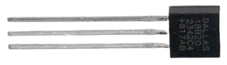

 
# Temperature Sensors

> Finding The Most Appropriate Sensor Type For Temperature Measurements

Measuring temperature is useful in many scenarios:

* **Environmental:**    

  Weather stations, controlling heating systems and air conditioning.

* **Fan-control:**    

  Turning on a cooling fan only when a device really gets too hot, controlling fan speed.

* **Battery Protection:**    

  Monitoring battery cells during charging and discharging for safety; turning off charging/discharging when cells get too hot.

Depending on the scenario, different sensor types are recommended.

## Sensor Types

Temperature sensors measure temperature using different physical properties:

1. **Thermistors (NTC/PTC)**:  

   Electrical **resistance** decreases as temperature rises (NTC) or increases as temperature rises (PTC). Their nonlinear behavior requires translating resistance to temperature by using a resistance/temperature table, a Beta equation, or the Steinhart-Hart equation. Calibration can further improve accuracy.

   
   

   For actual temperature measurements, **NTC thermistors are much more commonly used than PTC thermistors**. PTC thermistors are often used for threshold detection, overtemperature protection, self-regulating heaters, or current limiting rather than accurate temperature measurement.  

2. **Thermocouples**:  

   Made of two different metals joined at one end, thermocouples generate a tiny **voltage** based on the temperature difference between the measurement junction and a reference junction. 
   
   This minimal voltage requires sensitive measurement circuitry, and cold-junction compensation is required for accurate absolute temperature measurements.

   The relationship between voltage and temperature is not perfectly linear, either, so an appropriate characteristic curve or lookup table for the thermocouple type is required. 
   
   Thermocouples can measure very **high temperatures** which is why they are often used in ovens.  

3. **RTDs (Resistance Temperature Detectors)**:  

   RTDs are highly accurate and stable over a wide temperature range. 
   
   Precision RTDs commonly use platinum, such as Pt100 or Pt1000 elements, which makes them more expensive than thermistors. Their resistance/temperature relationship is much more linear than that of thermistors, although it is not perfectly linear.    

   For most DIY and normal engineering tasks, RTDs are overkill and too expensive. 

4. **Semiconductor Temperature Sensors**:  

   Semiconductor material causes electrical properties such as voltage or current to change with temperature. 
   
   These sensors are generally more linear than thermistors and are often available as ICs with analog or digital interfaces. One example is the popular [Dallas DS18B20](https://done.land/components/data/sensor/temperature/dallas/) sensor.

   

   With digital sensors, the measurement or conversion time is separate from the thermal response time. For example, the DS18B20 requires approximately 94-750ms for a temperature conversion, depending on the selected resolution.  

5. **Infrared Temperature Sensors**:  

   Infrared sensors measure the thermal radiation emitted by an object and therefore allow **non-contact temperature measurements**. 
   
   They commonly use thermopiles and are available as single-point sensors, such as the MLX90614, or arrays and thermal imaging sensors, such as the MLX90640.

   They are useful when physical contact is difficult or undesirable, and arrays can be used for thermal imaging and heat mapping: Instead of measuring a single spot, infrared sensor arrays measure many points at once and create a temperature map that can be displayed as a thermal image. 
   
   Measurement accuracy depends on surface emissivity, distance, field of view, reflections, and materials located between the sensor and the measured object, so accuracy depends on the kind of material you are measuring, and appropriate adjustments in software to account for the material properties.   

   

### Quick Comparison

| Sensor Type| Temperature Range| Thermal Response| Interface| Typical Accuracy| Excitation / Power| Cost| Other Characteristics|
|---|---|---|---|---|---|---|---|
| **Thermistors (NTC/PTC)**| -40°C to 150°C (typical)| milliseconds to seconds, depending on construction and mounting| Analog (Resistance measurement)| typically ±0.1°C to several °C, depending on sensor and calibration| Passive; measurement current causes some self-heating| Low| Nonlinear response, inexpensive, very high sensitivity|
| **Thermocouples**| -200°C to 1800°C (typical, depending on type)| milliseconds to seconds, depending on probe construction| Analog (Voltage output)| typically around ±1-2°C or a percentage of reading, depending on type and class| Passive; no excitation required| Medium| Very wide temperature range, requires cold-junction compensation|
| **RTDs (Resistance Temperature Detectors)**| -200°C to 850°C (typical for platinum RTDs)| milliseconds to seconds, depending on construction and mounting| Analog (Resistance measurement)| commonly ±0.1°C to ±1°C, depending on class and circuitry| Passive; requires excitation current, which can cause self-heating| High| Highly accurate, stable over time, nearly linear response|
| **Semiconductor Sensors (i.e. Dallas)**| -55°C to 125°C for DS18B20; varies by device| milliseconds to seconds thermally; additional conversion time may apply| Digital (I2C/SPI/[One-Wire](https://done.land/components/data/sensor/temperature/dallas/))/Analog| commonly around ±0.5°C to ±2°C, depending on device and range| Typically µA to a few mA| Low to Medium| Good linearity, easy integration, often factory calibrated|
| **Infrared Sensors**| typically -40°C to several hundred °C; specialized sensors much higher| milliseconds to seconds, depending on sensor| Digital/Analog| commonly around ±0.5°C to several °C under suitable conditions| Requires power| Medium to High| Non-contact measurement, affected by emissivity, reflections and field of view|

> Semiconductor sensors can be standalone (i.e. **Dallas**) or integrated into more sophisticated sensor ICs that measure additional entities as well and serve as a one-stop environmental sensor.      

## Latency and Thermal Response Time

For clarity, here are two important properties that determine how **fast** a temperature can deliver **accurate** temperature readings:

* **Latency:**    
  Time it takes for the sensor to record a new temperature. Depends solely on the sensor.

* **Thermal Response Time:**    
  Time it takes for the sensor to deliver accurate temperature readings. Depends on sensor housing, mounting, thermal contact, etc.

What matters at the end is the **thermal response time**: how long will it take a sensor to deliver the accurate temperature? 

The requirements for this response time depend largely on your scenario and use case:

* **Environmental Sensors:**    

  Environmental temperatures do not rapidly change, so thermal response time is less of a concern, and rugged sensors inside massive housings are usually suitable.

* **Battery/Device Monitoring:**    

  Electronic components such as MOSFETs, or lithium cells on overload, can heat up very rapidly. In these scenarios, it is key to get accurate temperature readings within a few hundred milliseconds to i.e. control cooling fans, or cut off charging to a lithium cell.
  
  Avoid unnecessarily massive housings when fast thermal response is important.

  For battery monitoring in particular, good thermal contact between the sensor and cell surface is at least as important as the nominal speed of the sensor.

## Thermal Mass

It is crucial to understand that **sensor latency** and **thermal response time** are not the same thing. 

A sensor may update its measurement very quickly, but the sensing element itself first has to reach the temperature of the object being measured. If the sensor is embedded in a housing, this housing adds thermal mass and thermal resistance and can significantly increase the response time.

For example, small NTC sensors that are not shielded by a housing can respond very quickly to temperature changes, so their response time is fast: 

If NTCs are embedded in metal housings for increased robustness, it may take several seconds or even longer until the sensor inside the housing approaches the temperature being measured. Likewise, when temperature drops, it may again take several seconds for the housing and sensor to cool down. So the very same NTC sensor now has a much longer response time.

A housing does not automatically make a sensor unsuitable for fast measurements, however. What ultimately matters is the combination of **thermal mass and thermal resistance between the measured object and the sensing element**. 

A small metal probe with excellent thermal contact can respond faster than a bare sensor that is poorly attached to the object.

So aside from the sensor and its housing and thermal mass, other factors that influence response time are mounting, thermal contact, airflow, and surrounding medium.

### Thermal Time Constant

Sensor datasheets often specify a **thermal time constant**, typically written as τ (tau). This is the time required for the sensor to complete approximately **63.2% of a sudden temperature change**.

After approximately 2τ, the sensor has reached about 86% of the final value, and after approximately 3τ about 95%.

The specified value is meaningful only under the test conditions stated by the manufacturer. A sensor may have very different thermal response times in moving air, still air, liquids, or when attached to a solid surface.

### Thermal Contact

For surface temperature measurements, good thermal contact between the sensor and the measured object can be just as important as low sensor mass.

Air gaps are particularly problematic because air is a poor thermal conductor. Pressing or bonding a small sensor directly against the surface generally provides a faster and more representative measurement than loosely positioning it nearby.

For electrically conductive objects such as battery cells, the sensor may also need to be electrically insulated while maintaining good thermal contact. Thin insulating tape, thermally conductive electrically insulating adhesive, or similar materials can be used depending on the application.

> Tags: Thermistor, NTC, PTC, Thermocouple, RTD, Pt100, Pt1000, Dallas, DS18B20, Infrared Temperature Sensor, IR Temperature Sensor, Thermopile, MLX90614, MLX90640, One-Wire, Latency, Housing, Thermal Mass, Thermal Resistance, Thermal Contact, Tau, Response Time, Cold-Junction Compensation, CJC, Steinhart-Hart, B-Value, Beta Value, Self-Heating, Battery Temperature Monitoring, Battery Protection, Fan Control

[Visit Page on Website](https://done.land/components/data/sensor/temperature?737512031305251116) - created 2025-03-04 - last edited 2026-09-09
