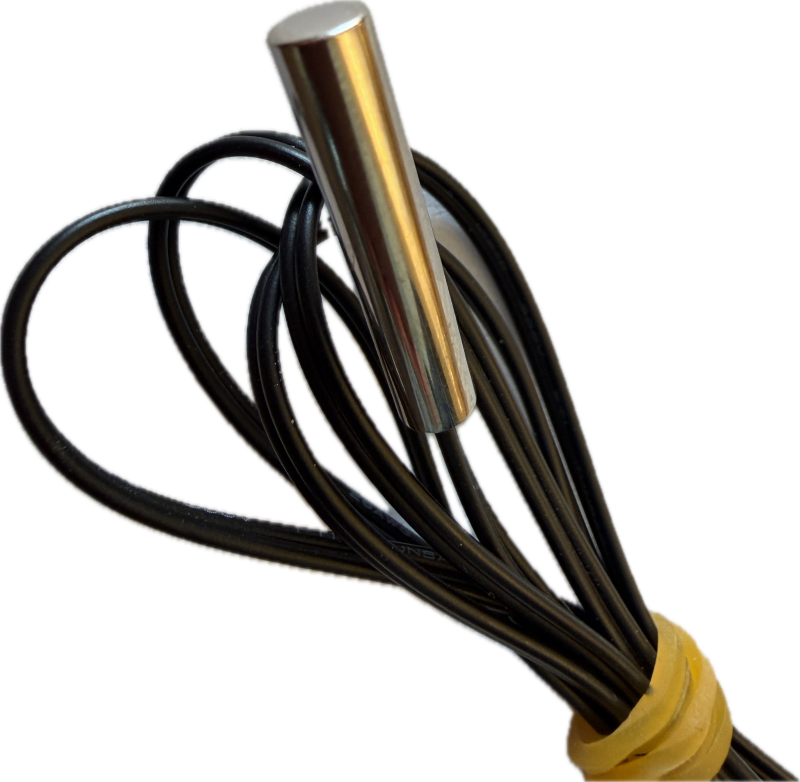

 
# Temperature Sensors

> Finding The Most Appropriate Sensor Type For Temperature Measurements

Measuring temperature is useful for a number of scenarios, for example:

* **Environmental:**    
  Weather stations, controlling heating systems and air conditioning.
* **Fan-control:**    
  Turning on a cooling fan only when a device really gets too hot, controlling fan speed.
* **Battery Protection:**    
  Monitoring Lithium cells during charging and discharging for security; turning off charge/discharge when cell gets too hot

Depending on the scenario, different sensors are recommended.

## Overview
Temperature sensors measure temperature in a number of different ways:

1. **Thermistors (NTC/PTC)**:  
   **Resistance** decreases as temperature rises (NTC) or vice versa (PTC). Their nonlinear behavior typically requires calibration.  

2. **Thermocouples**:  
   Made of two different metals joined at one end, thermocouples generate a tiny **voltage** based on the temperature difference. This voltage needs to be amplified using specialized circuitry, and cold-junction compensation is required. They can measure very **high temperatures**.  

3. **RTDs (Resistance Temperature Detectors)**:  
   RTDs are highly accurate and stable over a wide temperature range. They use platinum inside, which makes them expensive.  

4. **Semiconductor Temperature Sensors**:  
   Semiconductor material causes a change in voltage or current based on temperature. They are more linear than thermistors and are often used in ICs and with digital interfaces. One example is the popular [Dallas DS18B20](https://done.land/components/data/sensor/temperature/dallas/) sensor.  

### Quick Comparison

| Sensor Type| Temperature Range| Latency| Interface| Voltage Range| Power Consumption (when active) | Cost| Other Characteristics|
|---|---|---|---|---|---|---|---|
| **Thermistors (NTC/PTC)**| -50°C to 150°C (typical)| few milliseconds| Analog| Varies (3-5V)| 1-10mA | Low| Nonlinear response, requires calibration|
| **Thermocouples**| -200°C to 2000°C| tens of milliseconds to seconds| Analog (Voltage output)| Varies (depends on type)| 5-50mA| Medium| High temperature range, needs compensation circuits|
| **RTDs (Resistance Temperature Detectors)**| -200°C to 850°C| few milliseconds| Analog (Resistance measurement)| 3.3V-5V| 1-5mA| High| Highly accurate, stable over time, linear response|
| **Semiconductor Sensors (i.e. Dallas)**| -55°C to 150°C| few milliseconds| Digital (I2C/SPI/[One-Wire](https://done.land/components/data/sensor/temperature/dallas/)/Analog)| 3V to 5V| 1-3mA| Medium| Linear response, easy integration|

> Semiconductor sensors can be isolated (i.e. **Dallas**) or integrated into more sophisticated sensor ICs that measure additional entities as well and serve as a one-stop environmental sensor.      

## Thermal Mass

It is crucial to understand that a sensor latency (the speed in which it updates) applies to the pure sensor only. If the sensor is embedded in a housing, this housing adds significantly to the thermal mass and can severely degrade latency.

For example, NTC sensors by themselves respond within milliseconds to temperature changes. If however you use NTCs that are embedded in metal housings for increased robustness, it may take many seconds until the sensor inside the housing "sees" the temperature, and likewise, when temperature drops, it may again take many seconds for the housing to cool down.

### Latency

The required latency depends on how quickly the temperature you want to measure can change, and how quickly you need to be informed.

* **Environmental Sensors:**    
  Since environmental temperatures do not rapidly change within milliseconds or even seconds, latency is less of a concern, and rugged sensors inside of housings are ok.

* **Battery/Device Monitoring:**    
  Lithium batteries and MOSFETs can rapidly heat up within milliseconds, and if you use a sensor to control a cooling fan or as a security measure, **always use sensors without housing** because short latency is crucial here.

> Tags: Thermistor, NTC, PTC, Thermocouple, RTD, Dallas, One-Wire, One Wire, Latency, Housing

[Visit Page on Website](https://done.land/components/data/sensor/temperature?737512031305251116) - created 2025-03-04 - last edited 2026-09-09
