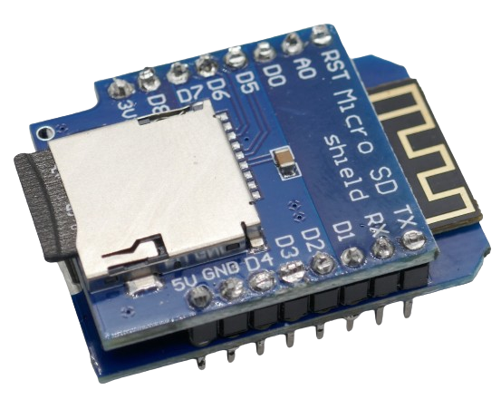
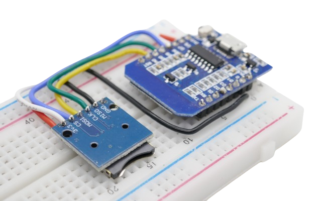
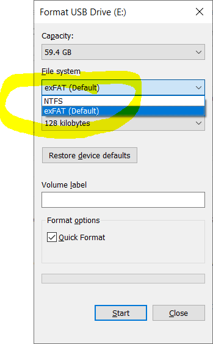

 
# Permanent Storage on SD Cards

> SD cards are a cost-effective way to permanently store data. They also allow easy data export from a device to your PC.

SD cards (memory cards) can store large amounts of data permanently. Since they are removable, they provide an excellent method for transferring data, such as sensor readings, to a PC for evaluation.


Let's cover some fundamental facts and then dive into everything you need to know about connecting **SD card readers** to your project.

## Life Span

There is no fixed lifespan for SD cards, but they can last anywhere from 10 to 30 years under normal use.

SD cards use a type of flash memory called *NAND*, which has a *finite number of write cycles*. Writing, deleting, and re-writing data contribute to the wear of SD cards.

Modern SD cards employ *wear-leveling* technology, which evenly distributes data across all memory cells to extend lifespan. When storing relatively small amounts of data, overall longevity improves even further.

### Practical Considerations
Flash memory (including SD cards) is not ideal for continuous high-frequency writing, such as real-time sensor logging. However, in practical use cases, they are quite reliable for storing sensor data.  

For example, writing 100 bytes of sensor data per second results in:
- 6KB per minute
 - 360KB per hour
 - 8MB per day
 - 260MB per month
 - 3GB per year  
  
Since modern SD cards typically start at 32GB, you could log data every second for **10 years before filling the card once**. Even if each memory unit endured only 1000 write cycles, you would need to log continuously for **10,000 years** before wearing out the card—far beyond any realistic concern.

## Speed

Different types of **SD cards** support different read and write speeds. This is important when handling *large data transfers*, such as recording 4K video.

For typical data logging applications, read and write speeds are not a major concern, and even the cheapest **SD cards** should be sufficient.

## Storage Capacity

Early SD cards stored up to *2GB*, while modern SD cards can exceed *128GB*.

Even if your project only requires a few kilobytes or megabytes for sensor data, choosing a high-capacity **SD card** can be beneficial for extending its lifespan, particularly in high-frequency logging applications (see *wear-leveling* above).

## Physical Dimensions

**SD cards** come in two primary sizes. Ensure that you purchase an **SD card reader** compatible with your card type.

- **Standard SD**: 24×32×2.1mm (larger, traditional format)
- **microSD**: 11×15×1mm (much smaller, commonly used in compact devices)

### Practical Considerations
- If you are adding permanent storage to a device and do **not** plan to swap out the **SD card** frequently, *microSD* is ideal due to its small size.  
- If you plan to use **SD cards** for **portability**, such as transferring data to a PC, handling *microSD* cards can be impractical. In this case, full-size **SD cards** are better.  
- Consider availability: if you have spare **SD cards** from cameras or other devices, choosing a matching **SD card reader** makes sense. Also, check whether your PC has a built-in card reader and which size it supports.

## SD Card Modules

**SD card modules** are small breakout boards with an **SD card** slot, allowing microcontrollers to read and write data. They communicate using the **SPI** interface, requiring four GPIO pins.


Using an **SD card module** is not strictly necessary. These modules simply provide an easy **SD card** mount and forward the necessary contacts to your microcontroller. **SD card modules** for **5V** microcontrollers also include a *level shifter*.  
  
However, **SD cards** natively support the *SPI* interface, so direct wiring is possible:  
- Connect *CS*, *DI*, *DO*, and *CLK* on the **SD card** to *CS*, *MOSI*, *MISO*, and *SCK* on the microcontroller.  
- Provide power via *VDD* and *VSS/GND*, keeping in mind that **SD cards operate at 3.3V**.  
- If using a **5V** microcontroller like an *Arduino*, a *level shifter* is required.  
  
That said, **SD card modules** are inexpensive, making direct wiring practical only for space-constrained projects or when adding storage directly to a microcontroller.

There are also **shields** available for specific microcontrollers, such as the *Wemos D1 Mini*. Shields are designed to be pin-compatible with their respective boards and require no additional wiring.



### Choosing an SD Card Module

Before selecting an **SD card module**, consider the following:

- **Voltage Compatibility**:  
  - SD cards use **3.3V** internally.  
  - Some modules have *3.3V* and *5V* pins, while others only provide *5V* (which may not work with **ESP8266** or other 3.3V microcontrollers unless modified).  
- **Card Size Support**:  
  - Most modern modules support *microSD* and do **not** accommodate full-size **SD cards**.  
- **Module Size**:  
  - Available in various form factors—choose a compact board if space is limited.  

### Pin Layout

**SD Card Modules** come with at least six pins:

| Pin Label | ESP8266 (adjust for other microcontrollers accordingly) |
| --- | --- |
| VCC | 3.3V (may be 5V tolerant, check datasheet) |
| GND | Ground pin **G** |
| CS | D8 (adjustable)  |
| MOSI | D7 |
| CLK | D5 |
| MISO | D6  |

Some modules feature an additional *5V* pin and use a voltage regulator when this pin is used.

> [!NOTE]  
> Essentially, the pins resemble the *power supply* (**VCC** and **GND**) and *communications* via *SPI*. Different microcontrollers have different *SPI* pins. Most *SPI* pins are typically fixed and assigned to specific microcontroller pins. **CS** can be freely assigned to any suitable *GPIO* pin. If you plan to use a microcontroller other than *ESP8266*, look up the designated *SPI* pins for your model.



## Connecting SD Card Readers

This is the schematics to connect a **SD Card Module** to a *ESP8266*:


### Breadboard

This is what the actual wiring on a breadboard looks like:


If you use a *Shield* instead, no wiring is required. Just make sure you stack the *Shield* on top of your microcontroller board in a pin-compatible orientation.


Then use header pins and solder or stick them together.


## Code

Code samples are downloadable for [platformio]() and [Arduino]().

Include the libraries *SPI.h* and *SD.h*. They are included in the *Arduino framework* by default.

The pins for the *SPI* connection are predefined by the microprocessor hardware. In the code, adjust the pin for *chipSelect*. In this example, **D8** is used. Make sure the baudrate for the serial output matches your *IDE* settings. The example uses a baudrate of 115200.

The sketch below illustrates the basic I/O operations: listing SD card contents, creating a file, writing to it, appending it, and reading it.

> [!CAUTION]
> Before you *build*, *upload* and *monitor* the sketch, make sure you insert a *SD Card*. The *SD Card Module* is only operational when a *SD card* is inserted and else will not respond. If things still don't work for you, please check the next paragraph on how to adequately *prepare* the *SD card*.


```c++
#include <Arduino.h>
#include <SPI.h>
#include <SD.h>

/*
 * D5 = CLK
 * D6 = MISO
 * D7 = MOSI
 * D8 = CS
*/

// CS (chip select) is freely configurable. In this example, D8 is used:
const int chipSelect = D8;
const String FILENAME = "samplefile.txt";

File myFile;

// helper function to dump folder content:
void printDirectory(File dir, int numTabs) {
   while(true) {
     File entry =  dir.openNextFile();
     if (! entry) {
       // no more files
       break;
     }
     for (uint8_t i=0; i<numTabs; i++) {
       Serial.print('\t');
     }
     Serial.print(entry.name());
     if (entry.isDirectory()) {
       Serial.println("/");
       printDirectory(entry, numTabs+1);
     } else {
       // files have sizes, directories do not
       Serial.print("\t\t");
       Serial.println(entry.size(), DEC);
     }
     entry.close();
   }
}  

// illustrates how to dump folder content recursively:
void listDriveContent() {
  // Demo 1: list content of inserted SD card
  File root;
  root = SD.open("/");

  printDirectory(root, 0);
}

void testFileExists(String filename) {
  if (SD.exists(filename)) {
    Serial.println("File exists.");
  }
  else {
    Serial.println("File doesn't exist.");
  }
}

// demonstrates how to create files and write text
void addTextToFile(String filename, String text) {
  // Only one file can be open at a time,
  // Make sure you ALWAYS close files after use as quickly as possible
  myFile = SD.open(filename, FILE_WRITE);

  if (myFile) {
    Serial.println("Writing text");
    myFile.println(text);
    myFile.close();

    Serial.println("File written.");
  } else {
    // on failure emit a message
    Serial.println("Error writing to file.");
  }
}

void readFile(String filename) {
  myFile = SD.open(filename, FILE_READ);
  if (myFile) {
    Serial.println("Reading file content:");
    // read character by character until end of file is reached:
    while (myFile.available()) {
      Serial.write(myFile.read());
      // small delay so you can see how the data is read char by char:
      delay(100);
    }
    myFile.close();
  } else {
    Serial.println("Unable to open file for reading.");
  }
}

void setup()
{
  // adjust baud rate to match your IDE or platformio.ini settings:
  Serial.begin(115200);

  Serial.print("Initializing SD card...");

  // make sure you inserted a SD card, and the inserted SD card matches the requirements
  // (i.e. FAT formatted, size within maximum size limits of SD card reader)

  // some modules will not initialize without inserted SD card
  if (!SD.begin(chipSelect)) {
    Serial.println("SD Card module not found. Make sure you inserted a SD card.");
    return;
  }

  Serial.println("SD Card module found.");
  
  listDriveContent();
  testFileExists("zumsel.abc");
  addTextToFile(FILENAME, "Hello World!");
  testFileExists(FILENAME);
  addTextToFile(FILENAME, "more text");
  readFile(FILENAME);
  
}

void loop() {
}
```
## Preparing SD Cards

Keep in mind two key points:

- **Is the SD Card Inserted?**  
  An SD card module is merely a *holder* and does not contain any electronic components by itself. If no SD card is inserted, your microcontroller **will not recognize the SD card module**. Always ensure that an SD card is inserted **before** running your microcontroller code.

- **Use FAT32 File System**  
  Most microcontrollers and SD card modules require the SD card to be formatted as `FAT32`.  
  **Other file systems such as `exFAT` will not work.**  

  

- **Test Your SD Card**  
  Older or worn-out SD cards may not function reliably. To check:
  1. Insert the SD card into your PC.
  2. Copy some files onto it.
  3. Eject the card, wait a moment, then reinsert it.
  4. Verify that the files are still accessible.  

## Converting an SD Card to FAT32  

On *Windows*, small SD cards (*<4GB*) can be formatted as `FAT32` using the standard formatting tool.

However, SD cards *larger than 4GB* (which is the norm today) are typically restricted to `exFAT` or `NTFS`. The format dialog does not even provide a `FAT32` option:



### Converting Large SD Cards to FAT32  

The easiest way to format large SD cards as `FAT32` is by using [DoneLandTools](https://done.land/tools/powershell/#install-donelandtools), a free PowerShell module.  
Simply run the command:

````powershell
Show-Fat32Converter
````

This opens a dialog. Follow the instructions, and your SD Card will be converted to `FAT32` in a matter of a few seconds.

## Troubleshooting  

If your microcontroller cannot detect the *SD card module*, follow these steps:

1. **Check your wiring**  
   - Ensure all connections are secure.  
   - Verify that the *chipSelect (CS)* pin is correctly defined in your code.  

2. **Verify SPI Pin Connections**  
   - If you are not using a *Wemos D1 Mini* or a compatible board, confirm that you have connected the wires to the correct **SPI** pins.  
   - Be mindful that *pin labels* (e.g., **D6**) and *pin numbers* (e.g., **6**) are not the same.  

3. **Confirm SD Card Functionality**  
   - Make sure the SD card is properly inserted.  

> Tags: Example, SD Card, Storage, FAT32, Filesystem

[Visit Page on Website](https://done.land/components/data/storage/permanent/onsdcards?097439021728243911) - created 2024-02-28 - last edited 2025-02-09
