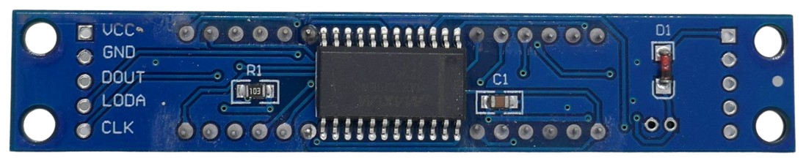
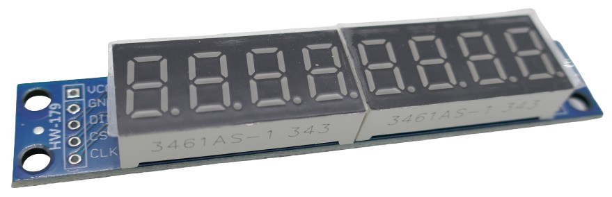
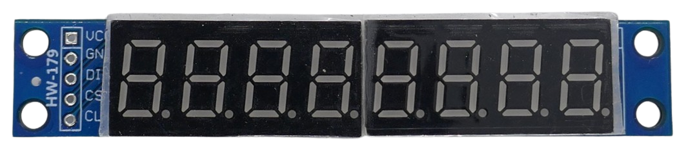
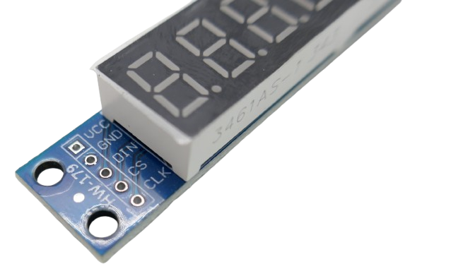
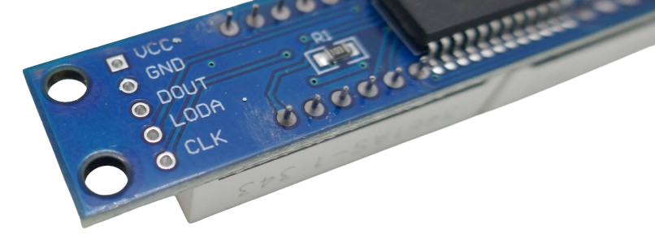
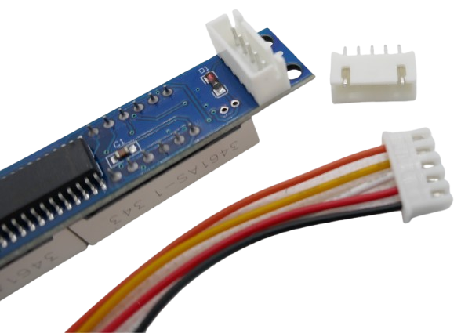
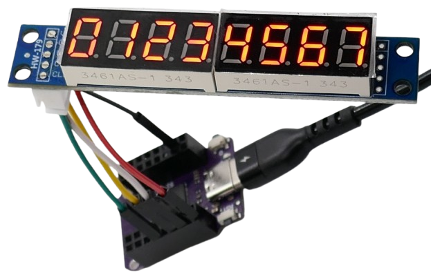
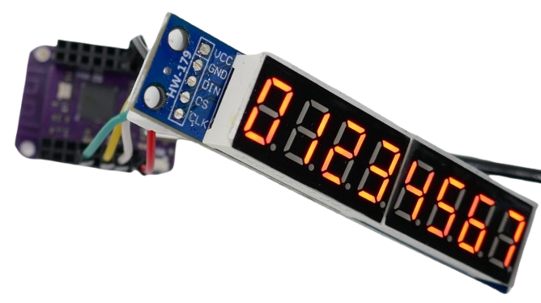

# MAX7219

> Great Visibility Indoors and Outdoors with Limited Resolution

The MAX7219 is an integrated circuit designed for controlling dot matrix displays, 7-segment numeric LED displays, and bar graph displays. It is widely used in microcontroller projects for its simplicity and ability to manage multiple LEDs with minimal wiring.



## Overview

The **MAX7219** is a versatile LED driver that can control:
- **7-Segment Displays**: Up to 8 digits.
- **LED Matrices**: An 8x8 grid of LEDs.
- **Bar Graph Displays**: Custom arrangements of LEDs.

For larger projects, multiple MAX7219 chips can be **cascaded** (connected in series) to expand the number of controlled LEDs.



### Key Features
1. **Integrated Current Control**:  
   - Drives LED segments directly without requiring external resistors.  
   - Provides consistent brightness across LEDs, regardless of the type used.

2. **Built-In BCD Decoder**:  
   - Simplifies driving numeric displays by automatically lighting the correct segments for digits (0-9).  
   - Operates in "no decode" mode for custom configurations, such as LED matrices.

3. **Test Mode**:  
   - Allows all LEDs to light up simultaneously for easy testing or initialization.

4. **Cascading Capability**:  
   - Enables the connection of multiple MAX7219 chips to control large displays.

### Interface

The MAX7219 uses a simple **SPI-compatible 3-wire interface**, making it easy to integrate with microcontrollers such as Arduino or ESP32. The three communication pins are:
- **DIN** (Data Input): Transfers data to the chip serially.
- **CLK** (Clock): Synchronizes data transmission.
- **LOAD/CS** (Chip Select): Latches data into the chip when the signal goes high.

#### Example Integration:
When connecting the MAX7219 to a microcontroller:
- Connect **DIN** to the microcontroller's **MOSI** pin.
- Connect **CLK** to the microcontroller's **SCK** pin.
- Connect **LOAD/CS** to any available GPIO pin, typically defined in software.

Libraries like **LedControl** (for Arduino) or similar ones for ESP32 simplify communication, allowing you to send display data with minimal code.


### Power Supply

The MAX7219 operates within a nominal voltage range of **4.0V to 5.5V**, with **5V** being the most commonly used. While the chip is designed for 5V systems, it often functions reliably at **3.3V**, making it compatible with 3.3V microcontrollers like the ESP32 and ESP8266. However, performance at lower voltages may depend on the specific LEDs and wiring configuration.

### LED Segment Displays

LED segment displays use individual LEDs arranged in modules to visually represent numbers, letters, or symbols. The most common type is the **seven-segment display**, which consists of seven rectangular LEDs configured to form the shape of any digit or letter. 



#### Key Components of an LED Segment Display

1. **Segment**:  
   A segment is one of the seven individual bars or lines within a single digit. Each segment lights up independently to form part of a number, letter, or symbol.

2. **Module (Digit)**:  
   A module refers to a single digit display unit. It is typically composed of:
   - **Seven segments** arranged in the shape of an "8".  
   - An optional additional segment for the **decimal point (DP)**.  

3. **Display**:  
   A display is a combination of multiple modules (often 4, 8, or more) controlled by a MAX7219 chip. The chip handles multiplexing and current control, allowing the microcontroller to focus on sending data rather than directly driving LEDs.

#### Expanded Explanation for Beginners:
- **Segment Behavior**:  
   Each segment represents a specific part of the digit. For example, to display the number "1," only two segments light up, whereas displaying "8" lights up all seven segments.
   
- **Modules in Practice**:  
   A standard module with eight digits may use a single MAX7219 for control, allowing cascading with additional chips for larger displays.

This modular design, combined with the MAX7219's current regulation and decoding capabilities, makes it highly efficient and easy to scale for larger projects.


| **Parameter**                | **Specification**                          |
|------------------------------|--------------------------------------------|
| **Operating Voltage (VCC)**  | 4.0V to 5.5V                               |
| **Logic Input Levels**       | TTL-Compatible                             |
| **Current Per Segment**      | Up to 40mA                                 |
| **Maximum Power Consumption**| 330mW (typical at full load)               |
| **Data Input Format**        | 16-bit serial                              |
| **Clock Frequency**          | Up to 10 MHz                              |
| **Number of Digits**         | Up to 8 digits (7-segment or dot matrix)   |
| **Brightness Control**       | 16 levels via digital control              |
| **Shutdown Mode Current**    | 150 µA (typical)                          |
| **Operating Temperature**    | -40°C to +85°C                             |
| **Pin Count**                | 24 (DIP, SOIC, or QFN package)            |
| **Interfacing**              | SPI-compatible 3-wire (DIN, CLK, LOAD)     |
| **Display Types Supported**  | 7-segment, 8x8 LED matrix, bar graph       |
| **Cascade Support**          | Yes (multiple ICs for extended displays)   |

## Wiring

Many MAX7219 breakout boards feature **two rows** of header pins, one at each end of the PCB. Understanding the pin layout is essential for proper wiring and chaining multiple displays.



### Input and Output Pins

1. **DIN (Data In)**:  
   - The **input** row connects the microcontroller to the MAX7219 chip. The pin labeled **DIN** receives the data signal.  
   - This is the first connection in the chain when using multiple displays.  

2. **DOUT (Data Out)**:  
   - The **output** row is used to cascade (daisy-chain) the data signal to additional displays. The pin labeled **DOUT** sends data to the next module.  



### SPI Interface

The MAX7219 uses a **SPI-like** interface, meaning it communicates using a three-wire system (data, clock, and chip select). While it is not a "true" SPI device, it follows a similar protocol for compatibility.

> [!TIP]  
> The MAX7219 can share an SPI bus with other SPI devices. To avoid communication conflicts, ensure that each device has its own **Chip Select (CS)** line and only one device is active at a time.  

#### Software vs. Hardware SPI
- **Software-Emulated SPI**:  
   You can use *any free GPIO* pins to communicate with the MAX7219, making it flexible for use in complex projects.  
- **Hardware SPI**:  
   Using dedicated hardware SPI pins is more efficient and reduces the microcontroller's processing load, especially when driving multiple displays.

### JST XH 2.54 5-Pin Connectors

Many breakout boards, such as the popular **HW-179**, use a **2.54 mm pitch** for their headers. You can use a modular **JST XH 2.54 5-pin connector** for a cleaner and more reliable connection:



> [!IMPORTANT]  
> While the original **JST XH** specification uses a **2.5 mm pitch**, these do **not fit** on standard PCBs. Be sure to use a **Chinese Clone** connector explicitly designed for **2.54 mm pitch**.

### Breakout Board Tips

For the commonly used **HW-179** breakout board:  
- The input pins are clearly labeled on the front side of the PCB.  
- If using a connector, attach it to the **back side** of the board. This keeps the labels visible and allows the display to be mounted conveniently into an enclosure.  




### GPIOs and Connections


| **MAX7219 Pin** | **Description**         | **ESP32 Pin (Example)** |
|------------------|-------------------------|--------------------------|
| VCC              | Power Supply (+5V)     | 5V                      |
| GND              | Ground                 | GND                     |
| DIN (MOSI)              | Serial Data **Input**      | GPIO23                  |
| DOUT             | Serial Data **Output**      | to **DIN** on next display                  |
| CLK              | Serial Clock Input     | GPIO18                  |
| LOAD/CS          | Chip Select (Latch)    | GPIO5                   |


## ESPHome

For integrating the MAX7219 with ESPHome, use the `MAX7219 7-Segment Display` component. This component is specifically designed for controlling **7-segment numeric LED displays** driven by the MAX7219.

> [!NOTE]  
> Do **not** use the `MAX7219 Digit Display` component unless your MAX7219 is controlling a **dot-matrix display** (e.g., an 8x8 LED matrix). The two components are optimized for different display types and are not interchangeable.

### Why Choose the Correct Component?

- The `MAX7219 7-Segment Display` component automatically handles **BCD decoding** for numeric displays, taking advantage of the chip's built-in functionality.
- The `MAX7219 Digit Display` component is intended for raw matrix control, requiring you to manually manage LED states for dot-matrix layouts.

Ensure you configure the component correctly in ESPHome, specifying the **number of digits** and wiring details. This simplifies your setup while ensuring optimal functionality for your specific display type.


````
esp32:
  board: lolin_s2_mini
  framework:
    type: arduino

spi:
  clk_pin: GPIO07
  mosi_pin: GPIO11

display:
  - platform: max7219
    cs_pin: GPIO12
    num_chips: 1  # number of cascaded (daisy-chained) chips
    lambda: |-
      it.print("01234567");
````





> Tags: HW-179, Display, LED, MAX7219

