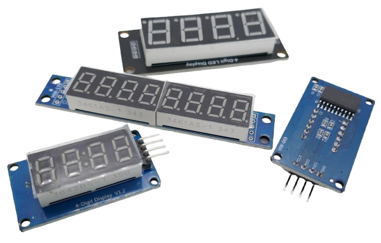
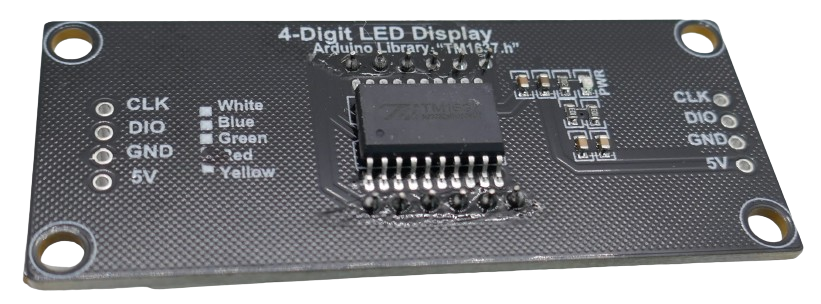
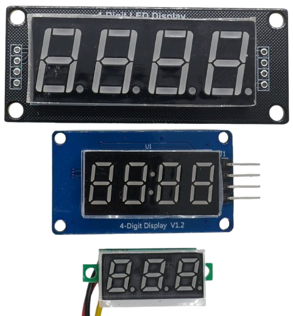
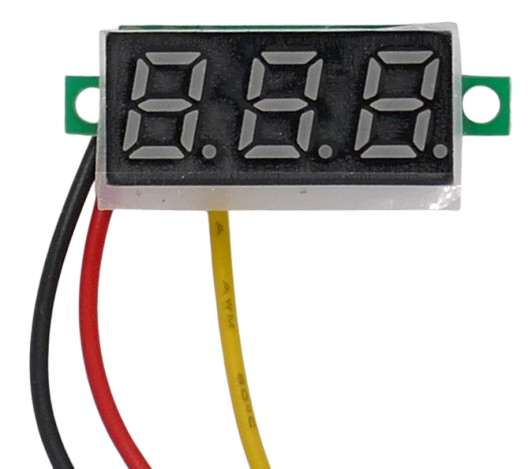
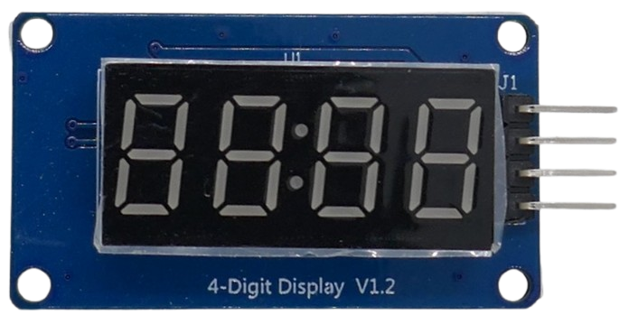

# LED Segment Displays

> Great Visibility Indoors and Outdoors with Limited Resolution

*LEDs* were a revolutionary advancement in lighting and display technology. It didn’t take long for engineers to *combine square LEDs* into displays capable of showing simple numbers and letters.

## Overview

*LED segment displays* use individual LEDs arranged in a module to display digits and letters. The most common configuration is the *seven-segment display*, which consists of seven rectangular LEDs forming the number or letter.

* **Segment:** A single segment is one of the seven individual bars (or lines) within a digit. It lights up independently to help form a portion of the number or letter.
* **Module (Digit):** A full module capable of displaying a number typically consists of seven segments arranged in the shape of an "8", often with an additional segment for the decimal point (DP).
* **Display:** Combination of 4 or more modules, and a controller.

### Advantages of LED Segment Displays

Using LEDs for display purposes offers several benefits:

- **Self-Illuminating:** LEDs emit their own light, eliminating the need for a separate backlight. Their brightness ensures that displays are clearly visible, even in bright environments such as outdoors or under direct sunlight.
- **Simplicity:** Displaying a figure only requires lighting the appropriate segments, with no advanced circuitry needed.

### Limitations of LED Segment Displays

However, this concept introduced some challenges:

- **High Energy Consumption:** Each LED requires a current in the *mA* range. For example, a seven-segment LED display with eight digits contains 56 LEDs. If each LED draws *20mA*, the total current draw could reach *1.12A*, which far exceeds what most microcontrollers or portable power sources can provide.
- **High GPIO Pin Requirement:** Each LED must be individually controlled. In the case of a display with 56 LEDs, you would need 56 GPIO pins, far more than most microcontrollers offer.

### Multiplexer

To address these challenges, LED displays use specialized ICs that implement a *multiplexer* and other supporting functions.

#### How a Multiplexer Works

A multiplexer powers the LEDs for one digit at a time, rapidly cycling through each digit at a high frequency. While, in reality, only one digit is lit at any given moment, the *persistence of vision* effect makes it appear as though all digits are lit simultaneously.

This approach offers two key advantages:

- **Reduced Power Consumption:** Since only one digit is powered at any moment, the total current draw is much lower than powering all LEDs simultaneously.
- **Simplified Circuit Design:** Fewer GPIO pins are required because the multiplexer handles the rapid switching between digits.

However, this technique does come with a trade-off: the display may appear slightly dimmer to the human eye due to the reduced duty cycle. Even so, the brightness remains adequate for most environments.

Tale from the Past
 

When the first digital wristwatches and pocket calculators appeared in the *1980s*, they typically used red LED displays. However, users quickly discovered their high power consumption: batteries did not last long. 

Even with the clever use of *multiplexers*, energy consumption was *still* to high for always-on battery-operated devices.

This quickly prompted consumer electronics to adopt much more energy-efficient *LCD displays*, the predecessors of today’s modern *TFT* and *OLED* displays.

Today, *LED segment displays* are still used when power consumption is *not* a priority. These displays are inexpensive, scalable to any size and brightness, and highly readable even from a distance or in bright environments.

### Character Map

Most LED segment displays are designed primarily for numerical output, so there's no need to address each LED individually. Many LED display controllers include built-in *character maps*, which automatically determine which LEDs to light up for a given character.

#### Benefits of Character Maps

When combined with a multiplexer, character maps significantly reduce the complexity of controlling the display:

- **Fewer GPIO Pins:** Instead of requiring a separate control line for each LED, the controller handles the logic internally, allowing the display to be driven with far fewer GPIO pins.
- **Ease of Use:** Developers can simply send a character code to the controller, and the appropriate LEDs will light up automatically.

By combining these features, LED segment displays strike a balance between simplicity, visibility, and functionality, making them a popular choice for a wide range of applications.

### Daisy Chaining

Some controllers like the *MAX7219* support *daisy-chaining* multiple displays to use more digits.

## Common LED Display Sizes

LED display sizes are defined by the **height of the digits**,  the **number of digits** in the display, and the **number of segments** per module. The latter determines whether a display can show digits only, or also more complex alphanumeric symbols.

### **Digit Height**
The height of each digit is measured in millimeters (mm) or inches. This determines the viewing distance and application suitability.

| **Digit Height** | **Typical Applications**                      | **Viewing Distance**     |
|-------------------|----------------------------------------------|---------------------------|
| **0.28 inch** (~7 mm)  | Small voltage meters | ~1-2 meters               |
| **0.39 inch** (~10 mm) | Measuring Devices  | ~2-3 meters               |
| **0.56 inch** (~14 mm) | Viewable from larger distance              | ~3-5 meters               |
| **0.8 inch** (~20 mm)  | Control panels       | ~5-7 meters               |
| **1.0 inch** (~25 mm)  | Control panels used by teams          | ~7-10 meters              |
| **1.2 inch** (~30 mm)  | Outdoor signage, scoreboards             | ~10-15 meters             |
| **4.0 inch** (~100 mm) | Advertising boards  | ~30-50 meters             |

### **Number of Digits**
The number of digits depends on the intended use case. Common configurations include:

- **3 Digit**: simple voltmeters etc without the need for great precision    
    
    
- **4 Digits**: basic clocks, countdowns, thermometers    
    
- **8 Digits**: High precision measurements    
    

### **Configurations**

The number of LEDs per module determines how many symbols can be shown:

1. **7-Segment Displays**:
   - numbers only *(most basic and most popular type)*
    
2. **14-Segment Displays**:
   - alphanumeric characters *(less common)*

3. **16-Segment Displays**:
   - enhanced alphanumeric capability *(special use cases)*

4. **Dot Matrix Displays**:
   - custom characters, animations, etc.     
   **Considered deprecated** *(low brightness, complexity, low resolution)*. Choose [OLED](https://done.land/components/humaninterface/display/oled/), [TFT](https://done.land/components/humaninterface/display/tft/), or **e-Ink** display.

## LED Display Controllers

*LED controllers* combine individual LEDs to digits or letters and multiplex the modules. Here are the most commonly used controller types:

| **Controller** | **Voltage Range** | **Daisy Chain Support** | **Supported Segments** | **Max LED Current (per segment)** | **Additional Features**            |
|----------------|-------------------|--------------------------|-------------------------|------------------------------------|------------------------------------|
| MAX7219        | 4V - 5.5V         | Yes                      | 64 (8 digits x 7 segments + DP) | 40mA                               | Built-in character map, SPI interface |
| TM1637         | 3.3V - 5V         | No                       | 6 digits x 7 segments + DP       | 20mA                               | 2-wire interface, low power consumption |
| HT16K33        | 4.5V - 5.5V       | No                       | 128 (16 digits x 8 segments)     | 25mA                               | I²C interface, keyboard scanning support |
| AS1100         | 2.7V - 5.5V       | Yes                      | 64 (8 digits x 7 segments + DP) | 40mA                               | SPI interface, low-power shutdown mode  |
| IS31FL3730     | 2.7V - 5.5V       | No                       | 144 (up to 144 individual LEDs)  | 40mA                               | I²C interface, PWM brightness control  |
| SAA1064        | 4.5V - 5.5V       | No                       | 4 digits x 7 segments + DP       | 25mA                               | I²C interface, low power              |
| CD74HC4511     | 3V - 6V           | No                       | 7 segments (1 digit)             | Up to 25mA                         | BCD to 7-segment decoder/driver       |

At any given moment, only one digit is lit, so the maximum simultaneous current draw is the number of LEDs a digit consists of, multiplied with the maximum current per LED segment as specified above.

> [!NOTE]
> While the data sheet of some controllers like *MAX7219* states a minimum voltage of *4.0V*, making it incompatible with *3.3V*, in reality these controllers often work just fine even with *3.3V* microcontrollers.

> Tags: LED Display Controller, Multiplexer, Character Map, Segment, Module

[Visit Page on Website](https://done.land/components/humaninterface/display/led?639124011028252627) - created 2025-01-27 - last edited 2025-01-27
