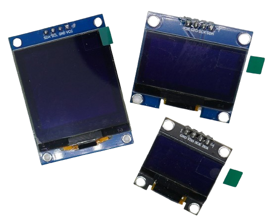

# OLED Displays

> Awesome Contrast, Great Readability, and Self-Illuminating Pixels

*OLED Displays* use *organic light-emitting diodes* to display pixels. Since each pixel acts as its own *light source*, these displays offer excellent contrast, wide viewing angles, and great readability in both dim and bright daylight.

Common display sizes include *0.48"*, *0.91"*, *0.96"*, *1.3"*, and *1.5"* inches. Resolutions range from *64x48* pixels to (in affordable price ranges) *128x128* pixels.

## Overview

For monochrome displays, *OLED* is an excellent and affordable technology. These displays typically use *I2C* and do not require a separate backlight, making them easy to connect with minimal *GPIO* usage. They are also very power-efficient when displaying content on a black background.

For simple DIY projects, monochrome OLED displays with a resolution of *128x64* pixels and screen sizes of *0.96"* or *1.3"* are widely available and cost as little as €1.00 per display.

For color displays, however, *TFT* remains the more cost-effective option. While color OLED displays are available, they are significantly more expensive than *TFT*. The same holds true for larger displays above *1.3"*.

> [!NOTE]
> Since in *OLED displays*, **each pixel** is an independent **light source**, power consumption depends on the number of pixels *on*. Content on a *black background* is more energy-efficient than *inverted displays* where the background is actively lit. For mixed content, *OLED displays* typically use *40-60%* of the energy a comparable *TFT display* would require.

### Caveats

There are two key challenges with *OLED displays*:

- **Limited Life-Span:** The *organic* materials in OLEDs degrade over time, leading to reduced brightness, particularly with *blue* OLEDs. This degradation typically becomes noticeable after more than 10,000 hours of use. For most *DIY projects*, this is not a concern unless the device is designed to remain always on without implementing screen saver logic.
- **Burn-In/Ghosting:** *OLED displays* are susceptible to image retention (burn-in, also known as *ghosting*) when static images are displayed for long periods. This can be a realistic problem in *DIY projects* where displays often show static layouts.

#### Workarounds

Both of these shortcomings can be mitigated by turning *OLED displays* off when not in use. This approach is similar to how many *OLED*-based smartwatches and smartphones operate. It also conserves power.

Here is the typical behavior for such devices:

- When there is information to display, the firmware turns the display on.
- After a set period of inactivity, the display automatically turns off (or dims).
- Users can press a key on the device to turn the display back on at any time.

### Comparison
Let's compare key facts of OLED and TFT displays:

| Feature               | OLED (Organic Light-Emitting Diode)                     | TFT (Thin Film Transistor LCD)                 |
|-----------------------|---------------------------------------------------------|------------------------------------------------|
| **Display Quality**   | Excellent contrast with true blacks (no backlight).     | Good, but blacks are less true due to backlight. |
| **Brightness**        | High brightness in dark environments but may fade in direct sunlight. | Can be brighter and more sunlight-readable with reflective layers. |
| **Power Efficiency**  | More power-efficient for mostly black screens (each pixel lights individually). | Backlight always on, consuming constant power regardless of image. |
| **Lifespan**          | Organic materials degrade over time, reducing lifespan, especially for blue pixels. | Generally longer lifespan without image burn-in issues. |
| **Viewing Angles**    | Wide viewing angles with consistent colors.             | Often good but may suffer from color shifts depending on panel type (e.g., TN, IPS). |
| **Refresh Rate**      | Very high, suitable for animations and fast updates.    | High, but can be slightly slower for complex graphics. |
| **Cost**              | Generally more expensive per unit size.                | More affordable and available in larger sizes. |
| **Ease of Use**       | Simple to wire and program; fewer connections for small sizes. | Requires more connections (backlight, control pins). |
| **Availability**      | Limited to smaller sizes (<3 inches typical).          | Wide range of sizes (from small to large).     |
| **Durability**        | Fragile; can be damaged by static or environmental factors (moisture). | More robust but may need additional care for backlight longevity. |
| **Color Accuracy**    | Vivid and vibrant colors.                               | Accurate but less vibrant compared to OLED.   |
| **Use Cases**         | Ideal for low-power, compact projects with sharp visuals. | Best for larger displays or applications requiring high brightness. |
| **Drawbacks**         | Risk of burn-in for static images, shorter lifespan for some colors. | Bulkier due to backlight, slightly less contrast. |
### Recommendation
Typical *0.96"* and *1.3"* monochrome OLED displays are an excellent and affordable choice for many DIY projects: they are easy to integrate, have good support, and offer sharp, crisp display quality.

If you require multi-color displays, larger sizes, or need a display to operate continuously for extended periods (days or months), *TFT* displays may be a better and more economical choice.

## OLED Driver Chips
*OLED displays* require a *driver chip* to interpret display information and draw it to the screen. Understanding the *driver chip* used on a particular *OLED breakout board* is crucial, as the chip determines which *software library* you need for your project.

Drivers support both *I2C* and *SPI* interfaces. Monochrome displays often use the simpler two-wire *I2C* interface due to the lower data transfer requirements. Grayscale and color displays, which need to handle more data, typically rely on the faster *SPI* interface. The interface type is usually fixed by the breakout board design.

> [!NOTE]
> The driver lists below highlight only the most commonly used drivers; many more exist. If unsure, consult the specific driver's data sheet.

### Monochrome Displays
Small monochrome OLED displays have recently become very affordable, thanks in part to cost-effective drivers like the *SH1106* and *SH1107*. These drivers are excellent for basic use cases, such as displaying text and static images.

However, certain drivers, like the *SH1106*, lack built-in hardware features for scrolling and animations. While such features may not be critical for typical DIY projects, if your project requires them, you may prefer the older but more capable *SSD1306* or *SSD1307*.

The *SSD1315* is a refined version of the *SSD1306*, offering improved brightness and contrast, making it a great choice for projects where enhanced visibility is essential.

|Driver|Resolution Support|Color Support|Interface Types|Unique Features/Benefits|Limitations Compared to Others|Common Applications|
|---|---|---|---|---|---|---|
|SH1106|Up to 132x64 (128x64 typical)|Monochrome|I2C,SPI|Affordable, wide availability, compatible with many small displays.|Lacks hardware scrolling; less efficient addressing.|Small DIY OLEDs (e.g., 0.96").|
|SH1107|Up to 128x128|Monochrome|I2C,SPI|Higher resolution for square displays, compact driver for wearables.|slower refresh|Compact devices, wearables.|
|SSD1306|Up to 128x64|Monochrome|I2C,SPI|Hardware scrolling, smooth animations, very efficient data addressing.|slightly older compared to newer drivers|General-purpose small displays.|
|SSD1307|Up to 128x64|Monochrome|I2C,SPI|Improved version of SSD1306, supports more flexible addressing modes.|No significant added benefits over SSD1306 for most users.|Small monochrome displays.|
|SSD1680|Up to 200x200|Monochrome|SPI|E-paper-like OLED with extremely low power for static content.|Limited refresh rate; not suitable for dynamic or video content.|E-readers, low-power dashboards.|
|SSD1315|Up to 128x64|Monochrome|I2C,SPI|Improved contrast and brightness compared to SSD1306, with backward compatibility.|No significant additional features over SSD1306 apart from brightness.|Budget-friendly small displays.|
|SSD1603|Up to 128x64|Monochrome|I2C|Highly power-efficient for basic applications.|Lacks advanced features like grayscale or color.|Simple text or icon-based displays.|

### Grayscale Displays
These drivers support 16 levels of grayscale, enabling more detailed images and modern UI designs. However, grayscale OLED displays come with certain trade-offs compared to their monochrome counterparts:

- **Price:** Grayscale displays are considerably more expensive.
- **Efficiency:** They consume more power due to the additional data handling and active pixels.
- **Refresh Rate:** Grayscale displays often have slower refresh rates, though this is typically not an issue when displaying static text.

|Driver|Resolution Support|Color Support|Interface Types|Unique Features/Benefits|Limitations Compared to Others|Common Applications|
|---|---|---|---|---|---|---|
|SSD1327|Up to 128x128|Grayscale (16 levels)|I2C,SPI| ||Graphical interfaces, detailed UIs.|
|SSD1322|Up to 256x64|Grayscale (16 levels)|SPI|Wide horizontal resolution, suited for panoramic or dashboard displays.||Audio players, control panels.|
|SSD1325|Up to 128x64|Grayscale (16 levels)|SPI|Mid-range grayscale resolution for detailed yet simple graphics.|Lower grayscale resolution than SSD1327; slower refresh rates.|Basic grayscale graphical displays.|

### Color Displays
OLED color displays are significantly more expensive than their monochrome counterparts: while a simple monochrome display can cost as little as *1.00€*, a full-color display of the same size typically costs *5-10x* more.

- **SSD1331:** An entry-level driver that provides vibrant and excellent display quality but is limited to smaller resolutions.
- **SSD1351:** Supports reasonable resolutions of up to *128x128* pixels, making it suitable for more detailed color applications.
- **SEPS525:** Unique for its higher resolution, though it is uncommon in DIY projects.
- **RA8875:** Capable of driving displays with resolutions up to VGA, but it is even rarer in DIY applications due to its specialized nature.

|Driver|Resolution Support|Color Support|Interface Types|Unique Features/Benefits|Limitations Compared to Others|Common Applications|
|---|---|---|---|---|---|---|
|SSD1331|Up to 96x64|RGB (65k colors)|SPI|high-speed refresh for animations|Limited resolution compared to SSD1351.|Small, colorful graphical displays.|
|SSD1351|Up to 128x128|RGB (65k colors)|SPI|supports typical DIY display resolutions|Higher power consumption, more expensive.|Wearables, premium graphical UIs.|
|SEPS525|Up to 160x128|RGB (262k colors)|SPI|18-bit colors|less common, lacking support |Portable devices, gaming consoles.|
|RA8875|Large resolutions (e.g., 800x480)|RGB (65k colors)|SPI,Parallel|includes built-in touch controller and advanced graphical functions.|Expensive; less common for small DIY projects.|Advanced graphical interfaces.|
## Programming
Most *monochrome OLED drivers* have universal support, meaning you can use the same libraries across various drivers. The [u8g2 C++ library](https://github.com/olikraus/u8g2/wiki/gallery) and the *ESPHome* [SSD1306 platform](https://esphome.io/components/display/ssd1306.html) provide support for *all* monochrome OLED drivers.

For *grayscale* and *color* displays, support is also widely available, but libraries and *ESPHome platforms* tend to target *specific drivers*:

* **C++/Arduino Framework:**  
    * **Monochrome:** *Universal* support through [u8g2](https://github.com/olikraus/u8g2/wiki/gallery). Here is a [full list](https://github.com/olikraus/u8g2/wiki/gallery) of supported drivers. Also, [here is an example](https://done.land/components/humaninterface/display/oled/sh1106/#example-code) using a monochrome *SH1106*-based OLED display. There are many other libraries, some of which are tailored to *specific* drivers only.
    * **Grayscale:** Support is available for *specific* drivers only, such as [Adafruit-SSD1327](https://github.com/adafruit/Adafruit_SSD1327/blob/master/Adafruit_SSD1327.cpp).
    * **Color:** Support is available for *specific* drivers only, such as [Adafruit-SSD1331-OLED](https://github.com/adafruit/Adafruit-SSD1331-OLED-Driver-Library-for-Arduino).

* **ESPHome:**  
    * **Monochrome:** *Universal* support via [SSD1306](https://esphome.io/components/display/ssd1306.html), covering common monochrome OLED drivers, including *SH1106* and *SH1107*. Here is a [full example](https://done.land/components/humaninterface/display/oled/sh1106/#esphome).  
    * **Grayscale:** Support is available for *specific* drivers only, such as [SSD1322](https://esphome.io/components/display/ssd1322.html), [SSD1325](https://esphome.io/components/display/ssd1325.html), and [SSD1327](https://esphome.io/components/display/ssd1351.html).
    * **Color:** Support is available for *specific* drivers only, such as [SSD1331](https://esphome.io/components/display/ssd1331.html) and [SSD1351](https://esphome.io/components/display/ssd1351.html).

## Data Sheets

[SSD1306](materials/ssd1306_datasheet.pdf)   
[SSD1327](materials/ssd1327_datasheet.pdf)   
[SSD1331](materials/ssd1331_datasheet.pdf)   
[SSD1351](materials/ssd1351_datasheet.pdf)   
[SH1106](materials/sh1106_datasheet.pdf)   
[SH1107](materials/sh1107_datasheet.pdf)   

> Tags: HID, Display, OLED, I2C, SPI, Driver, SSD1306, SSD1307, SSD1315, SSD1322, SSD1325, SSD1327, SSD1331, SSD1351, SSD1608,  SSD1680, SH1106, SH1107, SEPS525, RA8875, Monochrome, Grayscale, Color, Resolution

[Visit Page on Website](https://done.land/components/humaninterface/display/oled?644321051706242045) - created 2024-05-05 - last edited 2025-01-11
