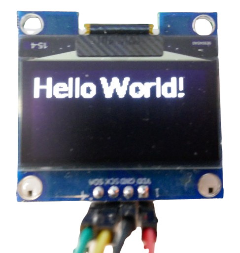

# SH1106-Based OLED Display

> 128x64 Monochrome OLED Displays for Affordable Prices  

The *SH1106* is a modern, cost-optimized *OLED display driver*, often considered a successor to the widely popular *SSD1306*. It is commonly found in affordable *0.96"* and *1.3"* monochrome OLED displays.

While *SH1106* works well for most OLED display use cases, if you have a choice, then get an OLED display with [SSD1306](https://done.land/components/humaninterface/display/oled/ssd1306/) driver instead. The older *SSD1306* is much more capable and supports hardware-accelerated scrolling. 

## Overview  

The [SSD1306](https://done.land/components/humaninterface/display/oled/ssd1306/) (released in *2007*) has long been the dominant OLED driver, but the *SH1106* (introduced in *2013*) has gained popularity in recent years due to its lower cost. The newer *SH1106* lacks hardware acceleration for scrolling and animations—features available in the *SSD1306*. For most typical OLED use cases, such as displaying static text and simple graphics, these features are not essential.

The *SH1106* supports monochrome OLED displays with a maximum resolution of *132x64* pixels, though most breakout boards use a *128x64* resolution. These displays typically communicate via the [I2C](https://done.land/fundamentals/interface/i2c/) interface.


## Breakout Boards  

Ready-to-use breakout boards include both the *SH1106* driver and an OLED display, with *0.96"* and *1.3"* sizes being the most common.


Some displays are also integrated into *keyboard-display-combos*, such as the example below:


## Display Colors  

*SH1106*-based OLED displays are **always monochrome**, but the emitted light color may vary.  

| Color        | Remarks |
|-------------|---------|
| **White**   | Best contrast and longest lifespan. |
| **Blue**    | Wears out faster than other colors. |
| **Yellow**  | A newer option, typically more expensive. |
| **Yellow/Blue** | A dual-color display where a small section is yellow, while the rest is blue. |

> [!NOTE]  
> All OLED displays degrade over time. After *10,000 hours* or more of continuous use, brightness may fade. *Blue* displays are more susceptible to wear than other colors.  

## I2C Interface  

Most *SH1106* breakout boards utilize the simple [I2C](https://done.land/fundamentals/interface/i2c/) protocol, although some versions support [SPI](https://done.land/fundamentals/interface/spi/) for faster data transfer.

The default I2C address is typically **0x3C** or **0x3D**, and it is often fixed:  

- **128x64** displays usually use **0x3C**.  
- **128x32** displays often use **0x3D**.  
- Some exceptions exist, so always check your display's documentation.  

> [!TIP]  
> If you need to connect multiple OLED displays, consider using an **I2C multiplexer** like the *PCF8575*, or choose an **SPI-based display**, which allows selecting the active device via the *CS* (Chip Select) pin.  

## Programming

The *SH1106* is supported [in all major development environments](https://done.land/components/humaninterface/display/usage/programming/).

## ESPHome

Using [ESPHome](https://done.land/tools/software/esphome/introduction/) is the simplest approach, as it natively supports the [SSD1306 OLED Display](https://esphome.io/components/display/ssd1306.html) component, which is compatible with most monochrome OLED drivers, including the *SH1106*. The following OLED drivers are supported:

* **SSD1306:** 128x32, 128x64, 96x16, 72x40, 64x48
* **SSD1305:** 128x32, 128x64
* **SH1107:** 128x64, 128x128
* **SH1106:** 128x32, 128x64, 96x16, 64x48

Here is an example configuration:


````
# define the I2C pins that you use 
# to connect the display to your microcontroller
i2c:
  sda: GPIO21
  scl: GPIO22

display:
  - platform: ssd1306_i2c
    model: "SH1106 128x64"  # 0.96/1.3" 128x64 OLED display
    address: 0x3C           # default address, use 0x3D if default fails
    rotation: 180           # rotate content if needed
    update_interval: 3000ms # 1s is default (1000ms)
    lambda: |-
      it.print(0, 0, id(lato400), "Hello World!");

# you need at least one font to output text
font:
  - file:
      type: gfonts
      family: Lato
      weight: 400
    id: lato400
    size: 20
````

To compile and upload the sample configuration, simply [follow these steps](https://done.land/tools/software/esphome/compileconfiguration/).



> [!NOTE]
> OLED displays are known for their crisp and clear visuals. If the text appears blurry, as shown in the image, it's likely that a font has been scaled incorrectly. For optimal results, use pixel fonts that are specifically designed for the display size.

You can now utilize all the graphics commands supported by the [ESPHome Display Component](https://esphome.io/components/display/index.html) to draw images, shapes, lines, arcs, and more.

## C++

For direct programming, two popular libraries support the *SH1106*:

- [U8G2 Library:](https://github.com/olikraus/u8g2) A universal library for **monochrome** displays, primarily focused on text output.
- [Adafruit GFX:](https://github.com/adafruit/Adafruit-GFX-Library) + [Adafruit_SH110x](https://github.com/adafruit/Adafruit_SH110x) A specific library for **SH110x** displays, which enables the use of the hardware-neutral *Adafruit GFX* library. This library excels at advanced drawing primitives.

[Read more](https://done.land/components/humaninterface/display/usage/programming/writingc++code/) about the differences, strengths, and weaknesses of each library.

### Using the U8G2 Library

The [U8G2 library](https://github.com/olikraus/u8g2) is a robust library with a clear focus on text output. It targets a large set of *monochrome* display drivers, including the *SH1106*.

> [!IMPORTANT]
> This library is not necessarily intuitive at first. For example, it uses a **character-based** coordinate system, not pixels. A *128x64 pixel* display has *16 columns* and *8 rows*. This is crucial with methods like `setCursor()` or `drawText()`. You also **must** load a font, else no text is outputted. Apparently there is no default font. You may want to consult the [reference](https://github.com/olikraus/u8g2/wiki/u8x8reference) before diving deeper into this library.

This is the `platformio.ini` I used with a standard [ESP32 DevKitC V4](https://done.land/components/microcontroller/families/esp/esp32/developmentboards/esp32s/esp32devkitcv4/) board:

````
[env:esp32dev]
platform = espressif32
board = esp32dev
framework = arduino
board_upload.flash_size = 4MB
monitor_speed = 115200
upload_speed = 921600
build_flags = 
	-DARDUINO_ESP32_DEV
lib_deps = olikraus/U8g2@^2.36.4
````


#### Selecting the OLED Driver

The *u8g2* library selects the display driver through *classes*. For a *128x64 SH1106 OLED display* connected via *I2C*, use one of the following classes:

- **`U8X8_SH1106_128X64_NONAME_HW_I2C`**: For hardware *I2C*.
- **`U8X8_SH1106_128X64_NONAME_SW_I2C`**: For software *I2C* (allows custom *I2C GPIOs*).

Here is a simple example that is using software-emulated *I2C*. You can use any available digital output GPIO. Just adjust `mySDA` and `mySCL`:

````

#include <Arduino.h>
#include <U8x8lib.h>

#ifdef U8X8_HAVE_HW_SPI
#include <SPI.h>
#endif
#ifdef U8X8_HAVE_HW_I2C
#include <Wire.h>
#endif


// try with software-emulated I2C first:
#define mySDA 21
#define mySCL 22
U8X8_SH1106_128X64_NONAME_SW_I2C u8x8(mySCL, mySDA);

// if this works, use the hardware I2C pins to connect the
// display, and use hardware-accelerated I2C
//U8X8_SH1106_128X64_NONAME_HW_I2C u8x8(U8X8_PIN_NONE);


void setup()
{
  u8x8.begin();
  u8x8.setFlipMode(1);

  u8x8.setFont(u8x8_font_chroma48medium8_r);  

  u8x8.inverse();
  u8x8.setCursor(0,0);  // 128x64 = 16 columns and 8 rows
  u8x8.print("U8x8 Library");
  u8x8.noInverse();
}

void loop() {
  u8x8.setCursor(0, 2);
  u8x8.print("Hardware SDA:");
  u8x8.setCursor(14, 2);
  u8x8.print(SDA);

  u8x8.setCursor(0, 4);
  u8x8.print("Hardware SCL:");
  u8x8.setCursor(14, 4);
  u8x8.print(SCL);

  delay(10000);
}
````

This should output some text onto your OLED display. You should now see the *GPIO numbers for hardware-accelerated I2C*. For classic *ESP32*, this should be `21` for `SDA` and `22` for `SCL`.

#### Hardware I2C
Next, try using the **much faster** *hardware-accelerated I2C*: wire the display to the hardware I2C GPIOs, and change the start of the code:

````c++
// try with software-emulated I2C first:
// #define mySDA 21
// #define mySCL 22
// U8X8_SH1106_128X64_NONAME_SW_I2C u8x8(mySCL, mySDA);

// if this works, use the hardware I2C pins to connect the
// display, and use hardware-accelerated I2C
U8X8_SH1106_128X64_NONAME_HW_I2C u8x8(U8X8_PIN_NONE);
````

Note how this constructor takes no GPIO numbers. It always uses the GPIOs that were defined in the constants `SDA` and `SCL`. 

> [!TIP]
> *Hardware-accelerated I2C* is **so much faster** that you should always use it for displays: while you can see text lines being drawn with software-emulated *I2C*, text shows **instantaneous** with hardware-accelerated *I2C*. For the latter to work, you **must** use the approriate class (`U8X8_SH1106_128X64_NONAME_HW_I2C` instead of `U8X8_SH1106_128X64_NONAME_SW_I2C`), and you **must** have wired the display to the GPIOs defined in the constants `SDA` and `SCL`. These may vary from board to board. If in doubt, output the constants first: display them using *software-emulated I2C* (as shown above).  


#### More Examples

If this quick example works for you, then maybe you are hungry for more:

<details><summary>C++ Example Code using u8g2</summary><br/>


````c++
#include <Arduino.h>
#include <U8x8lib.h>

#ifdef U8X8_HAVE_HW_SPI
#include <SPI.h>
#endif
#ifdef U8X8_HAVE_HW_I2C
#include <Wire.h>
#endif

// use hardware I2C (if you know the hardware i2c GPIOs for your board):
//U8X8_SH1106_128X64_NONAME_HW_I2C u8x8(U8X8_PIN_NONE);

// use software I2C (and define GPIOs yourself)
// pins below are for ESP32S, adjust as needed for other mc models:
#define SDA 21
#define SCL 22

U8X8_SH1106_128X64_NONAME_SW_I2C u8x8(SCL, SDA);

void setup(void)
{
  u8x8.begin();
  u8x8.setFlipMode(1);
}

void pre(void)
{
  u8x8.setFont(u8x8_font_amstrad_cpc_extended_f);    
  u8x8.clear();

  u8x8.inverse();
  u8x8.print(" U8x8 Library ");
  u8x8.setFont(u8x8_font_chroma48medium8_r);  
  u8x8.noInverse();
  u8x8.setCursor(0,1);
}

void draw_bar(uint8_t c, uint8_t is_inverse)
{	
  uint8_t r;
  u8x8.setInverseFont(is_inverse);
  for( r = 0; r < u8x8.getRows(); r++ )
  {
    u8x8.setCursor(c, r);
    u8x8.print(" ");
  }
}

void draw_ascii_row(uint8_t r, int start)
{
  int a;
  uint8_t c;
  for( c = 0; c < u8x8.getCols(); c++ )
  {
    u8x8.setCursor(c,r);
    a = start + c;
    if ( a <= 255 )
      u8x8.write(a);
  }
}

void loop(void)
{
  int i;
  uint8_t c, r, d;
  pre();
  u8x8.print("github.com/");
  u8x8.setCursor(0,2);
  u8x8.print("olikraus/u8g2");
  delay(2000);
  u8x8.setCursor(0,3);
  u8x8.print("Tile size:");
  u8x8.print((int)u8x8.getCols());
  u8x8.print("x");
  u8x8.print((int)u8x8.getRows());
  
  delay(2000);
   
  pre();
  for( i = 19; i > 0; i-- )
  {
    u8x8.setCursor(3,2);
    u8x8.print(i);
    u8x8.print("  ");
    delay(150);
  }
  
  draw_bar(0, 1);
  for( c = 1; c < u8x8.getCols(); c++ )
  {
    draw_bar(c, 1);
    draw_bar(c-1, 0);
    delay(50);
  }
  draw_bar(u8x8.getCols()-1, 0);

  pre();
  u8x8.setFont(u8x8_font_amstrad_cpc_extended_f); 
  for( d = 0; d < 8; d ++ )
  {
    for( r = 1; r < u8x8.getRows(); r++ )
    {
      draw_ascii_row(r, (r-1+d)*u8x8.getCols() + 32);
    }
    delay(400);
  }

  draw_bar(u8x8.getCols()-1, 1);
  for( c = u8x8.getCols()-1; c > 0; c--)
  {
    draw_bar(c-1, 1);
    draw_bar(c, 0);
    delay(50);
  }
  draw_bar(0, 0);

  pre();
  u8x8.drawString(0, 2, "Small");
  u8x8.draw2x2String(0, 5, "Scale Up");
  delay(3000);

  pre();
  u8x8.drawString(0, 2, "Small");
  u8x8.setFont(u8x8_font_px437wyse700b_2x2_r);
  u8x8.drawString(0, 5, "2x2 Font");
  delay(3000);

  pre();
  u8x8.drawString(0, 1, "3x6 Font");
  u8x8.setFont(u8x8_font_inb33_3x6_n);
  for(i = 0; i < 100; i++ )
  {
    u8x8.setCursor(0, 2);
    u8x8.print(i);			// Arduino Print function
    delay(10);
  }
  for(i = 0; i < 100; i++ )
  {
    u8x8.drawString(0, 2, u8x8_u16toa(i, 5));	// U8g2 Build-In functions
    delay(10);		
  }

  pre();
  u8x8.drawString(0, 2, "Weather");
  u8x8.setFont(u8x8_font_open_iconic_weather_4x4);
  for(c = 0; c < 6; c++ )
  {
    u8x8.drawGlyph(0, 4, '@'+c);
    delay(300);
  }
  

  pre();
  u8x8.print("print \\n\n");
  delay(500);
  u8x8.println("println");
  delay(500);
  u8x8.println("done");
  delay(1500);

  pre();
  u8x8.fillDisplay();
  for( r = 0; r < u8x8.getRows(); r++ )
  {
    u8x8.clearLine(r);
    delay(100);
  }
  delay(1000);
}
````


</details>


### Adafruit SH110x

Adafruit display libraries are widely popular due to their modular design. They consist of two separate libraries:

* [Specific Driver Library:](https://github.com/adafruit/Adafruit_SH110x) Targets the *SH110x* family of display drivers.
* [Adafruit GFX:](https://github.com/adafruit/Adafruit-GFX-Library) The core graphics library, which is hardware-independent and provides drawing commands.

This modular approach allows the source code to be compatible with a variety of displays; you simply adjust the specific driver library as needed.

#### platformio.ini

In *platformio*, start by defining the dependcies in `platformio.ini`:


````
framework = arduino
lib_deps = 
	adafruit/Adafruit SH110X@^2.1.12
````

The library and its dependencies are downloaded and installed automatically as soon as you save the file.

Here is source code to get you started:

````c++
#include <Arduino.h>
#include <SPI.h>
#include <Wire.h>
#include <Adafruit_GFX.h>
#include <Adafruit_SH110X.h>

#define i2c_Address 0x3c //initialize with the I2C addr 0x3C Typically eBay OLED's
//#define i2c_Address 0x3d //initialize with the I2C addr 0x3D Typically Adafruit OLED's

#define SCREEN_WIDTH 128 // OLED display width, in pixels
#define SCREEN_HEIGHT 64 // OLED display height, in pixels
#define OLED_RESET -1   //   QT-PY / XIAO
Adafruit_SH1106G display = Adafruit_SH1106G(SCREEN_WIDTH, SCREEN_HEIGHT, &Wire, OLED_RESET);


void setup() {
  // Start serial communication
  Serial.begin(115200);

  //Wire.begin(33, 35);   // in case you must define I2C pins manually

  delay(250); // wait for the OLED to power up
  // Initialize the OLED display
  display.begin(i2c_Address, true); 
  
  // Clear the display
  display.clearDisplay();
  display.setTextSize(1);              // Text size
  display.setTextColor(SH110X_WHITE);  // Text color

  display.setCursor(0, 0);
  display.clearDisplay();
  display.print("Some text output");
  display.display();                   // write to screen
}

void loop() {
  
}
````

Beware that you **must** call `display.display();` to write anything to the screen. The graphics commands just prepare an offscreen buffer. The buffer content will be written to the display only once you call `display()`. 

If you want to use examples that come with a particular library, keep in mind that *platformio* expects a certain order when defining methods. Typically, you need to move `setup()` and `loop()` to the **bottom** of the code to make examples compile in *platformio*. 

<details><summary>Better not use "hacked" libraries!</summary><br/>

The *SSD1306* was the dominant driver for monochrome OLED displays for a long time. When the *SH1106* appeared a few years later, it initially lacked driver support. 

As a result, users *modified* the original [Adafruit SSD1306 library](https://github.com/adafruit/Adafruit_SSD1306) to work with the *SH1106*. One such [modified Adafruit library for SH1106](https://github.com/wonho-maker/Adafruit_SH1106) exists, and others can be found as well.

Unfortunately, these modifications were not always done according to standards. They may work for the original author or even for you, but you might encounter header file errors and linker issues if your environment doesn't match the library author's, for example, using *PlatformIO* instead of *Arduino IDE*.

Moreover, these adapted libraries are no longer updated by the original authors and could be outdated.

Adafruit has since released an official library targeting all *SH110x* monochrome OLED displays: [Adafruit_SH110x](https://github.com/adafruit/Adafruit_SH110x). This is the library you should use if you want to work with the [Adafruit GFX](https://github.com/adafruit/Adafruit-GFX-Library).

</details>


## Conclusions

Getting started with *ESPHome* was incredibly fast—it took me only about five minutes to put together and run an example code. In contrast, it took over an hour (and a fair bit of frustration) to figure out the specifics of the *U8G2* library. *ESPHome* is far more efficient, especially for developers.

However, the firmware generated by *ESPHome* is significantly larger than manually compiled C++ code. This is expected because *ESPHome* includes standard features like *OTA updates* and encrypted wireless communication.

As a result, *C++ programming* is generally better suited for highly proficient developers or situations where memory space is limited. For most users—especially those working with microcontrollers like the *ESP32*, which has 4+ MB of flash memory—*ESPHome* offers a more streamlined and user-friendly approach to firmware development.

## Data Sheets

[SH1106](materials/sh1106_datasheet.pdf)   


> Tags: HID, Display, OLED, I2C, Driver, SH1106, Monochrome, 132x64, 128x64, 128x32

[Visit Page on Website](https://done.land/components/humaninterface/display/oled/sh1106?448322050807243142) - created 2024-04-28 - last edited 2025-01-10
