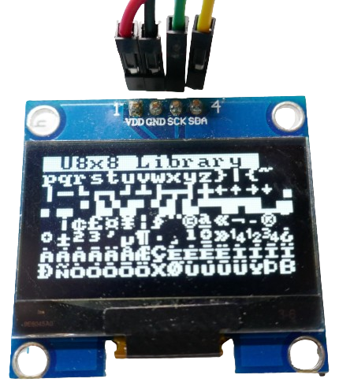
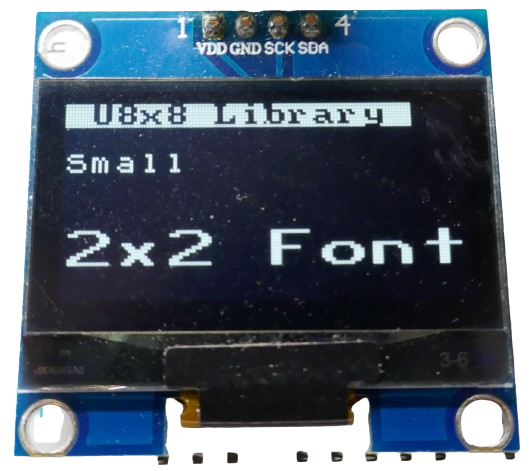
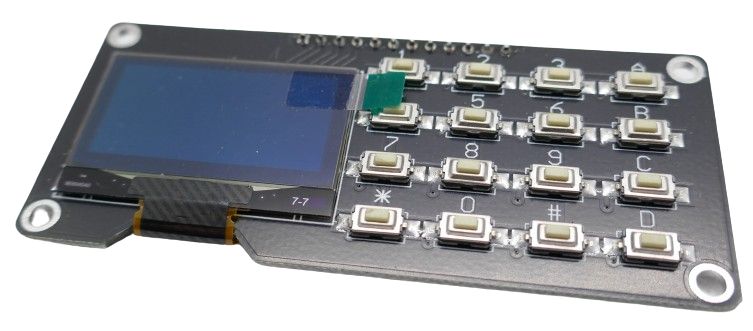
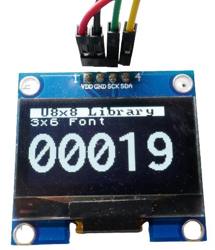

# SH1106-Based OLED Display

> 128x64 Monochrome OLED Displays For Little Money

The *SH1106* is a *OLED display driver* very similar to the popular *SSD1306*. It supports monochrome displays with a maximum resolution of *132x64* pixels and typically uses *I2C*.




## Overview
The *SH1106* is an economical driver for monochrome OLED displays up to a resolution of *132x64* pixels. It is sufficient for displaying text and static images which are the primary use cases.

If you need *animations* like *scrolling*, the *SSD1306* would be a better option as the *SH1106* lacks hardware animation or scrolling support.


## Breakout Boards and Colors

Typically, you purchase ready-to-use breakout boards that come with the driver and a OLED display. 



Common display sizes include *0.96"* and *1.3"*, either stand-alone or integrated into *keyboard-display-combos* like the ones below:


 
These displays come in various colors but they are **always monochrome**. The most common colors are *white*, *blue*, and *yellow/blue* (the first 8 lines are yellow, the rest is blue). Lately, fully *yellow* displays have become available as well. 

### I2C Interface


The vast majority of use cases uses the *I2C* interface since small monochrome displays need to handle only limited amounts of data, and *I2C* is simpler to use than *SPI* . However, *SPI* can be an option, too, and there are a few breakout boards that implement *SPI* instead of *I2C*.

The I2C address typically is either *0x3c* or *0x3d*.

## Programming

The by far easiest way of using the *SH1106* OLED display is via [ESPHome](https://done.land/tools/software/esphome/introduction/), however this platform is targeting primarily *ESP32* microcontrollers.

Alternately, you can use *C++ libraries* to program the firmware manually.

### ESPHome

Using *ESPHome* is the simplest approach, as *ESPHome* includes a native [SSD1306 OLED Display](https://esphome.io/components/display/ssd1306.html) component that supports most monochrome OLED drivers, including the *SH1106*. Here are the supported OLED drivers:

* **SSD1306:** 128x32, 128x64, 96x16, 72x40, 64x48
* **SSD1305:** 128x32, 128x64
* **SH1107:** 128x64, 128x128
* **SH1106:** 128x32, 128x64, 96x16, 64x48

Here is an example configuration:

````
# define the I2C pins that you use 
# to connect the display to your microcontroller
i2c:
  sda: GPIO21
  scl: GPIO22

display:
  - platform: ssd1306_i2c
    model: "SH1106 128x64"  # 0.96/1.3" 128x64 OLED display
    address: 0x3C           # default address, use 0x3D if default fails
    rotation: 180           # rotate content if needed
    update_interval: 3000ms # 1s is default (1000ms)
    lambda: |-
      it.print(0, 0, id(lato400), "Hello World!");

# you need at least one font to output text
font:
  - file:
      type: gfonts
      family: Lato
      weight: 400
    id: lato400
    size: 20
````


To compile and upload the sample configuration, simply [follow these simple steps](https://done.land/tools/software/esphome/compileconfiguration/).


You can now use all the graphics commands supported by the [ESPHome Display Component](https://esphome.io/components/display/index.html) to draw images, shapes, lines, arcs, etc.

### C++

For direct programming (using the *Arduino Framework*), two popular libraries support the *SH1106*:


- **U8G2 Library**
- **Adafruit GFX Library**

### U8G2 Library

The *U8G2 library* is a versatile and very robust choice that works for a variety of **monochrome** display drivers. 


#### Selecting the OLED Driver

Since *U8G2* supports many different drivers, you need to specify your driver at the beginning of the code. 

The example code typically includes a large block of commented lines describing supported drivers and hardware. To select the *SH1106*, uncomment the line corresponding to your required resolution (e.g., *128x64*).

### Example Code

The following code is adapted from the *U8G2* examples. I removed the full comment block at the start and kept only the relevant lines for the *SH1106 I2C driver*. Since I tested with a *132x64* pixel display, I uncommented the line for the *128x64* display.

No further configuration was required. The code compiled flawlessly in *PlatformIO* and ran perfectly on an *ESP32-S2 Mini*.


````c++
/*
  Universal 8bit Graphics Library (https://github.com/olikraus/u8g2/)

  Copyright (c) 2016, olikraus@gmail.com
  All rights reserved.

  Redistribution and use in source and binary forms, with or without modification, 
  are permitted provided that the following conditions are met:

  * Redistributions of source code must retain the above copyright notice, this list 
    of conditions and the following disclaimer.
    
  * Redistributions in binary form must reproduce the above copyright notice, this 
    list of conditions and the following disclaimer in the documentation and/or other 
    materials provided with the distribution.

  THIS SOFTWARE IS PROVIDED BY THE COPYRIGHT HOLDERS AND 
  CONTRIBUTORS "AS IS" AND ANY EXPRESS OR IMPLIED WARRANTIES, 
  INCLUDING, BUT NOT LIMITED TO, THE IMPLIED WARRANTIES OF 
  MERCHANTABILITY AND FITNESS FOR A PARTICULAR PURPOSE ARE 
  DISCLAIMED. IN NO EVENT SHALL THE COPYRIGHT HOLDER OR 
  CONTRIBUTORS BE LIABLE FOR ANY DIRECT, INDIRECT, INCIDENTAL, 
  SPECIAL, EXEMPLARY, OR CONSEQUENTIAL DAMAGES (INCLUDING, BUT 
  NOT LIMITED TO, PROCUREMENT OF SUBSTITUTE GOODS OR SERVICES; 
  LOSS OF USE, DATA, OR PROFITS; OR BUSINESS INTERRUPTION) HOWEVER 
  CAUSED AND ON ANY THEORY OF LIABILITY, WHETHER IN CONTRACT, 
  STRICT LIABILITY, OR TORT (INCLUDING NEGLIGENCE OR OTHERWISE) 
  ARISING IN ANY WAY OUT OF THE USE OF THIS SOFTWARE, EVEN IF 
  ADVISED OF THE POSSIBILITY OF SUCH DAMAGE.  

*/
#include <Arduino.h>
#include <U8x8lib.h>

#ifdef U8X8_HAVE_HW_SPI
#include <SPI.h>
#endif
#ifdef U8X8_HAVE_HW_I2C
#include <Wire.h>
#endif

U8X8_SH1106_128X64_NONAME_HW_I2C u8x8(/* reset=*/ U8X8_PIN_NONE);
//U8X8_SH1106_128X32_VISIONOX_HW_I2C u8x8(/* reset=*/ U8X8_PIN_NONE); 

void setup(void)
{
  u8x8.begin();
  //u8x8.setFlipMode(1);
}

void pre(void)
{
  u8x8.setFont(u8x8_font_amstrad_cpc_extended_f);    
  u8x8.clear();

  u8x8.inverse();
  u8x8.print(" U8x8 Library ");
  u8x8.setFont(u8x8_font_chroma48medium8_r);  
  u8x8.noInverse();
  u8x8.setCursor(0,1);
}

void draw_bar(uint8_t c, uint8_t is_inverse)
{	
  uint8_t r;
  u8x8.setInverseFont(is_inverse);
  for( r = 0; r < u8x8.getRows(); r++ )
  {
    u8x8.setCursor(c, r);
    u8x8.print(" ");
  }
}

void draw_ascii_row(uint8_t r, int start)
{
  int a;
  uint8_t c;
  for( c = 0; c < u8x8.getCols(); c++ )
  {
    u8x8.setCursor(c,r);
    a = start + c;
    if ( a <= 255 )
      u8x8.write(a);
  }
}

void loop(void)
{
  int i;
  uint8_t c, r, d;
  pre();
  u8x8.print("github.com/");
  u8x8.setCursor(0,2);
  u8x8.print("olikraus/u8g2");
  delay(2000);
  u8x8.setCursor(0,3);
  u8x8.print("Tile size:");
  u8x8.print((int)u8x8.getCols());
  u8x8.print("x");
  u8x8.print((int)u8x8.getRows());
  
  delay(2000);
   
  pre();
  for( i = 19; i > 0; i-- )
  {
    u8x8.setCursor(3,2);
    u8x8.print(i);
    u8x8.print("  ");
    delay(150);
  }
  
  draw_bar(0, 1);
  for( c = 1; c < u8x8.getCols(); c++ )
  {
    draw_bar(c, 1);
    draw_bar(c-1, 0);
    delay(50);
  }
  draw_bar(u8x8.getCols()-1, 0);

  pre();
  u8x8.setFont(u8x8_font_amstrad_cpc_extended_f); 
  for( d = 0; d < 8; d ++ )
  {
    for( r = 1; r < u8x8.getRows(); r++ )
    {
      draw_ascii_row(r, (r-1+d)*u8x8.getCols() + 32);
    }
    delay(400);
  }

  draw_bar(u8x8.getCols()-1, 1);
  for( c = u8x8.getCols()-1; c > 0; c--)
  {
    draw_bar(c-1, 1);
    draw_bar(c, 0);
    delay(50);
  }
  draw_bar(0, 0);

  pre();
  u8x8.drawString(0, 2, "Small");
  u8x8.draw2x2String(0, 5, "Scale Up");
  delay(3000);

  pre();
  u8x8.drawString(0, 2, "Small");
  u8x8.setFont(u8x8_font_px437wyse700b_2x2_r);
  u8x8.drawString(0, 5, "2x2 Font");
  delay(3000);

  pre();
  u8x8.drawString(0, 1, "3x6 Font");
  u8x8.setFont(u8x8_font_inb33_3x6_n);
  for(i = 0; i < 100; i++ )
  {
    u8x8.setCursor(0, 2);
    u8x8.print(i);			// Arduino Print function
    delay(10);
  }
  for(i = 0; i < 100; i++ )
  {
    u8x8.drawString(0, 2, u8x8_u16toa(i, 5));	// U8g2 Build-In functions
    delay(10);		
  }

  pre();
  u8x8.drawString(0, 2, "Weather");
  u8x8.setFont(u8x8_font_open_iconic_weather_4x4);
  for(c = 0; c < 6; c++ )
  {
    u8x8.drawGlyph(0, 4, '@'+c);
    delay(300);
  }
  

  pre();
  u8x8.print("print \\n\n");
  delay(500);
  u8x8.println("println");
  delay(500);
  u8x8.println("done");
  delay(1500);

  pre();
  u8x8.fillDisplay();
  for( r = 0; r < u8x8.getRows(); r++ )
  {
    u8x8.clearLine(r);
    delay(100);
  }
  delay(1000);

}
````

This is the *platformio.ini* I used to compile the sketch in *platformio* and run it on a *ESP32 S2 Mini*:

````
[env:lolin_s2_mini]
platform = espressif32
board = lolin_s2_mini
framework = arduino
lib_deps = 
	olikraus/U8g2@^2.35.19
````
### Adafruit Library

The *SH1106* initially lacked the same level of driver support as the *SSD1306*, which led users to adapt existing *SSD1306* libraries for the *SH1106*. 

Unfortunately, these adaptations were not always done according to standards. For example, there is an *Adafruit* library ported from their original *SSD1306* library, but the tweaks were applied somewhat crudely. As a result, errors in the header file can produce linker errors when using the code in *PlatformIO*. These issues might have been resolved by the time you read this, so it is still worth trying.



> [!NOTE]  
> Libraries targeting specific drivers can sometimes behave inconsistently depending on the *IDE* used. If a library fails to work in *PlatformIO*, consider testing it in *ArduinoIDE* to verify compatibility. Well-engineered libraries, however, should not exhibit such peculiarities.


## Data Sheets

[SH1106](materials/sh1106_datasheet.pdf)   


> Tags: HID, Display, OLED, I2C, Driver, SH1106, Monochrome, 132x64, 128x64, 128x32

[Visit Page on Website](https://done.land/components/humaninterface/display/oled/sh1106?448322050807243142) - created 2024-04-28 - last edited 2025-01-10
