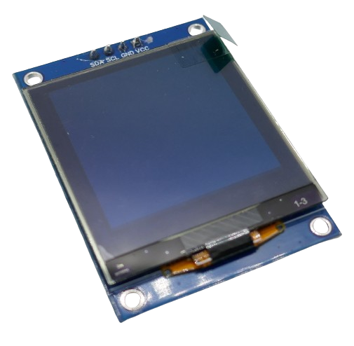
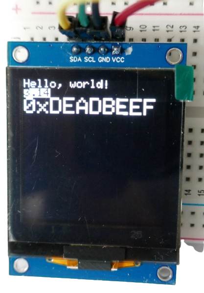
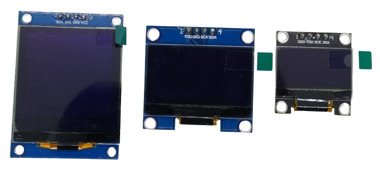
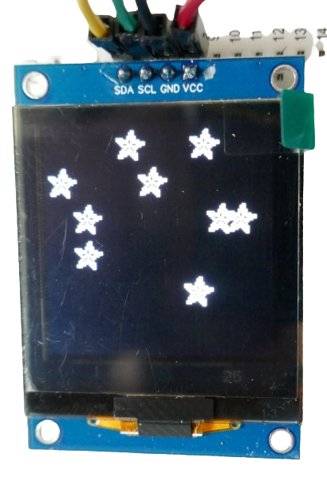
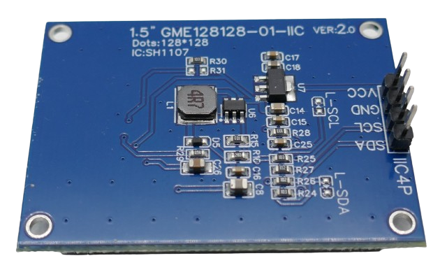
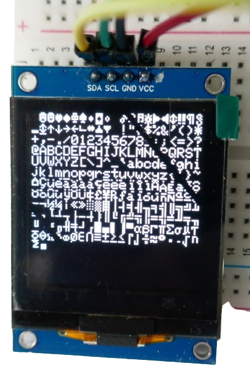
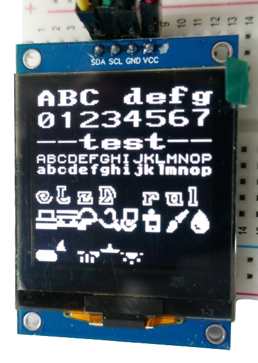

# SH1107-Based OLED Display

> 1.5 Inch High Resolution Monochrome OLED Displays

Whenever you need to display more complex information, a *SH1107*-based *monochrome OLED display* can be a good choice: the *SH1107* driver supports resolutions of up to *128x128* pixels and *doubles* the resolution compared to *entry-level OLED displays*.




*OLED display* breakout boards with the *SH1107* driver complement the *higher resolution* with a larger *physical size*: *1.5inch* displays are common.



## Higher Resolution And Larger Screen

When comparing a *1.5inch OLED display* with the popular *1.3inch* and *0.96inch* models, it becomes evident how much more real estate the *1.5inch SH1107*-based displays provide:




## Colors
The *display* comes in different colors: *white*, *blue*, *yellow*. There is also a *split-screen* version available with a small *yellow* margin at the top and the remainder of the screen using *blue* color.





## Interface

*SH1107* supports both *SPI* and *I2C*. Many breakout boards choose to use the efficient *two-wire I2C* interface.




## Libraries
Common libraries are *Adafruit SH110X* and the *multi-device* library *u8g2*.

### Example Code
I started by using the *Adafruit SH110X* library in *platformio* using a *ESP32 S2 Mini* microcontroller.

The example code worked after the usual *tweaking*:

* **Move Functions Up:** I moved all functions above *setup()*. In *platformio*, functions must be defined before they can be called.
* **I2C Hardware Address:** I changed the *default I2C hardware address* in the example code from *0x3d* to *0x3c*. If your *OLED display* stays blank, it is either one of these addresses, and with my generic *OLED display breakout board*, it happened to be *0x3c*.

````c++
/*********************************************************************
  This is an example for our Monochrome OLEDs based on SH1107 drivers

  This example is for a 128x128 size display using I2C to communicate

  Adafruit invests time and resources providing this open source code,
  please support Adafruit and open-source hardware by purchasing
  products from Adafruit!

  Written by Limor Fried/Ladyada  for Adafruit Industries.
  BSD license, check license.txt for more information
  All text above, and the splash screen must be included in any redistribution
*********************************************************************/


#include <SPI.h>
#include <Wire.h>
#include <Adafruit_GFX.h>
#include <Adafruit_SH110X.h>

#define SCREEN_WIDTH 128  // OLED display width, in pixels
#define SCREEN_HEIGHT 128 // OLED display height, in pixels
#define OLED_RESET -1     // can set an oled reset pin if desired
Adafruit_SH1107 display = Adafruit_SH1107(SCREEN_WIDTH, SCREEN_HEIGHT, &Wire, OLED_RESET, 1000000, 100000);


#define NUMFLAKES 10
#define XPOS 0
#define YPOS 1
#define DELTAY 2


#define LOGO_HEIGHT   16
#define LOGO_WIDTH    16
static const unsigned char PROGMEM logo_bmp[] =
{ 0b00000000, 0b11000000,
  0b00000001, 0b11000000,
  0b00000001, 0b11000000,
  0b00000011, 0b11100000,
  0b11110011, 0b11100000,
  0b11111110, 0b11111000,
  0b01111110, 0b11111111,
  0b00110011, 0b10011111,
  0b00011111, 0b11111100,
  0b00001101, 0b01110000,
  0b00011011, 0b10100000,
  0b00111111, 0b11100000,
  0b00111111, 0b11110000,
  0b01111100, 0b11110000,
  0b01110000, 0b01110000,
  0b00000000, 0b00110000 };


void testdrawline() {
  int16_t i;

  display.clearDisplay(); // Clear display buffer

  for(i=0; i<display.width(); i+=4) {
    display.drawLine(0, 0, i, display.height()-1, SH110X_WHITE);
    display.display(); // Update screen with each newly-drawn line
    delay(1);
  }
  for(i=0; i<display.height(); i+=4) {
    display.drawLine(0, 0, display.width()-1, i, SH110X_WHITE);
    display.display();
    delay(1);
  }
  delay(250);

  display.clearDisplay();

  for(i=0; i<display.width(); i+=4) {
    display.drawLine(0, display.height()-1, i, 0, SH110X_WHITE);
    display.display();
    delay(1);
  }
  for(i=display.height()-1; i>=0; i-=4) {
    display.drawLine(0, display.height()-1, display.width()-1, i, SH110X_WHITE);
    display.display();
    delay(1);
  }
  delay(250);

  display.clearDisplay();

  for(i=display.width()-1; i>=0; i-=4) {
    display.drawLine(display.width()-1, display.height()-1, i, 0, SH110X_WHITE);
    display.display();
    delay(1);
  }
  for(i=display.height()-1; i>=0; i-=4) {
    display.drawLine(display.width()-1, display.height()-1, 0, i, SH110X_WHITE);
    display.display();
    delay(1);
  }
  delay(250);

  display.clearDisplay();

  for(i=0; i<display.height(); i+=4) {
    display.drawLine(display.width()-1, 0, 0, i, SH110X_WHITE);
    display.display();
    delay(1);
  }
  for(i=0; i<display.width(); i+=4) {
    display.drawLine(display.width()-1, 0, i, display.height()-1, SH110X_WHITE);
    display.display();
    delay(1);
  }

  delay(2000); // Pause for 2 seconds
}

void testdrawrect(void) {
  display.clearDisplay();

  for(int16_t i=0; i<display.height()/2; i+=2) {
    display.drawRect(i, i, display.width()-2*i, display.height()-2*i, SH110X_WHITE);
    display.display(); // Update screen with each newly-drawn rectangle
    delay(1);
  }

  delay(2000);
}

void testfillrect(void) {
  display.clearDisplay();

  for(int16_t i=0; i<display.height()/2; i+=3) {
    // The INVERSE color is used so rectangles alternate white/black
    display.fillRect(i, i, display.width()-i*2, display.height()-i*2, SH110X_INVERSE);
    display.display(); // Update screen with each newly-drawn rectangle
    delay(1);
  }

  delay(2000);
}

void testdrawcircle(void) {
  display.clearDisplay();

  for(int16_t i=0; i<max(display.width(),display.height())/2; i+=2) {
    display.drawCircle(display.width()/2, display.height()/2, i, SH110X_WHITE);
    display.display();
    delay(1);
  }

  delay(2000);
}

void testfillcircle(void) {
  display.clearDisplay();

  for(int16_t i=max(display.width(),display.height())/2; i>0; i-=3) {
    // The INVERSE color is used so circles alternate white/black
    display.fillCircle(display.width() / 2, display.height() / 2, i, SH110X_INVERSE);
    display.display(); // Update screen with each newly-drawn circle
    delay(1);
  }

  delay(2000);
}

void testdrawroundrect(void) {
  display.clearDisplay();

  for(int16_t i=0; i<display.height()/2-2; i+=2) {
    display.drawRoundRect(i, i, display.width()-2*i, display.height()-2*i,
      display.height()/4, SH110X_WHITE);
    display.display();
    delay(1);
  }

  delay(2000);
}

void testfillroundrect(void) {
  display.clearDisplay();

  for(int16_t i=0; i<display.height()/2-2; i+=2) {
    // The INVERSE color is used so round-rects alternate white/black
    display.fillRoundRect(i, i, display.width()-2*i, display.height()-2*i,
      display.height()/4, SH110X_INVERSE);
    display.display();
    delay(1);
  }

  delay(2000);
}

void testdrawtriangle(void) {
  display.clearDisplay();

  for(int16_t i=0; i<max(display.width(),display.height())/2; i+=5) {
    display.drawTriangle(
      display.width()/2  , display.height()/2-i,
      display.width()/2-i, display.height()/2+i,
      display.width()/2+i, display.height()/2+i, SH110X_WHITE);
    display.display();
    delay(1);
  }

  delay(2000);
}

void testfilltriangle(void) {
  display.clearDisplay();

  for(int16_t i=max(display.width(),display.height())/2; i>0; i-=5) {
    // The INVERSE color is used so triangles alternate white/black
    display.fillTriangle(
      display.width()/2  , display.height()/2-i,
      display.width()/2-i, display.height()/2+i,
      display.width()/2+i, display.height()/2+i, SH110X_INVERSE);
    display.display();
    delay(1);
  }

  delay(2000);
}

void testdrawchar(void) {
  display.clearDisplay();

  display.setTextSize(1);      // Normal 1:1 pixel scale
  display.setTextColor(SH110X_WHITE); // Draw white text
  display.setCursor(0, 0);     // Start at top-left corner
  display.cp437(true);         // Use full 256 char 'Code Page 437' font

  // Not all the characters will fit on the display. This is normal.
  // Library will draw what it can and the rest will be clipped.
  for(int16_t i=0; i<256; i++) {
    if(i == '\n') display.write(' ');
    else          display.write(i);
  }

  display.display();
  delay(2000);
}

void testdrawstyles(void) {
  display.clearDisplay();

  display.setTextSize(1);             // Normal 1:1 pixel scale
  display.setTextColor(SH110X_WHITE);        // Draw white text
  display.setCursor(0,0);             // Start at top-left corner
  display.println(F("Hello, world!"));

  display.setTextColor(SH110X_BLACK, SH110X_WHITE); // Draw 'inverse' text
  display.println(3.141592);

  display.setTextSize(2);             // Draw 2X-scale text
  display.setTextColor(SH110X_WHITE);
  display.print(F("0x")); display.println(0xDEADBEEF, HEX);

  display.display();
  delay(2000);
}

void testdrawbitmap(void) {
  display.clearDisplay();

  display.drawBitmap(
    (display.width()  - LOGO_WIDTH ) / 2,
    (display.height() - LOGO_HEIGHT) / 2,
    logo_bmp, LOGO_WIDTH, LOGO_HEIGHT, 1);
  display.display();
  delay(1000);
}

#define XPOS   0 // Indexes into the 'icons' array in function below
#define YPOS   1
#define DELTAY 2

void testanimate(const uint8_t *bitmap, uint8_t w, uint8_t h) {
  int8_t f, icons[NUMFLAKES][3];

  // Initialize 'snowflake' positions
  for(f=0; f< NUMFLAKES; f++) {
    icons[f][XPOS]   = random(1 - LOGO_WIDTH, display.width());
    icons[f][YPOS]   = -LOGO_HEIGHT;
    icons[f][DELTAY] = random(1, 6);
    Serial.print(F("x: "));
    Serial.print(icons[f][XPOS], DEC);
    Serial.print(F(" y: "));
    Serial.print(icons[f][YPOS], DEC);
    Serial.print(F(" dy: "));
    Serial.println(icons[f][DELTAY], DEC);
  }

  for(;;) { // Loop forever...
    display.clearDisplay(); // Clear the display buffer

    // Draw each snowflake:
    for(f=0; f< NUMFLAKES; f++) {
      display.drawBitmap(icons[f][XPOS], icons[f][YPOS], bitmap, w, h, SH110X_WHITE);
    }

    display.display(); // Show the display buffer on the screen
    delay(200);        // Pause for 1/10 second

    // Then update coordinates of each flake...
    for(f=0; f< NUMFLAKES; f++) {
      icons[f][YPOS] += icons[f][DELTAY];
      // If snowflake is off the bottom of the screen...
      if (icons[f][YPOS] >= display.height()) {
        // Reinitialize to a random position, just off the top
        icons[f][XPOS]   = random(1 - LOGO_WIDTH, display.width());
        icons[f][YPOS]   = -LOGO_HEIGHT;
        icons[f][DELTAY] = random(1, 6);
      }
    }
  }
}


void setup()   {

  Serial.begin(9600);

  delay(250); // wait for the OLED to power up

  // Show image buffer on the display hardware.
  // Since the buffer is intialized with an Adafruit splashscreen
  // internally, this will display the splashscreen.

  display.begin(0x3c, true); // Address 0x3D default
 //display.setContrast (0); // dim display
 
  display.display();
  delay(2000);

  // Clear the buffer.
  display.clearDisplay();

  // draw a single pixel
  display.drawPixel(10, 10, SH110X_WHITE);
  // Show the display buffer on the hardware.
  // NOTE: You _must_ call display after making any drawing commands
  // to make them visible on the display hardware!
  display.display();
  delay(2000);
  display.clearDisplay();

  testdrawline();      // Draw many lines

  testdrawrect();      // Draw rectangles (outlines)

  testfillrect();      // Draw rectangles (filled)

  testdrawcircle();    // Draw circles (outlines)

  testfillcircle();    // Draw circles (filled)

  testdrawroundrect(); // Draw rounded rectangles (outlines)

  testfillroundrect(); // Draw rounded rectangles (filled)

  testdrawtriangle();  // Draw triangles (outlines)

  testfilltriangle();  // Draw triangles (filled)

  testdrawchar();      // Draw characters of the default font

  testdrawstyles();    // Draw 'stylized' characters

  testdrawbitmap();    // Draw a small bitmap image

  testanimate(logo_bmp, LOGO_WIDTH, LOGO_HEIGHT); // Animate bitmaps
}

void loop() {
}
````

This is the *platformio.ini* I used to compile the sketch in *platform.io* and run it on a *ESP32 S2 Mini*:

````
[env:lolin_s2_mini]
platform = espressif32
board = lolin_s2_mini
framework = arduino
lib_deps = adafruit/Adafruit SH110X@^2.1.10
````

## Screen Flicker
With this library and *OLED display*, for the first time I experienced *screen flicker*. Or should I say: *my camera experienced screen flicker*.

To the human eye, the display still looked ok without obvious *flickering*. When taking pictures though, significant *artefacts* became visible:




This surprised me as *OLED displays* need no  *refresh* due to their design: each pixel is a self-illuminated light emitter. 

The only technical reason for *flickering* could be *PWM*-based *dimming*, but that could be ruled out as the display was running at *full brightness*, and *PWM frequencies* are generally way too high to cause the artefacts in my camera anyway.

Which leaves us with *software issues*: some libraries *clear all pixels* and *start a fresh redraw* for each new frame. That of course would explain *flickering artefacts*, especially with almost *latency-free* displays like *OLED*.


### Flicker-Free Library: u8g2

To validate, I used a different library: *u8g2*. I then adapted one of the shipping examples.

With *u8g2*, the attached *display* is configured by *commenting in* the appropriate *constructor* line. With a bit of *trial and error*, I identified the constructor that worked perfectly with the generic *OLED breakout board* I was testing.

The result wasa rock-solid and *100% flicker-free* display. 

Apparently, the flickering was caused by how the *Adafruit* library draws the frames.



This is the flicker-free code:

````c++
/*

  16x16Font.ino
  
  Demonstration for 16x16 pixel fonts.
  Several fonts are included in the example. 

  Universal 8bit Graphics Library (https://github.com/olikraus/u8g2/)

  Copyright (c) 2016, olikraus@gmail.com
  All rights reserved.

  Redistribution and use in source and binary forms, with or without modification, 
  are permitted provided that the following conditions are met:

  * Redistributions of source code must retain the above copyright notice, this list 
    of conditions and the following disclaimer.
    
  * Redistributions in binary form must reproduce the above copyright notice, this 
    list of conditions and the following disclaimer in the documentation and/or other 
    materials provided with the distribution.

  THIS SOFTWARE IS PROVIDED BY THE COPYRIGHT HOLDERS AND 
  CONTRIBUTORS "AS IS" AND ANY EXPRESS OR IMPLIED WARRANTIES, 
  INCLUDING, BUT NOT LIMITED TO, THE IMPLIED WARRANTIES OF 
  MERCHANTABILITY AND FITNESS FOR A PARTICULAR PURPOSE ARE 
  DISCLAIMED. IN NO EVENT SHALL THE COPYRIGHT HOLDER OR 
  CONTRIBUTORS BE LIABLE FOR ANY DIRECT, INDIRECT, INCIDENTAL, 
  SPECIAL, EXEMPLARY, OR CONSEQUENTIAL DAMAGES (INCLUDING, BUT 
  NOT LIMITED TO, PROCUREMENT OF SUBSTITUTE GOODS OR SERVICES; 
  LOSS OF USE, DATA, OR PROFITS; OR BUSINESS INTERRUPTION) HOWEVER 
  CAUSED AND ON ANY THEORY OF LIABILITY, WHETHER IN CONTRACT, 
  STRICT LIABILITY, OR TORT (INCLUDING NEGLIGENCE OR OTHERWISE) 
  ARISING IN ANY WAY OUT OF THE USE OF THIS SOFTWARE, EVEN IF 
  ADVISED OF THE POSSIBILITY OF SUCH DAMAGE.  

*/

#include <Arduino.h>
#include <U8x8lib.h>

#ifdef U8X8_HAVE_HW_SPI
#include <SPI.h>
#endif

//U8X8_SH1107_128X128_HW_I2C u8x8(/* reset=*/ 8);
//U8X8_SH1107_128X80_HW_I2C u8x8(/* reset=*/ 8);
U8X8_SH1107_PIMORONI_128X128_HW_I2C u8x8(/* reset=*/ 8);
//U8X8_SH1107_SEEED_128X128_SW_I2C u8x8(/* clock=*/ SCL, /* data=*/ SDA, /* reset=*/ U8X8_PIN_NONE);
//U8X8_SH1107_SEEED_128X128_HW_I2C u8x8(/* reset=*/ U8X8_PIN_NONE);
//U8X8_SH1107_SEEED_96X96_4W_HW_SPI u8x8(/* cs=*/ 10, /* dc=*/ 9, /* reset=*/ 8);
//U8X8_SH1108_128X160_4W_HW_SPI u8x8(/* cs=*/ 10, /* dc=*/ 9, /* reset=*/ 8);
//U8X8_SH1108_160X160_4W_HW_SPI u8x8(/* cs=*/ 10, /* dc=*/ 9, /* reset=*/ 8);


void setup(void)
{
  u8x8.begin();

  
  u8x8.setFont(u8x8_font_px437wyse700a_2x2_r);
  u8x8.drawString(0, 0, "ABC defg");
  u8x8.setFont(u8x8_font_px437wyse700b_2x2_r);
  u8x8.drawString(0, 2, "01234567");
  u8x8.setFont(u8x8_font_px437wyse700a_2x2_r);
  u8x8.drawString(0, 4, "--test--");
  u8x8.setFont(u8x8_font_chroma48medium8_r);
  u8x8.drawString(0, 6, "ABCDEFGHIJKLMNOP");
  u8x8.setFont(u8x8_font_torussansbold8_r);
  u8x8.drawString(0, 7, "abcdefghijklmnop");
  u8x8.setFont(u8x8_font_lucasarts_scumm_subtitle_o_2x2_r);
  u8x8.drawString(0, 9, "OLED rulez");
  u8x8.setFont(u8x8_font_open_iconic_thing_2x2);
  u8x8.drawString(0, 11, "ABCDEFGHIJK");
  u8x8.setFont(u8x8_font_open_iconic_weather_2x2);
  u8x8.drawString(0, 14, "ABCDEFGHIJK");
  u8x8.refreshDisplay();		// only required for SSD1606/7 
}

void loop(void)
{
  
}
````

And this is the *platformio.ini* that I used to run the code on an *ESP32 S2 Mini*:

````
[env:lolin_s2_mini]
platform = espressif32
board = lolin_s2_mini
framework = arduino
lib_deps = 
	olikraus/U8g2@^2.35.19
````

> [!TIP]
> While working with the *u8g2* library, it occured to me how *simple-to-use* this library is, especially when the focus is on displaying *text*. It comes with a variety of fonts and requires just a few lines of code. Compared to the *Adafruit* library, memory consumption was roughly the same.


## Data Sheets

[SH1107](materials/sh1107_datasheet.pdf)   


> Tags: HID, Display, OLED, I2C, Driver, SH1107, Monochrome, 128x128

