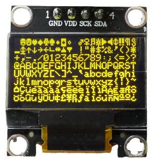
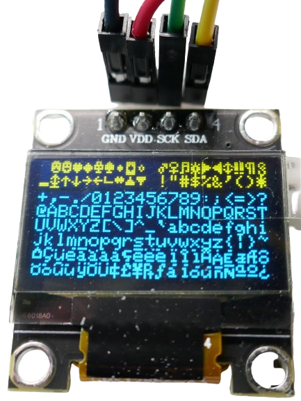
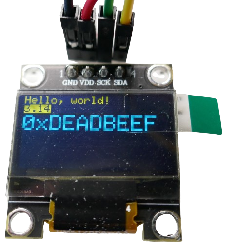
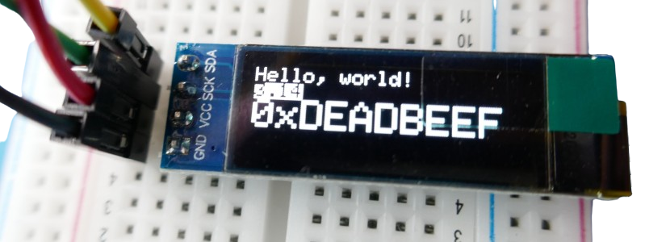

# SSD1306-Based OLED Display

> Small and Monochrome OLED Displays for Little Money

*SSD1306*-based *OLED displays* come in *128x32* and *128x64* pixel resolutions and typically use the *I2C* interface. These displays are *monochrome* but available in different colors: *white*, *blue*, and *yellow*.  

The *SSD1306* is very similar to the [SH1106](https://done.land/components/humaninterface/display/oled/ssd1306/), **but they are not identical**. Some libraries support both *SSD1306* and *SH1106*, but libraries written specifically for one **are not compatible** with the other.  

If you accidentally use the wrong driver for your OLED display, the screen will appear scrambled, though you may still recognize parts of the intended content.  

The *SSD1306* is the *older* but *more feature-rich* design, supporting hardware scrolling and other capabilities. The *SH1106* is a newer, cost-optimized variant that omits hardware acceleration for scrolling and animations, as these features are often unnecessary for such small displays.  



> [!CAUTION]  
> These displays are *physically very small*. A *0.96-inch 128x64 display* measures only *2.4x1.2 cm*. Despite their size, they can display a lot of useful information and are well-suited for compact and portable devices.  

## Dual Color  

*SSD1306*-based *OLED displays* are strictly *monochrome*, even if some vendors advertise *dual-color OLEDs*.  



In reality, these are *split-color displays* with a small *yellow* stripe at the top while the rest of the display is *blue*. You **cannot** freely change the color of individual pixels.  

However, *split-color* displays can be useful when incorporated into a purposeful screen layout. For example, the upper yellow portion could be used for *warning messages* or a *progress bar*.  



## 128x64 and 128x32  

The two most common *OLED resolutions* found in breakout boards using the *SSD1306* are:  

- *128x64* (available in *0.96"* and *1.3"* sizes)  
- *128x32* (typically *0.91"*)  



## Software Support  

There are many libraries available for *SSD1306 OLED displays*, compatible with *Arduino* as well as *ESP* microcontrollers.  

## Interface  

Most breakout boards use the efficient two-wire *I2C* interface.  

The *SSD1306* also supports *SPI*, but given the low data transfer requirements of small monochrome displays, using the *SPI* interface (which requires four wires and additional *GPIOs*) is often unnecessary.  

### Caveats  

Keep the following points in mind:  

- **SPI or I2C?** While the *SSD1306* supports *SPI*, most breakout boards use *I2C* to save *GPIOs*. Verify which interface your display supports and ensure your code matches the correct interface.  
- **I2C Hardware Address:** The default *I2C* address for most *SSD1306* breakout boards (regardless of resolution) is *0x3C*. If this does not work, try *0x3D*.  
- **PlatformIO Considerations:** If you use *PlatformIO* as your *IDE*, move all functions above the `setup()` function, as *C++* requires *forward function declaration*. Unlike the *Arduino IDE*, where functions can be placed anywhere, *PlatformIO* enforces stricter rules. Some libraries were originally developed in the *Arduino IDE* and include example code that places functions *after* they are called, which can cause compilation errors in *PlatformIO*. [Here](https://docs.platformio.org/en/latest/faq/ino-to-cpp.html) are the essential details for converting an `.ino` file to `.cpp` so that it compiles correctly in *PlatformIO*.  


## Programming

The by far easiest way of using *SSD1306* OLED displays is via [ESPHome](https://done.land/tools/software/esphome/introduction/), however this platform is targeting primarily *ESP32* microcontrollers.

Alternately, you can use *C++ libraries* to program the firmware manually.

## ESPHome

Using *ESPHome* is the simplest approach: *ESPHome* includes a native [SSD1306 OLED Display](https://esphome.io/components/display/ssd1306.html) component which is made to support a variety of OLED drivers, including the *SSD1306*. This are the currently supported OLED drivers:

* **SSD1306:** 128x32, 128x64, 96x16, 72x40, 64x48
* **SSD1305:** 128x32, 128x64
* **SH1107:** 128x64, 128x128
* **SH1106:** 128x32, 128x64, 96x16, 64x48

So if you come across *SH1106*-based OLEDs in the future, your *ESPHome* configuration continues to work almost unchanged.

> [!IMPORTANT]
> *ESPHome* creates the **illusion** that *SSD1306* and *SH1106* drivers would be compatible - which they are **not**. When using *C++* libraries, you must be careful to pick a library that is made for your particular driver. When you accidentally pick the wrong library, your display will be scambled due to the differences in memory and registers.    

Here is an example configuration for the *SSD1306*:

````
# define the I2C pins that you use 
# to connect the display to your microcontroller
i2c:
  sda: GPIO21
  scl: GPIO22

display:
  - platform: ssd1306_i2c
    model: "SSD1306_128X64"  # 0.96/1.3" 128x64 OLED display
    address: 0x3C           # default address, use 0x3D if default fails
    rotation: 180           # rotate content if needed
    update_interval: 3000ms # 1s is default (1000ms)
    lambda: |-
      it.print(0, 0, id(lato400), "Hello World!");

# you need at least one font to output text
font:
  - file:
      type: gfonts
      family: Lato
      weight: 400
    id: lato400
    size: 20
````


To compile and upload the sample configuration, simply [follow these simple steps](https://done.land/tools/software/esphome/compileconfiguration/).


> [!NOTE]
> OLED displays are crisp and clear. If texts appear unsharp like in the picture, you may have used a font that was scaled up or down. You get the best results with pixel fonts specifically designed for a given size.   

You can now use all the graphics commands supported by the [ESPHome Display Component](https://esphome.io/components/display/index.html) to draw images, shapes, lines, arcs, etc.


## C++

For direct programming (using the *Arduino Framework*), two popular libraries support the *SH1106*:

- [U8G2 Library](https://github.com/olikraus/u8g2)
- [Adafruit GFX](https://github.com/adafruit/Adafruit-GFX-Library) + [Adafruit_SH110x](https://github.com/adafruit/Adafruit_SH110x)

#### Why Adafruit Library?
The US company *Adafruit* produces and sells electronic components and provides extensive support for it, including state-of-the-art *C++ libraries*. 

Their libraries are popular because of good quality, documentation, and especially modular design: they consist of a *hardware specific* library for the particular display driver you need, and a *hardware neutral* core graphics library that provides the drawing commands:

* [Specific Driver Library:](https://github.com/adafruit/Adafruit_SH110x) targets a specific family of display drivers, i.e. *SH110x* drivers
* [Adafruit GFX:](https://github.com/adafruit/Adafruit-GFX-Library) core grafics library which is hardware independent and provides the drawing commands.

This way, source code remains compatible to most displays. All you need to do is change the hardware neutral library to target your display.

#### Why u8g2 Library
The [u8g2](https://github.com/olikraus/u8g2) library is another de-facto standard: it targets *all **monochrome** displays*, including OLED display drivers like *SH1106*.

With this library, your source code remains compatible to a variety of *monochrome displays*: all you need to do is use the appropriate display class in your code to initialize your display.

> [!TIP]
> *Oli Kraus* has created a universal library for **color displays**, too: [ucglib](https://github.com/olikraus/ucglib).


<details><summary>Caveats: Using ArduinoIDE Code In platformio</summary><br/>

You simply do not know most of the time *which IDE* was used to program a given library or example code that you want to use. A lot of the code you find in the Internet is many years old. Often, it was created using *ArduinoIDE*.

*ArduinoIDE* is a beginners-friendly (but rather limited) *C++ editor*. In order to simplify its user experience, it lets the user get away with many bad programming habits that a more professional IDE (like *platformio*) would flag down.

If examples do not compile right in *platformio*, you have two options:

* **Try with ArduinoIDE:** the code may compile just fine in *ArduinoIDE*. If so, it was probably created in *ArduinoIDE* in the first place, and requires some of the *ArduinoIDE* leniency.
* **Fix it:** check the code for signs of *ArduinoIDE specifics*, and turn the code into clean and solid *C++* source code that works fine in other IDEs such as *platformio*.

These are the most common issues with code that was created in *ArduinoIDE* and fails to compile in *platformio*:

* **`.ino` is `.cpp`:** *ArduinoIDE* uses the file extension `.ino` (as in *Ardu**ino***) for *C++ source code* files. The official extension is `.cpp` (as in *C++*). You can simply rename the file extension.
* **Add `#include <Arduino.h>`:** while not always necessary, it enables *ArduinoIDE-specific* features
* **Use `setup()` and `loop()`:** define both `setup()` and `loop()`. If you don't need `loop()`, define it anyway, and leave it empty.
* **Method Order:** make sure you define every method in your code **before you call the method**. Code written in *ArduinoIDE* typically moves method definitions to the *bottom* of the source code. This is only allowed in *ArduinoIDE*. For use in *platformio* and other professional IDEs, move `setup()` and `loop()` to the **bottom** of your code, and generally make sure all method definitions are defined once code calls them.

</details>

### Using u8g2 Library

The [U8G2 library](https://github.com/olikraus/u8g2) is a versatile and robust option that supports a wide range of **monochrome** display drivers.

#### Selecting the OLED Driver


In the *U8G2* C++ example, the display interface and resolution are selected through the *class*. For a *128x64 SSD1306 OLED display* connected via *I2C*, you can use one of the following classes:

- **`U8X8_SSD1306_128X64_NONAME_HW_I2C`**: For hardware *I2C*.
- **`U8X8_SSD1306_128X64_NONAME_SW_I2C`**: For software *I2C* (allows custom *I2C GPIOs*).

Once you’ve configured the appropriate class, the rest of the code is straightforward. I successfully tested this approach on *ESP32*, *ESP32-S2*, and *ESP32-C3*. 

> **Tip:** Ensure the *I2C GPIOs* in your code match your hardware setup; otherwise, the display will remain dark.


<details><summary>C++ Source Code</summary><br/>


````c++
#include <Arduino.h>
#include <U8x8lib.h>

#ifdef U8X8_HAVE_HW_SPI
#include <SPI.h>
#endif
#ifdef U8X8_HAVE_HW_I2C
#include <Wire.h>
#endif

// use hardware I2C (if you know the hardware i2c GPIOs for your board):
//U8X8_SSD1306_128X64_NONAME_HW_I2C u8x8(U8X8_PIN_NONE);

// use software I2C (and define GPIOs yourself)
// pins below are for ESP32S, adjust as needed for other mc models:
#define SDA 21
#define SCL 22

U8X8_SSD1306_128X64_NONAME_SW_I2C u8x8(SCL, SDA);

void setup(void)
{
  u8x8.begin();
  u8x8.setFlipMode(1);
}

void pre(void)
{
  u8x8.setFont(u8x8_font_amstrad_cpc_extended_f);    
  u8x8.clear();

  u8x8.inverse();
  u8x8.print(" U8x8 Library ");
  u8x8.setFont(u8x8_font_chroma48medium8_r);  
  u8x8.noInverse();
  u8x8.setCursor(0,1);
}

void draw_bar(uint8_t c, uint8_t is_inverse)
{	
  uint8_t r;
  u8x8.setInverseFont(is_inverse);
  for( r = 0; r < u8x8.getRows(); r++ )
  {
    u8x8.setCursor(c, r);
    u8x8.print(" ");
  }
}

void draw_ascii_row(uint8_t r, int start)
{
  int a;
  uint8_t c;
  for( c = 0; c < u8x8.getCols(); c++ )
  {
    u8x8.setCursor(c,r);
    a = start + c;
    if ( a <= 255 )
      u8x8.write(a);
  }
}

void loop(void)
{
  int i;
  uint8_t c, r, d;
  pre();
  u8x8.print("github.com/");
  u8x8.setCursor(0,2);
  u8x8.print("olikraus/u8g2");
  delay(2000);
  u8x8.setCursor(0,3);
  u8x8.print("Tile size:");
  u8x8.print((int)u8x8.getCols());
  u8x8.print("x");
  u8x8.print((int)u8x8.getRows());
  
  delay(2000);
   
  pre();
  for( i = 19; i > 0; i-- )
  {
    u8x8.setCursor(3,2);
    u8x8.print(i);
    u8x8.print("  ");
    delay(150);
  }
  
  draw_bar(0, 1);
  for( c = 1; c < u8x8.getCols(); c++ )
  {
    draw_bar(c, 1);
    draw_bar(c-1, 0);
    delay(50);
  }
  draw_bar(u8x8.getCols()-1, 0);

  pre();
  u8x8.setFont(u8x8_font_amstrad_cpc_extended_f); 
  for( d = 0; d < 8; d ++ )
  {
    for( r = 1; r < u8x8.getRows(); r++ )
    {
      draw_ascii_row(r, (r-1+d)*u8x8.getCols() + 32);
    }
    delay(400);
  }

  draw_bar(u8x8.getCols()-1, 1);
  for( c = u8x8.getCols()-1; c > 0; c--)
  {
    draw_bar(c-1, 1);
    draw_bar(c, 0);
    delay(50);
  }
  draw_bar(0, 0);

  pre();
  u8x8.drawString(0, 2, "Small");
  u8x8.draw2x2String(0, 5, "Scale Up");
  delay(3000);

  pre();
  u8x8.drawString(0, 2, "Small");
  u8x8.setFont(u8x8_font_px437wyse700b_2x2_r);
  u8x8.drawString(0, 5, "2x2 Font");
  delay(3000);

  pre();
  u8x8.drawString(0, 1, "3x6 Font");
  u8x8.setFont(u8x8_font_inb33_3x6_n);
  for(i = 0; i < 100; i++ )
  {
    u8x8.setCursor(0, 2);
    u8x8.print(i);			// Arduino Print function
    delay(10);
  }
  for(i = 0; i < 100; i++ )
  {
    u8x8.drawString(0, 2, u8x8_u16toa(i, 5));	// U8g2 Build-In functions
    delay(10);		
  }

  pre();
  u8x8.drawString(0, 2, "Weather");
  u8x8.setFont(u8x8_font_open_iconic_weather_4x4);
  for(c = 0; c < 6; c++ )
  {
    u8x8.drawGlyph(0, 4, '@'+c);
    delay(300);
  }
  

  pre();
  u8x8.print("print \\n\n");
  delay(500);
  u8x8.println("println");
  delay(500);
  u8x8.println("done");
  delay(1500);

  pre();
  u8x8.fillDisplay();
  for( r = 0; r < u8x8.getRows(); r++ )
  {
    u8x8.clearLine(r);
    delay(100);
  }
  delay(1000);
}
````


</details>


### Using Adafruit Library

The *Adafruit* library comes with easier-to-use graphics commands, thanks to its well-designed [Adafruit GFX](https://github.com/adafruit/Adafruit-GFX-Library) library.

To use this library, you need the *hardware-specific driver library* for your *SSD1306* driver: [Adafruit SSD1306 library](https://github.com/adafruit/Adafruit_SSD1306).


<details><summary>C++ Example Code using Adafruit GFX</summary><br/>

````c++

#include <SPI.h>
#include <Wire.h>
#include <Adafruit_GFX.h>
#include <Adafruit_SSD1306.h>

#define SCREEN_WIDTH 128 // OLED display width, in pixels
#define SCREEN_HEIGHT 32 // OLED display height, in pixels

// Declaration for an SSD1306 display connected to I2C (SDA, SCL pins)
// The pins for I2C are defined by the Wire-library. 
// On an arduino UNO:       A4(SDA), A5(SCL)
// On an arduino MEGA 2560: 20(SDA), 21(SCL)
// On an arduino LEONARDO:   2(SDA),  3(SCL), ...
#define OLED_RESET     -1 // Reset pin # (or -1 if sharing Arduino reset pin)
#define SCREEN_ADDRESS 0x3C ///< See datasheet for Address; 0x3D for 128x64, 0x3C for 128x32
Adafruit_SSD1306 display(SCREEN_WIDTH, SCREEN_HEIGHT, &Wire, OLED_RESET);

#define NUMFLAKES     10 // Number of snowflakes in the animation example

#define LOGO_HEIGHT   16
#define LOGO_WIDTH    16
static const unsigned char PROGMEM logo_bmp[] =
{ 0b00000000, 0b11000000,
  0b00000001, 0b11000000,
  0b00000001, 0b11000000,
  0b00000011, 0b11100000,
  0b11110011, 0b11100000,
  0b11111110, 0b11111000,
  0b01111110, 0b11111111,
  0b00110011, 0b10011111,
  0b00011111, 0b11111100,
  0b00001101, 0b01110000,
  0b00011011, 0b10100000,
  0b00111111, 0b11100000,
  0b00111111, 0b11110000,
  0b01111100, 0b11110000,
  0b01110000, 0b01110000,
  0b00000000, 0b00110000 };


void testdrawline() {
  int16_t i;

  display.clearDisplay(); // Clear display buffer

  for(i=0; i<display.width(); i+=4) {
    display.drawLine(0, 0, i, display.height()-1, SSD1306_WHITE);
    display.display(); // Update screen with each newly-drawn line
    delay(1);
  }
  for(i=0; i<display.height(); i+=4) {
    display.drawLine(0, 0, display.width()-1, i, SSD1306_WHITE);
    display.display();
    delay(1);
  }
  delay(250);

  display.clearDisplay();

  for(i=0; i<display.width(); i+=4) {
    display.drawLine(0, display.height()-1, i, 0, SSD1306_WHITE);
    display.display();
    delay(1);
  }
  for(i=display.height()-1; i>=0; i-=4) {
    display.drawLine(0, display.height()-1, display.width()-1, i, SSD1306_WHITE);
    display.display();
    delay(1);
  }
  delay(250);

  display.clearDisplay();

  for(i=display.width()-1; i>=0; i-=4) {
    display.drawLine(display.width()-1, display.height()-1, i, 0, SSD1306_WHITE);
    display.display();
    delay(1);
  }
  for(i=display.height()-1; i>=0; i-=4) {
    display.drawLine(display.width()-1, display.height()-1, 0, i, SSD1306_WHITE);
    display.display();
    delay(1);
  }
  delay(250);

  display.clearDisplay();

  for(i=0; i<display.height(); i+=4) {
    display.drawLine(display.width()-1, 0, 0, i, SSD1306_WHITE);
    display.display();
    delay(1);
  }
  for(i=0; i<display.width(); i+=4) {
    display.drawLine(display.width()-1, 0, i, display.height()-1, SSD1306_WHITE);
    display.display();
    delay(1);
  }

  delay(2000); // Pause for 2 seconds
}

void testdrawrect(void) {
  display.clearDisplay();

  for(int16_t i=0; i<display.height()/2; i+=2) {
    display.drawRect(i, i, display.width()-2*i, display.height()-2*i, SSD1306_WHITE);
    display.display(); // Update screen with each newly-drawn rectangle
    delay(1);
  }

  delay(2000);
}

void testfillrect(void) {
  display.clearDisplay();

  for(int16_t i=0; i<display.height()/2; i+=3) {
    // The INVERSE color is used so rectangles alternate white/black
    display.fillRect(i, i, display.width()-i*2, display.height()-i*2, SSD1306_INVERSE);
    display.display(); // Update screen with each newly-drawn rectangle
    delay(1);
  }

  delay(2000);
}

void testdrawcircle(void) {
  display.clearDisplay();

  for(int16_t i=0; i<max(display.width(),display.height())/2; i+=2) {
    display.drawCircle(display.width()/2, display.height()/2, i, SSD1306_WHITE);
    display.display();
    delay(1);
  }

  delay(2000);
}

void testfillcircle(void) {
  display.clearDisplay();

  for(int16_t i=max(display.width(),display.height())/2; i>0; i-=3) {
    // The INVERSE color is used so circles alternate white/black
    display.fillCircle(display.width() / 2, display.height() / 2, i, SSD1306_INVERSE);
    display.display(); // Update screen with each newly-drawn circle
    delay(1);
  }

  delay(2000);
}

void testdrawroundrect(void) {
  display.clearDisplay();

  for(int16_t i=0; i<display.height()/2-2; i+=2) {
    display.drawRoundRect(i, i, display.width()-2*i, display.height()-2*i,
      display.height()/4, SSD1306_WHITE);
    display.display();
    delay(1);
  }

  delay(2000);
}

void testfillroundrect(void) {
  display.clearDisplay();

  for(int16_t i=0; i<display.height()/2-2; i+=2) {
    // The INVERSE color is used so round-rects alternate white/black
    display.fillRoundRect(i, i, display.width()-2*i, display.height()-2*i,
      display.height()/4, SSD1306_INVERSE);
    display.display();
    delay(1);
  }

  delay(2000);
}

void testdrawtriangle(void) {
  display.clearDisplay();

  for(int16_t i=0; i<max(display.width(),display.height())/2; i+=5) {
    display.drawTriangle(
      display.width()/2  , display.height()/2-i,
      display.width()/2-i, display.height()/2+i,
      display.width()/2+i, display.height()/2+i, SSD1306_WHITE);
    display.display();
    delay(1);
  }

  delay(2000);
}

void testfilltriangle(void) {
  display.clearDisplay();

  for(int16_t i=max(display.width(),display.height())/2; i>0; i-=5) {
    // The INVERSE color is used so triangles alternate white/black
    display.fillTriangle(
      display.width()/2  , display.height()/2-i,
      display.width()/2-i, display.height()/2+i,
      display.width()/2+i, display.height()/2+i, SSD1306_INVERSE);
    display.display();
    delay(1);
  }

  delay(2000);
}

void testdrawchar(void) {
  display.clearDisplay();

  display.setTextSize(1);      // Normal 1:1 pixel scale
  display.setTextColor(SSD1306_WHITE); // Draw white text
  display.setCursor(0, 0);     // Start at top-left corner
  display.cp437(true);         // Use full 256 char 'Code Page 437' font

  // Not all the characters will fit on the display. This is normal.
  // Library will draw what it can and the rest will be clipped.
  for(int16_t i=0; i<256; i++) {
    if(i == '\n') display.write(' ');
    else          display.write(i);
  }

  display.display();
  delay(2000);
}

void testdrawstyles(void) {
  display.clearDisplay();

  display.setTextSize(1);             // Normal 1:1 pixel scale
  display.setTextColor(SSD1306_WHITE);        // Draw white text
  display.setCursor(0,0);             // Start at top-left corner
  display.println(F("Hello, world!"));

  display.setTextColor(SSD1306_BLACK, SSD1306_WHITE); // Draw 'inverse' text
  display.println(3.141592);

  display.setTextSize(2);             // Draw 2X-scale text
  display.setTextColor(SSD1306_WHITE);
  display.print(F("0x")); display.println(0xDEADBEEF, HEX);

  display.display();
  delay(2000);
}

void testscrolltext(void) {
  display.clearDisplay();

  display.setTextSize(2); // Draw 2X-scale text
  display.setTextColor(SSD1306_WHITE);
  display.setCursor(10, 0);
  display.println(F("scroll"));
  display.display();      // Show initial text
  delay(100);

  // Scroll in various directions, pausing in-between:
  display.startscrollright(0x00, 0x0F);
  delay(2000);
  display.stopscroll();
  delay(1000);
  display.startscrollleft(0x00, 0x0F);
  delay(2000);
  display.stopscroll();
  delay(1000);
  display.startscrolldiagright(0x00, 0x07);
  delay(2000);
  display.startscrolldiagleft(0x00, 0x07);
  delay(2000);
  display.stopscroll();
  delay(1000);
}

void testdrawbitmap(void) {
  display.clearDisplay();

  display.drawBitmap(
    (display.width()  - LOGO_WIDTH ) / 2,
    (display.height() - LOGO_HEIGHT) / 2,
    logo_bmp, LOGO_WIDTH, LOGO_HEIGHT, 1);
  display.display();
  delay(1000);
}

#define XPOS   0 // Indexes into the 'icons' array in function below
#define YPOS   1
#define DELTAY 2

void testanimate(const uint8_t *bitmap, uint8_t w, uint8_t h) {
  int8_t f, icons[NUMFLAKES][3];

  // Initialize 'snowflake' positions
  for(f=0; f< NUMFLAKES; f++) {
    icons[f][XPOS]   = random(1 - LOGO_WIDTH, display.width());
    icons[f][YPOS]   = -LOGO_HEIGHT;
    icons[f][DELTAY] = random(1, 6);
    Serial.print(F("x: "));
    Serial.print(icons[f][XPOS], DEC);
    Serial.print(F(" y: "));
    Serial.print(icons[f][YPOS], DEC);
    Serial.print(F(" dy: "));
    Serial.println(icons[f][DELTAY], DEC);
  }

  for(;;) { // Loop forever...
    display.clearDisplay(); // Clear the display buffer

    // Draw each snowflake:
    for(f=0; f< NUMFLAKES; f++) {
      display.drawBitmap(icons[f][XPOS], icons[f][YPOS], bitmap, w, h, SSD1306_WHITE);
    }

    display.display(); // Show the display buffer on the screen
    delay(200);        // Pause for 1/10 second

    // Then update coordinates of each flake...
    for(f=0; f< NUMFLAKES; f++) {
      icons[f][YPOS] += icons[f][DELTAY];
      // If snowflake is off the bottom of the screen...
      if (icons[f][YPOS] >= display.height()) {
        // Reinitialize to a random position, just off the top
        icons[f][XPOS]   = random(1 - LOGO_WIDTH, display.width());
        icons[f][YPOS]   = -LOGO_HEIGHT;
        icons[f][DELTAY] = random(1, 6);
      }
    }
  }
}

void setup() {
  Serial.begin(9600);

  // SSD1306_SWITCHCAPVCC = generate display voltage from 3.3V internally
  if(!display.begin(SSD1306_SWITCHCAPVCC, SCREEN_ADDRESS)) {
    Serial.println(F("SSD1306 allocation failed"));
    for(;;); // Don't proceed, loop forever
  }

  // Show initial display buffer contents on the screen --
  // the library initializes this with an Adafruit splash screen.
  display.display();
  delay(1000); // Pause for 2 seconds

  // Clear the buffer
  display.clearDisplay();

  // Draw a single pixel in white
  display.drawPixel(10, 10, SSD1306_WHITE);

  // Show the display buffer on the screen. You MUST call display() after
  // drawing commands to make them visible on screen!
  display.display();
  delay(2000);
  // display.display() is NOT necessary after every single drawing command,
  // unless that's what you want...rather, you can batch up a bunch of
  // drawing operations and then update the screen all at once by calling
  // display.display(). These examples demonstrate both approaches...

  testdrawline();      // Draw many lines

  testdrawrect();      // Draw rectangles (outlines)

  testfillrect();      // Draw rectangles (filled)

  testdrawcircle();    // Draw circles (outlines)

  testfillcircle();    // Draw circles (filled)

  testdrawroundrect(); // Draw rounded rectangles (outlines)

  testfillroundrect(); // Draw rounded rectangles (filled)

  testdrawtriangle();  // Draw triangles (outlines)

  testfilltriangle();  // Draw triangles (filled)

  testdrawchar();      // Draw characters of the default font

  testdrawstyles();    // Draw 'stylized' characters

  testscrolltext();    // Draw scrolling text

  testdrawbitmap();    // Draw a small bitmap image

  // Invert and restore display, pausing in-between
  display.invertDisplay(true);
  delay(1000);
  display.invertDisplay(false);
  delay(1000);

  testanimate(logo_bmp, LOGO_WIDTH, LOGO_HEIGHT); // Animate bitmaps
}

void loop() {
}
````
</details>


This is the *platformio.ini* I used to compile the source code in *platform.io* for an *ESP32 S2 Mini*:

````
[env:lolin_s2_mini]
platform = espressif32
board = lolin_s2_mini
framework = arduino
lib_deps = adafruit/Adafruit SSD1306@^2.5.10
````


## Data Sheets

[SSD1306](materials/ssd1306_datasheet.pdf)   


> Tags: HID, Display, OLED, I2C, Driver, SSD1306, Monochrome, 128x64, 128x32

[Visit Page on Website](https://done.land/components/humaninterface/display/oled/ssd1306?531770052306243253) - created 2024-05-05 - last edited 2024-05-05
