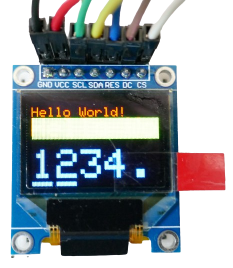
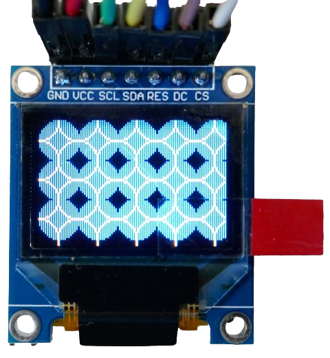
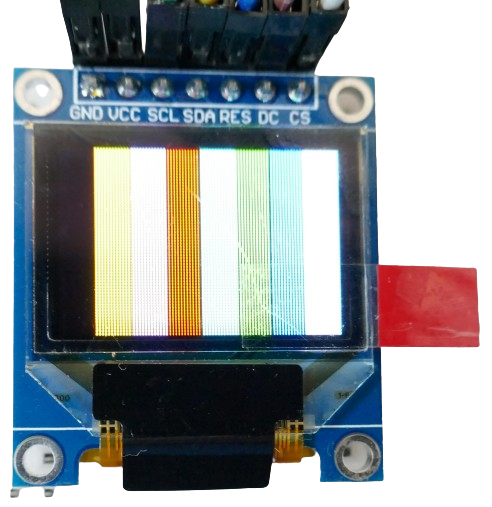
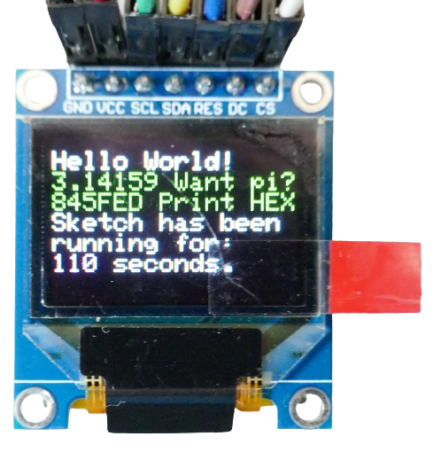
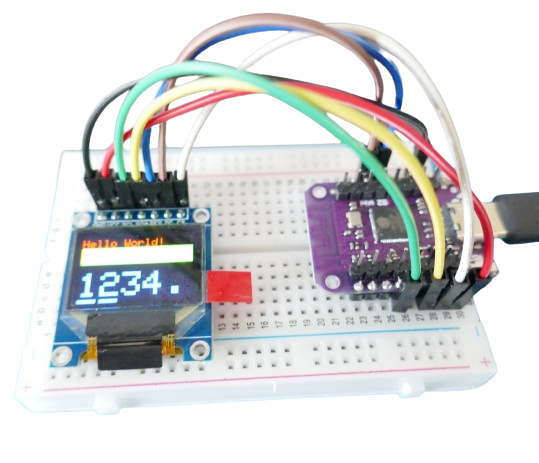

# SSD1331-Based OLED Display

> Small Full-Color OLED Displays 

Most *OLED displays* are *monochrome*. *OLED displays* using the *SSD1331 driver* can display 65K colors.



## Resolution

Since *full color OLED displays* are still quite expensive, most displays are *very small* with *limited resolution*: for example *0.95inch* at a resolution of *96x64*. 

Regardless, the added color capabilities help these small *displays* carry over *a lot more content* than *monochrome alternatives*.



## Interface

Due to the higher data volume that is required for color displays, these *OLED displays* use the faster *SPI interface*.


## Libraries

There is a number of libraries to select from, for example *Adafruit SSD1331 OLED Driver Library for Arduino*. 



## Wiring
*Pin labels* on this *OLED display breakout board* are *confusing* as they often do not use the commonly used *SPI pin names*. 

Some pins are labeled *SCL* and *SDA* and suggest an *I2C* interface.


That is *not the case*. The display supports *SPI* only. Here is what the pins do:


The display has seven pins:

| Pin | Label | Description |
| --- | --- | --- |
| 1 | GND | Ground |
| 2 | VCC | *3.3-5.0V* |
| 3 | SCL | SPI: Clock (SCLK, CLK) |
| 4 | SDA | SPI: MOSI |
| 5 | RES | Reset |
| 6 | DC | Data/Command |
| 7 | CS | SPI: Chip Select |

The *SPI* interface is implemented as a typical *three-wire design* using the pins *SDA* (*MOSI*), *SCL* (*CLK*), and *CS*.


> [!TIP]
> Pin *DC* is not common and used with components that can receive large amounts of data (such as *displays*): when this pin is pulled *low*, it indicates that the data received is a *command*, else *display data*.




### Connecting To ESP32 S2 Mini
In my tests, I am connecting the display to a *ESP32 S2 Mini* like so:

| Pin Display | Pin Wemos/Lolin S2 Mini | Description |
| --- | --- | --- |
| Gnd | Gnd | Ground |
| VCC | 3V3 | 3.3V |
| SCL | 7 | SPI Clock |
| CS | 12 | SPI Chip Select |
| SDA | 11 | SPI MOSI |
| RES | 33 | Reset |
| DC | 35 | Data/Command |


### Example #1
Here is example code taken from the *Adafruit SSD1306 library* that I used to create the pictures on this page. The code is already adjusted and runs fine in *platformio*:




> [!CAUTION]
> I was unable to run this code with *hardware SPI* on a *S2 Mini* (despite using the hardware SPI pins). Only the (much slower) software SPI constructor was able to control the display. See the following examples for more.


````c++
/***************************************************
  This is a example sketch demonstrating the graphics
  capabilities of the SSD1331 library  for the 0.96"
  16-bit Color OLED with SSD1331 driver chip

  Pick one up today in the adafruit shop!
  ------> http://www.adafruit.com/products/684

  These displays use SPI to communicate, 4 or 5 pins are required to
  interface
  Adafruit invests time and resources providing this open source code,
  please support Adafruit and open-source hardware by purchasing
  products from Adafruit!

  Written by Limor Fried/Ladyada for Adafruit Industries.
  BSD license, all text above must be included in any redistribution
 ****************************************************/
#include <Arduino.h>
#include <Adafruit_GFX.h>
#include <Adafruit_SSD1331.h>
#include <SPI.h>


// You can use any (4 or) 5 pins
#define sclk 7
#define mosi 11
#define cs   12
#define rst  33
#define dc   35


// Color definitions
#define	BLACK           0x0000
#define	BLUE            0x001F
#define	RED             0xF800
#define	GREEN           0x07E0
#define CYAN            0x07FF
#define MAGENTA         0xF81F
#define YELLOW          0xFFE0
#define WHITE           0xFFFF

// Option 1: use any pins but a little slower
// this was the ONLY option that worked for me on a S2 Mini microcontroller:
Adafruit_SSD1331 display = Adafruit_SSD1331(cs, dc, mosi, sclk, rst);

// Option 2: must use the hardware SPI pins
// this constructor did not work and seemed to not change the display content at all
//Adafruit_SSD1331 display = Adafruit_SSD1331(&SPI, cs, dc, rst);

float p = 3.1415926;


void testlines(uint16_t color) {
   display.fillScreen(BLACK);
   for (int16_t x=0; x < display.width()-1; x+=6) {
     display.drawLine(0, 0, x, display.height()-1, color);
   }
   for (int16_t y=0; y < display.height()-1; y+=6) {
     display.drawLine(0, 0, display.width()-1, y, color);
   }

   display.fillScreen(BLACK);
   for (int16_t x=0; x < display.width()-1; x+=6) {
     display.drawLine(display.width()-1, 0, x, display.height()-1, color);
   }
   for (int16_t y=0; y < display.height()-1; y+=6) {
     display.drawLine(display.width()-1, 0, 0, y, color);
   }

   // To avoid ESP8266 watchdog timer resets when not using the hardware SPI pins
   delay(0);

   display.fillScreen(BLACK);
   for (int16_t x=0; x < display.width()-1; x+=6) {
     display.drawLine(0, display.height()-1, x, 0, color);
   }
   for (int16_t y=0; y < display.height()-1; y+=6) {
     display.drawLine(0, display.height()-1, display.width()-1, y, color);
   }

   display.fillScreen(BLACK);
   for (int16_t x=0; x < display.width()-1; x+=6) {
     display.drawLine(display.width()-1, display.height()-1, x, 0, color);
   }
   for (int16_t y=0; y < display.height()-1; y+=6) {
     display.drawLine(display.width()-1, display.height()-1, 0, y, color);
   }

}

void testdrawtext(char *text, uint16_t color) {
  display.setTextSize(1);
  display.setTextColor(WHITE);
  display.setCursor(0,0);

  for (uint8_t i=0; i < 168; i++) {
    if (i == '\n') continue;
    display.write(i);
    if ((i > 0) && (i % 21 == 0))
      display.println();
  }
}

void testfastlines(uint16_t color1, uint16_t color2) {
   display.fillScreen(BLACK);
   for (int16_t y=0; y < display.height()-1; y+=5) {
     display.drawFastHLine(0, y, display.width()-1, color1);
   }
   for (int16_t x=0; x < display.width()-1; x+=5) {
     display.drawFastVLine(x, 0, display.height()-1, color2);
   }
}

void testdrawrects(uint16_t color) {
 display.fillScreen(BLACK);
 for (int16_t x=0; x < display.height()-1; x+=6) {
   display.drawRect((display.width()-1)/2 -x/2, (display.height()-1)/2 -x/2 , x, x, color);
 }
}

void testfillrects(uint16_t color1, uint16_t color2) {
 display.fillScreen(BLACK);
 for (int16_t x=display.height()-1; x > 6; x-=6) {
   display.fillRect((display.width()-1)/2 -x/2, (display.height()-1)/2 -x/2 , x, x, color1);
   display.drawRect((display.width()-1)/2 -x/2, (display.height()-1)/2 -x/2 , x, x, color2);
 }
}

void testfillcircles(uint8_t radius, uint16_t color) {
  for (uint8_t x=radius; x < display.width()-1; x+=radius*2) {
    for (uint8_t y=radius; y < display.height()-1; y+=radius*2) {
      display.fillCircle(x, y, radius, color);
    }
  }
}

void testdrawcircles(uint8_t radius, uint16_t color) {
  for (int16_t x=0; x < display.width()-1+radius; x+=radius*2) {
    for (int16_t y=0; y < display.height()-1+radius; y+=radius*2) {
      display.drawCircle(x, y, radius, color);
    }
  }
}

void testtriangles() {
  display.fillScreen(BLACK);
  int color = 0xF800;
  int t;
  int w = display.width()/2;
  int x = display.height();
  int y = 0;
  int z = display.width();
  for (t = 0 ; t <= 15; t+=1) {
    display.drawTriangle(w, y, y, x, z, x, color);
    x-=4;
    y+=4;
    z-=4;
    color+=100;
  }
}

void testroundrects() {
  display.fillScreen(BLACK);
  int color = 100;
  int i;
  int t;
  for(t = 0 ; t <= 4; t+=1) {
    int x = 0;
    int y = 0;
    int w = display.width();
    int h = display.height();
    for(i = 0 ; i <= 8; i+=1) {
      display.drawRoundRect(x, y, w, h, 5, color);
      x+=2;
      y+=3;
      w-=4;
      h-=6;
      color+=1100;
    }
    color+=100;
  }
}

void tftPrintTest() {
  display.fillScreen(BLACK);
  display.setCursor(0, 5);
  display.setTextColor(RED);
  display.setTextSize(1);
  display.println("Hello World!");
  display.setTextColor(YELLOW, GREEN);
  display.setTextSize(2);
  display.print("Hello Wo");
  display.setTextColor(BLUE);
  display.setTextSize(3);
  display.print(1234.567);
  delay(10000);
  display.setCursor(0, 5);
  display.fillScreen(BLACK);
  display.setTextColor(WHITE);
  display.setTextSize(0);
  display.println("Hello World!");
  display.setTextSize(1);
  display.setTextColor(GREEN);
  display.print(p, 5);
  display.println(" Want pi?");
  display.print(8675309, HEX); // print 8,675,309 out in HEX!
  display.print(" Print HEX");
  display.setTextColor(WHITE);
  display.println("Sketch has been");
  display.println("running for: ");
  display.setTextColor(MAGENTA);
  display.print(millis() / 1000);
  display.setTextColor(WHITE);
  display.print(" seconds.");
}

void mediabuttons() {
 // play
  display.fillScreen(BLACK);
  display.fillRoundRect(25, 10, 78, 60, 8, WHITE);
  display.fillTriangle(42, 20, 42, 60, 90, 40, RED);
  delay(500);
  // pause
  display.fillRoundRect(25, 90, 78, 60, 8, WHITE);
  display.fillRoundRect(39, 98, 20, 45, 5, GREEN);
  display.fillRoundRect(69, 98, 20, 45, 5, GREEN);
  delay(500);
  // play color
  display.fillTriangle(42, 20, 42, 60, 90, 40, BLUE);
  delay(50);
  // pause color
  display.fillRoundRect(39, 98, 20, 45, 5, RED);
  display.fillRoundRect(69, 98, 20, 45, 5, RED);
  // play color
  display.fillTriangle(42, 20, 42, 60, 90, 40, GREEN);
}

/**************************************************************************/
/*!
    @brief  Renders a simple test pattern on the LCD
*/
/**************************************************************************/
void lcdTestPattern(void)
{
  uint8_t w,h;
  display.setAddrWindow(0, 0, 96, 64);

  for (h = 0; h < 64; h++) {
    for (w = 0; w < 96; w++) {
      if (w > 83) {
        display.writePixel(w, h, WHITE);
      } else if (w > 71) {
        display.writePixel(w, h, BLUE);
      } else if (w > 59) {
        display.writePixel(w, h, GREEN);
      } else if (w > 47) {
        display.writePixel(w, h, CYAN);
      } else if (w > 35) {
        display.writePixel(w, h, RED);
      } else if (w > 23) {
        display.writePixel(w, h, MAGENTA);
      } else if (w > 11) {
        display.writePixel(w, h, YELLOW);
      } else {
        display.writePixel(w, h, BLACK);
      }
    }
  }
  display.endWrite();
}

void setup(void) {
  Serial.begin(9600);
  Serial.print("hello!");
  display.begin();

  Serial.println("init");
  uint16_t time = millis();
  display.fillScreen(BLACK);
  time = millis() - time;

  Serial.println(time, DEC);
  delay(10000);

  lcdTestPattern();
  delay(10000);

  display.fillScreen(BLACK);
  display.setCursor(0,0);
  display.print("Lorem ipsum dolor sit amet, consectetur adipiscing elit. Curabitur adipiscing ante sed nibh tincidunt feugiat. Maecenas enim massa");
  delay(10000);

  // tft print function!
  tftPrintTest();
  delay(10000);

  //a single pixel
  display.drawPixel(display.width()/2, display.height()/2, GREEN);
  delay(10000);

  // line draw test
  testlines(YELLOW);
  delay(10000);

  // optimized lines
  testfastlines(RED, BLUE);
  delay(10000);

  testdrawrects(GREEN);
  delay(10000);

  testfillrects(YELLOW, MAGENTA);
  delay(10000);

  display.fillScreen(BLACK);
  testfillcircles(10, BLUE);
  testdrawcircles(10, WHITE);
  delay(10000);

  testroundrects();
  delay(10000);

  testtriangles();
  delay(10000);

  display.fillScreen(BLACK);
  Serial.println("done");
}

void loop() {
}
````

This is the *platformio.ini* I used to compile the sketch in *platform.io* and run it on a *ESP32 S2 Mini*:

````
[env:lolin_s2_mini]
platform = espressif32
board = lolin_s2_mini
framework = arduino
lib_deps = adafruit/Adafruit SSD1331 OLED Driver Library for Arduino@^1.2.0
````

## Example #2

Due to the issues with *hardware SPI*, I decided to use one of the other popular *SSD1331 libraries:* namely *usglib*. This library is similar to *u8g2* in that it supports a multitude of hardware. While *u8g2* targets *monochrome* displays, *usglib* does the same for *color displays*.

Like usual with these libraries, the connected device is chosen by *commenting in* the appropriate constructor line. Here are the two constructors I used for the *96x64 color OLED display:

````c++
// Software-defined SPI pins:    
Ucglib_SSD1331_18x96x64_UNIVISION_SWSPI ucg(/*sclk=*/ 7, /*data=*/ 11, /*cd=*/ 35, /*cs=*/ 12, /*reset=*/ 33);

// Hardware SPI pins:
//Ucglib_SSD1331_18x96x64_UNIVISION_HWSPI ucg(/*cd=*/ 35, /*cs=*/ 12, /*reset=*/ 33);
````

The library comes with many great example sketches. I picked the *FPS* example which performs *speed tests*, figuring this would be a nice added value when comparing the performance of *software SPI* versus *hardware SPI*.

Just make sure you pick one of the two constructors, and comment out the other one. The code below starts by using the *software SPI* pins:

````
#include <SPI.h>
#include "Ucglib.h"

    
// Software-defined SPI pins:    
Ucglib_SSD1331_18x96x64_UNIVISION_SWSPI ucg(/*sclk=*/ 7, /*data=*/ 11, /*cd=*/ 35, /*cs=*/ 12, /*reset=*/ 33);

// Hardware SPI pins:
//Ucglib_SSD1331_18x96x64_UNIVISION_HWSPI ucg(/*cd=*/ 35, /*cs=*/ 12, /*reset=*/ 33);

void setup(void) {
  delay(1000);
  ucg.begin(UCG_FONT_MODE_TRANSPARENT);
  ucg.setColor(0, 0,0,0);
  ucg.setColor(1, 0,0,0);
  ucg.setColor(2, 0,0,0);
  ucg.setColor(3, 0,0,0);
}

/*
  Linear Congruential Generator (LCG)
  z = (a*z + c) % m;  
  m = 256 (8 Bit)
  
  for period:
  a-1: dividable by 2
  a-1: multiple of 4
  c: not dividable by 2
  
  c = 17
  a-1 = 64 --> a = 65
*/
uint8_t z = 127;	// start value
uint8_t lcg_rnd(void) {
  z = (uint8_t)((uint16_t)65*(uint16_t)z + (uint16_t)17);
  return z;
}

void draw_text(void) {
  ucg.setFont(ucg_font_ncenR14_tr);
  //ucg.setColor(255, 255, 255);
  ucg.setColor(lcg_rnd(),lcg_rnd(),lcg_rnd());
  ucg.setPrintPos(0,20);
  ucg.print("The quick brown");
  ucg.setPrintPos(0,40);
  ucg.print("fox jumps over");
  ucg.setPrintPos(0,60);
  ucg.print("the lazy dog");
}

void draw_box(void) {
  ucg_int_t x, y, w, h;
  ucg.setColor(lcg_rnd(),lcg_rnd(),lcg_rnd());
  x = lcg_rnd() & 31;
  y = lcg_rnd() & 31;
  w = 63;
  w += lcg_rnd() & 31;
  h = 63;
  h += lcg_rnd() & 31;
  ucg.drawBox(x,y,w, h);
}

void draw_gradient_box(void) {
  ucg_int_t x, y, w, h;
  static uint8_t idx = 0;
  switch(idx & 3)
  {
    case 0: ucg.setColor(0, lcg_rnd(),lcg_rnd(),lcg_rnd()); break;
    case 1: ucg.setColor(1, lcg_rnd(),lcg_rnd(),lcg_rnd()); break;
    case 2: ucg.setColor(2, lcg_rnd(),lcg_rnd(),lcg_rnd()); break;
    case 3: ucg.setColor(3, lcg_rnd(),lcg_rnd(),lcg_rnd()); break;
  }
  idx++;
  x = lcg_rnd() & 31;
  y = lcg_rnd() & 31;
  w = 63;
  w += lcg_rnd() & 31;
  h = 63;
  h += lcg_rnd() & 31;
  ucg.drawGradientBox(x,y,w, h);
}


// returns FPS*10
uint16_t measure(void (*draw_fn)(void)) {
  uint16_t FPS10 = 0;
  uint32_t time;

  ucg.clearScreen();

  time = millis() + 10*1000;
  do {
    draw_fn();
    FPS10++;
  } while( millis() < time );
  
  return FPS10;  
}


static const unsigned char u8d_tab[3]  = { 100, 10, 1 } ;
const char *u8dp(char * dest, uint8_t v)
{
  uint8_t pos;
  uint8_t d;
  uint8_t c;
  for( pos = 0; pos < 3; pos++ )
  {
      d = '0';
      c = *(u8d_tab+pos);
      while( v >= c )
      {
	v -= c;
	d++;
      }
      dest[pos] = d;
  }  
  dest[3] = '\0';
  return dest;
}

/* v = value, d = number of digits */
const char *u8d(uint8_t v, uint8_t d)
{
  static char buf[8];
  d = 3-d;
  return u8dp(buf, v) + d;
}

const char *convert_FPS(uint16_t fps) {
  static char buf[6];
  strcpy(buf, u8d( (uint8_t)(fps/10), 3));
  buf[3] =  '.';
  buf[4] = (fps % 10) + '0';
  buf[5] = '\0';
  return buf;
}

void show_result(const char *s, uint16_t fps)  {
  ucg.clearScreen();
  ucg.setFont(ucg_font_helvR18_tr);
  ucg.setColor(255, 255, 255);
  ucg.setPrintPos(0,25);
  ucg.print(s);
  ucg.setPrintPos(0,50);
  ucg.print(convert_FPS(fps));  
  delay(2000);
}

void loop(void)
{
  show_result("Text", measure(draw_text));
  show_result("Box", measure(draw_box));
  show_result("Gradient", measure(draw_gradient_box));
  delay(500); 
}
````

### Hardware SPI 70x Faster
The code ran flawlessly both with *software SPI* and with *hardware SPI* . It runs three *speed drawing tests*: *Text*, *Boxes*, and *Gradients*. At the end of each test, it reports back the achieved *frame rate*. When all three tests are completed, the code starts over again.

Obviously, the speed of *software SPI* depends on many factors including the microcontroller. Generally, though, *software SPI* is always dramatically slower than the optimized *hardware SPI*. This may not become evident when you just output a few lines of text. When doing animations or displaying video, the speed differences are dramatically.

The test above exposed that with *software SPI*, the *average framerate* was around *1-2fps*. With *hardware SPI*, it was typically around *70fps* and better.


## Data Sheets

[SSD1331](materials/ssd1331_datasheet.pdf)   


> Tags: HID, Display, OLED, Color, 16K, SPI, Driver, SSD1331, 96x64

[Visit Page on Website](https://done.land/components/humaninterface/display/oled/ssd1331?508490051108240758) - created 2024-05-07 - last edited 2024-05-07
