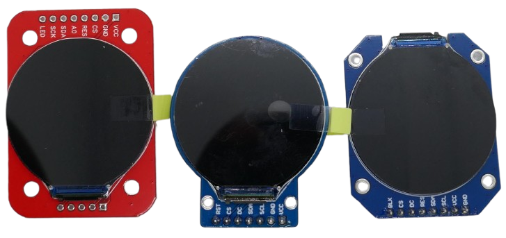
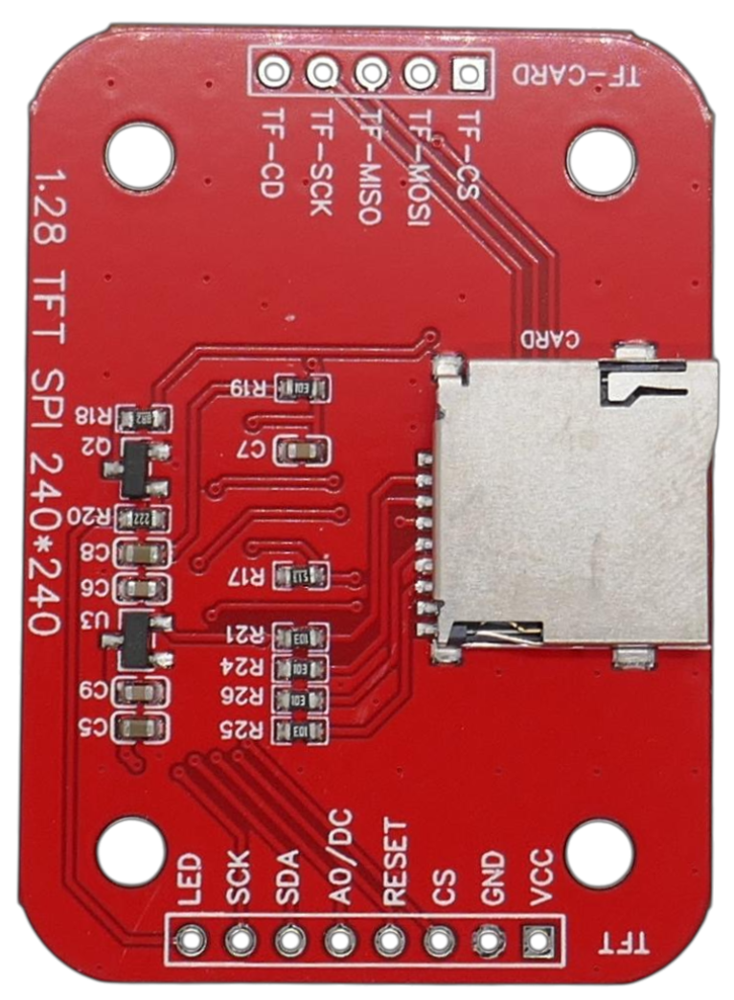
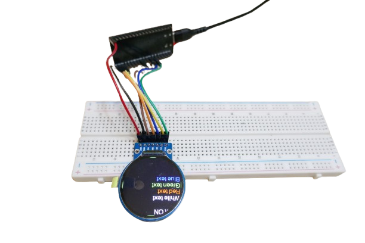

# 1.28 Inch Round TFT Display

> Round 240x240 Full-Color TFT Display

This uniquely-shaped TFT display features a relatively high *240x240* resolution with a high pixel density, offering crisp visuals on a *full-perspective IPS* screen that can be viewed from nearly any angle.

It is available in a variety of breakout board shapes:

There are subtile but important differences among the many available breakout boards that feature this display:

* **Voltage:** some boards have a voltage regulator and can be supplied with *3.3V* and *5V*. If the board has no voltage regulator, you must supply *3.3V* (and cannot use *5V*).
* **SD Card Reader:** some boards feature an SD card reader on the backside.
* **Dimmable Backlight:** most boards expose a separate backlight pin that you can either connect to *VCC* (always full brightness), or a *GPIO* that then can control backlight brightness via *PWM*. If the board does not expose a backlight pin, then the backlight is internally connected to *VCC* and not dimmable.

## Overview
The display utilizes the [GC9A01](https://done.land/components/humaninterface/display/tft/gc9a01/) driver, which is supported both by [ESPHome](https://esphome.io/components/display/ili9xxx.html) and widely used *Arduino* libraries, which are also compatible with *ESP32*: [Adafruit GFX library](https://www.adafruit.com/) and [TFT_eSPI](https://github.com/Bodmer/TFT_eSPI).

| Item | Description |
| --- | --- |
| Voltage | 3-5V |
| Interface | *SPI* |
| LCD Type | IPS |
| Controller | [GC9A01](https://done.land/components/humaninterface/display/tft/gc9a01/) |
| Libraries | [Adafruit library for GC9A01 drivers](https://github.com/adafruit/Adafruit_GC9A01A), [TFT_eSPI](https://github.com/Bodmer/TFT_eSPI), [ESPHome ILI9xxx component](https://esphome.io/components/display/ili9xxx.html) |
| Resolution | *240x240* |
| Colors | 262.000 (*18bit) |
| Pixel Size | *0.135x=.135mm* |
| Diameter | *35.5mm* (Display), *32.5mm* (active area) |
| Size | *50x36mm* (red), *44x36mm* (blue) |

Thanks to its *watch*-like form factor and high pixel density, this display is ideal for unusual projects, including [a home-made "smart watch"](https://www.instructables.com/ESP32-and-Round-OLED-Smart-Watch-Concept/):

## Pins

These are the pins and pin labels typically used with breakout boards:

| Pin | Remark |
| --- | --- |
| VCC | *3-5V* (may depend on board) |
| GND | ground |
| SCL/SCK/SCK | SPI Clock |
| SDA/DIN | SPI MOSI |
| CS | Chip Select |
| DC/A0 | Data/Command (Data=*high*, Command=*low*) |
| BL/BLK/LED | Backlight |
| RES | Reset |

For some reason, different breakout boards use different labels for these pins. The column *Pin* lists all commonly used labels.

> [!IMPORTANT]
> Some cheap generic display boards do not have a *voltage regulator*. These boards work with *3.3V* only and cannot be used with *5V* unless you add your own voltage regulator to step down the voltage. If you use *3.3V* anyway, you do not need to care. If you plan to use *5V*, make sure your display board can handle it.    

### SPI

The [SPI](https://done.land/fundamentals/interface/spi/) interface typically uses four lines. Displays only use the *MOSI* (*main out, sub in*) since there is only data travelling from the microcontroller to the display. The *MISO* pin (*main in, sub out*) for the opposite data direction is not exposed or used. 

Instead, most displays use a special additional pin called *DC*: this pin tells the display whether the sent data is supposed to be screen content, or a specific *command* to control the display.

### Optional SD Card Reader

The *red* board comes with a built-in [SD Card reader](https://done.land/components/data/storage/permanent/onsdcards/#connecting-sd-card-readers). The breakout board exposes the pins for the SD card reader on the opposite site of the main pin header. 

Wiring up the SD card reader is no different from a regular separate SD card reader breakout board. [Here](https://done.land/components/data/storage/permanent/onsdcards/#connecting-sd-card-readers) is a description.

## Wiring

Here is how you wire the display to a microcontroller, with example pins for [ESP32S](https://done.land/components/microcontroller/families/esp/esp32/developmentboards/esp32s/) and [ESP32-C3 SuperMini](https://done.land/components/microcontroller/families/esp/esp32/developmentboards/esp32-c3/c3supermini/):

| Display | Microcontroller | [ESP32S](https://done.land/components/microcontroller/families/esp/esp32/developmentboards/esp32s/) | [ESP32-C3 SuperMini](https://done.land/components/microcontroller/families/esp/esp32/developmentboards/esp32-c3/c3supermini/) |
| --- | --- |--- | --- |
| VCC | 3.3V (5V if display has a voltage regulator) | *3V3* | *3.3* |
| GND | Ground | *GND* | *G* |
| SCL/SCK/SCK | SPI Clock | *18*/*P18* | *4* |
| SDA/DIN | SPI MOSI | *23*/*P23* | *6* |
| CS | Chip Select | *22*/*P22* | *7* |
| DC/A0 | Data/Command | *16*/*P16* | *9* |
| RES | Display Reset | *4*/*P4* | *10*
| BL/BLK/LED (if present) | Backlight | *3V3* | *3.3* |

### Backlight Pin
If the display breakout board has no pin for the backlight, then the backlight power supply is hard-wired to *VCC*.

When you supply *VCC* to the backlight pin (or when there is no backlight pin), then the backlight always runs in full brightness.

Dimming the backlight is only possible with display breakout boards that expose a backlight pin. If so, to enable dimming connect this pin to any available *GPIO* (instead of *VCC*). In your code, use a *PWM* signal on this *GPIO* to control the brightness.

## Programming

For programming, you have two options:

### 1. C++ Libraries
You can use *C++* with one of the following libraries for full control over your display:

- [Adafruit library for GC9A01 drivers:](https://github.com/adafruit/Adafruit_GC9A01A) this library may only work in *ArduinoIDE* and fail in *platformio*
- [TFT_eSPI:](https://github.com/Bodmer/TFT_eSPI) requires manual adjustment of the file *User_Setup.h*.

Using *C++ code* gives you full flexibility but requires programming expertise, as you'll need to implement everything yourself.

> [!NOTE]
> Both mentioned libraries are designed for the *Arduino framework* so they work for *Arduino* and *ESP32* microcontrollers and any others that are compatible with the framework. For other ecosystems, different libraries exist.    

### 2. ESPHome
Alternatively, you can use [ESPHome](https://done.land/tools/software/esphome/introduction/), which simplifies the setup and eliminates the need for extensive coding. The [ILI9xxx component](https://esphome.io/components/display/ili9xxx.html) supports this display and is also compatible with a variety of other TFT displays, meaning any *ESPHome* sample configuration using the *ILI9xxx* component can be used with this display.

> [!IMPORTANT]
> The *ILI9xxx* component began supporting this display in March 2024. Ensure your *ESPHome* installation is up-to-date.

## Materials

* [WaveShare Documentation:](https://www.waveshare.com/wiki/1.28inch_LCD_Module) *WaveShare* is *one* vendor of such display boards, but not the only one. While the linked resource may provide helpful information, it may not fully apply to the board you use. Always make sure the boards are compatible.    

> Tags: GC9A01, Adafruit, TFT_eSPI, ESPHome, ILI9xxx, Round Display

[Visit Page on Website](https://done.land/components/humaninterface/display/tft/gc9a01/1.28inch240x240round?164176011208252418) - created 2025-01-07 - last edited 2025-01-07
