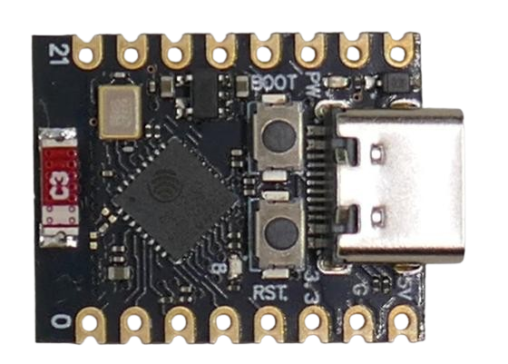

# Using C++ And 1.28 Inch Round TFT Display

> C++ Code For Using Round 1.28 Inch Color Display 

Learn how to use the round 1.28" TFT display in your C++ code. For this, you should already be familiar with using a *IDE* (i.e. [ArduinoIDE](https://www.arduino.cc/en/software) or [platformio](https://platformio.org/))

## Overview

The display uses the *GC9A01* driver which is supported by a number of renown libraries, including the [Adafruit library for GC9A01 drivers](https://github.com/adafruit/Adafruit_GC9A01A) (which then lets you use the [Adafruit GFX library](https://github.com/adafruit/Adafruit-GFX-Library)), and [TFT_eSPI](https://github.com/Bodmer/TFT_eSPI). We'll be looking at both of these in this article.

### Parts List

For this project, you'll need these items:

* **Round TFT Display:** any of the many available breakout boards. I'll be using the popular *1.28"* display (*240x240*), but there is also a *0.71"* version (*160x160*) that uses the same driver and can also be used.

     

* **Microcontroller:** I'll be using the super small (and very affordable) [ESP32-C3 SuperMini](https://done.land/components/microcontroller/families/esp/esp32/developmentboards/esp32-c3/c3supermini/), but you can use any other microcontroller that supports the *Arduino framework*, including *Arduinos* of course.

     

* **Wires:** 

## Wiring

(to be continued soon...)

> Tags: GC9A01, Adafruit, TFT_eSPI, ESPHome, ILI9xxx, Round Display

[Visit Page on Website](https://done.land/components/humaninterface/display/tft/gc9a01/1.28inch240x240round/usingc++?703295011508251418) - created 2025-01-07 - last edited 2025-01-07
