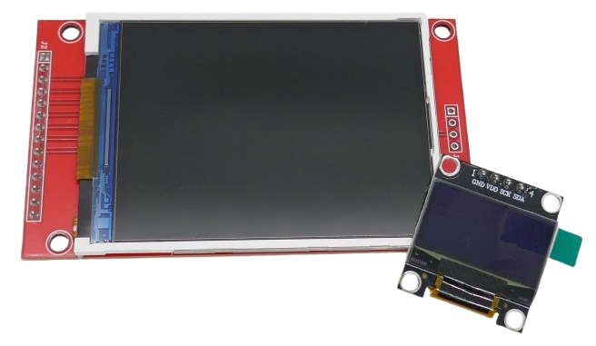
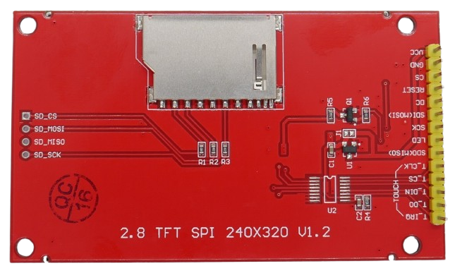
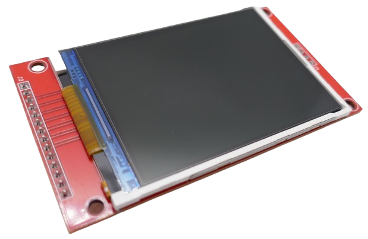
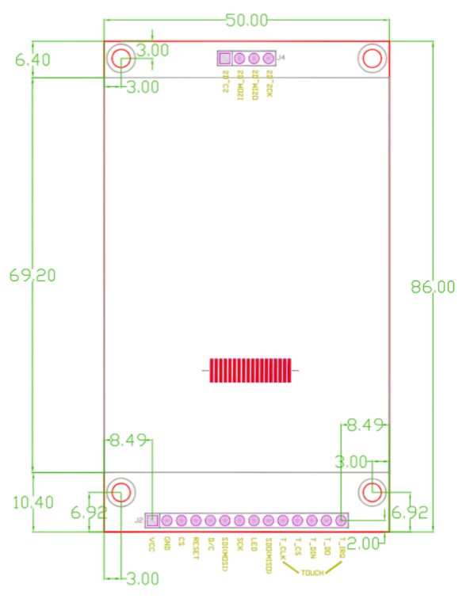
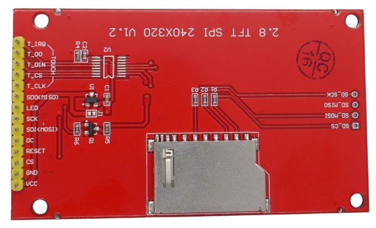
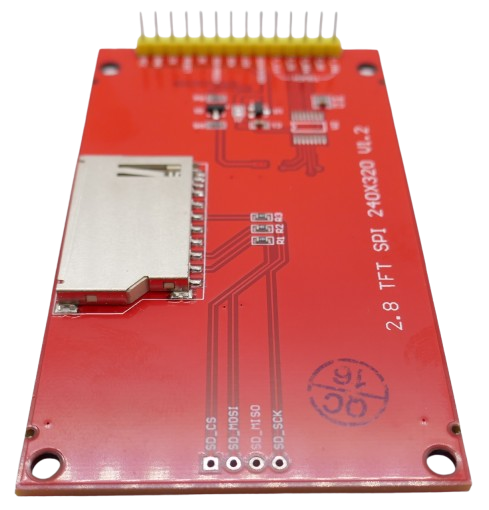

# 2.8" 320x240 TFT Display

> Rectangular 320x240 TFT Display With SPI, 262K Colors (18bit), SD-Card REader, And Optional Touch Support

This popular breakout board uses a [2.8" 320x240 TFT display](materials/qd-tft2803_datasheet.pdf) with a large display area (*43.2mm x 57.6mm*) at good pixel density. It comes with voltage regulators to support both *3.3V* and *5V*. 

Compared to a standard *0.96" 128x64* OLED display, the active screen area is a different league.

## Overview
The board uses the older (but still capable and widely supported) [ILI9341](https://done.land/components/humaninterface/display/tft/ili9341) display driver and a large [2.8" 320x240 TFT display](materials/qd-tft2803_datasheet.pdf). The display can be controlled via [SPI](https://done.land/fundamentals/interface/spi/) interface. There is no support for other display interfaces such as *parallel*.

### SD Card Reader
It has a built-in [SD-Card Reader](https://done.land/components/data/storage/permanent/onsdcards/) on the backside, making it an excellent choice for locally storing/exporting sensor data and simple playback of large video files.

### Optional Touch
There are two board versions: *touch* and *non-touch*. Both versions differ only by one chip: **U2** (the touch controller) is present on *touch* versions and misses on *non-touch* versions. 

The picture below shows a *non-touch version*. You can clearly see the solder pads for **U2**, and the missing touch controller chip:

> [!TIP]
> *MSP2807* often refers to the *touch* version, and *MSP2806* to the *non-touch* version. However, this board design appears to be available from various sources using various model numbers.

### SPI Interface
This board uses [SPI](https://done.land/fundamentals/interface/spi/) to control *display*, *touch*, and *SD Card* reader. 

| Item | Description |
| --- | --- |
| Supply Voltage | *3.2-5.0V* |
| Resolution | *320x240* |
| Pixel Size | *0.1335x0.1335mm* |
| Colors | *262K (18bit)* |
| Controller | [ILI9341](https://done.land/components/humaninterface/display/tft/ili9341) |
| Module Size | *50mm x 86mm* |
| Screen Size | *50mm x 69.1mm* |
| Visible Size | *43.2mm x 57.6mm* |
| Weight | *34g* (no touch)/*43g* (touch) |

## Pins

Since the breakout board optionally supports *touch*, there are 14 interface pins. Only nine of them are used for the board and display. The remainder are used by the *touch controller* (if present).

On the other side of the board, there are four additional through-holes that can be used to access the built-in [SD-Card Reader](https://done.land/components/data/storage/permanent/onsdcards/).

### Display Interface Pins

| Pin | Description | 
| --- | --- | 
| VCC | *3.3V*/*5V* | 
| GND | *ground* | 
| CS | Chip select (*low active*) | 
| RESET | Reset | 
| DC | Data/Command (Data=*high*, Command=*low*) | 
| SDI(MOSI) | SPI MOSI (SDA) | 
| SCK | SPI Clock (SCLK/SCL) | 
| LED | Backlight, connect to *3.3V* for continuous full brightness, else *PWM* signal |
| SDO(MISO) | SPI MISO |

### Touch Pins
These pins can be used for boards that have a *touch controller chip* (**U2**). On boards where **U2** is not equipped with a chip, they are without function.

| Pin | Description | 
| --- | --- | 
| T_CLK | Clock |
| T_CS | Chip select  (*low active*) |
| T_DIN | Data input |
| T_DO | Data output |
| T_IRQ | Interrupt |

### SD-Card Pins
The [SD-Card reader](https://done.land/components/data/storage/permanent/onsdcards/) has four connectors on the opposite side:

| Pin | Description | 
| --- | --- | 
| SD-CS | Chip select  (*low active*) |
| SD_MOSI | SPI MOSI |
| SD_MISO | SPI MISO |
| SD_CLK |  SPI Clock (SCK/SCLK/SCL) |

For examples on how to use the *SD-Card reader*, refer to [this article](https://done.land/components/data/storage/permanent/onsdcards/#pin-layout). The built-in SD-Card reader uses a *default SPI interface* and can be used like any other dedicated *SD-Card reader*.

### Backlight
The display backlight is controlled via pin **LED**: 

* **Fixed:** for simplicity or testing, connect **CLK** to *3.3V* for continuous maximum brightness.
* **On/Off:** for basic on/off control, connect **LED** to a GPIO output pin. Make sure the pin supplies *3.3V*.
* **Dimmable:** for a dimmable backlight, connect **LED** to any *PWM pin*.

### Reset
The **RESET** pin is important only when you intend to *reset* the display controller manually. Else, pull this pin *high* (o.e. by connecting it to *VCC*), ensuring that the device won't reset itself randomly.

> [!TIP]
> Unless you have a *real reason* why you wanted to ever manually reset the display controller, connecting **RESET** to the *Reset Pin* of your microcontroller appears to be the best value (provided your development board exposes this pin).

This pin is *low active*, and when *pulled low*, it resets the display controller. If you *do* plan to use this pin, these are the typical use cases:

* **Sync With Microcontroller:** when your microcontroller breakout board exposes its own *Reset pin*, you can connect **RESET** to the *reset pin* of your microcontroller. This way, you don't waste a precious *GPIO* and get basic reset behavior: when you reset your microcontroller (i.e. by pressing its *Reset* button), the display is resetted as well. This may be invaluable because else, when you reset your microcontroller, the display would *still* continue to show its previous content. This can be highly confusing, especially when you flash the microcontroller with fresh firmware (without removing its power). If the new firmware isn't drawing content on the display, after the firmware update, the board would still show the old display content, and users could be led to believe the firmare update wasn't successful.
* **Manual:** when wiring **RESET** to any output *GPIO*, *you* can control when to reset the display. Make sure the *GPIO* has a pullup resistor enabled, and pull the *GPIO low* to reset the display controller.

## Programming
The display boards use the [ILI9341](https://done.land/components/humaninterface/display/tft/ili9341) controller which is widely supported by many libraries and components:

### ESPHome 
[ESPHome](https://done.land/tools/software/esphome/introduction) has dedicated support for *ILI9341* through the [ILI9XXX](https://esphome.io/components/display/ili9xxx#ili9xxx) component.

### PlatformIO/Arduino 

* [Adafruit ILI9341:](https://github.com/adafruit/Adafruit_ILI9341) specific library for this driver, well documented, enables the use of the hardware-neutral [Adafruit GFX](https://github.com/adafruit/Adafruit-GFX-Library) library on top of it
* [TFT_eSPI:](https://github.com/Bodmer/TFT_eSPI) generic library for a wide range of TFT displays. Requires slightly confusing selection of the driver type you intend to use
* [ucglib:](https://github.com/olikraus/ucglib) universal library for *color TFT displays*, [well documented](https://code.google.com/archive/p/ucglib/wikis/connectili9341.wiki), the *ILI9341* driver is selected through the classes `Ucglib_ILI9341_18x240x320_SWSPI` and `Ucglib_ILI9341_18x240x320_HWSPI`. 

## Materials

[Board Schematics](materials/msp2807_schematics.pdf)    
[TFT Datasheet](materials/qd-tft2803_datasheet.pdf)    

> Tags: Display Driver, ILI9341, TFT Display, Full Color, 18bit, 262K, SPI, 2.8 Inch, MSP2806, MSP2807

[Visit Page on Website](https://done.land/components/humaninterface/display/tft/ili9341/2.8inch320x240?176165011419254712) - created 2025-01-18 - last edited 2025-01-18
