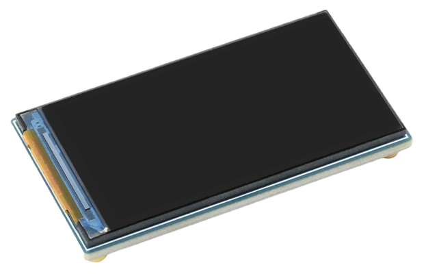
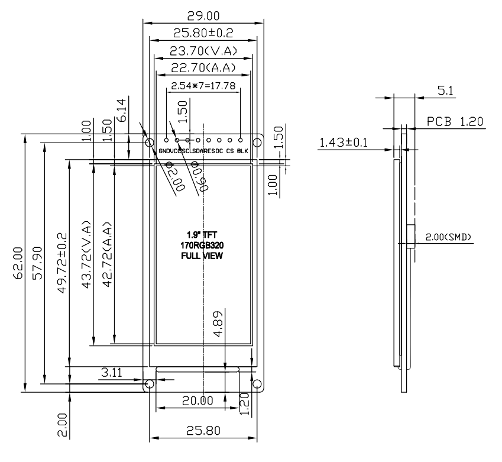

# 1.9" 170x320 IPS TFT Display

> Full-Angle (IPS) Rectangular TFT Display With SPI And 262K Colors (18bit)

This breakout board features a 1.9" *full-angle color TFT display with *SPI interface* that works for *3.3V* and *5V* microcontrollers. Since the display is using *IPS* (*In-Plane Switching*), it has excellent *viewing angles* and rich colors.

The display is available from generic Chinese sources (like [Estardyn](https://www.google.com/search?q=estardyn+tft+1.9) and others) for around €2.00:

It is used by renown brands as well. The [1.9" Adafruit Display](https://www.adafruit.com/product/5394) has a snappier *PCB design* and comes with good documentation. You decide whether this is worth *10x the cost* (around €20.00):

In-between this price range, there are many other vendors offering their own *PCB designs*, including this cleverly designed *PCB* from [WaveShare](https://www.google.com/search?q=waveshare+tft+1.9) with the smallest-possible form factor and an [excellent documentation](https://www.waveshare.com/wiki/1.9inch_LCD_Module) that equally applies to the breakout boards from other vendors:

| Item | Description |
| --- | --- |
| Supply Voltage | *3.2-5.0V* |
| Resolution | *170x320* |
| Pixel Size | *0.1335x0.1335mm* |
| Colors | *262K (18bit)* |
| Controller | [ST7789](https://done.land/components/humaninterface/display/tft/st7789) |
| Controller Power Consumption | *7mA* |
| Backlight Power Consumption | *20-40mA* |
| Sleep-In Power Consumption | *30uA* | 
| Module Size | *29x62x5.1mm* |
| Screen Size | *23.7x43.7mm* |
| Visible Size | *22.7x42.7mm* (*0.5mm margin*) |
| Weight | *9.8g* |

## SPI Interface
Both the [Chinese Board](https://www.google.com/search?q=estardyn+tft+1.9) and the [Adafruit Display](https://www.adafruit.com/product/5394) expose the *SPI interface*:

| Pin (Display Board) | Description | Pin ([Lolin32 Lite](https://done.land/components/microcontroller/families/esp/esp32/developmentboards/esp32s/lolin32lite/)) |
| --- | --- | --- | 
| GND | Ground | G |
| VCC | positive supply voltage | 3V |
| SCL | SPI Clock (SCK) | 18 |
| SDA | SPI MOSI | 23 |
| RES | Reset | EN or programmable GPIO, (*low active*) |
| DC | Data/Command (Data=*high*, Command=*low*) | any output GPIO |
| CS | Chip Select (*low active*) | 5 |
| BLK | Backlight | any PWM pin or 3V (100% bright, no dimming) |

### Backlight
The display backlight is controlled via pin **BLK**: 

* **Controllable:** if you want your microcontroller to control the backlight (i.e. to dynamically *dim it*), connect **BLK** to any *PWM pin*.
* **Fixed:** when you connect **BLK** to *3.3V/5V* directly, the backlight works independently from the microcontroller. You could use a small *potentiometer* to manually adjust its brightness. 

> [!TIP]
> With the latter setup, the display remains on (and fully readable) when the board enters *deep sleep*. This can be highly power efficient if you want your device to display *static content*.

### Reset
Via the **RES** pin, the display controller can be resetted (*low active*). Here are your options:

* **Don't care:** if you do not plan to reset the display, pull this pin *high* by connecting it to *VCC*, ensuring that the device won't reset itself randomly.
* **Sync With Microcontroller:** when your microcontroller breakout board exposes its own *Reset pin*, you can connect **RES** to the *reset pin* of your microcontroller. This way, you don't waste a precious *GPIO* and get basic reset behavior: when you reset your microcontroller (i.e. by pressing its *Reset* button), the display is resetted as well. This may be invaluable because else, when you reset your microcontroller, the display would *still* continue to show its previous content. This can be highly confusing, especially when you flash the microcontroller with fresh firmware (without removing its power). If the new firmware isn't drawing content on the display, after the firmware update, the board would still show the old display content, and users could be led to believe the firmare update wasn't successful.
* **Manual:** when wiring **RES** to any output *GPIO*, *you* can control when to reset the display. Make sure the *GPIO* has a pullup resistor enabled, and pull the *GPIO low* to reset the display controller.

> [!TIP]
> Unless you have a *real reason* why you wanted to ever manually reset the display controller, connecting **RES** to the *Reset Pin* of your microcontroller appears to be the best value (provided your development board exposes this pin).

## Programming
The display boards use the [ST7789](https://done.land/components/humaninterface/display/tft/st7789) controller that can be programmed with these librarys and components:

* **ArduinoIDE/platformio:** [Adafruit-ST7735-Library](https://github.com/adafruit/Adafruit-ST7735-Library), [TFT_eSPI](https://github.com/Bodmer/TFT_eSPI)
* **ESPHome:** [ILI9XXX](https://esphome.io/components/display/ili9xxx#ili9xxx) component, [ST7789V TFT LCD](https://esphome.io/components/display/st7789v.html) component (*obsolete*)

Here is a [good walkthrough](https://github.com/mboehmerm/IPS-Display-ST7789-170x320) using this display plus these:

* [Lolin32 Lite](https://done.land/components/microcontroller/families/esp/esp32/developmentboards/esp32s/lolin32lite/) development board
* [ArduinoIDE](https://www.arduino.cc/en/software) 
* [TFT_eSPI](https://github.com/Bodmer/TFT_eSPI) library

## Materials
* [How To Connect Breakout-Board:](https://www.waveshare.com/wiki/1.9inch_LCD_Module) excellent and detailed documentation (by *WaveShare*) covering the *WaveShare* breakout board. Applies to breakout boards from other vendors as well. Covers using the display with various microcontrollers (including *Raspberry Pi*, *STM32*, and *Arduino*).

> Tags: Display Driver, ST7789, TFT Display, Full Color, 18bit, 262K, SPI, 1.9 Inch, Adafruit, WaveShare, Estardyn, Lolin32 Lite, Raspberry

[Visit Page on Website](https://done.land/components/humaninterface/display/tft/st7789/1.9inch320x240?519299101221242534) - created 2024-10-20 - last edited 2024-10-20
