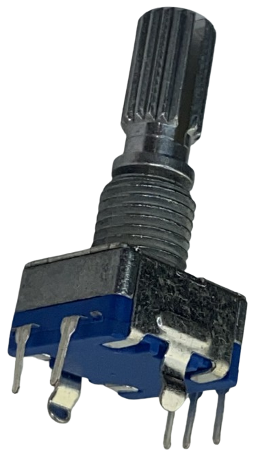
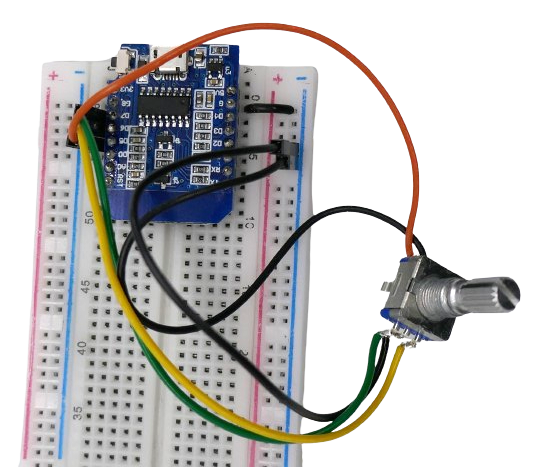

# Using Mechanical Rotary Encoder

> You can use a pure *machanical Rotary Encoder* directly with your microprocessor. There is no need for a breakout board.



## Rotary Encoder Pins
Here is the pin-out for most encoder types:

| Pin | Common Label | Description |
| --- | --- | --- |
| OUT A | CLK | connects to switch A inside the encoder |
| OUT B | DT | connects to switch B inside the encoder |
| GND | | connects to the other end of both switches A and B |
| SWITCH | SW | connects to the (optional) third switch that is enabled by pressing the encoder knob |
| GND |  | connects to the other end of the press switch |


> [!IMPORTANT]  
> Both **GND** pins work independently and are not connected. You must connect *both* **GND** pins to **GND**.
>
> Obviously you can connect both **GND** pins right at the **Rotary Encoder** end and save one wire when connecting the **Rotary Encoder** to your microcontroller.


When hooking up such a mechanical **Rotary Encoder** to your microprocessor, the schematics could look like this:


To connect the **Rotary Encoder** to the microprocessor you need **4** wires and **3** GPIO pins, one for each physical switch.

### Using Breakout Boards

A bit easier to work with are simple and readily available breakout boards that have a mechnical **Rotary Encoder** soldered right on to them:


Breakout boards combine both physical **GND** pins to just *one* **GND** output pin. However, they typically have one *new* pin labelled **+** or **V+**, though, whoch frequently raises confusion. 

You do not need to connect pin **V+** and can ignore it. If you do connect it, this is what happens:


When positive voltage is (optionally) supplied to pin **+**, it powers three *pullup resistors* that in turn *pull up* the output pins. 

> [!TIP]
> You *can* supply positive voltage to the **+** pin. It's completely optional, and you should do this only if you need to actively *pull up* the output pins. 
>
> Microcontroller GPIOs typically have built-in pullup resistors that you can easily activate by software. In most cases the **+** pin is not needed, and you can save one wire by ignoring this pin.

## Live Working Example

For this test, you need this:

* **Microprocessor**: I am using an *ESP8266*.
* **Rotary Encoder**: I am using a vanilla encoder with built-in switch (5-pn model)

Wire everything according to the circuit layout depicted above. It does not matter whether you are using a pure mechanical **Rotary Encoder** or a breakout board. If you do use a breakout board, leave the **+**/**V+** pin unconnected.

* Connect the microcontroller **GND** (*G*) to both **GND** pins at the **Rotary Encoder**
* Connect the remaining three pins coming from the **Rotary Encoder** to GPIO pins of your choice. The code below assumes that you connect **Switch A/CLK** to **D7**, **Switch B/DT** to **D6**, and **Switch/SW** to **D5**. 



Here is the code:

```powershell
#include <Arduino.h>

// define input pins
// if you use a Rotary Encoder breakout board, leave pin V+ unconnected
#define CLK_PIN D7  // pin D7 connected to rotary encoder CLK (OUT A)
#define DT_PIN D6   // pin D6 connected to rotary encoder DT (OUT B)
#define SW_PIN D5   // pin D5 connected to rotary encoder SW (SWITCH)

// define modes of movement
#define DIRECTION_R 0   // right turn
#define DIRECTION_L 1   // left turn

// define state variables
int counter = 0;
int direction = DIRECTION_R;
int CLKstate;
int buttonState;
int prev_CLKstate;
int prev_buttonState;

void setup() {
  // make sure the baud rate matches your settings
  Serial.begin(115200);

  // configure pins and activate pullup
  pinMode(CLK_PIN, INPUT_PULLUP);
  pinMode(DT_PIN, INPUT_PULLUP);
  pinMode(SW_PIN, INPUT_PULLUP);
  
  // initialize the previous CLK state (status of internal switch A)
  prev_CLKstate = digitalRead(CLK_PIN);
  prev_buttonState = digitalRead(SW_PIN);
}

void loop() {
  // manually monitoring and post-processing rotary encoder signals
  
  // monitor the rotating knob:

  // check current state of switch A
  CLKstate = digitalRead(CLK_PIN);

  // any change from before? Then is it now ON (HIGH)?
  if (CLKstate != prev_CLKstate && CLKstate == HIGH) {
    // let's check switch B to find out the direction
    // in clockwise direction, A fires before B, so switch B should be HIGH 
    // (HIGH = switch is NOT ON (all inputs are pulled up and connect to GND when switch is active))
    if (digitalRead(DT_PIN) == HIGH) {
      counter++;
      direction = DIRECTION_R;
    } else {
      counter--;
      direction = DIRECTION_L;
    }

    Serial.print("Direction: ");
    if (direction == DIRECTION_R)
      Serial.print("to the right");
    else
      Serial.print("to the left");

    Serial.print(" - Increments: ");
    Serial.println(counter);
  }

  // remember current state for next time
  prev_CLKstate = CLKstate;

  // monitor the button press (pressing on knob):

  // pins are HIGH by default (pulled up)
  // they switch to LOW when a switch activates (connects to GND):
  buttonState = digitalRead(SW_PIN);
  if (buttonState != prev_buttonState) 
  {
    if (buttonState == LOW)
      Serial.println("The button was PRESSED.");
    else
      Serial.println("The button was RELEASED.");
    // remember current state for next time:
    prev_buttonState = buttonState; 
  }
}
```

> [!NOTE]  
> The sketch defines all three GPIO pins as *INPUT_PULLUP*: the internal built-in pullup resistor is used. There is no need to externally pull up the pins.
>
> When you use a breakout board, *do not connect* the pin **V+**. This disables the external pullup resistors on the breakout board.

When you upload and run the sketch, the serial output reports every movement and key press of the **Rotary Encoder**.

> Tags: HID, Rotary Encoder, Example, Code, Pins

:eye:&nbsp;[Visit Page on Website](https://powershell.one/doneland_test/components/humaninterface/rotaryencoder/usingmechanicalrotaryencoder?155584020426240854) - last edited 2024-02-27
