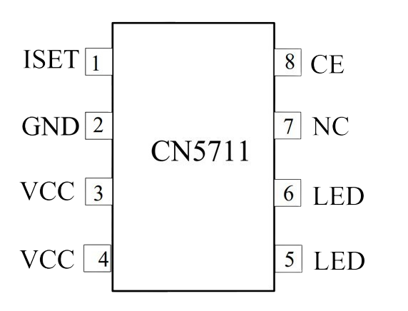

 
# CN5711

> Driving One LED With Constant Current Of Up To 1.5A

Single *power LEDs* are typically rated for *500mA* up to *2000mA*. Compared to classic *signal LEDs* with a maximum current of *20mA*, these power LED can emit an insane amount of light and are often found in *LED torches*, *emergency lights*, and *high power illuminations*.

*LDO6AJSA* is a tiny breakout board and *constant current LED driver* that can drive *one LED* with currents of up to *1.5A* (multiple LEDs only when connected in parallel). 

Internally, it uses the [CN5711](materials/cn5711_datasheet.pdf) constant current controller chip.

## CN5711
The *CN5711* is a current regulation IC operating from an input voltage of *2.8V* to *6V*. The *constant current* output can be set by an external resistor (in the case of the breakout board, this is a small potentiometer) up to a maximum of *1.5A*. 

The on-chip power MOSFET and current sense block greatly reduces the number of external components. The chip protects itself via *temperature regulation* (versus *)temperature protection*) and has a *chip enable* pin that can be used to turn the *LED* on and off, even in rapid succession, i.e. to implement *light patterns* as in the case of *emergency vehicle lamps*. Other use cases are *flashlights* and *headlights*.

### Required Input Voltage
The chip accepts an input voltage in the range of *2.8-6.0V*. The input voltage is the *maximum available output voltage*, so it *must be at least the LED forward voltage*.

For example, if you are driving an *LED* with a *forward voltage* of *3.5V*, then the *input voltage* must be at least *3.5V*.

Because of this, you can only drive *one LED* with this chip: when you connect more than one *LED* in series, their forward voltages add up and exceed the maximum input voltage of *6V*.

You could connect more than one *LED* to the chip if you connect the *LEDs in parallel* in which case their *current requirements* would add up. For example, if you connected *ten 20mA signal LEDs* in parallel, they would require a combined current of *200mA* and could all be driven by this controller.

> [!NOTE]
> When you connect *LED* in parallel, you no longer control *current per LED*. While the *overall current* is controlled, there may now be imbalances in between the *LED*, and one could draw *more* current, while another draws *less*. That's why it is recommeded to use *current limiting resistors* in series with each *LED* when you connect in parallel.

### Specs

| Spec | Value |
| --- | --- |
| Input voltage | 2.8-6.0V |
| Dropout Voltage | 0.37V @ 1.5A |
| Output Accuracy | 5% |
| Chip Temperature Regulation | >135C junction temp: current is reduced |
| LED Over-Current Protection | 1.5-2.3A (1.9A typ.) |
| Chip Enable | diable via *low*, power consumption reduced to *1uA*, max frequency 2kHz |

### Pin Out

| Pin | Description |
| --- | --- |
| VCC | input voltage (2.8-6V), connect both *VCC* pins |
| LED | output current, connect both *LED* pins to *LED anode* |
| GND | ground |
| exposed pad on backside | ground |
| ISET | resistor sets output current |
| CE | connect to *VCC* to *enable* output. Pull to *GND* *disables* the output. Do not let this pin float (do not leave unconnected) |
| NC | *not connected* |

### Output Current
The *constant output current* is set by a resistor that is connected to *ISET* and *GND*. The resistor value is calculated with the formula *Iled = 1800V / Riset*.

The maximum resistor value is *30K*: *1800/30000* results in a minimum current of *60mA*. The maximum current is *1.5A*.

| Resistor | Constant Current |
| --- | --- |
| 30K | 60mA |
| 1.8K | 1.000mA (1A) |
| 1.2K | 1.500mA (1.5A) |

Over-current protection kicks in inbetween *1.5-2.3A*.

### Dimming
*LEDs* can be dimmed in three ways:

* **PWM:** apply a *PWM signal* to *CE* (up to *2kHz*). Frequencies above *200Hz* are not recognized by the human eye or cameras.
* **Iset:** Add an *NMOS transistor* in parallel to *Rset* and vary the resistor, thus effectively varying the *constant current*. Current controls *LED* brightness. In contrast to *PWM*, this type of dimming is completely flicker-free.
* **Iset potentiometer:** use a potentiometer as *Rset*: varying the potentiometer setting will manually dim the *LED*.

### Heat Sink
The chip needs to be able to sink heat in order to provide the maximum constant current. Without proper heat sink, once the internal junction temperature exceeds *135C*, the *output current* is *reduced*.

The thermal path is through the chip **ground plate**, and the PCB copper traces act as immediate heat sink. 

> [!TIP]
> If you want to improve the heat sink, an external heat sink would need to go on the back side of the *PCB* (not on top of the chip package).

> Tags: LED Driver, CN5711, LDO6AJSA
