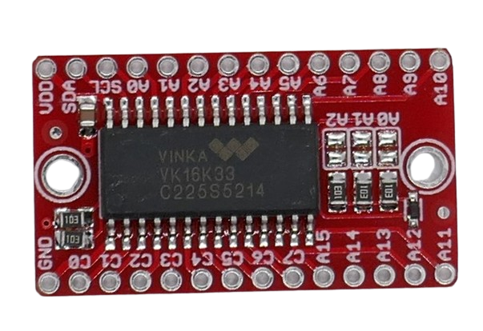

 
# HT16K33

> Controls Up To Sixteen 7-Segment LED Displays Or 128 Individual LED Via I2C Interface

The *HT16K33* is a sophisticated **LED** *controller* primarily designed to drive *7-segment* displays. It can however be used to drive *any* type of **LED**.

## Key Aspects

Here is what sets the *HT16K33* apart from other *7-segment* display *controllers*:

* **I2C:** You can use the *I2C* two-wire protocol to control the chip
* **128 LED:** You can control up to *128* individual segments/**LED** which is sufficient for displaying up to *16 digits*
* **Blinking:** Supports built-in **LED** *blinking* (on, off, 2Hz, 1Hz, 0.5Hz)
* **Key Scan:** has built-in *key scan* support for connecting a keyboard or series of *input buttons* 

In contrast to other controllers such as the *MAX7219*, this controller *does not provide a constant current*. It provides the *operating voltage* at its outputs, and it is up to you to choose the appropriate *series resistor* to provide the required *forward voltage* for your **LED**.

## LED Driver

*HT16K33* lets you flexibly control the connected **LED**:

| Item | Description |
| --- | --- |
| Brightness | digital and analog brightness control |
| Segment Control | individual **LED** segment control: each **LED** can be controlled individually |
| Blink Mode | 0.5Hz, 1Hz, 2Hz |
| Digits | Can be set to control between 1 (8 **LED**) and 16 (128 **LED**) 7-segment displays. |

### Brightness Control

**LED** brightness can be controlled *digitally* in *16 steps*.

## Interface

*HT16K33* supports *I2C* interface (two-wire). 

## Breakout Boards

Typically, the *HT16K33* comes ready-to-use with *7-segment* and *14-segment* displays but is also available as separate *controller board* without **LED**:

## Data Sheet

[Data Sheet](materials/ht16k33_datasheet)

> Tags: LED, 7-Segment, Matrix, Controller, HT16K33, 5V, I2C

[Visit Page on Website](https://done.land/components/light/led/7-segment/ht16k33?243188030026242123) - created 0001-01-01
