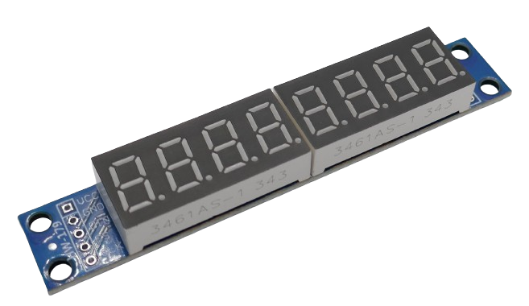
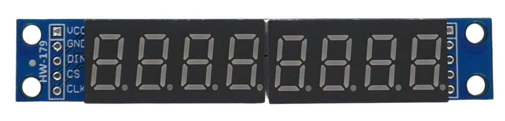
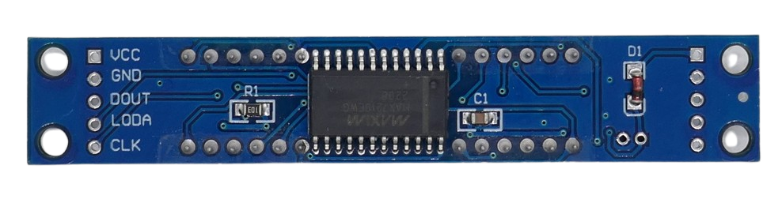

 
# MAX7219

> Controls Up To Eight 7-Segment LED Displays Or 64 Individual LED

The popular *MAX7219* *controller* is used in many *7-segment **LED** displays* and can drive up to *eight* displays (for displaying *eight* digits):

> [!TIP]
> This controller is essentially an **LED** *driver*. You are not limited to use a *7-segment* **LED** *display*. You could as well drive up to *64 individual **LED***, i.e. to control *indicator **LED*** or drive a **LED** *bar graph*.

> [!CAUTION]
> This is a **5V** device. Use *MAX6951* if you need **3.3V** operation. Typically though, even for **3.3V** *ESP* microcontrollers, it is best to use **5V** to drive **LED** and employ a *level shifter* for the control wires.

## Architecture

The *MAX7219* consists internally of these units:

* **BCD Code-B Decoder:** converts *4-bit* decimal numbers in a 7-segment decimal
* **Multiplex Scan Circuitry:** controls *8 **LED*** at a time in rapid succession (*800Hz*)
* **Static RAM:** stores the value displayed in each display

## LED Driver

*MAX7219* lets you flexibly control the connected **LED**:

| Item | Description |
| --- | --- |
| Common Cathode | **LED** are controlled by their *anode* (**+**) and all use the same *cathode* (**-**) |
| Brightness | digital and analog brightness control |
| Max recommended current per **LED** | 40mA |
| Segment Control | individual **LED** segment control: each **LED** can be controlled individually |
| LED Current | provides *constant current* that can be set through an external resistor |
| Max Sink Current | 500mA (62.5mA per **LED**) |
| Blank Mode | Can blank display to reduce energy consumption while retaining the information |
| Digits | Can be set to control between 1 (8 **LED**) and 8 (64 **LED**) 7-segment displays. |

### Brightness Control

**LED** brightness can be controlled via *current* (analog) by using an external resistor, and also *digitally* in *16 steps*.

### Current Control

**LED** are driven by *constant current*. The *current* per **LED** is set by an external resistor according to this table (select the column that matches the *forward voltage* of the **LEDs** you want to drive):

| Current (mA) | 1.5V | 2.0V | 2.5V | 3.0V | 3.5V |
| --- | --- | --- | --- | --- | --- |
| 40 | 12.2k | 11.8k | 11k | 10.6k | 9.69k |
| 30 | 17.8k | 17.1k | 15.8k | 15k | 14k |
| 20 | 29.8k | 28k | 25.9k | 24.5k | 22.6k |
| 10 | 66.7k | 63.7k | 59.3k | 55.4k | 51.2k |

## Interface

*MAX7219* supports a simple 4-wire *10 MHz serial interface*. 

> [!NOTE]
> *MAX7221* supports *SPI*, *QSPI*, and *MICROWIRE* interfaces and is *slew-rate limited to reduce electromagnetic interference* (*EMI*). Otherwise, both chips are identical.

## Breakout Boards

Typically, the *MAX7219* comes on a breakout board ready-to-use with *7-segment* displays:

The *controller* and all logic is placed on the back side:

## Data Sheet

[Data Sheet](materials/max7219_datasheet.pdf)

> Tags: LED, 7-Segment, Matrix, Controller, MAX7219, 5V

[Visit Page on Website](https://done.land/components/light/led/7-segment/max7219?268130030026242123) - created 0001-01-01
