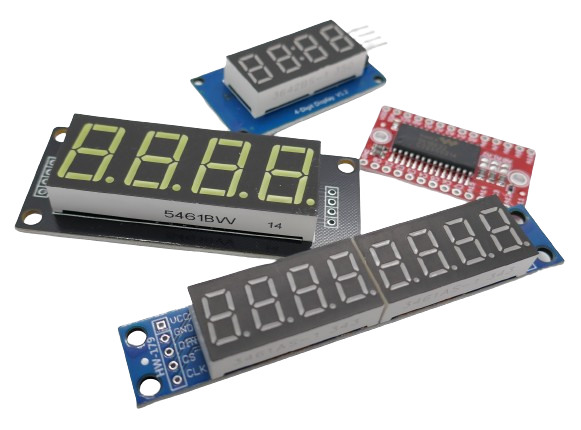
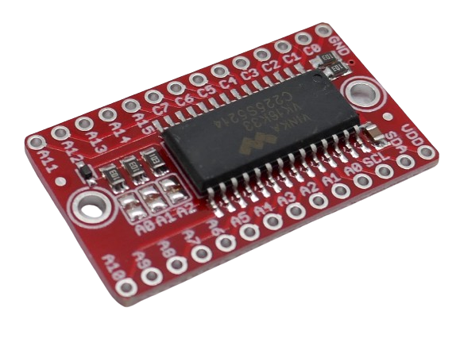

 
# 7-Segment Display

> Display Numeric Data With 7-Segment LED Displays

When multiple **LED** are combined, they can be used to display *numeric* and *alphanumeric* information. The most basic type of display is the *7-segment* **LED**.

The number of digits displayable solely depends on the number of *7-segment* **LED** that you combine. 

## Controllers

Each segment in each display represents a single **LED**. One *7-segment* display therefore consists of at least *seven* individual **LED**. Some displays include an additional *decimal point* and/or a *colon*. A typical *4-digit* breakout board is made of *30* individual **LED**.

Wiring and controlling these **LED** directly would require *31* wires and *30 GPIO* pins which obviously does not make practical sense. Specialized *controller IC* are used instead to control the **LED**. Here are a few commonly used *controllers*:

* [TM1637](TM1637)
* [MAX7219](MAX7219)
* [HT16K33](HT16K33)

## Multiplexing

These controllers use *two separate strategies* to control a variable number of *7-segment displays*:

* **Direct LED Control:** similar to a generic *port extender*, the *controller* comes with individual *GPIO*s that can each be turned on and off. Each *GPIO* provides a *constant current* to drive *exactly one* **LED**. Combined, the *GPIO* can control *exactly **one** 7-segment* **LED**.
* **Multiplexing:** in order to control *more than one 7-segment* display, the controller uses *multiplexing*: it switches between separate *7-segment displays* in high frequency. The same *GPIO* ports control many different *7-segment displays*, one at a time, in rapid succession. By switching between the displays *fast enough*, the human eye does not notice any *flicker* (however most *7-segment displays* do flicker when recorded with a camera).

> Tags: 7-Segment, Matrix, TM1637, MAX7210, HT16K33

[Visit Page on Website](https://done.land/components/light/led/7-segment?207284030026242123) - created 0001-01-01
