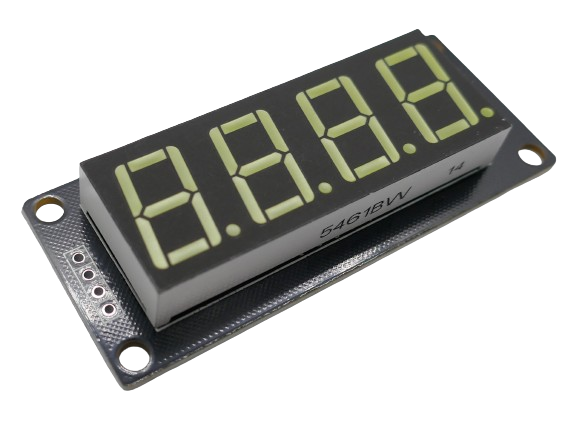
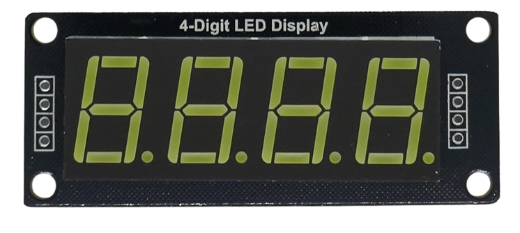
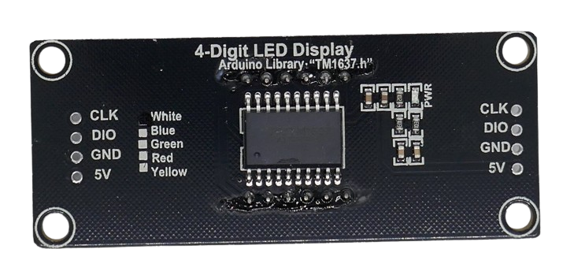
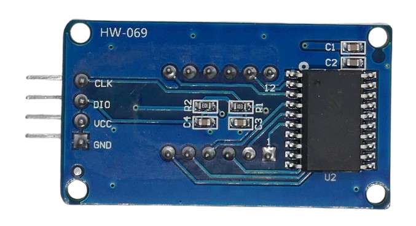
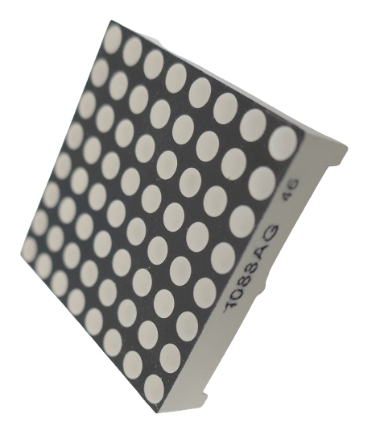
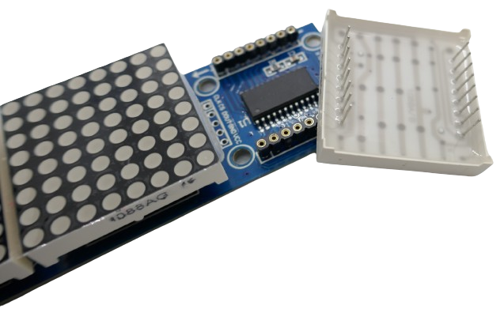
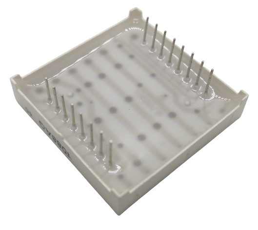

 
# TM1637
> Controls Up To Six 8-Segment LED Displays Or 48 Individual LED And Comes With Keyboard Scan Capabilities, Too

The *TM1637* controller is a clever **LED** *controller* used in many *7-segment **LED** displays*.

It is available in many different breakout boards.

> [!TIP]
> What sets this controller apart from others is its *two-wire* serial interface and the built-in *keyboard scan* support which can make this controller a one-stop solution to control *device user interfaces* consisting of *indicator **LED*** and *keys*.

## LED Driver

*MAX7219* lets you flexibly control the connected **LED**:

| Item | Description |
| --- | --- |
| Common Anode | **LED** are controlled by their *cathode* (**-**) and all use the same *anode* (**+**) |

## Interface

*TM1637* supports a simple 2-wire *serial interface*. 

## Breakout Boards

Typically, the *MAX7219* comes on a breakout board ready-to-use with *7-segment* displays:

The *controller* and all logic is placed on the back side:

The actual component placement and size of the breakout boards can vary:

### 8x8 Dot Matrix Displays

*MAX7219* is a very popular controller for driving *8x8 dot matrix displays* as well:

They are *cheap* and available as breakout boards with *one* or *many* 8x8 dot matrix displays. In the picture you can see the connectors that take a *8x8 dot matrix module*, and the *MAX7219* chip beneath:

The *8x8 dot matrix modules* have two rows with 8 pins each. They are available in all common **LED** colors.

> [!CAUTION]
> The *MAX7219* is primarily designed to drive simple *7-segment displays*. Its *constant current* is limited. While *8x8 dot matrix modules* are flexible and can display **LED** *ticker* and patterns, the *brightness* is *very limited*. These displays are not up-to-date with current technology. For vivid colors and blinding brightness, consider using modern *WS2182*-based **RGB** *matrix displays* instead. 

## Data Sheet

[Data Sheet](materials/tm1637_datasheet.pdf)

> Tags: LED, 7-Segment, Matrix, Controller, TM1637, 5V, 8x8 Segment

[Visit Page on Website](https://done.land/components/light/led/7-segment/tm1637?323971030026242123) - created 2024-03-28
