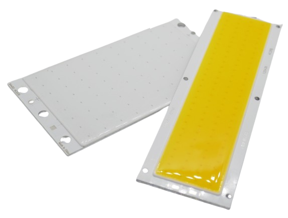

 
# COB LED (Chip On Board)

> Large Surface, High Light Output And Ready-To-Use For Various Voltages

*COB* (*Chip On Board*) **LED** have an exceptionally large *light emitting surface*: *multiple LED chips* are mounted directly onto a substrate or circuit board.

These **LED** chips are arranged closely together and covered with a phosphor coating or resin to enhance light output and color uniformity. They typically come on aluminum modules.

*COB* **LED** are simpler to manufacture and cheaper. The close proximity of multiple **LED** on a common substrate yields a high and uniform *light output*, allows for various shapes and forms and provides good *heat dissipation*.

> [!NOTE]
> The many different **LED** on a *COB* are partially connected in series and partially connected in parallel to design a particular desired *total forward voltage*.
They often can be connected directly to voltages like **12-13V** without the need of *series resistors* or *constant voltage*/*constant current* power supplies.

> Tags: LED, Light, Anode, Cathode, COB
