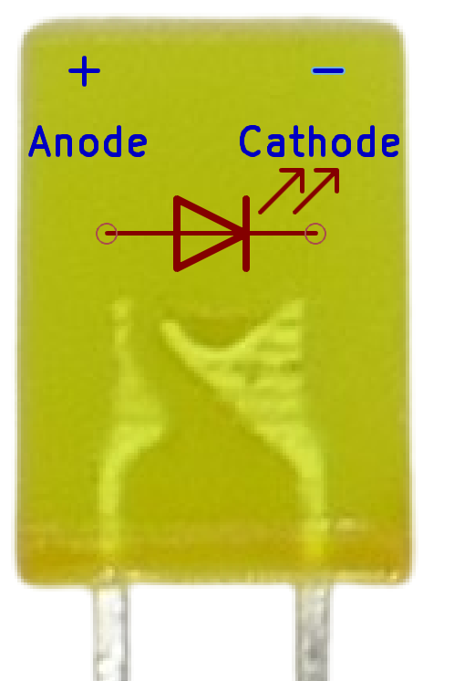
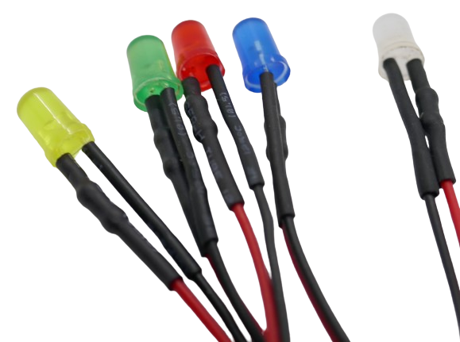

 
# Classic Indicator LED

> Calculate Series Resistors For Classic Indicator LED And Start Playing

Probably anyone in electronics has come across the classic standard LEDs that come in two diameters: 3mm and 5mm.


As *cheap indicator* **LED**, they are designed to emit a noticeable colored *light* to *indicate* a given *state*. That is not much asked - which is why these **LED** are *cheap* and popular among hobbyists to play around with.


## Not Very Efficient

These **LED** are neither very bright nor very efficient: at *20mA*, they consume relatively *much* energy for relatively *low* light output. Because of their low *currents*, they get away with it and despite their *inefficiencies* do not produce much heat or need *heat sinks*.

What matters more is their *low price* and the many available colors:


## Wiring: Anode and Cathode

Classic *indicator **LED*** have *two* "legs". The *longer* leg is the *anode* (**+**). 


Since most **LED** are transparent, you can look *inside* the **LED**. This is useful if the **LED** is already wired or its "legs" have been shortened or cut off otherwise.     

Inside the **LED** head, a *short* metal piece is connected to the *anode* (**+**). The much *wider* cup-shaped counterpart is connected to the *cathode* (**-**). 




## Calculating Series Resistor

Due to their low power, cheap *series resistors* are used for *current limiting*. 

The required resistor value can quickly be calculated based on the well known **LED** *current* (20mA) and the also well-known *forward voltages* (based on **LED** color).

> [!CAUTION]
> Each **LED** *color* has its own *forward voltage*. Do not use a *series resistor* for a *blue* **LED** on a *red* **LED**.

Here is a quick reference sheet to find the right *series resistor* for a given **LED** color and the *voltage* you want it to power with:

````
PS> 5,9,12,24  | Get-LedResistor -Color yellow, orange, red, green, blue, white | Format-Table -AutoSize

WARNING: LED Forward Voltage was guessed from color and can be completely different. Use at own risk.
Required Resistor (Ohm) Operating Voltage (V) Led Current (mA) Led Voltage (V) Led Color
----------------------- --------------------- ---------------- --------------- ---------
                   6250                     5               20             1.8 yellow   
                   6452                     5               20             1.9 orange   
                   6667                     5               20               2 red      
                   7692                     5               20             2.4 green    
                  10000                     5               20               3 blue     
                  11111                     5               20             3.2 white

  
                   2778                     9               20             1.8 yellow   
                   2817                     9               20             1.9 orange   
                   2857                     9               20               2 red      
                   3030                     9               20             2.4 green    
                   3333                     9               20               3 blue     
                   3448                     9               20             3.2 white    


                   1961                    12               20             1.8 yellow   
                   1980                    12               20             1.9 orange   
                   2000                    12               20               2 red      
                   2083                    12               20             2.4 green    
                   2222                    12               20               3 blue     
                   2273                    12               20             3.2 white    


                    901                    24               20             1.8 yellow   
                    905                    24               20             1.9 orange   
                    909                    24               20               2 red      
                    926                    24               20             2.4 green    
                    952                    24               20               3 blue     
                    962                    24               20             3.2 white    
````

> [!CAUTION]
> The table shows *typical* values. Use at *own risk*. Better yet, *calculate* the correct *series resistor* value yourself using the *specs* of your particular **LED**. You can also *adjust the values* for the **LED** forward voltages in the **PowerShell** script I used to create the table, and calculate your own. 

<details><summary>PowerShell Script to calculate **LED** resistance values</summary><br/>

Here is the **PowerShell** script that was used above to calculate the **LED** *series resistor* values:

```powershell
function Get-LedResistor
{
  [CmdletBinding(DefaultParameterSetName='ForwardVoltage')]
  param
  (
    [Parameter(Mandatory,ValueFromPipeline)]
    [double]
    $OperatingVoltage,
    
    
    [Parameter(Mandatory,ParameterSetName='precise')]
    [double]
    $ForwardVoltage,
    
    [Parameter(Mandatory,ParameterSetName='guess')]
    [ValidateSet('yellow','orange','red','green','blue','white')]
    [string[]]
    $Color,
    
    [int]
    $Current = 20    
  )

  begin
  {
    $colorToVoltage = @{
      yellow = 1.8
      orange = 1.9
      red = 2.0
      green = 2.4
      blue = 3.0
      white = 3.2
    }
  }
  process
  {
    $Color | ForEach-Object {
      $curColor = $_
      if ($PSCmdlet.ParameterSetName -eq 'guess')
      {
        $ForwardVoltage = $colorToVoltage[$curColor]
      }
      else
      {
        $curColor = $colorToVoltage.GetEnumerator() | 
        Sort-Object { [Math]::Abs($_.Value - $ForwardVoltage)  } | 
        Select-Object -First 1 -ExpandProperty Key
      }
    
      $voltageDrop = $OperatingVoltage - $ForwardVoltage
      $resistance = $Current * 1000 / $voltageDrop
  
      [PSCustomObject]@{
        'Required Resistor (Ohm)' = $resistance -as [Int]
        'Operating Voltage (V)'   = $OperatingVoltage
        'Led Current (mA)'        = $Current
        'Led Voltage (V)'         = $ForwardVoltage
        'Led Color'               = $curColor
      }
    }
  }
  end
  {
    if ($PSCmdlet.ParameterSetName -eq 'guess')
    {
      Write-Warning "LED Forward Voltage was guessed from color and can be completely different. Use at own risk."
    }
  }
}
```

Run this script inside a **PowerShell** *console* or **IDE** like *Windows PowerShell ISE* or *VSCode* to define the new command `Get-LedResistor'.

Next, use the command inside the same PowerShell session like below. As you will see, **PowerShell** commands are *extremely powerful and versatile*, and this one new command can calculate one individual resistor as well as *a resistor table* for a *wide range of operating voltages*:

````
PS> Get-LedResistor -OperatingVoltage 3.3 -Color red -Current 10


Required Resistor (Ohm) : 7692
Operating Voltage (V)   : 3.3
Led Current (mA)        : 10
Led Voltage (V)         : 2
Led Color               : red

WARNING: LED Forward Voltage was guessed from color and can be completely different. Use at own risk.


PS> Get-LedResistor -OperatingVoltage 10 -Current 15 -ForwardVoltage 2.2


Required Resistor (Ohm) : 1923
Operating Voltage (V)   : 10
Led Current (mA)        : 15
Led Voltage (V)         : 2.2
Led Color               : green


PS> 3..24 | Get-LedResistor -Current 15 -Color blue | Select-Object -Property required*, *operat*

WARNING: LED Forward Voltage was guessed from color and can be completely different. Use at own risk.
Required Resistor (Ohm) Operating Voltage (V)
----------------------- ---------------------
                                            3
15000                                       4
7500                                        5
5000                                        6
3750                                        7
3000                                        8
2500                                        9
2143                                       10
1875                                       11
1667                                       12
1500                                       13
1364                                       14
1250                                       15
1154                                       16
1071                                       17
1000                                       18
938                                        19
882                                        20
833                                        21
789                                        22
750                                        23
714                                        24
````

</details>

### Wired and Preconfectioned LED

You may come across *preconfectioned* **LED** that have *wires* already attached to them:



*Wire color* typically lets you identify *anode* (red) and *cathode* (black). If the *wire color* is different or you want to make sure, you now know from above how looking *inside* the **LED** head can tell you the polarity.

> [!CAUTION]
> Wired **LED** often already come with a *series resistor* that hides inside the *shrink tube* (like seen in the picture above). In this case, the **LED** is already preconfigured for a particular operating voltage.


*Indicator* **LED** exist in many different shapes and forms and can also be *square*, *clear* or *fogged*. They all work the same.


> Tags: LED, Light, Anode, Cathode

:eye:&nbsp;[Visit Page on Website](https://done.land/components/light/led/classicindicatorled?276177032017241931) - last edited 2024-03-17
