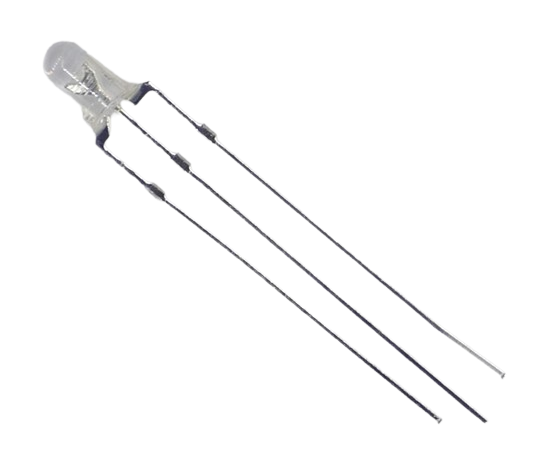

 
# Dual Color LED

> Simple Yet Effective Indicator LED To Indicate Different States Via Different Colors

Dual color **LED** help save space: instead of using a separate *green* and a *red* **LED**, for example, a *single bi-color* **LED** can indicate both states by changing its color. They exist in any available **LED** color combination.

## Two LED with different colors

What sets them apart is that internally, they use *two* separate **LED** with different colors. It's essentially a *2-in-1* package. 

> [!NOTE]
> You could as well use a *RGB* **LED** to show different colors. For *indicator* purposes where just *two* states matter, *dual color* **LED** are simpler (and cheaper).

## Identifying Anode and Cathode

The *middle* pin serves either as *common anode* (**+**) or *common cathode* (**-**), depending on **LED** type. 

The other two pins connect to the respective internal **LED**, one per color. 

> [!TIP]
> You control both colors individually and can power them *individually* or *at the same time*, essentially *mixing* colors: the **LED** therefore can display *three* different colors.

> [!WARNING]
> The *forward voltage* depends on **LED** *color*. Since both internal **LED** display *different* colors, their specs are different, too. You need different *series resistors* for each of the two internal **LED**.

> Tags: LED, Light, Anode, Cathode, Dual Color, Common Anode, Common Cathode

:eye:&nbsp;[Visit Page on Website](https://done.land/components/light/led/dualcolor?558728031318243445) - last edited 2024-03-18
