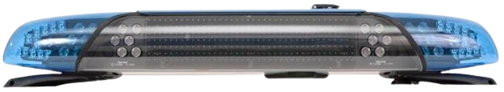
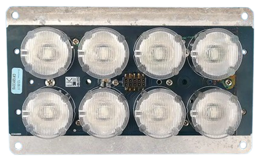
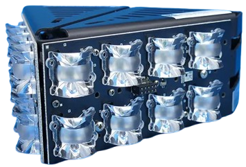
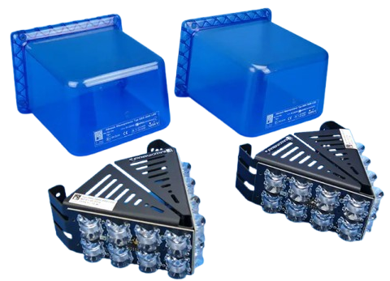
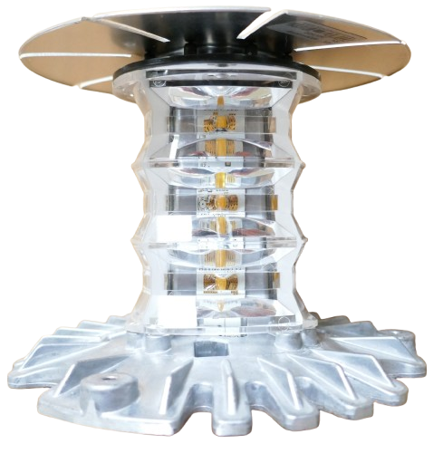
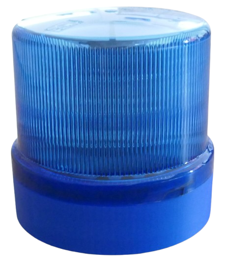
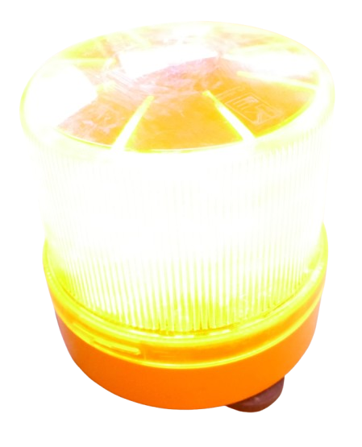

# Haensch High Performance LEDs 

> Overview of Commercial Hänsch High Performance LED Lights for Emergency Services 

The German company *Hänsch* has developed optical and acoustic vehicle warning systems since 1984. 

Hänsch started using high-performance LEDs in the early 2000s and is one of the top sellers, so today older Hänsch emergency lights are readily available on *Ebay* for little money. That makes them particularly interesting for DIY projects.

## Overview

In this article, I cover *older* Hänsch equipment only that today is readily available on the second-hand market. During this time, Hänsch used predominantly four *Cree* LED types: `XR`, `XR-E`, `XP-E`, `XP-E2`. These types illustrate the advances *Cree* made, so these LED types are increasingly brighter and more efficient, or put differently, if you can get `XP-E2`, this is better than `XR`. 

| Introduced | Cree LED         | Product          | 
| ----------------------------------- | ---------------------------------------- | --------------------------------------------------------------- | 
| 2006                            | `XR` | *Typ 43 LED*                                              |
| 2007/08                         | `XR-E`     | *Sputnik nano, MOVIA-D LED, DBS 975/2000/3000* |    
| 2009                            | `XP-E`                 | *COMET LED* and subsequent |            
| 2010–11                         | `XP-E`             | *DBS 4000, SATURN LED, MOVIA-SL LED*                         |  
| 2013                            | `XP-E2`          | *Sputnik SL*                                                  |   
| 2013 onward                     | `XP-E2`   | *Sputnik SL, COMET/DBS/INTEGRO generations*                       | 

### Why Bother Using Second-Hand Equipment?

You can of course buy brand new Cree LEDs and not bother about used emergency equipment. However, used Hänsch has these advantages:

* **Binning:**    
  Hänsch used the highest-quality LED bins, so you get the brightest and most efficient variants.   
* **Optics:**   
  Come with diffusor optics. The LED by itself isn't typically useful, you need a way to spread the high intensity light.   
* **PCB:**    
  The LEDs are already pre-mounted on a heavy-duty PCB. Manually soldering these LEDs requires reflow soldering and specific PCB designs.    
* **Heat Sink:**   
  You get the LEDs mounted in a fixture that is designed for continuous operation and has the capability to sink the enormous heat that these high-performance LEDs can emit.   

## Aging and Lifespan

For a well-designed beacon, aging and wear is usually much smaller than expected. 

### Calendar Age
In an old emergency beacon, you should worry about optics, PCB, driver electronics, seals and connectors. Calendar age does not affect the Cree die much. Put differently, *shelf life* is almost unlimited.

### Operating Time

Actual *operating time* is what matters, dominated by temperature and drive current. 

A Hänsch lamp might have been installed on a vehicle for 15 years, but that obviously does not mean the LEDs have 15 years of operating time. So it matters where you got the equipment from. 

Roughly, operating hours rise in this order: fire with the least hours, then police, and ambulance with the highest hours. Obviously, this is just a rule of thumb, and there may be ambulances that were not used for actual emergency service that have very low operating time.

### Effects

High operating time does not increase the risk of sudden failure. Instead, over time the LED brightness decreases. 

`XP-E` LEDs, for example, are designed to run on *700 mA* in emergency lights. Hänsch projects 61.000 hours at this current before the LED brightness is reduced to 70%:

| XP-E current | Projected time to 70% output |
| -----------: | ---------------------------: |
|       350 mA |                    ~96,000 h |
|       400 mA |                    ~90,000 h |
|       500 mA |                    ~79,000 h |
|       600 mA |                    ~70,000 h |
|       700 mA |                    ~61,000 h |

And since the duty cycle in flashing lights is just around 40%, if an emergency vehicle was in service for 10 years with an average of 3 hours of emergency lights each single day, then this would be:

**10 years x 365 days x 3 hours x 0.4 duty cycle = 4.380 LED hours**

That's small compared with the tens of thousands of continuous hours for which these emitters were designed.

### What to Expect
You don't need to fear that a 2009 `XP-E` taken from an emergency light now produces only 70–80% output just because it's 15+ years old. That would confuse calendar age with powered aging.

In fact, a genuine 2009 Cree that spent most of those years switched off could plausibly be closer to its original specification today than a cheap new high-power LED from an unknown manufacturer.

#### Blue LEDs
Blue LEDs have a significant advantage: emergency-blue Cree devices are direct-emission InGaN LEDs. There is no phosphor conversion layer as there is with a white LED, so phosphor/binder changes and the associated color shift won't occur.   

#### Amber
While there are direct Amber LEDs with no phosphor conversion, in emergency equipment you often find *PC Amber* LEDs. These are essentially blue LEDs with a conversion to make them emit amber light.

The reason for this is often simplicity: Blue and PC Amber LEDs share the same voltages and can use the same electronics, which is especially convenient in dual-color lights.   

So if you deal with **PC Amber** instead of **Amber** LEDs, the emitted color may move away from saturated amber toward a paler/yellower appearance, potentially with a slight greenish or whitish component depending on the phosphor spectrum.

For a well-designed fixture, however, the first practically measurable symptom will still be flux loss before an obvious color change.

## Testing LED Quality
Here are a few approaches that may help you judge the quality of used high-power LEDs. 

The objective is to test *different* used LED **lights** against each other, not so much individual **LEDs** *inside the same* light. The latter would be all of same age and exposed to the same operating times, anyway. 

Put differently, without precise test equipment you can very easily compare **relative** difference, not so much **absolute** values.

### Brightness
★★★★★

Cheap digital lux meters can work surprisingly well: run the light continuously (if possible) through a diffusor, and measure the brightness always at the same distance and angle. The absolute value is irrelevant. What matters are **relative** differences between entire lamps **of identical design**.

If you are able to use a photodiode like *BPW34* or *TEMT6000*, you can even build a shielded test device small enough to measure individual LEDs against each other while they remain in place inside a lamp. This helps evaluating lamps **of different designs** against each other.

> [!TIP]
> Always put something between LED and sensor, i.e. opal acrylic PTFE sheet, frosted plastic or several layers of white paper. Even a crude white enclosure dramatically improves repeatability.

### Color
★★★★★ (for PC Amber)    
★★☆☆☆ (for Blue)

Whether or not an LED has shifted color over time can be tested in a number of ways. It is revealing for PC Amber LEDs while it provides not much extra value for Blue LEDs.

#### Human Eye
Place two LEDs side by side behind the same diffuser and drive them at identical current. Your eye is extremely good at detecting:

* amber vs yellow
* saturated vs washed-out amber
* orange shift
* uneven hue

Do not compare them sequentially. Illuminate them simultaneously.

#### Smart Phone

A phone camera can also work if you lock white balance, ISO, shutter speed, exposure and focus. Then photograph every LED through the same diffuser.

You can extract average RGB values, for example:
| LED     |   R |   G |  B | Ratio R/G |
| ------- | --: | --: | -: | --------: |
| Amber A | 241 | 118 | 15 |      2.04 |
| Amber B | 239 | 116 | 14 |      2.06 |
| Amber C | 224 | 137 | 22 |      1.64 |

Absolute RGB values are meaningless, but relative differences under fixed camera settings can be very useful. In this example, lamp C clearly differs spectrally. 

#### Color Sensor
The `AS7341` color sensor chip is particularly interesting because it provides several spectral channels rather than just RGB. It is probably the sweet spot between "affordable" and "actually useful".

### Thermal Behavior
★★★☆☆   

If you own a IR thermal camera, run all LEDs at the same current on the same type of heatsink/MCPCB/lamp type for the same duration, and compare temperature. LEDs that get hotter than the rest are suspicious.

### Forward Voltage
★★☆☆☆

Test each individual LED with a realistic current (i.e. 700 mA), and record the forward voltage after 1-2 seconds.

For a batch of identical LEDs, the population will naturally cluster. Outliers are worth investigating, but typically, the recorded forward voltage of all LEDs should be very similar **for one lamp**. The interesting part is comparing the forward voltages between lamps. This can differentiate lamps with high operating time from rarely used lamps.

[Visit Page on Website](https://done.land/components/light/led/highperformance/emergencylights?492176091123265739) - created 2026-09-22 - last edited 2026-09-22
