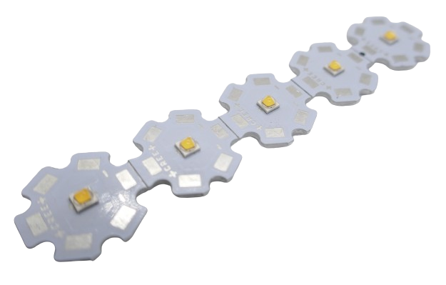

 
# High Performance LED

> Workhorses That Can Convert Many Watt Of Energy In Blinding Brightness

*High performance **LED*** are designed to convert *much more current* into *light* than regular **LED** can. They are used in *super bright flashlights*, *floodlights*, *illumination*, on *stages* and in *studios*, and also in *emergency lights* on police cars and ambulances.

There is no clear distinction when you start to enter the realm of *high performace* **LED** but typically these **LED** start at *3W* (compared to *50mW* for regular *indicator **LED***). Some *high performace* **LED** can go up to *30-50W*.

## Price And Heat

This *performance* comes at a *high price* though, both *monetary* (they are much more expensive than regular **LED**) and *technically*:

No **LED** is 100% efficient, and a fraction of the energy is *not converted to light* and ends up as *heat*. With the *high currents* of *1-10A*, even *very efficient* **LED** start to become very hot and need *heat sinks* or even *active cooling*. Without, they can be destroyed.

For the same reason, you can no longer use simple *series resistors* to control the *current*. Their *inefficiency* would produce even more heat, and resistors would need to be huge to sustain the currents. Instead, you need to invest in a *constant current* power supply.

For all of these reasons, you can't just pick an **LED** with a huge wattage and hope for the best. 

## Entry Level

*Cheap generic* **3W LED** are available and come mounted on star-like aluminum *heat sinks*. 

These **LED** are not much more expensive than regular **LED**. However, their performance often is similar, too:

* **Low Efficiency:** A significant part of the supplied energy is converted to *heat*. These **LED** heat up quickly. If you plan to operate them at their maximum of **3W**, you will need to add *extensive heat sinks* and *active cooling*.
* **Low Light Output:** Even then, while being brighter than normal **LED**, their light output is not nearly as blindingly bright as you probably had hoped for.

> [!TIP]
> If you *must* use these types of **LED**, try and operate them at *a third* of their rated maximum (around *230mA*). This will get you almost the same light output but avoids the immense *heat problems* that can arise when operated at full *3W*.

## Professional Grade

When you are *really* after super bright light, go get a *high performance* **LED** from a renown manufacturer like *Cree*. They are more expensive but this money buys you the performance you ask for.

Depending on type and color, typical *Cree* **LED** types have a maximum current of *700mA-2.000mA*.

These **LED** are often mounted to metal *LED Stars* available in various diameters and materials like aluminum and copper (more expensive but better *heat conductor*). 

### Heat 

Even though *Cree* **LED** are much more *efficient* than *generic high performance* **LED**, when run close to their maximum *current* they, too, produce significant *heat* and cannot be driven without a proper heat sink.

Always make sure you use a proper heat sink or even active cooling for high performance **LED**

> [!TIP]
> Since *Cree* **LED** *perform exceptionally well* and yield a lot of light output, driving them with *half of their maximum current* often produces all the light you need without running in *heat dissipation problems*.

## High Performance RGB LED

Similar to *regular RGB* **LED**, these **LED** are also available in *high performance* versions, both from *generic* and *renown* vendors.

Like their "normal" counterparts, they use *three* or *four* individual **LED** internally (*RGB* or *RGBW*).

> [!TIP]
> While you *could* run all *four* internal **LED** at their maximum ratings of *1.000mA* (**10W**), this would produce severe *heat sink* challenges.
> Rather, since each *color* is capable of outputting the maximum light, this allows for a constant *brightness* throughout the entire *color spectrum* at around **3W** maximum.
> Whether you emit pure *red* light (by driving just the *red* **LED** at maximum current), or mix a *yellow* color (by driving *green* and *red* at half the maximum current), the overall light emission can be made comparable for *any color*.

> Tags: LED, Light, Anode, Cathode, RGB, High Performance, Heat Sink

:eye:&nbsp;[Visit Page on Website](https://done.land/components/light/led/highperformance?198478031411241041) - last edited 2024-03-17
