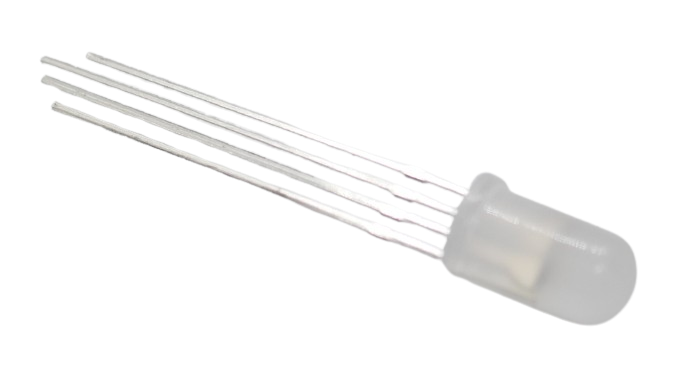

 
# Programmable LED

> Built-In Chip Controls Colors, Handles Currents, And Can Be Daisy-Chained To More Programmable LEDs. That Saves Effort And Wires.


Programmable LED incorporate all the driver electronics and make them much easier to use, especially with RGB LED. 

Previously, you had to design an appropriate driver circuit that would supply appropriate currents to all three basic LEDs inside a RGB LED, each color requiring a different current. Changing the brightness (without changing the color) further complicated matters.

Programmable LED take care of all of this for you. They require just a stable voltage (typically *5V*, but *12V* and other versions exist). The internal electronics takes care of supplying the correct current to each internal LED and can mix colors and adjust brightness.

## Overview
Operating a simple RGB LED used to be fairly complex: you had to treat it like three individual LEDs (red, green, blue), and each color has its own current requirements. This meant that even for a *single* RGB LED, there was substantial overhead, not to think about LED strips or LED matrices with hundreds or thousands of LEDs. That's why the first LED strips were just single-color LEDs.

Programmable LEDs embed all the driver electronics, so each programmable RGB LED resembles really a full-blown driver circuit with three connected LED.

They typically have four pins:

| Pin | Description |
| --- | --- |
| V+ | positive voltage, i.e. *5V* for *WS2812B* |
| GND | Ground |
| DIN | Data from microcontroller or *previous* LED in daisy-chain |
| DOUT | Data to *next* LED in daisy-chain |


This made it simple to design LED strips, LED matrices, and LED signals and signs since now each LED is individually controllable.

> [!TIP]
> One of the most common errors is to mix up **DIN** and **DOUT**. When you accidentally connect your microcontroller data pin to **DOUT** of a programmable LED (stip/matrix/etc), it will remain dark.


### Digital Control
Obviously, it would be unfeasable to connect a separate control wire to each LED, let alone spending one GPIO per LED. That's why programmable LEDs typically use a *one-wire protocol* where the LEDs are *daisy-chained*.

Many different protocols exist, although they all work similarly. The most popular *WS2812 LED* use a one-wire, time-based communication protocol that works like this:

* **Wiring:**    
  Each WS2812 LED has four connectors. Two receive *5V power* (*V+* and *GND*). Then there is *DATA IN* (receiving the control data), and *DATA OUT* (passing the control data to the next daisy-chained WS2812 LED).
* **Protocol:**   
    The protocol distinguishes between `0` and `1` using pulse-width modulation (PWM) at an 800 kHz data rate (1.25 µs per bit):

    | Bit Value	 | High Time	| Low Time	| Total Period |
    | --- | --- | --- | --- |
    | 0	| ~0.4 µs	| ~0.85 µs	| 1.25 µs |
    | 1	 |~0.8 µs| 	~0.45 µs|	1.25 µs|

    So `1` has a longer high pulse than `0`.

    Each LED requires *24 bits* (3 bytes), one byte per color, and the data is sent *MSB first* (most significant bit first). After all data has been sent, a *reset code* latches the colors (pulling the data line low for 50 µs or more).

* **Daisy-Chaining:**    
    The first LED receives the full data stream, keeps the first 24 bits, and shifts the remaining data to the next LED. The next LED repeats the process. This continues for all LEDs in the chain.   

* **Data Stream:**
    Even though each LED in a chain or strip of LEDs is *individually addressable*, there are no LED addresses or "packet counters". For every change, the complete bit stream for *all LEDs* needs to be sent. So if you operate a LED strip with 144 LEDs, and you wanted to change the color for the last LED, you would have to send a data stream of *144 x 24bits* (432 bytes).
    
    The LEDs in the chain do not "keep track" of how many LEDs are in the chain. They just latch their own 24 bits and shift the rest, letting the chain pass the remaining bits along.
  
Thanks to this simple daisy-chain protocol, wiring *WS2812 programmable LED* (like all other types that share the basic concept) is simple, and programmable LEDs do not need unique addresses.

The challenge is the *precise timing* that is required since this protocol does not use a *clock*. The microcontroller that is sending the data must strictly adhere to the agreed timing.

> [!NOTE]
> [ESP32](https://done.land/components/microcontroller/families/esp/esp32/) microcontrollers are an ideal choice for controlling programmable LEDs: they have a dedicated **RMT peripheral** that can generate precise signals without CPU involvement. **RMT** (*Remote Control Transceiver*) was originally used to send and receive infrared remote control signals, yet due to its flexibility, RMT can also be used to generate or receive many other types of high frequency signals. Microcontrollers without such capabilities may have to disable interrupts and stop all other tasks while controlling programmable LED.   


## LED Controllers
Programmable LEDs *internalize* their drivers. This was a gradual development: 

* **WS2811:** *(2011)*  
  uses a dedicated *external IC* designed to drive three LED channels (*Red, Green, Blue*) using a simple one-wire communication protocol. Available in *5V* and *12V*.
* **WS2812:**  *(2013)*  
  Controller is *fully integrated* into each individual LED which reduces the number of external components. Requires *5V*. 
* **WS2812B:** *(2014, aka *NeoPixel*)*    
  Fixed initial problems, reduced pins from 6 to 4 to simplify internal wiring, added an internal capacitor for improved stability, improved heat dissipation and reduced power consumption. Up to the present time, *WS2812B* is the most popular and widely available programmable LED.

### Improvements 
Once the fundamental design with the *WS2812B* had matured, new challenges arose:

* **Voltage:**  *WS2812B* is limited to *5V* which produces high currents and unwanted voltage drops for long LED strips. Newer controllers support higher voltages.
* **RGBW:** Newer LEDs have additional channels (like dedicated *cold white* (**CW**), *warm white* (**WW**), *natural white* (**NW**), or combinations). Newer controllers extended the *one-wire* protocol from *24bit* to *32bit* and *40bit* while maintaining backwards compatibility.
* **Frame Rate:**    
  for very large installations, and/or very fast frame rates (changes of LED configurations), some drivers completely redesigned the protocol to allow for a separate *clock* line and higher data transmission rates. 
* **Robustness:**    
  while a single data line simplifies wiring, it poses a reliability risk: if just *one* controller fails, all subsequent **LEDs** in the string stop receiving data and fail as well - similar to the old christmas tree light bulbs that were connected in series.

  That's why controllers like *WS2813* and *WS2815* feature *two* data lines, allowing the signal to bypass *one* failed controller (but not *two* or more). Such controllers may be worth the investment when the light strip is integrated into furniture or other places where it is later hard to access (and repair).  

This led to a new generation of controllers. They were mostly built around the same *one-wire* protocol and maintain backwards compatibility:

| Controller | LED Package(s)         | Colors   | Voltage | Data Frequency (kHz) | PWM Refresh (Hz) | Power Consumption (mA per LED) | Features |
|------------|------------------------|---------|---------|--------------------|----------------|------------------------|----------|
| WS2811    | *any* (external driver IC) | RGB     | 5/12/24V | 800                | 400-2000       | ~18.5mA (per channel, external LED-dependent) | External IC, can control multiple LEDs |
| WS2812    | 5050 / 3535 / 2020       | RGB     | 5V      | 800                | 400-2000       | ~18.5mA per color (~55mA total at full white) | Integrated controller |
| WS2813    | 5050 / 3535 / 2020       | RGB     | 5V      | 800                | 2000           | ~18.5mA per color (~55mA total at full white) | Backup data line for fault tolerance |
| WS2815    | 5050 / 3535 / 2020       | RGB     | 12V     | 800                | 4000           | ~12mA per color (~36mA total at full white) | Higher voltage reduces power drop |
| SK6812    | 5050 / 3535 / 2020       | RGBW    | 5V      | 800                | 1200           | ~18.5mA per color (~74mA total at full white) | Adds white channel (32-bit) |
| SK6812    | 5050 / 3535 / 2020       | RGBWW   | 5V      | 800                | 1200           | ~18.5mA per color (~92mA total at full white) | Adds warm and cool white channels (40-bit) |
| APA106    | 5mm / 8mm / 5050 / 3535  | RGB     | 5V      | 800                | 2000           | ~18.5mA per color (~55mA total at full white) | Single **LED** package, ideal for indicators |


## Brightness and Color Quality
It is important to understand that although programmable LED incorporate the driver electronics, they still consist of individual components that may differ between vendors, makes, and models.

The *brightness* and *color quality* entirely depends on the *LED* that was used for a particular programmable LED, not the driver IC. So a *WS2812B* light strip, for example, is not always the same thing. 

* **Physical LED Size:**   
  The physical size of the LED package is one indicator for brightness: a *5050* package (5x5 mm) has more surface area to emit light than a *3535* (3.5x3.5mm) or *2020* package (2x2 mm).

* **LED Quality:**    
  The quality of the LED substrates and the LED design affects achievable brightness considerably. Affordable entry-level LED strips may use inferior LEDs with a lower achievable brightness than higher-priced items. 

* **Pixel Density:**     
  LED strips and matrices use different LED spacings. The more LEDs per meter, the more brightness. Typical LEDs per meter (LED/m) are 30, 60, 72, 96, 144.
  
  There are also **dual and triple-row** LED strips with even more brightness.

  | LED/m | Use Case |
  | --- | --- |
  | 30 | accent lighting |
  | 60 | balances brightness and power efficiency, indirect (diffused) lighting |
  | 72-96 | Smooth lighting, short strips, directly visible |
  | 144 | Very bright, professional installations, may require high currents and heat sinks |

  Keep in mind that high pixel density (and brightness) LED strips are not just expensive. They can quickly draw enormous **currents**, easily reaching **10-20A** or more. Installations requires special wiring, high-end power supplies, and heat sinks, or else you risk a fire hazard. Before you take this effort you may want to question whether you actually *need* these brightness levels.

* **Color Changes / Voltage Drop:**  
  With long LED strips operated at lower voltages (like *5V*), *color fidelity* may deteriorate due to *voltage drops* along the strip. When the colors change towards the end of the strip, *voltage injection* is needed, meaning you need to connect the power supply to additional points of your LED strip, i.e. add power somewhere in the middle, and at the end of the strip instead just at the start of the strip.


## Form Factors
Many different form factors exist that all use programmable LED:

* **LED Strip:**    
  daisy-chained programmable LED on a PCB or thin metal layer. Can be cut at regular intervals, i.e. to shorten, or to implement curves or sections. Parts of the strip that you cut off (at **marked** locations) can be reused elsewhere.
* **LED Matrix:**
  LED strip that is organized in a *serpentine* way to create a two-dimensional area.    
  

* **Individual LEDs:**
  Single LED versions can be used for spot lights or to implement programmable indicator LEDs.   
  
  


### Single programmable LEDs

Even though *single programmable* **through-hole** *LEDs* aren't as common as PCB-mounted versions, they exist and can be very useful:



Typically, they do not use *WS2812B* but instead *APA106* or similar controllers. These work basically the same.


Individual programmable LED have four legs with different length. Some have two shorter and two longer legs, while others have legs with distinct lengths, so each leg has a different length.

The two **inner** legs connect to the **5V** power supply:  
- The *longer* inner leg is **GND**.  
- The *shorter* inner leg is **+5V**.  

The two **outer** legs handle digital signals:  
- The leg next to **V+** (*shorter* pin) is **DIN** (data input).  
- The leg on the opposite side (*longer* pin) is **DOUT** (data output).  

Connect **DIN** to your microcontroller's GPIO output. Connect **DOUT** to the **DIN** of the next **LED** in the chain.  

Single programmable LEDs can be daisy-chained just like LED strips or matrix displays, allowing control via a *single* GPIO pin, making them ideal for *DIY microcontroller projects* requiring multiple indicator **LEDs**, as it minimizes wiring and reduces GPIO usage.


> [!TIP]
> If you need individual programmable LEDs, you can also purchase *single PCB-mounted WS2812B LED*. These are essentially *LED strips* with just one LED. A much cheaper way is to cut a suitable LED strip into pieces with individual WS2812B LEDs on each piece.

## Frame Rate Considerations
For most scenarios, the frame rate (color/brightness changes per second) are not important: 

If you plan to add ambient lighting, or use programmable LEDs as indicator LEDs in a dashboard, you don't care much about how often each LED can be changed **per second**. It's sufficient that you can change them in a blink of an eye.

This is different once you create sophisticated light effects, TV/Gaming Ambilight, or even build a video screen: now it does matter how often the LED strip can be updated because it distinguishes annoying *flicker* from elegant *smoothness*.

Here are the details about determining maximum frame rates.

### Factors Affecting Frame Rate

The maximum frame rate (updates to the LED strip per second) depends on a number of factors:

* **Number and Type of LED:**     
  Each update requires sending a data stream covering *all connected LEDs*, even if you just want to update a single LED. The total number of LEDs is therefore directly proportional to the amount of data. Classic RGB LED require 3 bytes, more sophisticated RGBW or RGBWW LED require 4 or 5 bytes. 
  
  Since most LED controllers use a *800kHz* data rate, meaning the LED controllers expect a data stream of 800 thousand bits per second, the number of LEDs directly influences the frame rate. With more LEDs, you can send the update commands less often.

* **Microcontroller:**    
 *ESP32* can calculate roughly *65k-85k* **LED** per second. At 1000 **LED** this is a *70Hz* frame rate, dropping to *35Hz* at 2000 **LED**. Weaker microcontrollers like *ESP8266* or *Arduino Nano* support much lower frame rates. So even if the *one-wire protocol* speed at *800kHz* would allow for higher frame rates, the microcontroller may be the bottleneck.
* **Reset Time:**  
  The **LED** controller sends a *reset time* after each data package  before it processes the next. This improves *robustness* because it clearly *distinguishes* one data package from the next, and most controllers today use significantly *longer reset times* than initially. Even the popular *WS2812B* today uses a *reset time* of *280us* while the initial batch used *50us*.

  Since the *reset time* is added only at the end of each *data stream*, and since it accounts for only a few hundred microseconds, its influence on the maximum possible *frame rate* (updates per second) is neglectible.   


> [!TIP]
> Make sure the libraries and the code you use account for *reset times* **>280us** to be compatible with *any* **LED** controller.


### Calculating Frame Rates
The maximum possible *frame rate* supported by the *one-wire* protocol can be calculated by putting the values from above into this formula, and adding the *reset time* that signals the end of each data stream:

`framerate = 1 / (( (24*[total LED])/800.000) + [Reset Time] )`

For **RGBW LED**, replace *24* with *32*, for **RGBWW LED** replace with *40*.

#### 1m @ 144LED/m (144 LED)
For a *WS2812B* **LED strip** with *144 **RGB LED**/m and a length of *1m*, the values add up to:

`framerate = 1 / (((24*144)/800000) + 0.00028) = 217.4 frames/sec`

So with a **1m 144LED/m RGB strip**, you can achieve a maximum frame rate of *217 frames/sec*.


Your microcontroller needs to be capable of sending the control data fast enough. In the example above, with a **1m 144LED/m RGB strip**, you need to control a total of 144 LEDs. 

A dual-core *ESP32* can calculate roughly *65k-85k* **LED** per second. Less performant microcontrollers like *ESP8266* perform considerably worse.

At *70.000 LED calculations/sec*, a *ESP32* can therefore deliver data at this frame rate:

`framerate = 70000 / [total LED]`    
`70000 / 144 = 590Hz`

Since the *ESP32* can easily handle framerates of up to *486* for the LED strip, you can leverage the maximum framerate *one-wire* allows at *800kHz*: *217Hz*. 

#### 20m @ 90 LED/m (1800 LED)
Once your LED strip grows longer, lesser-capable microcontrollers can quickly become a bottleneck. Not so much with powerful *ESP32*:  a strip with 1800 LEDs would reduce the framerate at which an *ESP32* can deliver data to *35Hz*:

`70000 / 1800 = 39Hz`

However, the *one-wire* hard limit for 1800 LEDs would be *18.4Hz*, so the *ESP32* would still outperform the *one-wire protocol*:

`framerate = 1 / (( (24*1800)/800000) + 0.00028) = 18.4 frames/sec`

### Frame Rate Calculator

Here is a **PowerShell** script that you can use to calculate frame rates for **LED strips**:

<details><summary>PowerShell Framerate Calculator</summary><br/>


Run this script in a **PowerShell** shell to define the new command `Get-LedStripDetail`:

```powershell
function Get-LedStripDetail
{
  [CmdletBinding(DefaultParameterSetName='framerate')]
  param
  (
    [Parameter(ParameterSetName='framerate', Mandatory)]
    [int]
    $Framerate,
    
    [Parameter(ParameterSetName='framerate', ValueFromPipeline)]
    [Parameter(ParameterSetName='ledpermeter', Mandatory, ValueFromPipeline)]
    [int]
    $LedPerMeter,
    
    [int]
    $ResetTimeMicroSec=280,
    
    [switch]
    $IncludeWhiteLed,
    
    [ValidateRange(1,10000)]
    [int]
    $DataRateKhz=800,
    
    [Parameter(ParameterSetName='ledpermeter', Mandatory)]
    [double]
    $StripLengthCm,
    
    [Parameter(ParameterSetName='totalled', Mandatory)]
    [int]
    $TotalLedCount
  )
  
  process
  {
    if ($PSBoundParameters.ContainsKey('ledpermeter'))
    {
      $TotalLedCount = $LedPerMeter * $StripLengthCm / 100
    }
    
    $bits = if ($IncludeWhiteLed)
    { 
      32 
      $type = 'RGBW'
    }
    else
    { 
      24
      $type = 'RGB'
    }
    
    $timeforSinglePackage = $bits / ($DataRateKhz * 1000)
    
    if ($PSCmdlet.ParameterSetName -eq 'framerate')
    {
      $resetTime = $ResetTimeMicroSec / 1000000
      $datarate = $DataRateKhz * 1000
      
      [int]$totalLed = $datarate * (1/$framerate-$resetTime)/$bits
      
      
      if ($PSBoundParameters.ContainsKey('ledpermeter'))
      {
        [PSCustomObject]@{
          LedCount = $totalLed
          Type = $type
          StripType = "${LedPerMeter}LED/m"
          StripLengthCm = [Math]::Round(($totalLed / $LedPerMeter) * 100, 1)
        }
      }
      else
      {
        [PSCustomObject]@{
          LedCount = $totalLed
          Type = $type
          StripType = 'n/a'
          StripLengthCm = 'n/a'
        }       
      }
    }
    else
    {
      # led count is given
      $timeForPackage = $timeforSinglePackage * $TotalLedCount
      $totalPackageTime = $timeForPackage + ($ResetTimeMicroSec/1000000)
    
      $frameRate = 1 / $totalPackageTime
    
      [PSCustomObject]@{
        LedCount = $TotalLedCount
        Type = $type
        Framerate = [Math]::Round($frameRate,1)
        'DataTime (us)' = $totalPackageTime
      }
    }
  }
}
```


#### Calculating Framerate Based on LED Count

When you know the number of **LED** (either absolute or as a combination out of **LED**/*meter* and *length of the strip*), you can calculate the maximum possible *framerate*:

````
PS> Get-LedStripDetail -TotalLedCount 100 

LedCount Type Framerate DataTime (us)
-------- ---- --------- -------------
     100 RGB        305       0.00328


PS> Get-LedStripDetail -LedPerMeter 144 -StripLengthCm 150

LedCount Type Framerate DataTime (us)
-------- ---- --------- -------------
     216 RGB        148       0.00676


# submitting a list of LED/m values:
PS> 60,90,120,144 | Get-LedStripDetail -StripLengthCm 150

LedCount Type Framerate DataTime (us)
-------- ---- --------- -------------
      90 RGB        336       0.00298
     135 RGB        231       0.00433
     180 RGB        176       0.00568
     216 RGB        148       0.00676
````

Likewise, when you know the *desired framerate*, you can calculate the number of **LED** you can drive at this framerate:

````
PS> Get-LedStripDetail -Framerate 305

LedCount Type StripType StripLengthCm
-------- ---- --------- -------------
     100 RGB  n/a       n/a          


PS> Get-LedStripDetail -Framerate 148 -LedPerMeter 144

LedCount Type StripType StripLengthCm
-------- ---- --------- -------------
     216 RGB  144LED/m            150

# submitting a list of desired framerates:
PS> 336,231,231,176,148 | Get-LedStripDetail -LedPerMeter 144

LedCount Type StripType StripLengthCm
-------- ---- --------- -------------
      90 RGB  144LED/m           62.5
     135 RGB  144LED/m           93.8
     135 RGB  144LED/m           93.8
     180 RGB  144LED/m            125
     216 RGB  144LED/m            150
````


</details>


> Tags: LED, Light, Anode, Cathode, RGB, Neopixel, WS2812, Programmable LED

[Visit Page on Website](https://done.land/components/light/led/programmable?668154031318243445) - created 2024-03-10 - last edited 2025-03-09
