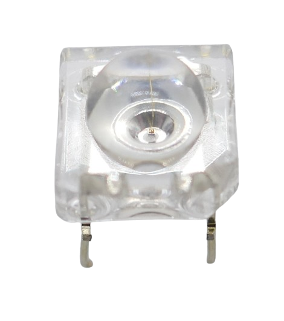
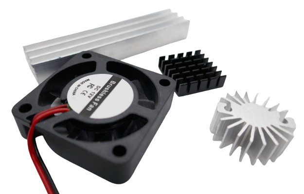

 
# LED (Light Emitting Diodes)

> LEDs Can Be Flexibly Shaped, Produce Light In Any Color Efficiently, Last Forever and Cost Little

**LED**s (*light emitting diodes*) are *semiconductors* that work like a *diode* yet their main feature is that they emit *light*.

Their conversion of electric power to *light* is so efficient that **LED** typically do not produce *heat* (very high powered **LED** still do): they are said to produce *cold light*.

## Rugged Yet Simple to Destroy

**LED** are *rugged* and last longer and are *more resilient* to *mechanical* stress than most other light sources. 

### Low Internal Resistance

One pecularity makes them very *delicate and sensitive*, though: they have a *low internal resistance*. 

When you connect an **LED** directly to a power source, it will almost *instantly burn up*. The **LED** *low resistance* behaves similar to a wire or a *fuse* (which have a *low resistance*, too): 

When you *short-circuit* your power supply with them, for a fraction of a second a *huge current* flows and *heats up* and ultimately destroys both. The very same happens with **LED**. 

### Always Control Current

To operate **LED** safely, you must always *limit the current* that can flow through the **LED**. There are [many ways](Current) to *limit current*. In hobbyist projects, a simple *series resistor* is the most popular one.

## Identifying Anode and Cathode

Since **LED** are semiconductors and conduct current in one direction only, it is crucial to connect it to the correct *polarity*. The two *legs* of a **LED** are called *anode* (**+**) and *cathode* (**-**).

Forward Voltage, Reverse Voltage, and Breakdown Voltage
 

Any material has a *breakdown voltage*: at this voltage, it becomes *conductive*. 

Semiconductors (like **LED**) have **two** *breakdown voltages*: the *forward voltage* is the *breakdown voltage* for the "normal" current that flows from **+** to **-** (in the *correct* or *intended* direction). *Reverse voltage* is the *breakdown voltage* when current flows the opposite direction.

When you connect a **LED** correctly to **+** and **-**, once the applied voltage exceeds the **LED** *forward voltage*, the **LED** starts to emit light. Typically, **LED** *forward voltages* are in the range of *1.6-4.0V*, depending on their *color* and the materials they were made of.

When you connect a **LED** *incorrectly* and accidentally *reverse polarity*, the **LED** acts like a *diode* and will not conduct. Since **LED** were never designed to be *diodes*, no effort was made to optimize their *reverse voltage*. Compared to *real diodes*, the *reverse voltage* for **LED** is *very low* and around **5V**.

So once the voltage of your *incorrectly connected power* exceeds **5V**, the **LED** starts to conduct but cannot utilize the power to produce light. The power instead is converted to *heat* and ultimatively destroys the **LED**.

When you use a current-limiting *series resistor* or some other means of *current limit*, you are protected against accidental *reverse voltage* as well: even though the voltage may exceed the *reverse voltage*, only a very small *current* flows which is not powerful enough to cause real damage. 

Let's examine the fundamental **LED** types and identify their *anode* and *cathode*.

### Two Legs

### More Than Two Legs

**LED** with *more* than two legs serve special purposes. Here are common examples:

#### Multi-Color LED

They can be *bi-color* (three legs) or *RGB* (four legs) and internally always use a distinct physical **LED** per color.

The *longest* leg is the *common connection*: whether *anode* (**+**) or *cathode* (**-**) depends on the particular **LED** type. 

The remaining legs connect to the individual internal **LED**.

> [!WARNING]
> In *bi-color* and *RGB* **LED**, each internal **LED** has *different* requirements and needs a different *series resistor*.

#### Programmable LED

*Smart* **LED** (like *WS2812*) have *four* or more legs and use an integrated chip to drive its internal **LED**.

> [!TIP]
> Thanks to the on-board chip, you need to supply *only one voltage* to all internal **LED**.
> *Smart* **LED** can be *daisy chained* which drastically reduces the *wiring*.
> Since they are *digitally controlled*, a *microcontroller* is mandatory to operate them.

## Fundamental LED Types

**LED** are produced for various use cases and exist in many shapes and forms. 

There are only a few *fundamental* **LED** types, though:

## Standard Indicator LEDs

[Indicator LED](Classic%20Indicator%20LED) are *cheap* and *simple to use*. Many hobbyist projects use these.

## Straw-Hat LED

*Straw-Hat* **LED** are *very bright* and feature a *wide viewing angle* due to a *built-in lens*. They are ideal for decoration purposes or as an *indicator **LED***.

Their distinctive *shape* resembles a *straw hat* which led to their name. *Straw-Hat* **LED** are a *cost-effective* choice when you need *very bright* **LED**.

In all other aspects, they work like regular **LED**.

## Piranha / SuperFlux LED

*Piranha* **LED** are small and compact *square* **LED** with a relatively large *light output* with *four* pins (instead of *two*). They are also known as *SuperFlux*.

Similar to *Straw Hat* **LED**, they have a *built-in lens* for a *wide viewing angle* but are even *brighter* than the latter. There are even *high performance piranha* **LED** available that internally use two light emitting chips.

### Anode and Cathode

To identify *anode* and *cathode*, closely examine the *piranha* **LED**. Use a *magnifying glass* if at hand.

* **Anodes:** On one side you can identify two *holes*. The pins on this side are the *anodes* (**+**).
* **Cathodes:** One *edge* is *rounded*. When you look at the **LED** from the top and place the *rounded edge* to the *lower right* side, then the *bottom pins* are the *cathodes*

The picture below shows both *a rounded edge* (on the left side) and the two *holes* (on the right side). Both are a bit hard to identify on first look:

The next picture below also shows both the *rounded edge* and the two *cathode* pins from a different angle. The *rounded edge* is positioned at the *lower right*, so the two pins seen in the picture are the *cathodes*.

> [!TIP]
> Typically, both *anodes* and both *cathodes* are internally connected. You need to connect only *one* *anode* and *cathode*, and use only *one series resistor*.
> With the *high performance multi-chip piranha* **LED**, all pins must be wired.

### Intended Use

*Piranha* **LED** are often used in *automotive* use cases where a *robust* and *very bright* light with a *wide viewing angle* is needed, i.e. in *brake lights*.

Even though not required with the *regular* types, for added robustness you can connect *anode* and *cathode* with two separate wires each.

Here is a picture of the *built-in lens* designed to emit the light in almost all directions:

## Dual Color LED

Dual color **LED** help save space: instead of using a separate *green* and a *red* **LED**, for example, a *single bi-color* **LED** can indicate both states by changing its color.

Internally, these **LED** are really *two* **LED** with different colors. 

The *middle* pin serves either as *common anode* (**+**) or *common cathode* (**-**), depending on **LED** type. 

The other two pins connect to the respective internal **LED**, one per color. 

> [!TIP]
> You control both colors individually and can power them *individually* or *at the same time*, essentially *mixing* colors: the **LED** therefore can display *three* different colors.

> [!WARNING]
> The *forward voltage* depends on **LED** *color*. Since both internal **LED** display *different* colors, their specs are different, too. You need different *series resistors* for each of the two internal **LED**.

## WS2812 Programmable LED

Sophisticated **LED Strips** often use *WS2812* **LED** that come with full RGB color, an internal controller chip *per LED*, and *four* legs.

These **LED** are available in many different forms and shapes and are not restricted to **LED strips**. They are also available as *regular individual **LED***.

Some vendors call this **LED** type *NeoPixel*.

### Advantages

Each *WS2812* **LED** can display the full *color spectrum* and works similar to *simple RGB* **LED**: internally *three* **LED** in *red*, *green*, and *blue* color can be mixed to produce all other colors.

> [!NOTE]
> There are many different variations and also different on-board controllers. The *WS2812* typically uses **5V** and comes with three **LED** (*RGB*). There are also versions and controllers for other voltages and combinations with *white* **LED** (*RGBW*, *RGBWW*) for added brightness.
> Especially for *long* **LED strips**, choosing a *higher voltage* is wise: with **5V**, the *current* requirements for hundreds or thousands of **LED** can easily exceed *10-20A*, require expensive thick wires and can produce considerable *heat*.

Programmable **LED** like the *WS2812* are *much simpler* to operate than *simple RGB* **LED**:

* **Uniform Voltage:** *WS8212* **LED** require *5V*. The different *voltages* and *currents* required by each of the three internal color **LED** is automatically adjusted by the internal driver chip. Other controller support different supply *voltages* but fundamentally do the same.   
* **Digital Control:** to display a given *color* and *brightness*, you send a *digital control signal* to the **LED**. There is no need to manually calculate and provide the individual *current* to each of the three **LED** to mix the desired *color* and *brightness*.
* **Daisy Chain:** *WS8212* **LED** can be daisy-chained which makes them especially suitable for **LED strips**. When daisy-chained, *each **LED*** can be controlled *individually*. This makes *WS8212* also very interesting for *individual indicator **LED***: you need just *one* GPIO pin to control an arbirary number of indicator **LED**.

> [!NOTE]
> Programmable **LED** like *WS2812* need a digital control signal. They are perfect for microcontroller projects. They cannot be used without one.

### Pins for Single Programmable LED

For individual (non-SMD) *WS8212* (or similar) **LED**, look at the *length* of the legs:

* **Two different lengths:** some **LED** come with legs in *two* different lengths: two legs are shorter than the other two.
* **Four different lengths:** typically, each leg has a different length.

#### Power Connection

The two *inner* legs are connected to the **5V** power supply. The *longer* leg is **GND**, the *shorter* leg is **+5V**.

#### Digital Connection

The two *outer* legs carry the *digital control signal*. The leg next to **V+** (*shorter* pin) is the digital *input* **DIN**. The leg on the other side (*longer* pin) is digital *output* **DOUT**.

Connect **DIN** to your microcontrollers' GPIO output, and connect **DOUT** to **DIN** of the next **LED** in the daisy chain.

> [!CAUTION]
> *WS8212* **LED** are **5V** devices. When you daisy chain multiple **LED**, they can draw *high currents*. Always connect the **V+** pin to a separate sufficiently strong **5V** power supply, and connect **GND** to the ground of your microcontroller (*common ground*).   
> The data pin can be driven directly from a GPIO pin. If you use a **3.3V** microcontroller like *ESP8266* or *ESP32*, the appropriate way is to use a *level shifter* to shift the GPIO *3.3V* to *5V*. If the connection between GPIO and *first* *WS8212* **LED** is short (<30cm), you typically get away with using the **3.3V** signal directly and without a *level shifter*.

> [!TIP]
> It is just important to get the digital control signal to the *first* **LED**. All subsequently daisy chained **LED** automatically pass on the digital signal using **5V**.
> If the distance between a **3.3V** microcontroller and the daisy chained *WS8212* **LED** is large (>30cm) and you don't have a *level shifter* at hand, a workaround is to use *one WS8212* close to the microcontroller. It then acts like a level shifter.

## 3W High Performance LED (Generic)

**LED** can be used for **illumination**, too. These *high performance* **LED** turn *much higher currents* into *light* than the typical *10-20mA* used by simple *indicator* **LED**.

There are *cheap generic* **3W LED** that take a *current* of around *700mA*. They are typically mounted on an *aluminum star-shaped heat sink*.

> [!WARNING]
> With *high performance* **LED**, the *currents* at play are *significant*. You can no longer use *series resistors* due to their catastrophic *inefficiency*. Instead, a *constant current* power supply is needed.   
> These **LED** also typically get *very hot very fast*. A *heat sink* is mandatory, and depending on the *currents* you use to drive them, additional *heat sinks* or even active cooling is necessary.

> [!TIP]
> *Generic high performance* **LED** seem like a good deal at first because they are relatively cheap. You get what you pay for, though.
> Compared to *high performance* **LED** from renown vendors like *Cree*, *generic* **LED** are considerably less *efficient* and turn much more *current* into *heat*. Their *light output* is *considerably* less than that of a *Cree* **LED**.

Generally, the best way to drive these **LED** is to *not* use the *maximum current*. When these **LED** are rated for *700mA*, don't apply more than *250mA* (unless you want to invest heavily in *heat sinking*.

The *practical* rating of these **LED** is not **3W** but rather **0.8W**.

## 3W High Performance Quality LED (3-5W, Cree)

If you are really after *huge light emission*, investing in high performance **LED** from renown manufacturers like *Cree* pays off.

These **LED** are much more efficient: less energy is wasted as *heat* (and needs to be dissipated by *heat sinks*). At the same time, these **LED** produce *extensively more light* than their cheap generic counterparts.

Depending on type and color, *Cree* **LED** have a maximum current of *700mA-2.000mA*.

These **LED** are typically mounted to metal *LED Stars* available in various diameters. Even though *Cree* **LED** are more *efficient* than *generic high performance* **LED**, when run close to their maximum *current* they, too, produce significant *heat* and cannot be driven without a proper heat sink.

Always make sure you use a proper heat sink or even active cooling for high performance **LED**

> [!TIP]
> The same advice again: running *high performance* **LED** close at their *maximums* might not be a good idea. At considerably less current (i.e. half of their maximum), they are still emitting massively bright light but without the need to deal with *extensive heat*.

## High Performance RGB LED

Similar to *regular RGB* **LED**, these **LED** are also available in *high performance* versions, both from *generic* and *renown* vendors.

Like their "normal" counterparts, they use *three* or *four* individual **LED** internally (*RGB* or *RGBW*).

> [!TIP]
> While you *could* run all *four* internal **LED** at their maximum ratings of *1.000mA* (**10W**), this would produce severe *heat sink* challenges.
> Rather, since each *color* is capable of outputting the maximum light, this allows for a constant *brightness* throughout the entire *color spectrum* at around **3W** maximum.
> Whether you emit pure *red* light (by driving just the *red* **LED** at maximum current), or mix a *yellow* color (by driving *green* and *red* at half the maximum current), the overall light emission can be made comparable for *any color*.

## COB LED

*COB* (*Chip On Board*) **LED** have a large *light emitting surface*: *multiple LED chips* are mounted directly onto a substrate or circuit board.

These **LED** chips are arranged closely together and covered with a phosphor coating or resin to enhance light output and color uniformity. They typically come on aluminum modules.

*COB* **LED** are simpler to manufacture and cheaper. The close proximity of multiple **LED** on a common substrate yields a high and uniform *light output*, allows for various shapes and forms and provides good *heat dissipation*.

> [!NOTE]
> The many different **LED** on a *COB* are partially connected in series and partially connected in parallel to design a particular desired *total forward voltage*.
They often can be connected directly to voltages like **12-13V** without the need of *series resistors* or *constant voltage*/*constant current* power supplies.

> Tags: LED, Light, Anode, Cathode, RGB, Neopixel, WS2812, COB, Piranha, Superflux, Straw Hat, Forward Voltage, Reverse Voltage, Breakdown Voltage

:eye:&nbsp;[Visit Page on Website](https://done.land/components/light/led?198478031411241041) - last edited 2024-03-17
