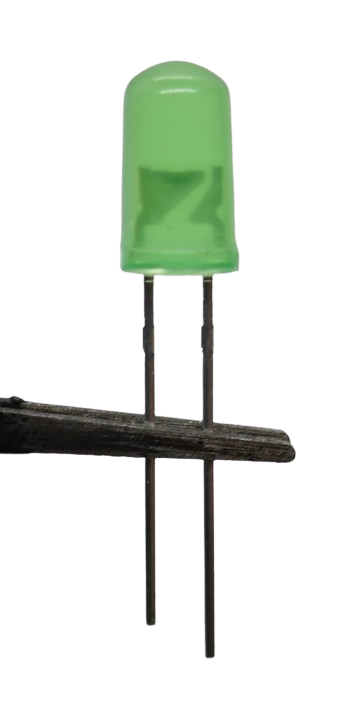
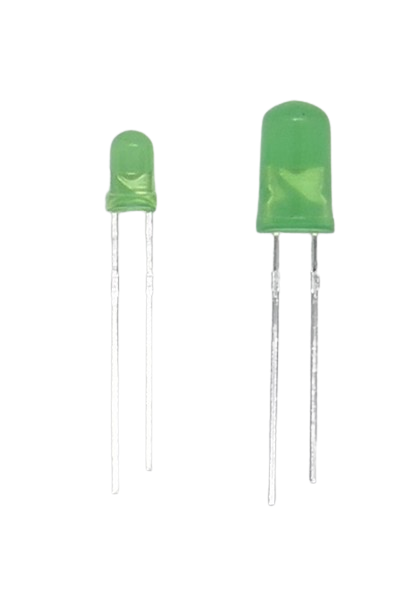

 
# LED (Light Emitting Diodes)

> LEDs Can Be Flexibly Shaped, Produce Light In Any Color Efficiently, Last Forever and Cost Little

**LED**s (*light emitting diodes*) are *semiconductors* that work like a *diode* yet their main feature is that they emit *light*.

Their conversion of electric power to *light* is so efficient that **LED** typically do not produce *heat* (very high powered **LED** still do): they are said to produce *cold light*.


## Rugged Yet Simple to Destroy

**LED** are *rugged* and last longer and are *more resilient* to *mechanical* stress than most other light sources. 

One pecularity makes them very *delicate and sensitive*, though: they have a *low internal resistance*. 

When you connect an **LED** directly to a power source, it will almost *instantly burn up*. The **LED** *low resistance* behaves similar to a wire or a *fuse* (which have a *low resistance*, too): 

When you *short-circuit* your power supply with them, for a fraction of a second a *huge current* flows and *heats up* and ultimately destroys both. The very same happens with **LED**. 

To operate **LED** safely, you must always *limit the current* that can flow through the **LED**. There are [many ways](Current) to *limit current*. In hobbyist projects, a simple *series resistor* is the most popular one.

## Identifying Anode and Cathode

Since **LED** are semiconductors and conduct current in one direction only, it is crucial to connect it to the correct *polarity*. The two *legs* of a **LED** are called *anode* (**+**) and *cathode* (**-**).

<details><summary>Forward Voltage, Reverse Voltage, and Breakdown Voltage</summary><br/>

Any material has a *breakdown voltage*: at this voltage, it becomes *conductive*. 

Semiconductors (like **LED**) have **two** *breakdown voltages*: the *forward voltage* is the *breakdown voltage* for the "normal" current that flows from **+** to **-** (in the *correct* or *intended* direction). *Reverse voltage* is the *breakdown voltage* when current flows the opposite direction.

When you connect a **LED** correctly to **+** and **-**, once the applied voltage exceeds the **LED** *forward voltage*, the **LED** starts to emit light. Typically, **LED** *forward voltages* are in the range of *1.6-4.0V*, depending on their *color* and the materials they were made of.

When you connect a **LED** *incorrectly* and accidentally *reverse polarity*, the **LED** acts like a *diode* and will not conduct. Since **LED** were never designed to be *diodes*, no effort was made to optimize their *reverse voltage*. Compared to *real diodes*, the *reverse voltage* for **LED** is *very low* and around **5V**.

So once the voltage of your *incorrectly connected power* exceeds **5V**, the **LED** starts to conduct but cannot utilize the power to produce light. The power instead is converted to *heat* and ultimatively destroys the **LED**.

When you use a current-limiting *series resistor* or some other means of *current limit*, you are protected against accidental *reverse voltage* as well: even though the voltage may exceed the *reverse voltage*, only a very small *current* flows which is not powerful enough to cause real damage. 
</details>

Let's examine different **LED** types and their "legs" next and correctly identify *anode* and *cathode*.

### Two Legs

Classic *indicator **LED*** have *two* "legs". The *longer* leg is the *anode* (**+**). 


> [!TIP]
> Since most **LED** are transparent, you can look *inside* the **LED**, too, to identify the *anode*. This is useful if the **LED** is already wired or its "legs" have been shortened or cut off otherwise.     
> Inside the **LED**, you see a *short* metal piece that is always connected to the *anode* (**+**). The much *wider* cup-shaped counterpart is connected to the *cathode* (**-**). 



### More Than Two Legs

**LED** with *more* than two legs serve special purposes. Here are some examples:

#### Multi-Color LED

These **LED** can be *bi-color* (three legs) or *RGB* (four legs). They always use a distinct physical **LED** per color inside.


The *longest* leg is the *common connection*: whether this is the *anode* (**+**) or *cathode* (**-**) depends on the particular **LED** type and construction. 

The remaining legs connect to the individual internal **LED**.

> [!WARNING]
> The **LED** specs like *current* and *forward voltage* are based on *color*, so in *bi-color* and *RGB* **LED**, each internal **LED** has *different* requirements and needs a different *series resistor*.

#### Programmable LED

*Smart* **LED** (like *WS2812*) have *four* or more legs and use an internal chip to drive the internal **LED**.


> [!TIP]
> *Smart* **LED** like the *WS2812* are *much easier* to use than regular **RGB LED**: you need to supply *only one voltage*, and the internal chip takes care of supplying the correct *current* to each individual **LED**. With *regular **RGB LED**, you need to use separate *series resistors* for *each color*.
> *Smart* **LED** can also be *daisy chained* which dramatically reduces the number of required *wires*. Since they are *digitally controlled*, a *microcontroller* is mandatory to operate them.

## Standard Hobbyist LEDs

Anyone in electronics has come across the classic standard LEDs that typically come in two diameters: 3mm and 5mm.



### Not Very Efficient

*Cheap standard indicator* **LED** are neither very bright nor very efficient: at *20mA*, they consume relatively *much* energy for relatively *low* light output. They are still very popular (and sufficient) for *indicator* purposes or just to play around and come in many colors:


### Calculating Series Resistor

For low power 3- or 5mm hobbyist **LED**, typically a *series resistor* is used for *current limiting*. It can be quickly calculated based on the well known **LED** *current* (20mA) and the typically well-known *forward voltages* (based on **LED** color).

> [!CAUTION]
> 
>
> The light color emitted by a **LED** is based on the materials used, and while the *current* is the same, the *forward voltage* differs considerably for each color. You need a *different series resistor* for each color. The suggested *series resistor* values below are *guesses* based on standard values. Always make sure you double-check with the data sheet and vendor information of *your* **LED**. Use at own risk.

I am using a small **PowerShell** script to calculate below values. The results show the suggested *series resistor* for a particular **LED** color and is calculated for an operating voltage of **5V**, **9V**, **12V**, and **24V**:

````
PS> 5,9,12,24  | Get-LedResistor -Color yellow, orange, red, green, blue, white | Format-Table -AutoSize

WARNING: LED Forward Voltage was guessed from color and can be completely different. Use at own risk.
Required Resistor (Ohm) Operating Voltage (V) Led Current (mA) Led Voltage (V) Led Color
----------------------- --------------------- ---------------- --------------- ---------
                   6250                     5               20             1.8 yellow   
                   6452                     5               20             1.9 orange   
                   6667                     5               20               2 red      
                   7692                     5               20             2.4 green    
                  10000                     5               20               3 blue     
                  11111                     5               20             3.2 white

  
                   2778                     9               20             1.8 yellow   
                   2817                     9               20             1.9 orange   
                   2857                     9               20               2 red      
                   3030                     9               20             2.4 green    
                   3333                     9               20               3 blue     
                   3448                     9               20             3.2 white    


                   1961                    12               20             1.8 yellow   
                   1980                    12               20             1.9 orange   
                   2000                    12               20               2 red      
                   2083                    12               20             2.4 green    
                   2222                    12               20               3 blue     
                   2273                    12               20             3.2 white    


                    901                    24               20             1.8 yellow   
                    905                    24               20             1.9 orange   
                    909                    24               20               2 red      
                    926                    24               20             2.4 green    
                    952                    24               20               3 blue     
                    962                    24               20             3.2 white    
````

> The table shows the values *for a particular shipment of these **LED*** that I received. They can serve as *rough estimates* but always make sure you check the data sheet or vendor information for *your* **LED** types.

<details><summary>PowerShell Script to calculate **LED** resistance values</summary><br/>

Here is the **PowerShell** script that was used above to calculate the **LED** *series resistor* values:

```powershell
function Get-LedResistor
{
  [CmdletBinding(DefaultParameterSetName='ForwardVoltage')]
  param
  (
    [Parameter(Mandatory,ValueFromPipeline)]
    [double]
    $OperatingVoltage,
    
    
    [Parameter(Mandatory,ParameterSetName='precise')]
    [double]
    $ForwardVoltage,
    
    [Parameter(Mandatory,ParameterSetName='guess')]
    [ValidateSet('yellow','orange','red','green','blue','white')]
    [string[]]
    $Color,
    
    [int]
    $Current = 20    
  )

  begin
  {
    $colorToVoltage = @{
      yellow = 1.8
      orange = 1.9
      red = 2.0
      green = 2.4
      blue = 3.0
      white = 3.2
    }
  }
  process
  {
    $Color | ForEach-Object {
      $curColor = $_
      if ($PSCmdlet.ParameterSetName -eq 'guess')
      {
        $ForwardVoltage = $colorToVoltage[$curColor]
      }
      else
      {
        $curColor = $colorToVoltage.GetEnumerator() | 
        Sort-Object { [Math]::Abs($_.Value - $ForwardVoltage)  } | 
        Select-Object -First 1 -ExpandProperty Key
      }
    
      $voltageDrop = $OperatingVoltage - $ForwardVoltage
      $resistance = $Current * 1000 / $voltageDrop
  
      [PSCustomObject]@{
        'Required Resistor (Ohm)' = $resistance -as [Int]
        'Operating Voltage (V)'   = $OperatingVoltage
        'Led Current (mA)'        = $Current
        'Led Voltage (V)'         = $ForwardVoltage
        'Led Color'               = $curColor
      }
    }
  }
  end
  {
    if ($PSCmdlet.ParameterSetName -eq 'guess')
    {
      Write-Warning "LED Forward Voltage was guessed from color and can be completely different. Use at own risk."
    }
  }
}
```

Run this script inside a **PowerShell** *console* or **IDE** like *Windows PowerShell ISE* or *VSCode* to define the new command `Get-LedResistor'.

Next, use the command inside the same PowerShell session like below. As you will see, **PowerShell** commands are *extremely powerful and versatile*, and this one new command can calculate one individual resistor as well as *a resistor table* for a *wide range of operating voltages*:

````
PS> Get-LedResistor -OperatingVoltage 3.3 -Color red -Current 10


Required Resistor (Ohm) : 7692
Operating Voltage (V)   : 3.3
Led Current (mA)        : 10
Led Voltage (V)         : 2
Led Color               : red

WARNING: LED Forward Voltage was guessed from color and can be completely different. Use at own risk.


PS> Get-LedResistor -OperatingVoltage 10 -Current 15 -ForwardVoltage 2.2


Required Resistor (Ohm) : 1923
Operating Voltage (V)   : 10
Led Current (mA)        : 15
Led Voltage (V)         : 2.2
Led Color               : green


PS> 3..24 | Get-LedResistor -Current 15 -Color blue | Select-Object -Property required*, *operat*

WARNING: LED Forward Voltage was guessed from color and can be completely different. Use at own risk.
Required Resistor (Ohm) Operating Voltage (V)
----------------------- ---------------------
                                            3
15000                                       4
7500                                        5
5000                                        6
3750                                        7
3000                                        8
2500                                        9
2143                                       10
1875                                       11
1667                                       12
1500                                       13
1364                                       14
1250                                       15
1154                                       16
1071                                       17
1000                                       18
938                                        19
882                                        20
833                                        21
789                                        22
750                                        23
714                                        24
````

</details>

### Wired and Preconfectioned LED

Occasionally you may come across *preconfectioned* **LED** that have already *wires* attached to them:


Hopefully, *wire color* lets you identify *anode* (red wire) and *cathode* (black wire). If not, above you learned a trick to identify the *anode* by looking *inside the **LED** head*.

Take a close look at the wire to check whether a *series resistor* was already added. In the picture above you see a *bulky shape* in the section of the *shrink tubing*. When a *series resistor* is already in place, then this **LED** is preconfigured for a given voltage. Often, preconfigured **LED** are ready-to-use in automotive areas (**12V**).

> [!TIP]
> If in doubt, take a bench power supply and set it to a safe minimum voltage like **1.5V**. Then connect the **LED** and slowly raise the voltage.
> If the **LED** does not emit light at above **3.8V** (and you haven't accidentally reversed polarity), then a *series resistor* must have obviously been added.

The picture shows already wired **LED**, and you can identify the *resistor* that was added to one leg of the **LED**. These **LEDs** were already tailored to work with a specific voltage.

*Indicator* **LED** exist in many different shapes and forms and can also be *square*, *clear* or *fogged*. They all work the same.


## Straw-Hat LED

*Straw-Hat* **LED** are characterized by their distinctive *shape* that resembles a *straw hat*. They use a built-in *lens* to increase the *viewing angle* which makes them especially suitable as *indicator light* or for decoration.


Otherwise, they work like regular **LED**.


## Piranha / SuperFlux LED

*Piranha* **LED** are small and compact square **LED** with a relatively large *light output*. They are also called *SuperFlux*.

### Anode and Cathode

These **LED** come with *four* legs, one at each side of the square.

Typically one side has two *holes*. The pins on this side are the *anodes* (**+**). The picture below shows both *a rounded edge* (on the left side) and the two *holes* (on the right side), even though both are a bit hard to identify on first look:


The *rounded edge* can also help to identify the pins: when viewed from *top* and turned so that the *round* corner is on the lower right, then the two pins at the bottom are the *cathodes*. The picture below shows both the *rounded edge* and the two *cathode* pins:


> [!TIP]
> Typically, both *anodes* and both *cathodes* are internally connected. You need to connect only *one* anode and cathode, and use only *one series resistor*.
> **High performance multi-chip LED** are different: they use *two* internal **LED** that are individually connected to one *anode* and *cathode* each. In this case, you need to connect all four legs. 

### Use Case

A frequent use case is in cars and other vehicles that need to robustly emit brighter light than *regular indicator* **LED** (i.e. for brake lights).


For added robustness, you can connect *anode* and *cathode* with two separate wires each.


They often use a lens to emit the light in all directions, similar to *straw hat* **LED**.


## Dual Color LED

This type of *indicator* **LED** has *three* "legs and *two* internal **LED** in different colors.

Dual color **LED** help save space: instead of i.e. using a separate *green* and a *red* **LED**, a *single* **LED** can indicate both states by changing color.


The *middle* pin serves either as *common anode* (**+**) or *common cathode* (**-**), depending on **LED** type. 

The other two pins connect to the respective internal **LED**, one per color. 

> [!TIP]
> You control both colors individually and can power them *individually* or *at the same time*, essentially *mixing* colors: the **LED** therefore can display *three* different colors.


> [!WARNING]
> The *current* requirements and *forward voltage* typically depends on **LED** *color*. Since both internal **LED** display *different* colors, their specs are different, too. You need different *series resistors* for the two internal **LED**.


## WS8212 Programmable LED

Sophisticated **LED Strips** often use *WS8212* **LED** that come with full RGB color, an internal controller chip *per LED*, and *four* legs.

These **LED** are available in many different form factors and can be used like *regular individual **LED*** as well.


Some vendors call this **LED** type *NeoPixel*.

### Advantages

Each *WS8212* **LED** can display the full *color spectrum* and works similar to *simple RGB* **LED**: internally *three* **LED** in *red*, *green*, and *blue* color can be mixed to produce all other colors.

Since *WS8212* **LED** come with a built-in **LED** driver chip, it is much easier to use these **LED** compared to *simple RGB* **LED**:

* **Uniform Voltage:** *WS8212* **LED** require *5V*. The different *voltages* and *currents* required by each of the three internal color **LED** is automatically adjusted by the internal driver chip.
* **Digital Control:** to display a given *color* and *brightness*, you send a *digital control signal* to the **LED**. There is no need to manually calculate and provide the individual *current* to each of the three **LED** to mix the desired *color* and *brightness*.
* **Daisy Chain:** *WS8212* **LED** can be daisy-chained which makes them especially suitable for **LED strips**. When daisy-chained, *each **LED*** can be controlled *individually*. This makes *WS8212* also very interesting for *individual indicator **LED***: you need just *one* GPIO pin to control an arbirary number of indicator **LED**.

> [!NOTE]
> *WS2812* **LED** need a digital control signal. They are a perfect choice for microcontroller projects. They cannot be used without one.

*WS8212* **LED** come with *four* legs or connectors:


### Individual LED Pins

For individual (non-SMD) *WS8212* **LED**, look at the *length* of the legs:

* **Two different lengths:** some **LED** come with legs in *two* different lengths: two legs are shorter than the other two.
* **Four different lengths:** typically, each leg has a different length.

#### Power Connection

The two *inner* legs are connected to the **5V** power supply. The *longer* leg is **GND**, the *shorter* leg is **+5V**.

#### Digital Connection

The two *outer* legs carry the *digital control signal*. The leg next to **V+** (*shorter* pin) is the digital *input* **DIN**. The leg on the other side (*longer* pin) is digital *output* **DOUT**.

Connect **DIN** to your microcontrollers' GPIO output, and connect **DOUT** to **DIN** of the next **LED** in the daisy chain.

> [!CAUTION]
> *WS8212* **LED** are **5V** devices. When you daisy chain multiple **LED**, they can draw *high currents*. Always connect the **V+** pin to a separate sufficiently strong **5V** power supply, and connect **GND** to the ground of your microcontroller (*common ground*).   
> The data pin can be driven directly from a GPIO pin. If you use a **3.3V** microcontroller like *ESP8266* or *ESP32*, the appropriate way is to use a *level shifter* to shift the GPIO *3.3V* to *5V*. If the connection between GPIO and *first* *WS8212* **LED** is short (<30cm), you typically get away with using the **3.3V** signal directly and without a *level shifter*.


> [!TIP]
> It is just important to get the digital control signal to the *first* **LED**. All subsequently daisy chained **LED** automatically pass on the digital signal using **5V**.
> If the distance between a **3.3V** microcontroller and the daisy chained *WS8212* **LED** is large (>30cm) and you don't have a *level shifter* at hand, a workaround is to use *one WS8212* close to the microcontroller. It then acts like a level shifter.

## High Performance LED (3W, Generic)

Whenever **LED** are to be used for *illumination*, a high light output is required. Cheap generic *3W* **LED** can be a solution. They typically use a *current* of *700mA*.

> [!WARNING]
> High performance LED require significant *currents*. Inefficient *series resistors* cannot be used for this type of **LED**, and also *constant voltage* power supplies are no good choice: due to heat, the internal resistance of these **LED** can change during operation.   
> With high performance LED, always use a *constant current* power supply that provides exactly the *current* these **LED** require.


While generic high performance **LED** are relatively cheap, they are not very *efficient* and produce much *heat*. They are typically mounted on an aluminum or copper **LED Star** board that serves as a *heat sink*. 

When you run these **LED** at their maximum specs, you most likely will need to add extensive additional *heat sinks*.

> [!TIP]
> The best way to use this type of **LED** is to drive them in the middle range and not close to their maximum *current*. **LED** rated at a maximum current of *700mA* should be used at *200-300mA*. This produces already a lot of light but without the immense heat and need for expensive heat sinks.


## High Performance Quality LED (3-5W, Cree)

If you are really after *huge light emission*, investing in high performance **LED** from renown manufacturers like *Cree* is a wise decision.

These **LED** are much more efficient: less energy is wasted as *heat* (and needs to be dissipated by *heat sinks*). At the same time, these **LED** produce *much more light* than their cheap generic counterparts.

Depending on type and color, *Cree* **LED** typically have a maximum current of *700mA-2.000mA*.


Typically, these **LED** are mounted to metal *LED Stars* available in various diameters: even though *Cree* **LED** are relatively *efficient*, when run close to their maximum *current* they do produce significant *heat* and cannot be run without a proper heat sink.


<sup><sub>Always make sure you use a proper heat sink or even active cooling for high performance **LED**</sub></sup>

> [!TIP]
> Like with generic high performance **LED**, running **LED** at considerably less current (i.e. half of their maximum) than their maximum ratings can reduce heat problems while still emitting massively bright light.


## High Performance RGB LED

There are high performance *RGB Cree* **LED** available. They use *three* or *four* individual **LED** internally (*RGB* or *RGBW*).


Each individual internal **LED** has a maximum current of *1.000mA* While you *could* run each of these internal **LED** at maximum current simultaneously (*4.000mA/10W*), this would produce severe *heat sink* challenges.

### Enough Reserve For Uniform Brightness 

Rather, each *color* is capable of outputting the maximum light which allows homogenous light emission for the entire color spectrum. 

Regardless of whether you emit pure *red* light (by using just the *red* **LED** at maximum current), or mix a *yellow* color (by running *green* and *red* at half the maximum current), the overall light emission is constant for *any color*.


## COB LED

*COB* (*Chip On Board*) **LED** mount *multiple LED chips* directly onto a substrate or circuit board, typically in the form of a single module.


Multiple **LED** chips are arranged closely together and covered with a phosphor coating or resin to enhance light output and color uniformity. They typically come on aluminum modules.

*COB* **LED** are simpler to manufacture and cheaper. The close proximity of multiple **LED** on a common substrate yields a high *light output*, allows for various shapes and forms and provides a good *heat dissipation*.


> [!NOTE]
> *COB* **LED** often consist of many individual **LED** connected in series and/or in parallel. This allows for a large illuminated area, and depending on the way the individual **LED** are internally connected, almost any *total forward voltage* desired.
> *COB modules* often can be connected directly to **12-13V** in *car appliances*.


> Tags: LED, Light, Anode, Cathode

:eye:&nbsp;[Visit Page on Website](https://done.land/components/light/led?198478031411241041) - last edited 2024-03-11
