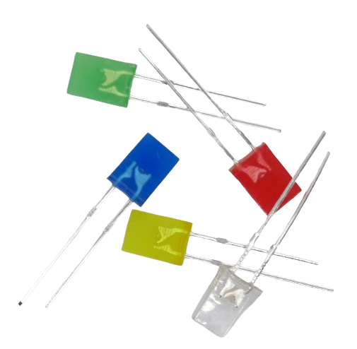
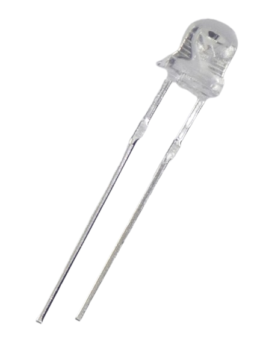
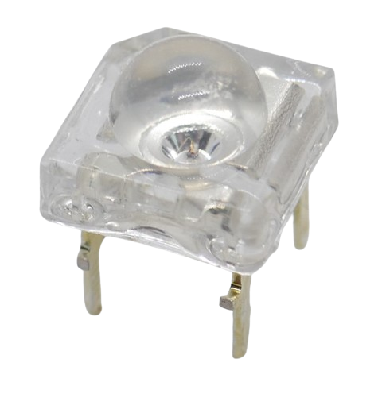
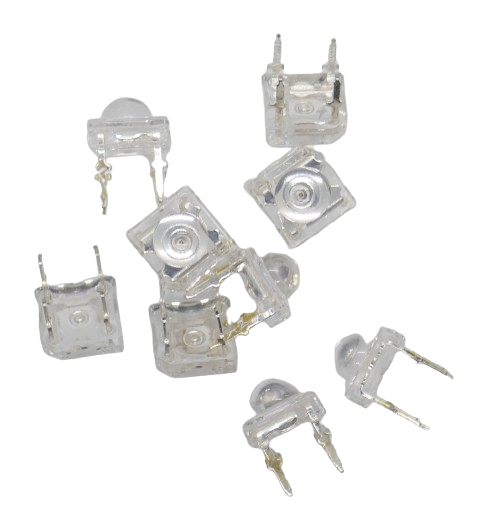
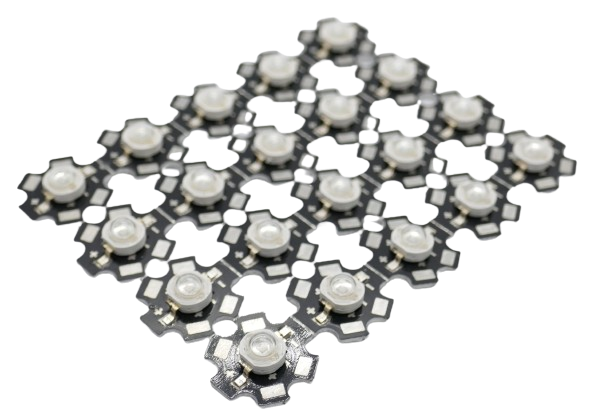

 
# LED (Light Emitting Diodes)

> LEDs Can Be Flexibly Shaped, Produce Light In Any Color Efficiently, Last Forever and Cost Very Little

**LED**s (*light emitting diodes*) are *semiconductors* that work like a *diode* but emit *light*.

Their conversion of electric power to *light* is so efficient that **LED** typically do not produce *heat* (very high powered **LED** still do): they are said to produce *cold light*.

## Rugged Yet Simple to Destroy

**LED** are *rugged* and last longer and are *more resilient* to *mechanical* stress than most other light sources. 

One pecularity makes them very *delicate and sensitive*, though: they have a *low internal resistance*. When you connect **LED** directly to a power source can *instantly destroy* them. The **LED** *low resistance* behaves like a wire that you use to *short-circuit* your power supply: for a fraction of a second, a *huge current* flows and causes your **LED** to burn up, almost like a *fuse*.

**You must always limit the *current* that you supply to a LED**. 

[Read more here](Current) to find out *how* you can safely control the **LED** *current* and *calculate the resistance* for a *series resistor*. You'll also learn more on using *constant voltage* or *constant current* to drive single **LED** as well as **LED Strips**.

## Identifying Anode and Cathode

It is important to connect **+** and **-** to the correct "legs" of the **LED**. 

> [!NOTE]
> **LED** are *diodes* so *current* can flow in just one direction. When you accidentally connect the **LED** legs to the wrong polarity, the **LED** won't emit light. Worse though, **LED** have a very low *reverse voltage* of just *5V*. If you apply a voltage in *wrong polarity* to a **LED** that is above *5V*, you can *destroy it*.
> Most often, though, connecting the wrong polarity to a **LED** is not doing permanent harm because **LED** are used with some sort of *current limiting* (as discussed elsewhere). Just never try and use **LED** as a *real diode replacement*.

### Two Legs

The *longer* leg is the *anode* (**+**). 

> [!TIP]
> You can identify the *anode* even when **LEDs** are already *wired* or the "legs" have been cut and shortened.       
> Look inside the **LED** head: you'll identify a *wider* metal part, and a relatively *short* pin. The *short* pin is connected to the *anode* (**+**), and the wider *triangle*-like part is connected to the *cathode* (**-** or **GND**)

### More Legs

**LED** with *more* than two legs serve special purposes and use *multiple* internal **LED**. 

#### Simple Multi-Color

These **LED** can be *bi-color* (three legs) or *RGB* (four legs). They always use a distinct physical **LED** per color inside.

The *longest* leg is the *common connection*: whether this is the *anode* (**+**) or *cathode* (**-**) depends on the particular **LED** type and construction. 

The remaining legs connect to the individual internal **LED**.

> [!WARNING]
> The **LED** specs like *current* and *forward voltage* are based on *color*, so in *bi-color* and *RGB* **LED**, each internal **LED** has *different* requirements and needs a different *series resistor*.

#### Programmable

*Smart* **LED** (like WS2812) have *four* or more legs and use an internal chip to drive the internal **LED**.

Consult the data sheet to identify the pins and their purpose.

## Standard Hobbyist LEDs

Anyone in electronics has come across the classic standard LEDs that typically come in two diameters: 3mm and 5mm:

The picture shows already wired **LED**, and you can identify the *resistor* that was added to one leg of the **LED**. These **LEDs** were already tailored to work with a specific voltage.

*Indicator* **LED** exist in many different shapes and forms and can also be *square*, *clear* or *fogged*. They all work the same.

## Straw-Hat LED

*Straw-Hat* **LED** are characterized by their distinctive *shape* that resembles a *straw hat*. They use a built-in *lens* to increase the *viewing angle* which makes them especially suitable as *indicator light* or for decoration.

Otherwise, they work like regular **LED**.

## Piranha / SuperFlux LED

*Piranha* **LED** are small and compact square **LED** with a relatively large *light output*. They are also called *SuperFlux*.

### Anode and Cathode

These **LED** come with *four* legs, one at each side of the square.

Typically one side has two *holes*. The pins on this side are the *anodes* (**+**).

One corner of the square can also be *rounded*. When viewed from *top* and turned so that the *round* corner is on the lower right, then the two pins at the bottom are the *cathodes*.

> [!TIP]
> Typically, both *anodes* and both *cathodes* are internally connected. You need to connect only *one* anode and cathode, and use only *one series resistor*.
> **High performance multi-chip LED** are different: they use *two* internal **LED** that are individually connected to one *anode* and *cathode* each. In this case, you need to connect all four legs. 

### Use Case

A frequent use case is in cars and other vehicles that need to robustly emit brighter light than *regular indicator* **LED** (i.e. for brake lights).

For added robustness, you can connect *anode* and *cathode* with two separate wires each.

They often use a lens to emit the light in all directions, similar to *straw hat* **LED**.

## Dual Color LED

This type of *indicator* **LED** has *three* "legs and *two* internal **LED** in different colors.

Dual color **LED** help save space: instead of i.e. using a separate *green* and a *red* **LED**, a *single* **LED** can indicate both states by changing color.

The *middle* pin serves either as *common anode* (**+**) or *common cathode* (**-**), depending on **LED** type. 

The other two pins connect to the respective internal **LED**, one per color. 

> [!TIP]
> You control both colors individually and can power them *individually* or *at the same time*, essentially *mixing* colors: the **LED** therefore can display *three* different colors.

> [!WARNING]
> The *current* requirements and *forward voltage* typically depends on **LED** *color*. Since both internal **LED** display *different* colors, their specs are different, too. You need different *series resistors* for the two internal **LED**.

## WS8212 Programmable LED

Sophisticated **LED Strips** often use *WS8212* **LED** that come with full RGB color, an internal controller chip *per LED*, and *four* legs.

These **LED** are available in many different form factors and can be used like *regular individual **LED*** as well.

Some vendors call this **LED** type *NeoPixel*.

### Advantages

Each *WS8212* **LED** can display the full *color spectrum* and works similar to *simple RGB* **LED**: internally *three* **LED** in *red*, *green*, and *blue* color can be mixed to produce all other colors.

Since *WS8212* **LED** come with a built-in **LED** driver chip, it is much easier to use these **LED** compared to *simple RGB* **LED**:

* **Uniform Voltage:** *WS8212* **LED** require *5V*. The different *voltages* and *currents* required by each of the three internal color **LED** is automatically adjusted by the internal driver chip.
* **Digital Control:** to display a given *color* and *brightness*, you send a *digital control signal* to the **LED**. There is no need to manually calculate and provide the individual *current* to each of the three **LED** to mix the desired *color* and *brightness*.
* **Daisy Chain:** *WS8212* **LED** can be daisy-chained which makes them especially suitable for **LED strips**. When daisy-chained, *each **LED*** can be controlled *individually*. This makes *WS8212* also very interesting for *individual indicator **LED***: you need just *one* GPIO pin to control an arbirary number of indicator **LED**.

> [!NOTE]
> *WS2812* **LED** need a digital control signal. They are a perfect choice for microcontroller projects. They cannot be used without one.

*WS8212* **LED** come with *four* legs or connectors:

### Individual LED Pins

For individual (non-SMD) *WS8212* **LED**, look at the *length* of the legs:

* **Two different lengths:** some **LED** come with legs in *two* different lengths: two legs are shorter than the other two.
* **Four different lengths:** typically, each leg has a different length.

#### Power Connection

The two *inner* legs are connected to the **5V** power supply. The *longer* leg is **GND**, the *shorter* leg is **+5V**.

#### Digital Connection

The two *outer* legs carry the *digital control signal*. The leg next to **V+** (*shorter* pin) is the digital *input* **DIN**. The leg on the other side (*longer* pin) is digital *output* **DOUT**.

Connect **DIN** to your microcontrollers' GPIO output, and connect **DOUT** to **DIN** of the next **LED** in the daisy chain.

> [!CAUTION]
> *WS8212* **LED** are **5V** devices. When you daisy chain multiple **LED**, they can draw *high currents*. Always connect the **V+** pin to a separate sufficiently strong **5V** power supply, and connect **GND** to the ground of your microcontroller (*common ground*).   
> The data pin can be driven directly from a GPIO pin. If you use a **3.3V** microcontroller like *ESP8266* or *ESP32*, the appropriate way is to use a *level shifter* to shift the GPIO *3.3V* to *5V*. If the connection between GPIO and *first* *WS8212* **LED** is short (<30cm), you typically get away with using the **3.3V** signal directly and without a *level shifter*.

> [!TIP]
> It is just important to get the digital control signal to the *first* **LED**. All subsequently daisy chained **LED** automatically pass on the digital signal using **5V**.
> If the distance between a **3.3V** microcontroller and the daisy chained *WS8212* **LED** is large (>30cm) and you don't have a *level shifter* at hand, a workaround is to use *one WS8212* close to the microcontroller. It then acts like a level shifter.

## High Performance LED (3W, Generic)

Whenever **LED** are to be used for *illumination*, a high light output is required. Cheap generic *3W* **LED** can be a solution. They typically use a *current* of *700mA*.

> [!WARNING]
> High performance LED require significant *currents*. Inefficient *series resistors* cannot be used for this type of **LED**, and also *constant voltage* power supplies are no good choice: due to heat, the internal resistance of these **LED** can change during operation.   
> With high performance LED, always use a *constant current* power supply that provides exactly the *current* these **LED** require.

While generic high performance **LED** are relatively cheap, they are not very *efficient* and produce much *heat*. They are typically mounted on an aluminum or copper **LED Star** board that serves as a *heat sink*. 

When you run these **LED** at their maximum specs, you most likely will need to add extensive additional *heat sinks*.

> [!TIP]
> The best way to use this type of **LED** is to drive them in the middle range and not close to their maximum *current*. **LED** rated at a maximum current of *700mA* should be used at *200-300mA*. This produces already a lot of light but without the immense heat and need for expensive heat sinks.

## High Performance Quality LED (3-5W, Cree)

If you are really after *huge light emission*, investing in high performance **LED** from renown manufacturers like *Cree* is a wise decision.

These **LED** are much more efficient: less energy is wasted as *heat* (and needs to be dissipated by *heat sinks*). At the same time, these **LED** produce *much more light* than their cheap generic counterparts.

Depending on type and color, *Cree* **LED** typically have a maximum current of *700mA-2.000mA*.

Typically, these **LED** are mounted to metal *LED Stars* available in various diameters: even though *Cree* **LED** are relatively *efficient*, when run close to their maximum *current* they do produce significant *heat* and cannot be run without a proper heat sink.

> [!TIP]
> Like with generic high performance **LED**, running **LED** at considerably less current (i.e. half of their maximum) than their maximum ratings can reduce heat problems while still emitting massively bright light.

## High Performance RGB LED

There are high performance *RGB Cree* **LED** available. They use *three* or *four* individual **LED** internally (*RGB* or *RGBW*).

Each individual internal **LED** has a maximum current of *1.000mA* While you *could* run each of these internal **LED** at maximum current simultaneously (*4.000mA/10W*), this would produce severe *heat sink* challenges.

### Enough Reserve For Uniform Brightness 

Rather, each *color* is capable of outputting the maximum light which allows homogenous light emission for the entire color spectrum. 

Regardless of whether you emit pure *red* light (by using just the *red* **LED** at maximum current), or mix a *yellow* color (by running *green* and *red* at half the maximum current), the overall light emission is constant for *any color*.

## COB LED

*COB* (*Chip On Board*) **LED** mount *multiple LED chips* directly onto a substrate or circuit board, typically in the form of a single module.

Multiple **LED** chips are arranged closely together and covered with a phosphor coating or resin to enhance light output and color uniformity. They typically come on aluminum modules.

*COB* **LED** are simpler to manufacture and cheaper. The close proximity of multiple **LED** on a common substrate yields a high *light output*, allows for various shapes and forms and provides a good *heat dissipation*.

> [!NOTE]
> *COB* **LED** often consist of many individual **LED** connected in series and/or in parallel. This allows for a large illuminated area, and depending on the way the individual **LED** are internally connected, almost any *total forward voltage* desired.
> *COB modules* often can be connected directly to **12-13V** in *car appliances*.

> Tags: LED, Light, Anode, Cathode

:eye:&nbsp;[Visit Page on Website](https://done.land/components/light/led?198478031411241041) - last edited 2024-03-11
