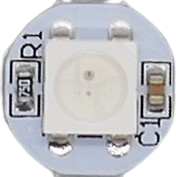

 
# LED (Light Emitting Diodes)

> LEDs Can Be Flexibly Shaped, Produce Light In Any Color Efficiently, Last Forever and Cost Little

**LED**s (*light emitting diodes*) are *semiconductors* that work like a *diode* yet their main feature is that they emit *light*.

Their conversion of electric power to *light* is so efficient that **LED** typically do not produce *heat* (very high powered **LED** still do): they are said to produce *cold light*.

## Rugged Yet Simple to Destroy

**LED** are *rugged* and last longer and are *more resilient* to *mechanical* stress than most other light sources. 

### Low Internal Resistance

One pecularity makes them very *delicate and sensitive*, though: they have a *low internal resistance*. 

When you connect an **LED** directly to a power source, it will almost *instantly burn up*. The **LED** *low resistance* behaves similar to a wire or a *fuse* (which have a *low resistance*, too): 

When you *short-circuit* your power supply with them, for a fraction of a second a *huge current* flows and *heats up* and ultimately destroys both. The very same happens with **LED**. 

### Always Control Current

To operate **LED** safely, you must always *limit the current* that can flow through the **LED**. There are [many ways](Current) to *limit current*. In hobbyist projects, a simple *series resistor* is the most popular one.

## Identifying Anode and Cathode

Since **LED** are semiconductors and conduct current in one direction only, it is crucial to connect it to the correct *polarity*. The two *legs* of a **LED** are called *anode* (**+**) and *cathode* (**-**).

Forward Voltage, Reverse Voltage, and Breakdown Voltage
 

Any material has a *breakdown voltage*: at this voltage, it becomes *conductive*. 

Semiconductors (like **LED**) have **two** *breakdown voltages*: the *forward voltage* is the *breakdown voltage* for the "normal" current that flows from **+** to **-** (in the *correct* or *intended* direction). *Reverse voltage* is the *breakdown voltage* when current flows the opposite direction.

When you connect a **LED** correctly to **+** and **-**, once the applied voltage exceeds the **LED** *forward voltage*, the **LED** starts to emit light. Typically, **LED** *forward voltages* are in the range of *1.6-4.0V*, depending on their *color* and the materials they were made of.

When you connect a **LED** *incorrectly* and accidentally *reverse polarity*, the **LED** acts like a *diode* and will not conduct. Since **LED** were never designed to be *diodes*, no effort was made to optimize their *reverse voltage*. Compared to *real diodes*, the *reverse voltage* for **LED** is *very low* and around **5V**.

So once the voltage of your *incorrectly connected power* exceeds **5V**, the **LED** starts to conduct but cannot utilize the power to produce light. The power instead is converted to *heat* and ultimatively destroys the **LED**.

When you use a current-limiting *series resistor* or some other means of *current limit*, you are protected against accidental *reverse voltage* as well: even though the voltage may exceed the *reverse voltage*, only a very small *current* flows which is not powerful enough to cause real damage. 

## Standard Indicator LEDs

[Indicator LED](Classic%20Indicator%20LED) are *cheap* and *simple to use*. Many hobbyist projects use these.

## Straw-Hat LED

[Straw Hat](Straw%20Hat) **LED** have a shape resembling a *straw hat*, partially because they feature a built-in *lens* for a wide *viewing angle*.

## Piranha / SuperFlux LED

[Piranha](Piranha%20SuperFlux) **LED** are small and compact *square* **LED** with a relatively large *light output* with *four* pins (instead of *two*). They are also known as *SuperFlux*.

## Dual Color LED

[Dual color](Dual%20Color) **LED** are really just *two-in-one* **LED** that internally consist of two regular **LED** in different colors. They are perfect for *indicating* two different states, i.e. *funtional* (green) and *error* (red).

## RGB Color LED

[RGB](RGB) **LED** can produce *any color*: three internal **LED** in *red*, *green* and *blue* mix any other color.

## Programmable LED

Once **LED** consist of more than one *color*, they become difficult to operate: each internal color **LED** has its own specific *forward voltage* and needs its own specific *voltage*.

Worse, **LED** *strip* multiply this effort: *each* of the *three* color **LED** in *each* of the connected **RGB LED** need to be carefully wired.

[Programmable](Programmable) **RGB LED** come to the rescue by adding a tiny chip to *each programmable **RGB LED***. Both *color mixing* and *current control* is managed by this chip. It is controlled by just one *data pin* that can be *daisy chained* to string up any number of *programmable **RGB LED***.

Most commonly, the **LED** controllers are *embedded* in **SMD LED** like the type *5050* in the picture above.

> [!NOTE]
> *Programmable* **LED** are comprised of a **LED** and a *controller chip*. From the outside, you can only see the **LED**. This is why *regular* **SMD LED** are *indistinguishable* on first sight from *programmable* **SMD LED**. 

The **LED** *controller* chip can essentially be embedded in *any* **LED** and are not restricted to **LED strips**. They are i.e. also available as *single discrete* **LED***. 

## SMD LED

[SMD](SMD) (*surface mounted device*) **LED** are a special form factor and suitable for *direct mounting* (soldering) to *PCB*. This *SMD* form factor is available for any of the discussed **LED** types:

You get *SMD* versions of *single color*, *RGB*, and *programmable* **LED**.

## 3W High Performance LED (Generic)

**LED** can be used for **illumination**, too. These [high performance **LED**](High%20Performance) turn *much higher currents* into *light* than the typical *10-20mA* used by simple *indicator* **LED**.

## COB LED

With *dual color* and *RGB* **LED**, you have seen *multiple individual **LED*** blended together. [COB (*Chip On Board*)](COB) takes this a step further and mounts a large number of **LED** directly onto a substrate or circuit board. 

The result are large surfaces of any shape or area, a *cheap* production method and very much homogenous *light output*.

> [!NOTE]
> The many different **LED** on a *COB* are partially connected in series and partially connected in parallel to design a particular desired *total forward voltage*.
They often can be connected directly to voltages like **12-13V** without the need of *series resistors* or *constant voltage*/*constant current* power supplies.

## LED Matrix Displays

Multiple **LED** are combined in *7-Segment* displays. They are commonly used to display numeric information.

Dedicated *controller IC* make it simple to drive these displays via *I2C* or similar interfaces.

> Tags: LED, Light, Anode, Cathode, RGB, Neopixel, WS2812, COB, Piranha, Superflux, Straw Hat, Matrix, 7-Segment, Forward Voltage, Reverse Voltage, Breakdown Voltage

[Visit Page on Website](https://done.land/components/light/led?198478031411241041) - created 2024-03-17 - last edited 2024-03-25
