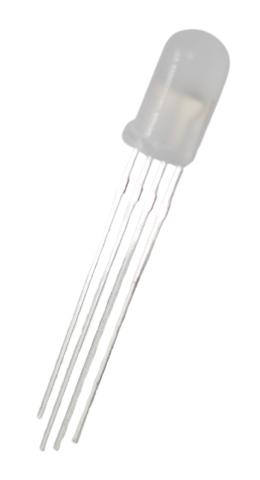

 
# RGB LED

> Mix Any Color: Red, Green And Blue LED Combined Provide A Universal Color LED

*RGB* **LED** contain at minimum three separate **LED** in the colors *red*, *green*, and *blue*. In addition, *cold white* and *warm white* **LED** can be added to provide more levels of *brightness* and *contrast*.

> [!NOTE]
> Please do not confuse **RGB LED** with *programmable **RGB LED***. Simple **RGB LED** (as discussed here) are often used in *cheap* **LED** *strips*: they can change color, but they can change the color only for the entire strip.   
> *Programmable **RGB LED*** come with a built-in chip *per LED*. They are more expensive but can be individually controlled. Each *programmable **RGB LED*** can have its *individual color* and *brightness*.

## Identifying Anode and Cathode

Classic **RGB LED** have *four* pins: a *common ground*, and *three* pins for the *three individual **LED***.

* **Common Cathode (-):** the *longest* pin is the *common cathode* (**-**).
* **Red:** On one side of the *common cathode*, there is only *one* pin. That's the *anode* for the *red* **LED**
* **Green and Blue:** on the other side of the *common cathode*, there are *two* pins: first the *anode* for *green*, then for *blue*

Be careful:

* **Do not confuse LED type:** *programmable* **RGB LED** *also* come with *four* pins, however they are completely different: two supply power, one is the *digital input*, and the other one serves as *digital output* to daisy-chain the signal to other *programmable* **RGB LED** in that string.
* **You are responsible:** In *classic* **RGB**, *you* are *solely responsible* for providing the correct *current* to each individual color **LED**. Each *color* has a different *forward voltage* and needs a different *series resistor*. If you want to connect multiple **RGB LED**, it's therefore much easier to use a *constant current* power supply. In *programmable* **RGB LED**, the built-in chip takes care of current control, and you just submit **5V**, **12V** or **24V** to the **LED** (depending on type).

> Tags: LED, Light, Anode, Cathode, RGB, Common Cathode

[Visit Page on Website](https://done.land/components/light/led/rgb?698156031318243445) - created 2024-03-03 - last edited 2024-03-18
