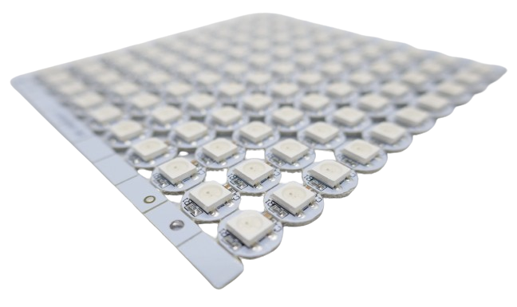
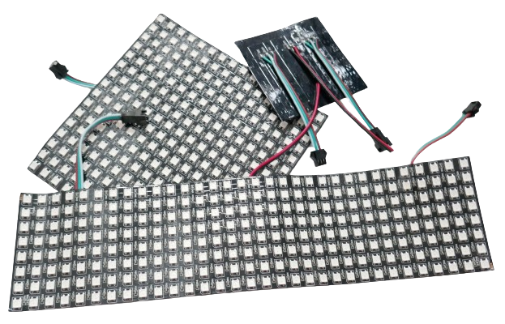
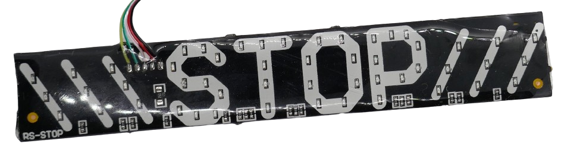
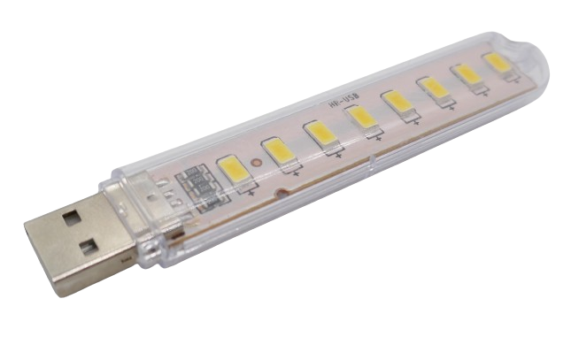
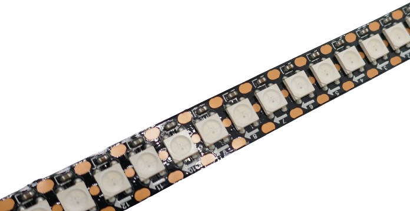

 
# SMD LED

> Designed To Be Directly Soldered To PCB And Optionally With Embedded LED Controller

**SMD LED** (*surface mounted device*) have no "legs": they come in a square or rectangular housing with *soldering pads*, ready to be mounted to *PBC* or other materials.

This design is commonly found in **LED strips** and *matrix displays*, but **SMD LED** are also available separately or mounted to individual *PCB*.

## Form Factors

**SMD LED** are classified using a four-digit-code. The code is the *size* of the **LED**. 

Here are the most common **SMD LED** types and their sizes:

* **5050:** the most common type in **LED strips* measures *5.0x5.0mm*
* **3535:** for narrower **LED strips*, the *3535* is used and measures just *3.5x3.5mm*. At this size it still has roughly the same capabilities like the *5050*
* **2020:** if *size* is crucial, the *2020* needs only *2.0x2.0mm*. This miniaturization starts to impact performance, and *light emission* is typically less (around *half*) compared to *3535* and *5050*.

> [!NOTE]
> There are *many more sizes and types*. The three mentioned are the most common types. *5050* **SMD LED** are most commonly found on *stripes* and *matrix displays*.   

## Simple LED

Simple **SMD LED** do not contain any control logic. They are regular **LED**, just without "legs" and instead with contacts that can be directly soldered to a PCB.

Often, they can be found on *breakout boards* as simple *indicators*. They may as well be used in *static displays* where neither the *color* nor the *pattern* changes:

They are also used in **LED** lamp bulbs and lights:

## LED Type

The *form factor* (like *5050*) does not tell what *kind* of **LED** is inside, nor does it tell you whether an additional **LED** *controller* is embedded, or not.

Most often, though, they contain *three* or *four distinct* **LED** substrates.

### Various Color Options

These separated *substrates* act like individual **LED**. Vendors can create *very bright single colors* (by using the *same* color for all compartments), *selectable warm, natural, and/or cold white* (by using different *white* substrates), *RGB* (by using *red*, *green*, and *blue* substrates), and *RGBW* (by adding *white* to *red*, *green* and *blue*).

> [!CAUTION]
> Since **SMD LED** *types* (like *5050*) just define a *form factor*, this does not guarantee any specs or assures any performance. Quality, *color stability*, and *brightness* all depend on the specific vendor and the **LED** substrates that were used inside.   
> Most vendors produce **SMD LED** with very similar specs, though. Should you be looking for exceptional above average performance, then ask the vendor for the *datasheet* so you can look up how well the built-in **LED**s perform.

### Various Controller Options

Aside from the particular **LED** *substrates*, these **LED** often also embed a **LED** controller, turning the **SMD LED** into a *programmable* **SMD LED**.

> [!NOTE]
> *Cheap* **RGB Stripes** use **RGB LED** without an individual controller. The entire *stripe* is controlled by one main controller instead, and the stripe can change its color, but only in its entity.   
> More sophisticated (and expensive) stripes use **SMD LED** with an embedded controller (such as the *WS2812* or similar): each **LED** can now be individually controlled and is able to play *animations* or illuminate sophisticated *light scenes*.

> Tags: LED, SMD, 5050, 3535, 2020

[Visit Page on Website](https://done.land/components/light/led/smd?892194032020245813) - created 2024-03-20
