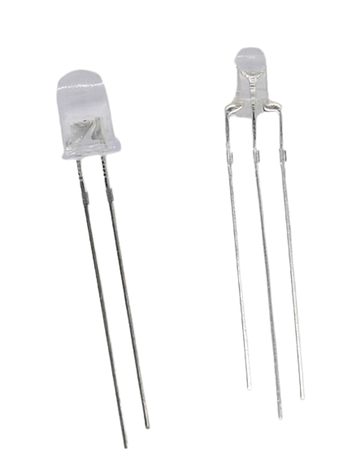
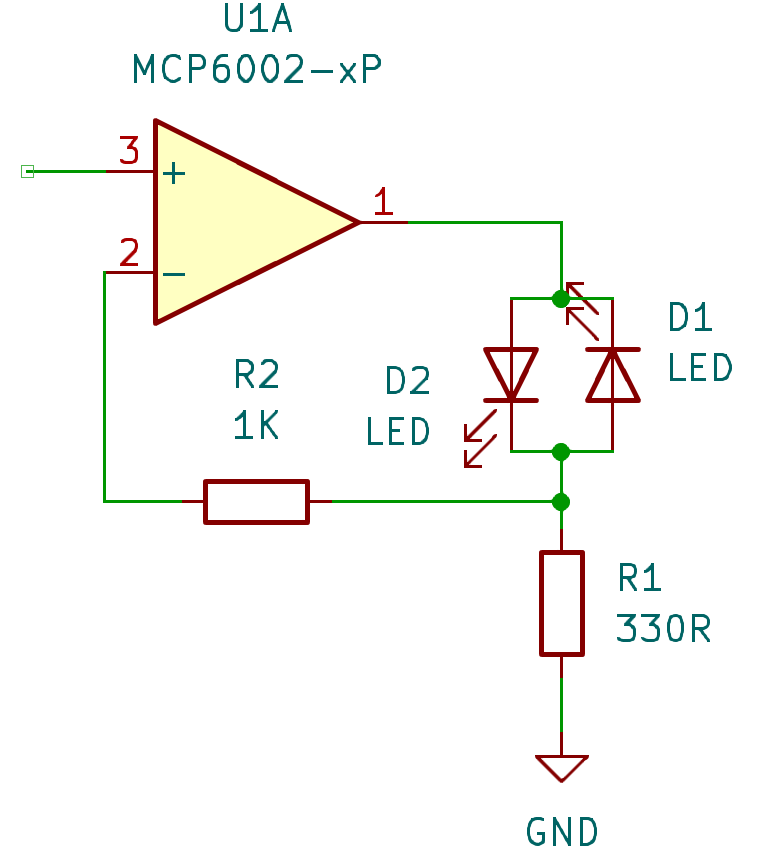
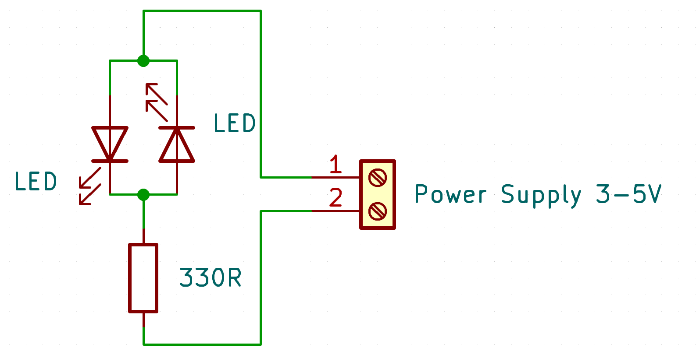
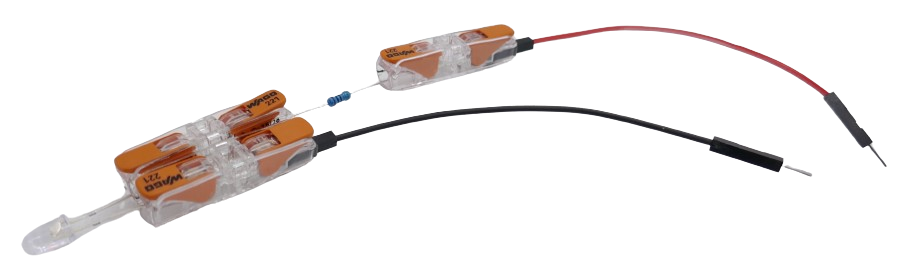
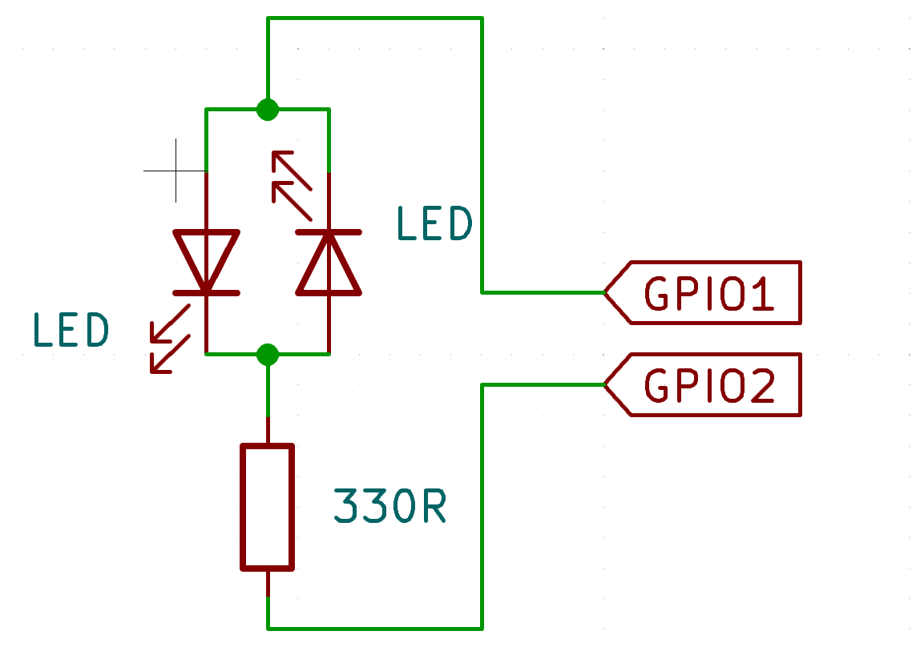
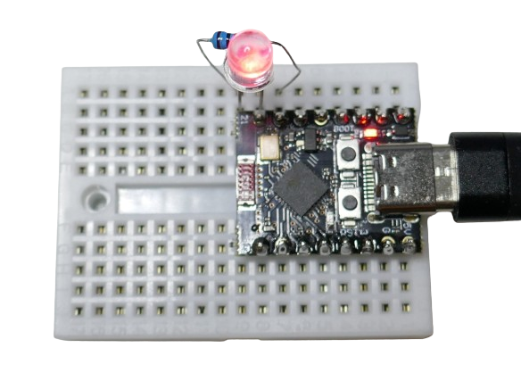
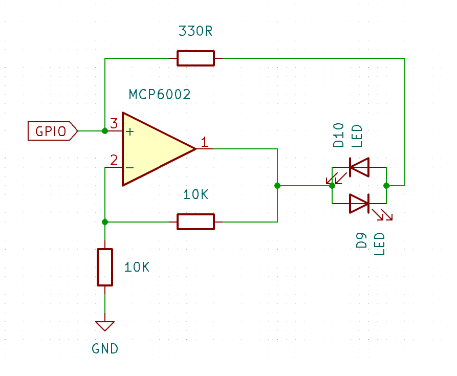

 

# Bipolar Bicolor LED

> Using A Single Bipolar LED To Signal State Of GPIO

*Bipolar LEDs* are really *two* LED in one housing, mounted in opposite direction: depending on the polarity you apply to its *two* legs, either one of the internal *LEDs* lightens up.

The image below shows the *bi-polar LED* on the left side: it has *two* legs and is indistinguishable from a regular *LED*.



Alternatively, *bi-color LED* with *three legs* exist (on the right side in above image). These are *not bi-polar*. Instead, such *LED* have a *common anode* or *cathode* (middle pin), and each of the two internal *LED* exposes a separate pin.

* **Bi-Polar:** color is controlled by *polarity*. Only *one* of the two internal *LED* can be on at any given time.
* **Three-Leg:** each internal *LED* can be powered individually, and both *LED* can be *on* at the same time, producing a mixed *third* color if desired.

In this article, I am looking at *bi-polar LED*.

### Challenges

Since *bi-polar LED* require reversed polarities, they are typically used in circuitry with *bipolar power supply* (*dual-supply*), or with *AC* (such as audio appliances).

Most DIY circuits are *single supply* (with a power supply ranging from a positive voltage to *GND*, and no negative voltages, i.e. *battery* or *USB* operated). This can make using *bi-polar LEDs* more complex.

#### Dual-Supply Circuits

In *dual-supply* scenarios (i.e. audio devices with positive **and** negative voltages), *bipolar LEDs* just require a single *OpAmp* to reverse the voltage as needed, and probably the only even simpler approach would be using [two separate LEDs](https://done.land/components/light/led/signalleds/bi-colorsignals/twoseparateled).

Here is the basic schematic:


* **High:** the *OpAmp* outputs a *positive* voltage
* **Low:** the *OpAmp* outputs close to *0V* (*GND*)


    

However, this approach will not work with a *single power supply* (one that goes from *GND* to a positive voltage). It would require a *positive* **and** a *negative* voltage, enabling the *OpAmp* to produce the negative voltage difference required to drive the other *LED* inside the *bipolar LED*.


## Testing Bi-Polar LED With Single-Supply

To better understand how *bi-polar LED* really work, let's test some *bi-polar LEDs*.

### Manual Powering

Here is the fundamental circuitry: the *bi-polar LED* is really a package of *two LED* in opposite direction. Like any other *LED*, they need a current-limiting resistor, i.e. *330R*.

The actual resistor value depends on the type of *LED* and the voltage you want to supply, yet a *330R* resistor should at least produce a visible light emission both for *3.3V* and *5V* power supply. You can then measure the currents, and adjust the resistor value so that the *LED* has the brightness you want.





Either use a breadboard, or simply connect the current limiting resistor to either leg of the *bi-polar LED*.



When you supply power to the circuit, one of the two *LED* lights up. Once you *reverse* the polarity of supplied power, the *other LED* lights up in a different color.

### Fine Tuning
When I tested the *bi-polar LED* with *3.3V* and the conservative *330R* resistor, the emitted light was a bit dim. The measured current was *4.8mA* for *red* and *3.8mA* for *green*. 

The vendor claimed a forward voltage of *1.8V* for *red* and *2.2V* for *green*, and a maximum current of *20mA* each. Calculating the current limiting resistor with these values yields this result:

````
PS> Get-LedResistor -ForwardVoltage 1.8 -Current 20 -OperatingVoltage 3.3


Required Resistor (Ohm) : 75
Operating Voltage (V)   : 3.3
Led Current (mA)        : 20
Led Voltage (V)         : 1.8
Led Color               : yellow
````

I thus exchanged the *330R* resistor with a *75R* resistor, which resulted in *13.2mA* for *green*, and *18.7mA* for *red*. The *LED* now was (marginally) brighter, however the added current wan't worth it, so I changed the resistor back to *330R*.

> [!TIP]
> Always start with a conservative resistor like *330R*, then measure the *current* and note the *LED brightness*. Next, lower the resistor value gradiually without ever exceeding *20mA*. You may notice that the visible brightness won't change that much because the human vision is not a linear system. You would require *a multitude of current* to effectively *double* the *visual* brightness. *Signal LEDs* do not need to illuminate your lab. They just need to be clearly *noticeable*.


## Using Two GPIOs
*Manually* re-wiring cables on a breadboard to reverse polarity is simple, yet how can this be done programmatically and without changing the circuitry?

The objective in this article is to attach the signal LED to an arbitrary *GPIO* and have it signal its state, without requiring special programming or dedicated additional GPIOs. 

Before we use a single *GPIO* to drive the *bi-polar LED*, let's first invest *two GPIOs*. Using *two* GPIOs is by far the easiest way to operate *bi-polar LEDs*.


   


Here is how it works:

| GPIO1 | GPIO2 | LED | Remark |
| --- | --- | --- | --- |
| *high* | *low* | **green** | *GPIO1* sources current, *GPIO2* sinks current |
| *low* | *high* | **red** | *GPIO2* sources current, *GPIO1* sinks current |
| *high* | *high* | *off* | no voltage difference |
| *low* | *low* | *off* | no voltage difference |


### Proof Of Concept
And here is a test setup using a *ESP32-C3* (any microcontroller will do):

  

Note how the *bi-polar LED* is connected directly to *one GPIO*, and uses the current limiting resistor to connect it to *the other GPIO*. The polarity of the *LED* does not matter (it just reverses the sequence of emitted colors).

Here is the source code:

````c++
#include <Arduino.h>

// the output pins for the LED and resistor:
#define GPIO_A 20
#define GPIO_B 21

void Red()
{
  // polarity from GPIO_B to GPIO_A
  digitalWrite(GPIO_A, LOW); 
  digitalWrite(GPIO_B, HIGH); 
}

void Green()
{
  // polarity from GPIO_A to GPIO_B
  digitalWrite(GPIO_A, HIGH); 
  digitalWrite(GPIO_B, LOW); 
}


void Off_A()
{
  // one way to turn off the LED: no voltage difference
  digitalWrite(GPIO_A, LOW); 
  digitalWrite(GPIO_B, LOW); 
}

void Off_B()
{
  // another way to turn off the LED: no voltage difference
  digitalWrite(GPIO_A, HIGH); 
  digitalWrite(GPIO_B, HIGH); 
}


void setup() {
  pinMode(GPIO_A, OUTPUT);
  pinMode(GPIO_B, OUTPUT);
  Off_A();
}

void loop() {
  // let both colors light up for one second, then pause one second:
  Red();
  delay(1000);
  
  Green();
  delay(1000);
  
  Off_A();
  delay(1000);
  
  // let both colors light up in sequence ten times
  for (int i = 0; i <= 10; i++) {
    Red();
    delay(200);
    Green();
    delay(200);
  }
  
  // turn off the LED using the alternate method
  Off_B();
  delay(1000);  
}
````

## Using Just One GPIO
The previous example illustrated that a *bi-polar LED* can be driven by *two GPIOs*. The *second* GPIO must always be *inverted* to the first. This effectively produces the *reversed voltage*.

### Auto-Generating Second GPIO

In order to require *just one GPIO* (and ultimately simply use *any* GPIO that you may use for *any* kind of purpose), the *second* GPIO needs to be provided by someone else.

For this, you can use an *operational amplifier* such as the [MCP6002](https://done.land/components/signalprocessing/operationalamplifier/mcp6002) and use it as an *inverter*.


> [!TIP]
> The *MCP6002* supports *sourcing* and *sinking* currents of up to *20mA* so you can drive the signal LED directly off the *OpAmp*. Just make sure you purchase a *genuine MCP6002*. Market places such as *AliExpress* routinely sell *fake MCP6002* that do not work.

Here are the schematics:

   

The *MCP6002* is wired as an *inverter*, so when the *non-inverting input* (pin 3) receives a *low* signal, the *output* (pin 1) is *high* and can source up to *20mA*, lighting up the *bi-color LED* in one color.

When the *GPIO* turns *high*, the output switches to *low* and can now *sink* up to *20mA*, effectively reversing polarity, and lighting up the *bi-color LED* in the other color.


> [!IMPORTANT]
> I was unable to test this circuit yet because I, too, naively ordered *MCP6002* at some *AliExpress sellers*. These *OpAmps* obviously [turned out to be fake](https://done.land/components/signalprocessing/operationalamplifier/fakeopamps). I am now awaiting delivery of genuine components from [Mouser](https://www.mouser.com). If you have the option to test this circuit before I can, please leave a comment below. 


> Tags: Bipolar, Bi-Polar, Bi-color, Signal LED

[Visit Page on Website](https://done.land/components/light/led/signalleds/bi-colorsignals/bipolarbicolorled?209989081026242401) - created 2024-08-25 - last edited 2024-08-25
