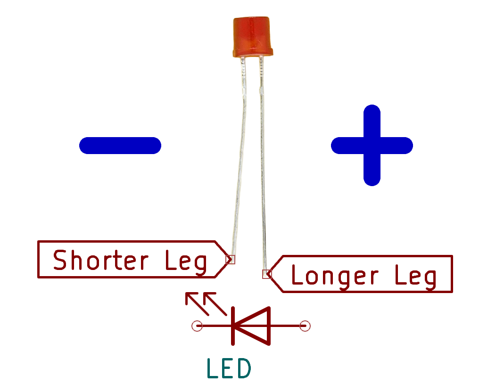
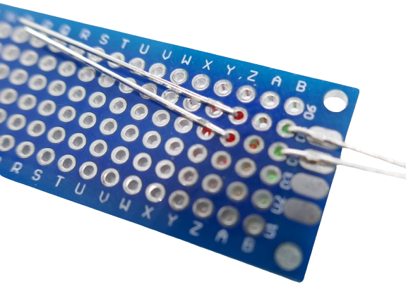
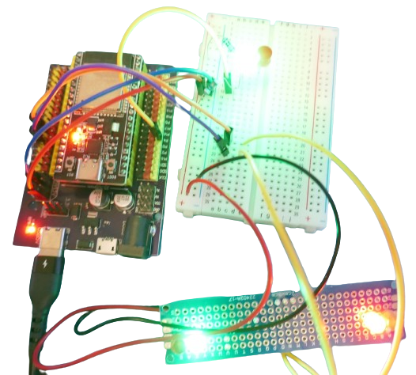

 

# Two Separate LEDs

> Signalling State Of GPIO Using Two Separate LEDs

Two separate LEDs - i.e. a *green* and a *red* LED - can be used to signal the *high* or *low* state of a *GPIO*.

## Schematics

An *output GPIO* can both *sink* and *source* current. That's why two simple *LED* can be used to indicate its state.


* **High:** current flows through the LED connected to *GND*.
* **Low:** current flows from the positive voltage source to the *GPIO* (which becomes effectively *GND*), and illuminates the *LED* connected in *reverse* connection.

> [!NOTE]
> This "trick" works because *GPIO voltages* are always below the *LED reverse breakdown voltage*. You cannot use this circuit with voltages higher than roughly *5V*, or else you would risk destroying the *LED* connected in *wrong* direction.

### Identifying Anode And Cathode
Here's a quick refresher on *LEDs* and where to find their *cathode* (**-**) and *anode* (**+**):




### Adjustments

Typical signal *LEDs* require approximately *10mA* to light up in decent brightness. At *3.3V*, this requires a current limiting resistor of *90 ohms* for a typical *green LED*, and *130 ohms* for a typical red *red LED*:

````powershell
PS> Get-LedResistor -Current 10 -OperatingVoltage 3.3 -Color red, green


Required Resistor (Ohm) : 130
Operating Voltage (V)   : 3.3
Led Current (mA)        : 10
Led Voltage (V)         : 2
Led Color               : red

Required Resistor (Ohm) : 90
Operating Voltage (V)   : 3.3
Led Current (mA)        : 10
Led Voltage (V)         : 2.4
Led Color               : green

WARNING: LED Forward Voltage was guessed from color and can be completely different. Use at own risk.
````

> [!TIP]
> To use the *PowerShell* cmdlet `Get-LedResistor`, install the *donelandtools* module from the [Microsoft PowerShell Gallery](https://www.powershellgallery.com/): `Install-Module -Name DoneLandTools -Scope CurrentUser -Force`.


Make up your mind *which LED* should turn on *when*. The circuit cannot be changed later. 


### Testing
Let's first test the schematics. For this, connect *3.3V* and *GND* to the rails of your breadboard. 

Then, connect one of the *GPIOs* that you use in your configuration (i.e. *GPIO4*) to both the *cathode* of the *green LED* and the *anode* of the *red LED*.


Connect the *90 ohms* resistor to the *anode* of your *green LED*, and connect the other end of the resistor to *3.3V*.

Likewise, connect the *130 ohms* resistor to the *cathode* of your *red LED*, and connect the other end of the resistor to *GND*.

Now, when you change the switch in your *Home Assistant* dashboard that represents the *GPIO* you wired up, the *LEDs* should indicate the current switch status.

### Smart Signalling On Perf Board

If you'd like to use the *LEDs* in a project like the [Remote-Control Powerstrip](https://done.land/projects/esphome/switchesandcontrollingdevices/remotecontrolledpowerstrip), you may want to solder the circuitry to some perfboard.

Here is an example, placing two LED *pairs* (capable of signalling the state of *two* GPIOs) on one perfboard. 

#### Place LEDs In Opposite Direction
Make sure you place the *green* and the *red LED* in opposite orientation onto the perfboard:


Next, ensure that both LED align with the perfboard and are not tilted:


Finally, bend the LED legs all the way to the sides so the LEDs are fixed and won't slide out when you solder them to the perfboard.




#### Adding Resistors

Identify the side of the LEDs that will be connected to the *GPIO*: that's the *cathode* (shorter leg) of the *green LED* and the *anode* (longer leg) of the *red LED*.

On the *opposite* side of the *LEDs*, solder the *resistors* to the *LEDs*:


Do this on both sides.


Then trim off the legs of the *LEDs*. Do **Not** trim off any part of the resistors.

#### Add Connections For GPIOs

Connect the other end of each *LED pair* with a wire, connecting the *red led anode* and the *green led cathode*. This provides you with two wires that later can be connected to the two *GPIOs* that you want to monitor.

#### Add Connections For Power Supply

Connect the two resistors that come from the *red LEDs* somewhere in the middle of the perfboard. Where the resistors connect will be the place where you later connect *GND*.

Do the same with the two resistors that come from the *green LEDs*: where these connect will later be the supply point for *3.3V*.

> [!IMPORTANT]
> Since the wires will cross over each other at some point, you may want to put the resistors that come from the *green LEDs* in red *heat shrink*. Note how one resistor is covered in heat shrink in the picture below:


Finally, add the power supply cables: connect a *red wire* to the junction point of the two *green LED resistors*, and add a *black wire* to the junction point where the two *red LED resistors* connect:


#### Testing

Once you have finished the perfboard, you can perform a first test: connect *3.3V* and *GND* to your red and black wire. Next, connect one of the *GPIO wires* to *GND*, then to *3.3V*. The appropriate LED should turn on.

When that works, it's time to add the perfboard to your test setup: connect two wires to two of the GPIOs you use in this project (i.e. GPIO13 and GPIO14).



Connect the perfboard cables for *3.3V* and *GND* to your breadboard power rail, then connect the two *GPIO wires* to the two GPIOs.

The two *LED pairs* on your perfboard should immediately start to signal the *GPIO state*, and when you go to your *Home Assistant test dashboard* and change the switches, then the *LEDs* on your perfboard should reflect these changes.


> Tags: Bi-Color, Signal LED, Get-LedResistor, DoneLandTools

[Visit Page on Website](https://done.land/components/light/led/signalleds/bi-colorsignals/twoseparateled?006778081424241658) - created 2024-08-23 - last edited 2024-08-23
