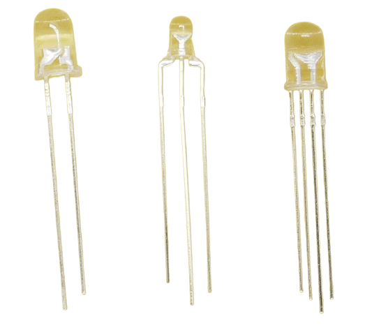
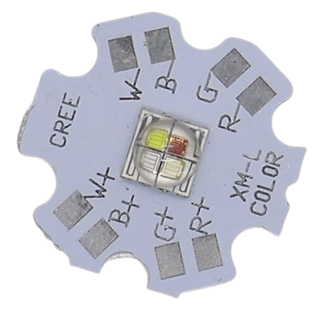
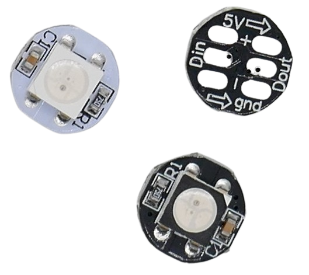

 
# Signal LEDs

> Signalling State Via LEDs

One fundamental use case for *LEDs* is to *signal a state*: best known and ubiquous are *power indicator LEDs* which are simple *LEDs* with a current limiting resistor, directly connected to a power source. They light up once a device is powered on.

*Signal LEDs* can do much more, though:

*Bi-color* or *RGB LED* indicate more information than just an *on/off* state. 

* With two colors, *standby* and *ready* or *charging* and *full* can be indicated by different colors. 
* *RGB LED* provide even more options and effects (such as *breathing color* (color transitions), i.e. while connecting to a network).

## Multi-Color LEDs

There are three different popular packaging forms:

### LEDs with Legs 

 Multi-color *LEDs* typically come with more than *two* legs, although *bi-polar bi-color LED* can have just *two*, like a regular *LED* (controlling emitted color by applied polarity):

* **Two Legs:** either a monochrome (regular) *LED*, or a *bi-polar LED*. *Bi-polar LEDs* are really two *LEDs* in opposite direction. Depending on applied polarity, either one lights up in a separate color.
* **Three Legs:** *bi-polar LED* with a common *anode* or *cathode*. Again, *two separate LEDs* are used inside, and depending on whether you supply power to an outer leg, it lights up. Since with this design, you can also power *both LEDs* at the same time, effectively mixing their colors, such *LED* can emit *three colors*.
* **Four Legs:** *RGB LED* with *three* internal *LED* and a common *anode* or *cathode* (longest leg). *RGB LED* can be used as a simple *bi-color LED*, indicating state in *green* and *red* (by ignoring the blue LED). By combining all three *red*, *green*, and *blue LED* and adjusting their brightness individually via current or *PWM*, this *LED* can emit *any* color.
* **Four Legs (programmable):** Indistinguishable from the former, they can contain a microchip that manages *RGB colors* and *current limiting*. Such *LEDs* (like the [APA106](https://done.land/components/light/led/programmable/apa106)) take *5V power* with two legs, and a *control signal* with the other two legs. These *LED* can be *daisy-chained*, and a microcontroller can control as many of these *LEDs* as needed with just two *GPIO*.

### LEDs on Star-Shaped Heat Sinks

The most flexible type of *RGB LED* provides separate connections to *each internal LED* and does not use a *common anode* or *cathode*. 

Such *LED* are typically *high power illumination LED* (1W or even 3W per *LED*, with a *RGBW LED* bein rated for a maximum overall power of *12W*). As such, they are typically mounted on a heat sink (star) and can have additional *white LEDs* (*RGBW* or *RGBWW*). 

Nevertheless, even if this might be technical overkill and not economical, they, too, can be used to signal state.

### Programmable SMD RGB LED
Programmable *LEDs* (such as the popular [WS2812](https://done.land/components/light/led/programmable/ws2812)) are commonly used in individually addressable *LED light strips*. Since these *LED* are *individually addressable*, they can also be used as single *signal LEDs*. The only prerequisite is that your project uses a microcontroller that can produce the control signal required to program the *LED*.

Such *LED* are typically *SMD* (*Surface Mount Devices*), so they are directly soldered to a *PCB* (*printed circuit board*), and have no legs. Breakout boards exist with premounted *SMD LED* that are easier to use in DIY projects.

> [!TIP]
> *SMD LED* are available in different sizes (i.e. *3528*, *5050*, and *2835*). These numbers refer to the size of the *LED*. A *3528 SMD LED* for example is *3.5mm x 2.8mm*.

## Light Patterns

*Blinking* and other light *patterns* (like *breathing color changes*) are another great way of visualizing information. 

*PWM* (*pulse width modulation*) is just an extreme variant of blinking, with a frequency so high that the human eye cannot distinguish the *on* and *off* phases anymore, effectively *dimming LEDs* - again another option of signalling state.

## GPIOs

Simple *indicator LEDs* are either directly connected to a power source (to indicate *power on*), or controlled by firmware using a dedicated *GPIO*. 

Devices with more than just one or two *indicator LEDs* can quickly require a lot of *GPIOs* just for the *signal LEDs*, and since *GPIOs* are often scarce, there are better ways:

* clever wiring can signal *GPIO state* without requiring another dedicated *GPIO* 
* programmable *RGB LED* need just *two GPIOs* for *any* number of *indicator LEDs* which is one of the best ways to scale.
* *Dedicated LED driver ICs* just require *two GPIOs* (typically using *I2C*) and can control a great number of *LEDs* or *RGB LEDs*. These specialized ICs often come with built-in support for current control and/or blinking and other patterns.

> Tags: Bi-Color, Signal LED, RGB LED

[Visit Page on Website](https://done.land/components/light/led/signalleds?384042080926244727) - created 2024-02-18 - last edited 2024-08-25
