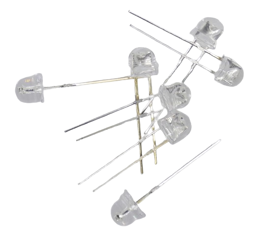
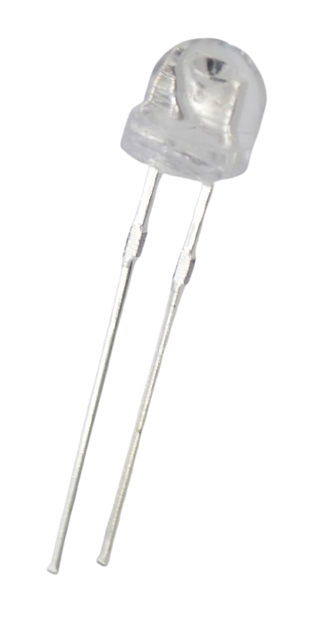

 
# Straw Hat LED

> High Brightness, A Lens And A Wide Viewing Angle At Reasonable Pricing

*Straw-Hat* **LED** are *very bright* and feature a *wide viewing angle* due to a *built-in lens*. They are ideal for decoration purposes or as an *indicator **LED***.

## Straw Hat Shape

Their distinctive *shape* resembles a *straw hat* which led to their name. *Straw-Hat* **LED** are a *cost-effective* choice when you need *very bright* **LED**.

In all other aspects, they work like regular **LED**.

## Wiring: Anode and Cathode

*Straw Hat* **LED*** have *two* "legs". The *longer* leg is the *anode* (**+**). 

> Tags: LED, Light, Anode, Cathode, Straw Hat

