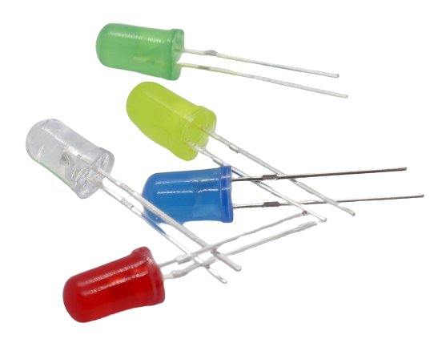

 
# Light

> Using Light Sources Like LED/Strips/WS2812 And Components That Can Control Them

Today **LED** (*light emitting diodes*) is the predominant technology to produce *light*: it is *efficient*, **LED** are physically *rugged*, *cheap to produce*, and come in various colors and shapes.

## Fundamental LED Types

We all know the classic *indicator* **LED** but there are many more **LED** types.

Check out the [LED section](LED) to find out about *multicolor*, *programmable*, *stips*, *high performance* and *COB* **LED**.

## Supporting Components

To actually (and safely) operate **LED** in your various scenarios, additional components may be required:

* **Power Supply:** *Constant voltage* or better yet *constant current*
* **Breakout Boards:** A number of breakout boards exist to help you control multiple **LED** with just two *GPIO*, either by using *multiplexer* or *I2C*

I'll add appropriate sub-sections soon.

> Tags: LED

[Visit Page on Website](https://done.land/components/light?379917031318243445) - created 2024-02-21 - last edited 2024-03-18
