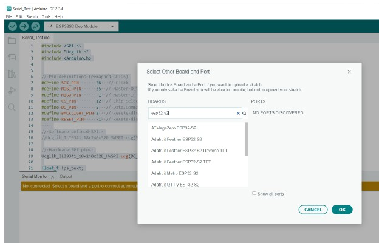

 
# ArduinoIDE

> Beginner-Friendly But Limited Integrated Development Environment (IDE)

*ArduinoIDE* was the first IDE simple enough to be used by hobbyists. Meanwhile, it is available in a much-improved [version 2.x](https://www.arduino.cc/en/software).


## Overview
[ArduinoIDE](https://www.arduino.cc/en/software) is a simple and free development environment for developing *C++ source code*. You can compile your code and upload it to your microcontroller. 

*ArduinoIDE* has recently been upgraded to version *2.x*. You should no longer use the old and limited version *1.x*. There are numerous [free download options](https://www.arduino.cc/en/software) for *Windows*, *Linux*, and *macOS*.

### Adding Support For ESP32 And Other Microcontrollers
Out of the box, *ArduinoIDE* works for *Arduino* microcontrollers and a few others. To use additional microcontrollers, i.e. *ESP32*, you need to add more *board definitions* manually. For example, if you want to use the popular [ESP](https://done.land/components/microcontroller/families/esp/) family of microcontrollers, [install the ESP32 board managers](https://randomnerdtutorials.com/installing-esp32-arduino-ide-2-0/).

````
http://arduino.esp8266.com/stable/package_esp8266com_index.json, https://raw.githubusercontent.com/espressif/arduino-esp32/gh-pages/package_esp32_index.json
````

Now you are ready to work on *C++ source code*, compile it, and upload it to your microcontroller.


## Selecting Microcontroller
It is crucial for success to configure the microcontroller board you use. If you pick the wrong board, *ArduinoIDE* creates firmware that may not be compatible to your hardware.


### Selecting Board
On top of the *ArduinoIDE user interface*, right below the main menu, you find a drop down list where you can select the board you are using. If the board that is currently shown in the list does not match your board, click into the list, and choose *Select other board and port*. 



This opens a dialog with two lists:

* **Select Board:** search for your board.    
* **Select Port:** select the *port* to which your microcontroller is connected.


You can configure a board and start composing *C++ code* even when no microcontroller is connected. In this case, ignore the right list, and do not pick a port.

#### Finding Board Definition
With many microcontroller boards - especially well-known brands - you find a dedicated board definition that exactly matches your particular board. That's the optimal case, and you are already done.

With lesser-known or *no-name* boards, this can be much more difficult. If you cannot find a board design in the list that matches your microcontroller, here are some options:


* **Look It Up:**     
     [Look up the microcontroller](https://done.land/components/microcontroller/families/) to see if it has been covered already here. If so, I already did the research for you and suggest a *compatible board definition name* that you can use. If i.e. you are using a *no-name ESP32-S2 Mini* board, the corresponding [article](https://done.land/components/microcontroller/families/esp/esp32/developmentboards/esp32-s2/s2mini/) provides you with the necessary information.
* **Find Compatible Board:**    
    In the dialog, search for the microcontroller type, i.e. enter `ESP32S2` or `ESP32-S2`. Next, select a board definiton that seems similar to your board. To make sure the board definition matches your board, use *test code* to compare its settings to your board. Be sure the board definition assigns the correct GPIOs to the commonly used pin constants such as `MOSI`, `MISO`, `SS`, `SDA`, and `SCL`.
* **Search the Web:**     
    Look for projects using your microcontroller type, and try and find out which board definition these projects have successfully used.
* **Add New Board Design:**    
    Take a deep insight into the way how *ArduinoIDE* manages board designs, and review the board designs available to identify the one that matches your microcontroller. If no appropriate board design exists, copy a board design that is as similar as possible, and adjust the settings to fully match your board. This approach, while being a great learning experience, involves deeper knowledge about your board, and the willingness to invest a few hours in explorations.


## Select Port
In order for *ArduinoIDE* to communicate with your microcontroller board, it needs to be connected to the PC running *ArduinoIDE*. Typically, you connect your microcontroller board with a *USB cable*.

In a perfect world, you hear a "connecting sound" from your *PC* once you plug in your microcontroller board, and in the menu `Tools/Port`, a new port is selectable with the name of your microcontroller board.

> [!IMPORTANT]
> Once you connect your microcontroller to your PC, in *ArduinoIDE* always visit the menu `Tools/Port`, and select the appropriate port. It is **not sufficient** to just plug the board in. 


In a not-so-perfect world, connecting *ArduinoIDE* to your microcontroller can be challenging. Below are the top two reasons, and workarounds.

### Missing Port

When *ArduinoIDE* shows no port in its menu `Tools/Port` once you connected your microcontroller, here are the common issues causing this:

  * **Wait:** simply *waiting* for *15-30 sec* can occasionally solve the issue, especially with modern microcontrollers that use *USB-emulated ports*. It can take a moment for the USB controller and the devices to (re-)negotiate all settings.
  * **Reboot:** before investigating anything else, *reboot* your PC, and try again. Very often, USB ports are locked by other running software - especially when you use different IDEs in parallel and may be using *platformio*, too. Even a stand-alone *ArduinoIDE* may have trouble re-using a USB connection after it ran for a while.
  * **Missing Driver:** if you haven't used this particular microcontroller before, it may use a *UART* that requires a specific driver to be installed on your PC. Without this driver, your PC cannot recognize the microcontroller. Find out which *UART* the board uses, and install an appropriate driver for it, then try again.    
  * **Wrong USB Cable:** make sure you *firmly* plugged in the USB cable on both ends. If the connection still does not work, and you haven't used *this particular USB cable* successfully before, then the cable may not be suitable (some are for *charging* only and lack data cables) or damaged. Try a different cable. Once you successfully used a particular USB cable, mark it with a label so in the future you know that this cable is good to go.

### Wrong Port / Upload Errors
If *ArduinoIDE* shows a port, but once you are trying to upload new firmware to it, you get error messages, then here are the typical reasons:

* **Port Locked:** most typically, the port is locked. Some other application may have taken ownership, or *ArduinoIDE* did not correctly release it after a previous upload. To solve this, *reboot* your PC, and try again.
* **Firmware Upload Mode:** Ideally, the IDE can automatically switch the microcontroller to *firmware upload mode* which is required to upload new firmware to it. Many boards, like [ESP32 DevKitC V4](https://done.land/components/microcontroller/families/esp/esp32/developmentboards/esp32s/esp32devkitcv4/) or [ESP32-S2 Mini](https://done.land/components/microcontroller/families/esp/esp32/developmentboards/esp32-s2/), do not support this automatic switch. You need to *manually* switch the microcontroller to *firmware upload mode* before starting the upload in your IDE, which is typically done through two push buttons on the microcontroller board:     
    * Enable Firmware Upload: hold down and keep pressed the button labeled `BOOT` or `0`. Then press the button `RES` or `RESET`, and release all buttons.
    * Disable Firmware Upload: to resume to normal operations after you have uploaded the new firmware, press `RES` or `RESET` without pressing the other button.


> Tags: Microcontroller, ArduinoISE, ESPHome, platformio, Board Manager

