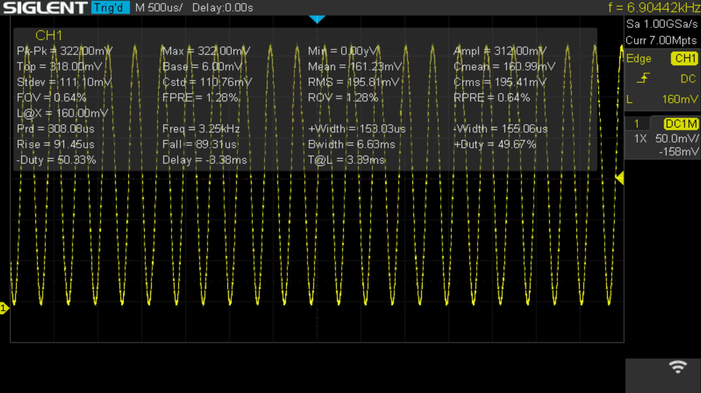
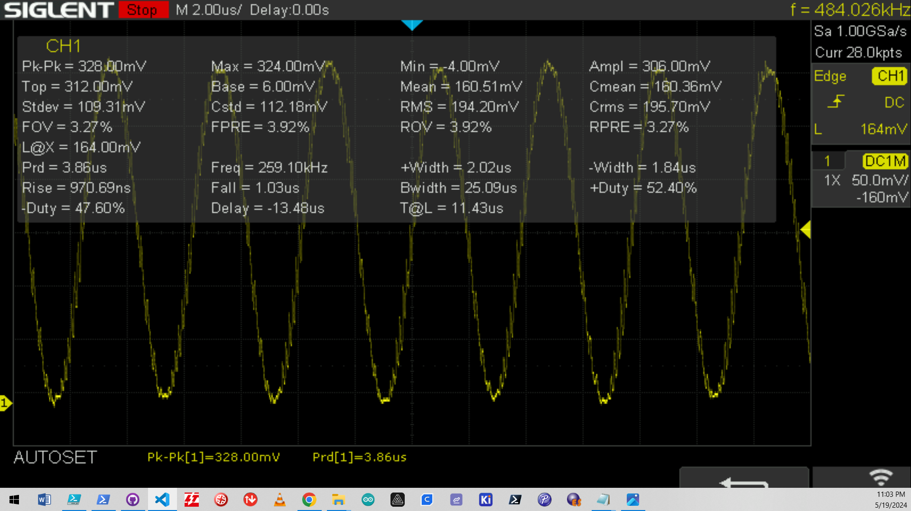

 
# DAC

> Built-In Digital-To-Analog Converter (DAC) With High Speed Direct Memory Access (DMA)

The built-in *DAC* (*Digital-to-Analog* converter) can turn a digital value into a *voltage*. This can be useful to produce a given voltage at a pin *dynamically by code* rather than *fixed* by discrete components (i.e. via a *voltage divider* using resistors). There are many use cases. One is generating *wave forms* so you can create *signal generators* or produce *audio output*.

## Support

A *built-in DAC* is supported by these *ESPxxxx* modules:

| ESP Module | Internal DAC |
| --- | --- |
| ESP8266 | - |
| Classic ESP32 | yes, 8bit, 2 channels,  GPIOs: 25, 26 |
| S2 | yes, 8bit, 2channels, GPIOs: 17, 18 |
| S3 | - |
| C3 | - |
| C6 | - |
| H2 | - |


## Benefit of Built-In DAC
You can get separate breakout boards with *external DACs* like the popular *MCP4725*, and add simple-to-use *DAC capability* to *any* microcontroller.


However, *external DACs* are *not the same* as having an *internal built-in DAC*: 

The *built-in DAC* tightly integrates with the rest of the microcontroller infrastructure. Most importantly, it can directly communicate with its memory (*Direct Memory Access*, *DMA*). 

Since the *CPU* is *not involved* when *DMA* is used, the *DAC* can change the voltage much more often per second than external DACs.

> [!NOTE]
> *External DACs* like the *MCP4725* do support *very high speeds*: its *I2C* interface is ready for *100kbps*, *400kbps*, and even *3.4Mbps*. However, it *cannot* directly access memory, and always needs the *CPU* to manage *I2C* and do the memory transfer, thus placing a high burden on the *CPU*.   


## Overview
A *Digital-to-Analog Converter* (DAC) converts digital data into an analog signal (*voltage*), enabling digital audio playback, video, and other data that can be used by analog devices such as speakers, monitors, and sensors.

A *DAC* is not a *buck* or *boost* converter: it can only output *voltages* within the range of the *supply voltage*. 


### Voltage Range
The analog reference voltage for ESP32 is *3.3V*. An *ideal DAC* would be able to produce voltages in the range of *0.0-3.3V* in a *linear* way.

In practice, *DACs* are not perfectly ideal and show a *zero drift* (cannot deliver exactly *0.0V*, range ends at around *0.08V*) and *early saturation* (cannot reach the upper voltage limit and deliver around *3.165V* at most).

### Resolution
The *DAC resolution* defines the *voltage steps* that are creatable. The built-in *DAC* has a *8bit* resolution, providing *256 voltage steps*.


### Speed
The *internal DAC* can be operated in different modes, yielding different update speeds:

| Mode | Example | Speed | Remarks |
| --- | --- | --- | --- |
| Arduino API | `dacWrite(DAC_CH1, Val);` | 20uS/50kHz | requires no external includes |
| Espressif API | `dac_output_voltage(DAC_CH1, Val);` | 5uS/200kHz | requires `#include <driver/dac.h>` |
| DMA | 10uS/100kHz | no *CPU* load |

> [!CAUTION]
> When looking at speeds, keep in mind that for *API methods*, this is the speed *for a single voltage change*. A *waveform* like a *sine wave* consists of many different voltage points, often hundreds. *DMA* is *much faster* and can for example create a *sine wave* at *100kHz*. The same *sine wave* created by individual *API calls* in a loop would reach a maximum frequency of around *150Hz* (and keep the CPU at 100% load).


### DAC Output Current
The DAC outputs a *control signal* that can be used to drive other circuitry, i.e. an *amplifier*, an *oscilloscope*, a *voltmeter*, or an *audio amplifier*.

**You cannot and should never directly drive** any component that requires significant currents. DAC output can typically source up to about **12mA** and sink up to about **10mA**. 
 
For reliable operation and to avoid damaging the DAC, it is advisable to limit the current draw to much lower values and **not exceed 1-2mA**.

> [!TIP]
> If you need to output *higher currents*, you should use an external buffer, such as an *operational amplifier* (op-amp) configured as a *voltage follower*. 


### Operational Modes
The *ESP32 DAC* supports *three* modes of operation:

| Mode | Remark |
| --- | --- |
| Direct Voltage Output | 8bit digital input is directly converted to the corresponding analog voltage. This voltage stays constant until a new digital value is written to the DAC (*one-shot mode*) |
| DMA Continuous Output | Complex wave forms are generated from digital values read directly from memory without much *CPU* intervention. |
| Cosine Wave Generator | Generates a *cosine waveform* with controllable frequency, amplitude, and phase shift at an output frequency in the range of *130Hz-100kHz* |

## Producing Fixed Voltages
Often, your project just needs a *fixed voltage* that can be controlled by your code.

The easiest way for this is to use the default *Arduino API* (not requiring any additional libraries).

> [!NOTE]
> While the *Espressif API* is about *4x faster* than the built-in *Arduino API*, this does not really matter: when switching an output pin to a *fixed voltage*, it makes no difference whether this takes *20uS* or just *5uS*.


### Setting Pin Voltage
To set one of the *DAC output pins* to a given voltage, use this call:

````c++
dacWrite(uint8_t dac_pin, uint8_t value);
````

| Argument | Description |
| --- | --- |
| dac_pin | Classic ESP: GPIO25 (Ch1) or GPIO26 (Ch2); ESP32-S2: GPIO17 (Ch1) or GPIO18 (Ch2) |
| value | *0-255*: 0=0.08V; 255=3.16V |


### Turning Off Voltage
To *turn off* the voltage completely on a pin, use this call:

````c++
void dacDisable(uint8_t dac_pin);
````

> [NOTE]
> In a simple sketch you can test the *DAC output voltage* with a *multimeter*. **Only use** voltmeters with internal power supply. **Do not** connect voltmeters that draw their energy from the *DAC output*, i.e. to power its *display LEDs*. This would likely exceed the recommended maximum output current of *1-2mA*.


### Stepping Up Voltage Slowly
To see the *DAC* in action, you can use a simple *multimeter* provided you ask the *DAC* to perform voltage changes slowly enough for the *multimeter* to pick up the voltage.

The following sketch asks the *DAC* to change the voltage every second. It increments the *digital input* by *25* each time, so the *DAC* is producing the analog voltage for the digital inputs *0, 25, 50, 75, 100, 125, 150, 175, 200, 225, and 250*.

The sketch uses *DAC Channel 1* which corresponds to *GPIO25* on a *classic ESP32*, and *GPIO17* on a *S2*. 

> [!CAUTION]
> Make sure you adjust the sketch to the type of *ESPxxxx* you are using by uncommenting the appropriate line defining the *DAC GPIO* to use.


````c++
#include <Arduino.h>

#define DAC1 25       // ESP32:    DAC Ch1 
//#define DAC1 17     // ESP32-S2: DAC Ch1 
                 

void setup(){
}

void loop(){
 for(int i=0;i<256;i+=25)
 {
   dacWrite(DAC1, i);
   delay(1000);
 }
}
````

To see the effect, connect the red plus cable of a multimeter to the *DAC pin* and the black ground cable to *GND*.


> [!CAUTION]
> Only use *battery-powered multimeters*. Do not hook up a *voltage display* that is powered solely by the input voltage. Keep in mind that a *DAC output* should never be exceeding *1-2mA* and can be destroyed by currents above *12mA*.


### Sawtooth Wave
Next, let's generate a *wave form* by changing the voltage in high(er) frequency. The next sketch *increases* and then *decreases* the voltage in a *linear* way, effectively producing a *sawtooth wave*.

> [!CAUTION]
> The next sketch is *not* using `delay(1000);` so the voltage changes occur at the maximum possible frequency. You can no longer use a *normal multimeter* to check the effect: it would take much too long for its measurements and just display *an average voltage*. To see the effect, you need an *oscilloscope*. Since the generated *waveform* will have a very low frequency of around *100Hz*, you can use cheap pocket-size oscilloscopes or even *multimeters with oscilloscope functionality*.


````c++
#include <Arduino.h>

#define DAC1 25       // ESP32:    DAC Ch1 
//#define DAC1 17     // ESP32-S2: DAC Ch1 


void setup(){
}

void loop() {
 for (int i=0; i<255; i++){
   dacWrite(DAC1, i);
 }

 for (int i=255; i>=0; i--){
   dacWrite(DAC1, i);
 }
}
````

This is the generated *waveform* displayed on a pocket oscilloscope:


And this would be an output from a *real* oscilloscope:


### Sine Wave
Now that you know how to instruct the *DAC* to produce a voltage, you can generate basically *any* waveform. 

To create more complex waveforms such as a *sine wave*, use an *array* with the voltages required for the waveform, then index into the array to let the *DAC* produce the required voltages.

````c++
#include <Arduino.h>

#define DAC1 25       // ESP32:    DAC Ch1 
//#define DAC1 17     // ESP32-S2: DAC Ch1 

int Sin_Array[256]; 
float Period = (2*PI)/256;
float Rad_Angle;                   

void setup(){
    
   for(int Angle=0; Angle<256; Angle++) {
       Rad_Angle = Angle*Period;
       Sin_Array[Angle] = (sin(Rad_Angle)*127)+128;
   }
}

void loop(){
 for(int i=0;i<256;i++)
   dacWrite(DAC1, Sin_Array[i]);
}
````

This is the generated *sine wave* displayed by an oscilloscope:


### Speed Check
Let's finally come back to the initial example where the sketch incremented the voltage in steps of 25. The sketch used a delay of *1000ms* between each voltage change so that a regular *multimeter* would have sufficient time to measure the signal.

Take the same sketch but comment out the line with `delay(1000);` to see what the *maximum speed* is for regular *API calls* to change voltages:


````c++
#include <Arduino.h>

#define DAC1 25       // ESP32:    DAC Ch1 
//#define DAC1 17     // ESP32-S2: DAC Ch1 
                 

void setup(){
}

void loop(){
 for(int i=0;i<256;i+=25)
 {
   dacWrite(DAC1, i);
   //delay(1000);
 }
}
````


This is the generated *waveform* displayed on a pocket oscilloscope:


And this would be an output from a *real* oscilloscope:


## Higher Frequencies
Setting *one* discrete voltage on one of the *DAC* pins is simple and straight-forward as you have seen: the *Arduino method* `dacWrite();` sets the desired voltage - done.

Once you need to set voltages more often, for example if you want to generate complex wave forms at higher frequency, things become more complex. As you have already seen above, generating *sawtooth* or *sine waves* or entirely different wave forms is absolutely possible using the simple `dacWrite();`. It just takes comparably long: each call requires approximately *20uS*, severely limiting the *frequencies* you can generate. At best, you will be able to create a *sine wave* at around *200Hz*.

In the remaining part, I look into alternative approaches allowing higher frequencies:

* **Espressif API:** First, I look at a much faster way of setting *DAC output voltage*. It still requires the *CPU* to do the calls but allows for *sine waves* at up to *1kHz*.
* **I2S and DMA:** Then, I'll dive into *I2S* and how this can use *DMA* (*Direct Memory Access*) so that the *DAC* can communicate directly with memory, effectively bypassing the *CPU bottleneck* and allowing *sine waves* at frequencies of up to *100kHz*.

## Espressif Libraries
Using the *Espressif Libraries* to control the *DAC* (instead of the generic *Arduino libraries*) improves speed quite a lot. You can compare the difference in maximum achievable frequency using this sketch:

````c++
#include <Arduino.h>
#include <driver/dac.h>

#define DAC1 25       // ESP32:    DAC Ch1 
//#define DAC1 17     // ESP32-S2: DAC Ch1 


const uint8_t sineLookupTable[] = {
128, 136, 143, 151, 159, 167, 174, 182,
189, 196, 202, 209, 215, 220, 226, 231,
235, 239, 243, 246, 249, 251, 253, 254,
255, 255, 255, 254, 253, 251, 249, 246,
243, 239, 235, 231, 226, 220, 215, 209,
202, 196, 189, 182, 174, 167, 159, 151,
143, 136, 128, 119, 112, 104, 96, 88,
81, 73, 66, 59, 53, 46, 40, 35,
29, 24, 20, 16, 12, 9, 6, 4,
2, 1, 0, 0, 0, 1, 2, 4,
6, 9, 12, 16, 20, 24, 29, 35,
40, 46, 53, 59, 66, 73, 81, 88,
96, 104, 112, 119};

void setup(){
   dac_output_enable(DAC_CHANNEL_1);
}

void loop(){
 for(int i=0;i<100;i++) {
   dacWrite(DAC1, sineLookupTable[i]);
   //dac_output_voltage(DAC_CHANNEL_1, sineLookupTable[i]);
 }
}
````

When you compile and run this sketch *as-is*, it uses the default *Arduino API* and produces a *sine wave* at *537Hz*: 


You probably noted that this example already *increased* the frequency from around *200Hz* to almost *600Hz* without changing the API calls yet. 

Note that this example uses only *100 samples* (100 voltage values) that define the curve. The previous examples had used *256* samples (*2.56*x more). *537Hz*/*2.56* equals to *209Hz*, the frequency we saw earlier. 

So from a performance perspective, both examples ran the *DAC* at **53.7ksps** (53.700 *samples per second*).

### Testing Espressif API
Now *comment in* the line `dac_output_voltage(DAC_CHANNEL_1, sineLookupTable[i]);` and *comment out* the line `dacWrite(DAC1, sineLookupTable[i]);`, effectively just changing the *method* that tells the *DAC* the voltage it should deliver.

Once you compile and upload the changed sketch, this is the result:




We now see a frequency of *3.25kHz* which is roughly *6x faster*, or from a performance perspective: the *DAC* now runs at *100 samples* x *3250Hz* = *325ksps**.

> [!NOTE]
> This example is pushing it to the *extreme* showing the maximum archievable frequency going this route. One *CPU core* is most likely working at close to *100%* load.


### More Control Through Interrupts
The code above is hard to integrate with other tasks as it blocks the *CPU*.

You can slightly modify the code though and i.e. use *hardware interrupts* to take care of updating the *DAC voltages*.

This has two benefits: 

* **Non-Blocking:** `loop()` is not doing anything and could be used to execute other code, i.e. a user interface to change signal parameters on the fly. 
* **Frequency Adjustments:** Adjusting the signal frequency is now trivial as it just requires to change the *timer interrupt interval*.

Here is the modi­fied code that generates a *sine wave* at exactly *1kHz*:

````c++
#include <Arduino.h>
#include <driver/dac.h>
 
hw_timer_t *Timer0_Cfg = NULL;
 
uint8_t SampleIdx = 0;

const uint8_t sineLookupTable[] = {
128, 136, 143, 151, 159, 167, 174, 182,
189, 196, 202, 209, 215, 220, 226, 231,
235, 239, 243, 246, 249, 251, 253, 254,
255, 255, 255, 254, 253, 251, 249, 246,
243, 239, 235, 231, 226, 220, 215, 209,
202, 196, 189, 182, 174, 167, 159, 151,
143, 136, 128, 119, 112, 104, 96, 88,
81, 73, 66, 59, 53, 46, 40, 35,
29, 24, 20, 16, 12, 9, 6, 4,
2, 1, 0, 0, 0, 1, 2, 4,
6, 9, 12, 16, 20, 24, 29, 35,
40, 46, 53, 59, 66, 73, 81, 88,
96, 104, 112, 119};
 
// this is the timer interrupt procedure updating the DAC:
void IRAM_ATTR Timer0_ISR()
{
  dac_output_voltage(DAC_CHANNEL_1, sineLookupTable[SampleIdx++]);
  if(SampleIdx == 100) 
    SampleIdx = 0;

}
 
void setup()
{
  // setup timer interrupt
  Timer0_Cfg = timerBegin(0, 80, true);
  timerAttachInterrupt(Timer0_Cfg, &Timer0_ISR, true);
  timerAlarmWrite(Timer0_Cfg, 10, true);
  timerAlarmEnable(Timer0_Cfg);
  dac_output_enable(DAC_CHANNEL_1);
}
 
void loop()
{
  // all DAC operations are handled by interrupts
  // loop() can be used for anything else you need to do, i.e. manage a user interface
}
````

This is the result:


## I2S And DMA

By using *DMA*, the built-in *DAC* can produce *wave forms* at much higher sampling rates and frequencies.

The sketch below produces a *sine wave* at a frequency of *65kHz*:

````c++
#include <Arduino.h>

#include "freertos/FreeRTOS.h"
#include "freertos/task.h"
#include "freertos/queue.h"

#include "soc/rtc_io_reg.h"
#include "soc/rtc_cntl_reg.h"
#include "soc/sens_reg.h"
#include "soc/rtc.h"

#include "driver/dac.h"

// signal frequency is determined by frequency_step like this:
// frequency_step = desiredFrequencyHz x 65536 / 8500000
// -or-
// frequency = 8500000 x frequency_step / 65536
// 8: 1.04kHz
// 16: 2.08kHz
// 50: 6.5kHz
// 100: 12.97kHz
// 200: 25.94kHz
// 500: 64.85kHz
int frequency_step = 500;  // Frequency step for CW generator

int clk_8m_div = 0;      // RTC 8M clock divider (0=8MHz)
int scale = 1;           // 1/2 scale
int offset;              // no offset
int invert = 2;          // invert MSB (most significant bit) for sine wave

float frequency = RTC_FAST_CLK_FREQ_APPROX / (1 + clk_8m_div) * (float) frequency_step / 65536;
        

// all manipulations are direct writes to a particular register
// DAC is configured using register SENS_SAR_DAC_CTRL1_REG and SENS_SAR_DAC_CTRL2_REG
// SENS_SAR_DAC_CTRL1_REG enables the cosine generator
// SENS_SAR_DAC_CTRL2_REG connects it to a DAC channel

// Register bits can be changed using SET_PERI_REG_MASK();


// enables the cosine generator for a DAC channel:
void dac_cosine_enable(dac_channel_t channel)
{
    // Step 1: ENABLE the cosine generator:
    SET_PERI_REG_MASK(SENS_SAR_DAC_CTRL1_REG, SENS_SW_TONE_EN);
    
    // Step 2: CONNECT the cosine generator to a DAC channel:
    switch(channel) {
        // cosine generator is enabled per channel using SENS_DAC_CW_EN1_M and SENS_DAC_CW_EN2_M
        // MSB must be inverted by SENS_DAC_INV1 and SENS_DAC_INV2 
        case DAC_CHANNEL_1:
            SET_PERI_REG_MASK(SENS_SAR_DAC_CTRL2_REG, SENS_DAC_CW_EN1_M);
            SET_PERI_REG_BITS(SENS_SAR_DAC_CTRL2_REG, SENS_DAC_INV1, 2, SENS_DAC_INV1_S);
            break;
        case DAC_CHANNEL_2:
            SET_PERI_REG_MASK(SENS_SAR_DAC_CTRL2_REG, SENS_DAC_CW_EN2_M);
            SET_PERI_REG_BITS(SENS_SAR_DAC_CTRL2_REG, SENS_DAC_INV2, 2, SENS_DAC_INV2_S);
            break;
    }
}


// frequency (for both channels)is determined by two parameters:
// clk_8m_div (RTC 8M clock divider): 0=8Mhz clock, range is 0-273
// frequency_step: range is 1-65535
void dac_frequency_set(int clk_8m_div, int frequency_step)
{
    REG_SET_FIELD(RTC_CNTL_CLK_CONF_REG, RTC_CNTL_CK8M_DIV_SEL, clk_8m_div);
    SET_PERI_REG_BITS(SENS_SAR_DAC_CTRL1_REG, SENS_SW_FSTEP, frequency_step, SENS_SW_FSTEP_S);
}

// scaling, range is 0-3:
// 0: no scale
// 1: scale to 1/2
// 2: scale to 1/4
// 3: scale to 1/8
void dac_scale_set(dac_channel_t channel, int scale)
{
    switch(channel) {
        case DAC_CHANNEL_1:
            SET_PERI_REG_BITS(SENS_SAR_DAC_CTRL2_REG, SENS_DAC_SCALE1, scale, SENS_DAC_SCALE1_S);
            break;
        case DAC_CHANNEL_2:
            SET_PERI_REG_BITS(SENS_SAR_DAC_CTRL2_REG, SENS_DAC_SCALE2, scale, SENS_DAC_SCALE2_S);
            break;
    }
}

// Offset output for a particular channel: range is 0-255
void dac_offset_set(dac_channel_t channel, int offset)
{
    switch(channel) {
        case DAC_CHANNEL_1:
            SET_PERI_REG_BITS(SENS_SAR_DAC_CTRL2_REG, SENS_DAC_DC1, offset, SENS_DAC_DC1_S);
            break;
        case DAC_CHANNEL_2:
            SET_PERI_REG_BITS(SENS_SAR_DAC_CTRL2_REG, SENS_DAC_DC2, offset, SENS_DAC_DC2_S);
            break;
    }
}

// Invert output for a particular channel, range is 0-3:
// 0: no inversion
// 1: completely inverted
// 2: invert MSB (most significant bit)
// 3: invert all but MSB
void dac_invert_set(dac_channel_t channel, int invert)
{
    switch(channel) {
        case DAC_CHANNEL_1:
            SET_PERI_REG_BITS(SENS_SAR_DAC_CTRL2_REG, SENS_DAC_INV1, invert, SENS_DAC_INV1_S);
            break;
        case DAC_CHANNEL_2:
            SET_PERI_REG_BITS(SENS_SAR_DAC_CTRL2_REG, SENS_DAC_INV2, invert, SENS_DAC_INV2_S);
            break;
    }
}

// task that handles the DAC
void dactask(void* arg) {
    while(1){
        // set frequency
        dac_frequency_set(clk_8m_div, frequency_step);
        vTaskDelay(2000/portTICK_PERIOD_MS);
    }
}

void setup() {
    dac_cosine_enable(DAC_CHANNEL_1);
    dac_output_enable(DAC_CHANNEL_1);
    xTaskCreate(dactask, "dactask", 1024*3, NULL, 10, NULL);
}

void loop() {}
````

This is the result on an oscilloscope:


The desired frequency is set via the variable *frequency_step* which is an *integer*. You can calculate other values either by submitting a desired frequency:

*frequency_step = desiredFrequencyHz x 65536 / 8500000*

Or you can fill in integer values for *frequency_step* and then calculate the effective frequency like this:

*frequency = 8500000 x frequency_step / 65536*

For example, when you change the value for *frequency_step* in the code from *500* to *2000*, according to the formula above, the resulting frequency now would be:

*frequency = 8500000 x **2000** / 65536* = **259.4kHz**

Here is the result on an oscilloscope:





> Tags: ESP32, S2, DAC, DMA, Direct Memory Access, I2S, Sine Wave, Signal Generator

[Visit Page on Website](https://done.land/components/microcontroller/esp/espfeatures/dac?723859050918243938) - created 2024-05-17 - last edited 2024-05-18
