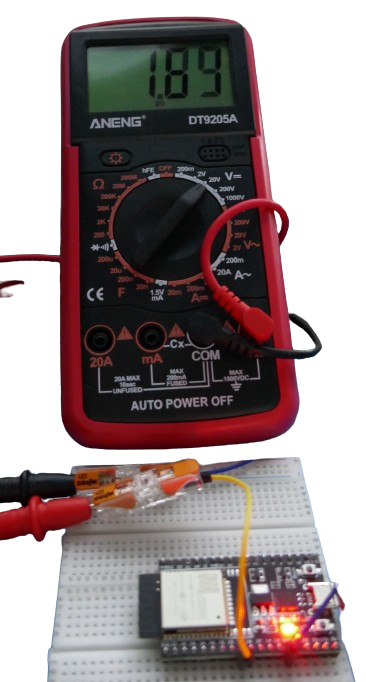
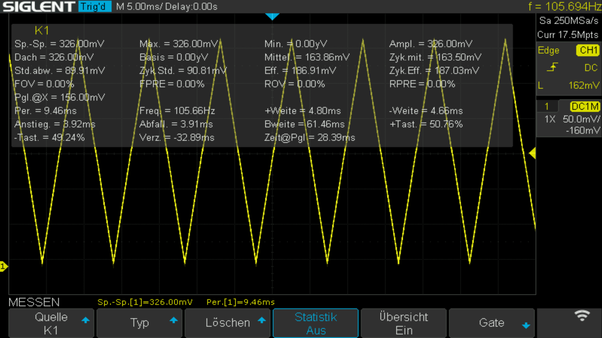
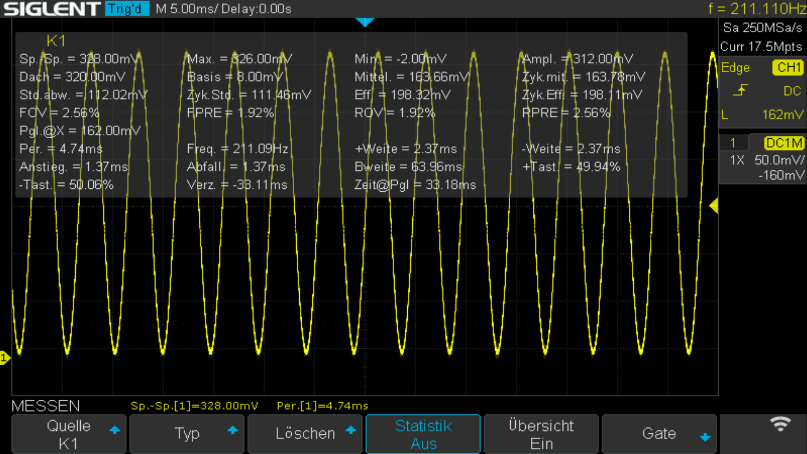

 
# DAC

> Built-In Digital-To-Analog Converter (DAC) With High Speed Direct Memory Access (DMA)

The built-in *DAC* (*Digital-to-Analog* converter) can turn a digital value into a *voltage*. This can be useful produce a given voltage *by code* rather than by discrete components. There are many use cases. One is generating *wave forms* so you can create *signal generators* or produce *audio output*.

## Support

A *built-in DAC* is supported by these *ESPxxxx* modules:

| ESP Module | Internal DAC |
| --- | --- |
| ESP8266 | - |
| Classic ESP32 | yes, 8bit, 2 channels,  GPIOs: 25, 26 |
| S2 | yes, 8bit, 2channels, GPIOs: 17, 18 |
| S3 | - |
| C3 | - |
| C6 | - |
| H2 | - |


## Benefit of Built-In DAC
You can get separate breakout boards with *external DACs* like the popular *MCP4725*, and add simple-to-use *DAC capability* to *any* microcontroller.


However, *external DACs* are *not the same* as having an *internal built-in DAC*: 

The *built-in DAC* tightly integrates with the rest of the microcontroller infrastructure. Most importantly, it can directly communicate with its memory (*Direct Memory Access*, *DMA*). 

Since the *CPU* is *not involved* when *DMA* is used, the *DAC* can change the voltage much more often per second than external DACs.

> [!NOTE]
> *External DACs* like the *MCP4725* do support *very high speeds*: its *I2C* interface is ready for *100kbps*, *400kbps*, and even *3.4Mbps*. However, it *cannot* directly access memory, and always needs the *CPU* to manage *I2C* and do the memory transfer, thus placing a high burden on the *CPU*.   


## Overview
A *Digital-to-Analog Converter* (DAC) converts digital data into an analog signal (*voltage*), enabling digital audio playback, video, and other data that can be used by analog devices such as speakers, monitors, and sensors.

A *DAC* is not a *buck* or *boost* converter: it can only output *voltages* within the range of the *supply voltage*. 


### Voltage Range
The analog reference voltage for ESP32 is *3.3V*. An *ideal DAC* would be able to produce voltages in the range of *0.0-3.3V* in a *linear* way.

In practice, *DACs* are not perfectly ideal and show a *zero drift* (cannot deliver exactly *0.0V*, range ends at around *0.08V*) and *early saturation* (cannot reach the upper voltage limit and deliver around *3.165V* at most).

### Resolution
The *DAC resolution* defines the *voltage steps* that are creatable. The built-in *DAC* has a *8bit* resolution, providing *256 voltage steps*.


### Speed
The *internal DAC* can be operated in different modes, yielding different update speeds:

| Mode | Example | Speed | Remarks |
| --- | --- | --- | --- |
| Arduino API | `dacWrite(DAC_CH1, Val);` | 20uS/50kHz | requires no external includes |
| Espressif API | `dac_output_voltage(DAC_CH1, Val);` | 5uS/200kHz | requires `#include <driver/dac.h>` |
| DMA | 10uS/100kHz | no *CPU* load |

> [!CAUTION]
> When looking at speeds, keep in mind that for *API methods*, this is the speed *for a single voltage change*. A *waveform* like a *sine wave* consists of many different voltage points, often hundreds. *DMA* is *much faster* and can for example create a *sine wave* at *100kHz*. The same *sine wave* created by individual *API calls* in a loop would reach a maximum frequency of around *150Hz* (and keep the CPU at 100% load).


### DAC Output Current
The DAC outputs a *control signal* that can be used to drive other circuitry, i.e. an *amplifier*, an *oscilloscope*, a *voltmeter*, or an *audio amplifier*.

**You cannot and should never directly drive** any component that requires significant currents. DAC output can typically source up to about **12mA** and sink up to about **10mA**. 
 
 For reliable operation and to avoid damaging the DAC, it is advisable to limit the current draw to much lower values and **not exceed 1-2mA**.

 > [!TIP]
 > If you need to output *higher currents*, you should use an external buffer, such as an *operational amplifier* (op-amp) configured as a *voltage follower*. 


### Operational Modes
The *ESP32 DAC* supports *three* modes of operation:

| Mode | Remark |
| --- | --- |
| Direct Voltage Output | 8bit digital input is directly converted to the corresponding analog voltage. This voltage stays constant until a new digital value is written to the DAC (*one-shot mode*) |
| DMA Continuous Output | Complex wave forms are generated from digital values read directly from memory without much *CPU* intervention. |
| Cosine Wave Generator | Generates a *cosine waveform* with controllable frequency, amplitude, and phase shift at an output frequency in the range of *130Hz-100kHz* |

## Producing Fixed Voltages
Often, your project just needs a *fixed voltage* that can be controlled by your code.

The easiest way for this is to use the default *Arduino API* (not requiring any additional libraries).

> [!NOTE]
> While the *Espressif API* is about *4x faster* than the built-in *Arduino API*, this does not really matter: when switching an output pin to a *fixed voltage*, it makes no difference whether this takes *20uS* or just *5uS*.

### Setting Pin Voltage
To set one of the *DAC output pins* to a given voltage, use this call:

````c++
dacWrite(uint8_t dac_pin, uint8_t value);
````

| Argument | Description |
| --- | --- |
| dac_pin | Classic ESP: GPIO25 (Ch1) or GPIO26 (Ch2); ESP32-S2: GPIO17 (Ch1) or GPIO18 (Ch2) |
| value | *0-255*: 0=0.08V; 255=3.16V |


### Turning Off Voltage
To *turn off* the voltage completely on a pin, use this call:

````c++
void dacDisable(uint8_t dac_pin);
````

> [NOTE]
> In a simple sketch you can test the *DAC output voltage* with a *multimeter*. **Only use** voltmeters with internal power supply. **Do not** connect voltmeters that draw their energy from the *DAC output*, i.e. to power its *display LEDs*. This would likely exceed the recommended maximum output current of *1-2mA*.

### Stepping Up Voltage Slowly
To see the *DAC* in action, you can use a simple *multimeter* provided you ask the *DAC* to perform voltage changes slowly enough for the *multimeter* to pick up the voltage.

The following sketch asks the *DAC* to change the voltage every second. It increments the *digital input* by *25* each time, so the *DAC* is producing the analog voltage for the digital inputs *0, 25, 50, 75, 100, 125, 150, 175, 200, 225, and 250*.

The sketch uses *DAC Channel 1* which corresponds to *GPIO25* on a *classic ESP32*, and *GPIO17* on a *S2*. 

> [!CAUTION]
> Make sure you adjust the sketch to the type of *ESPxxxx* you are using by uncommenting the appropriate line defining the *DAC GPIO* to use.

````c++
#include <Arduino.h>

#define DAC1 25       // ESP32:    DAC Ch1 
//#define DAC1 17     // ESP32-S2: DAC Ch1 
                 

void setup(){
}

void loop(){
 for(int i=0;i<256;i+=25)
 {
   dacWrite(DAC1, i);
   delay(1000);
 }
}
````

To see the effect, connect the red plus cable of a multimeter to the *DAC pin* and the black ground cable to *GND*.





> [!CAUTION]
> Only use *battery-powered multimeters*. Do not hook up a *voltage display* that is powered solely by the input voltage. Keep in mind that a *DAC output* should never be exceeding *1-2mA* and can be destroyed by currents above *12mA*.


### Sawtooth Wave
Next, let's generate a *wave form* by changing the voltage in high(er) frequency. The next sketch *increases* and then *decreases* the voltage in a *linear* way, effectively producing a *sawtooth wave*.

> [!CAUTION]
> The next sketch is *not* using `delay(1000);` so the voltage changes occur at the maximum possible frequency. You can no longer use a *normal multimeter* to check the effect: it would take much too long for its measurements and just display *an average voltage*. To see the effect, you need an *oscilloscope*. Since the generated *waveform* will have a very low frequency of around *100Hz*, you can use cheap pocket-size oscilloscopes or even *multimeters with oscilloscope functionality*.


````c++
#include <Arduino.h>

#define DAC1 25       // ESP32:    DAC Ch1 
//#define DAC1 17     // ESP32-S2: DAC Ch1 


void setup(){
}

void loop() {
 for (int i=0; i<255; i++){
   dacWrite(DAC1, i);
 }

 for (int i=255; i>=0; i--){
   dacWrite(DAC1, i);
 }
}
````

This is the generated *waveform* displayed on a pocket oscilloscope:


And this would be an output from a *real* oscilloscope:




### Sine Wave
Now that you know how to instruct the *DAC* to produce a voltage, you can generate basically *any* waveform. 

To create more complex waveforms such as a *sine wave*, use an *array* with the voltages required for the waveform, then index into the array to let the *DAC* produce the required voltages.

````c++
#include <Arduino.h>

#define DAC1 25       // ESP32:    DAC Ch1 
//#define DAC1 17     // ESP32-S2: DAC Ch1 

int Sin_Array[256]; 
float Period = (2*PI)/256;
float Rad_Angle;                   

void setup(){
    
   for(int Angle=0; Angle<256; Angle++) {
       Rad_Angle = Angle*Period;
       Sin_Array[Angle] = (sin(Rad_Angle)*127)+128;
   }
}

void loop(){
 for(int i=0;i<256;i++)
   dacWrite(DAC1, Sin_Array[i]);
}
````

This is the generated *sine wave* displayed by an oscilloscope:




### Speed Check
Let's finally come back to the initial example where the sketch incremented the voltage in steps of 25. The sketch used a delay of *1000ms* between each voltage change so that a regular *multimeter* would have sufficient time to measure the signal.

Take the same sketch but comment out the line with `delay(1000);` to see what the *maximum speed* is for regular *API calls* to change voltages:


````c++
#include <Arduino.h>

#define DAC1 25       // ESP32:    DAC Ch1 
//#define DAC1 17     // ESP32-S2: DAC Ch1 
                 

void setup(){
}

void loop(){
 for(int i=0;i<256;i+=25)
 {
   dacWrite(DAC1, i);
   //delay(1000);
 }
}
````


This is the generated *waveform* displayed on a pocket oscilloscope:


And this would be an output from a *real* oscilloscope:


> Tags: ESP32, S2, DAC, DMA, Direct Memory Access

[Visit Page on Website](https://done.land/components/microcontroller/esp/esp32/examplecode/dac?723859050918243938) - created 2024-05-17 - last edited 2024-05-18
