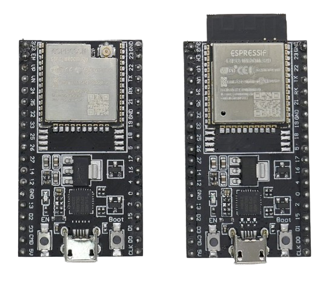
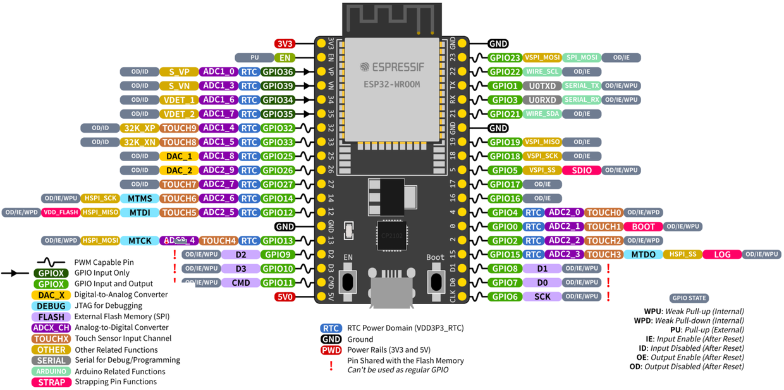
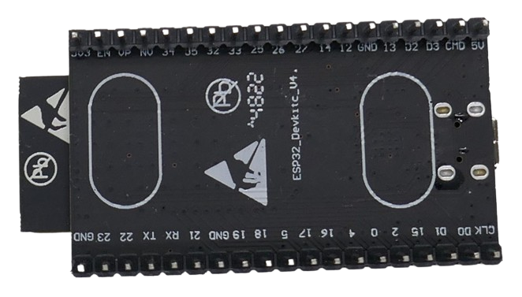

 
# ESP32 DevKitC V4

> Original DevKit From Espressif Providing Access To Almost All ESP32 Pins

*ESP32-DevKitC V4* is a small-sized ESP32-based development board produced by the original *ESP32* manufacturer *Espressif*. This board is ideal for experimenting with all *ESP32 features* as most of the I/O pins are broken out to the pin headers on both sides for easy interfacing.

The breakout board is available with a wide variety of original *ESP32 modules*, including the popular *WROOM 32D* (with PCB antenna) and *WROOM 32U* (with IPX-connector to connect an external antenna).

| Item | Description |
| --- | --- |
| USB Connector | Micro USB |
| Size | 48.2x27.9mm (without PCB antenna), 54.4x27.9mm (with PCB antenna) |
| Microcontroller | ESP32-WROOM-DA/32E/32UE/32D/32U, ESP32-WROVER-E/IE, ESP32-SOLO1 |

## Hardware Overview
The dominant part of the breakout board is the *ESP32 module* (depending on type either with attached PCB antenna, or with an IPX antenna jack). On the inner side, there is unused space unless your breakout board uses the larger *WROVER* module with additional *PSRAM*.

### USB Connector
On the opposite side, a *Micro USB* connector lets you connect the board to a computer.

Behind the *USB connector*, a *Silicon Labs CP2102* chip provides the *USB to UART* bridge at speeds of up to 3Mbps.

### Power Supply
The board provides three *mutually exclusive* ways to power it:

* **USB:** *5V USB* is used and converted internally to *3.3V*
* **5V/GND Pins:** You can power the board through an external power supply by connecting it to the pins *5V* and *GND*. The input power goes through the voltage regulator (like *USB* option).
* **3.3V/GND Pins:** You can provide *3.3V* directly by connecting a suitable power supply to the pins *3.3V* and *GND*. These pins power the microcontroller *directly* and do not go through a voltage regulator. This option provides the best energy efficiency but is also the most dangerous one: if your external power supply does not *always* deliver regulated voltage in the range of *3.0-3.6V*, the board and/or microcontroller *will be damaged*.

> [!CAUTION]
> Always use **only one** of the three power methods listed above. When you power the board through an external power supply, **never** also supply power through *USB*. The most common error is to keep the board supplied by an external power supply while connecting it via *USB cable* to a computer in order to upload new firmware. Always make sure you either *disconnect the external power supply*, or you use a *USB connector* where the *power lines* can be turned off.

### Voltage Regulator
Behind the *CP2102*, there is a dedicated *IRU1117-33* 3.3V *voltage regulator* capable of supplying *800mA*. This regulator is used when you supply voltage either via *USB* or directly via the *5V* pin. The voltage regulator accepts an absolute *maximum input voltage* of *7V*.

On the right side, there are two *JY3/S8050* epitaxal planar transistors with a high collector current of *500mA* each and high total power dissipation.

### Power LED
On the opposite side, a *SMD power LED* is located. It turns on whenever input power passes through the *voltage regulator*. It **does not turn on** when you supply *3.3V* directly to the *3.3V pin.*

> [!CAUTION]
> When you power the board directly via the *3.3V Pin*, the *power LED* stays *off* even though the board runs perfectly fine. This behavior is by design and a good thing: when powering the board directly via *3.3V*, this is done typically to maximize energy efficiency in use cases where energy is limited (i.e. battery-operated devices). In such scenarios, you do not want the *power LED* to waste precious energy.

### Firmware Download Mode
The board comes with two *push buttons* labeled *EN* (reset button) and *Boot*.

To reliably put the board in *Firmware download mode*, hold down *Boot* and then press *EN*. The board is now ready to download new firmware via the *USB connector*.

Important: once the new firmware is successfully transferred to the board, press *EN* (reset) to *leave* the *Firmware download mode* and run your sketch.

> [!TIP]
> Depending on the currently uploaded firmware, you may not have to press buttons to transfer new firmware to the board: the board may enter the *Firmware download mode* automatically once you connect it via USB cable to a computer and upload a new sketch. This however is not guaranteed, and when your current sketch keeps the microcontroller very busy, the automatic method may fail. Pressing the buttons as illustrated is always a safe and reliable way of *stopping the current sketch* and instructing the board to look for new firmware.

## Pinouts
This breakout board exposes most *ESP32* pins:

The tables below provide detailed information for each header pin. The *Pin Type* resolves as follows: **P**ower supply, **G**round, **I**nput, **O**utput.

### Header Pin Row 1

| Pin | Label | Pin Type | Description |
|  --- |  --- |  --- |  --- |  
| 1 | 3V3 | P | 3.3V power supply |
| 2 | EN | I | CHIP_PU, Reset |
| 3 | VP | I | GPIO36, ADC1_CH0, S_VP |
| 4 | VN | I | GPIO39, ADC1_CH3, S_VN |
| 5 | IO34 | I | GPIO34, ADC1_CH6, VDET_1 |
| 6 | IO35 | I | GPIO35, ADC1_CH7, VDET_2 |
| 7 | IO32 | IO | GPIO32, ADC1_CH4, TOUCH_CH9, XTAL_32K_P |
| 8 | IO33 | IO | GPIO33, ADC1_CH5, TOUCH_CH8, XTAL_32K_N |
| 9 | IO25 | IO | GPIO25, ADC1_CH8, DAC_1 |
| 10 | IO26 | IO | GPIO26, ADC2_CH9, DAC_2 |
| 11 | IO27 | IO | GPIO27, ADC2_CH7, TOUCH_CH7 |
| 12 | IO14 | IO | GPIO14, ADC2_CH6, TOUCH_CH6, MTMS |
| 13 | IO12 | IO | GPIO12, ADC2_CH5, TOUCH_CH5, MTDI |
| 14 | GND | G | Ground |
| 15 | IO13 | IO | GPIO13, ADC2_CH4, TOUCH_CH4, MTCK |
| 16 | D2 | IO | GPIO9, D2 |
| 17 | D3 | IO | GPIO10, D3 |
| 18 | CMD | IO | GPIO11, CMD |
| 19 | 5V | P | 5V power supply |

### Header Pin Row 2

| Pin | Label | Pin Type | Description |
|  --- |  --- |  --- |  --- | 
| 1 | GND | G | Ground |
| 2 | IO23 | IO | GPIO23 |
| 3 | IO22 | IO | GPIO22 |
| 4 | TX | IO | GPIO1, U0TXD |
| 5 | RX | IO | GPIO3, U0RXD |
| 6 | IO21 | IO | GPIO21 |
| 7 | GND | G | Ground |
| 8 | IO19 | IO | GPIO19 |
| 9 | IO18 | IO | GPIO18 |
| 10 | IO5 | IO | GPIO5 |
| 11 | IO17 | IO | GPIO17 |
| 12 | IO16 | IO | GPIO16 |
| 13 | IO4 | IO | GPIO4, ADC2_CH0, TOUCH_CH0 |
| 14 | IO0 | IO | GPIO0, ADC2_CH1, TOUCH_CH1, Boot |
| 15 | IO2 | IO | GPIO2, ADC2_CH2, TOUCH_CH2 |
| 16 | IO15 | IO | GPIO15, ADC2_CH3, TOUCH_CH3, MTDO |
| 17 | D1 | IO | GPIO8, D1 |
| 18 | D0 | IO | GPIO7, D0 |
| 19 | CLK | IO | GPIO6, CLK |

### Pins To Avoid
Some pins are used internally for communication between ESP32 and *SPI flash memory*. They are grouped on both sides near the USB connector. Avoid using these pins, as it may disrupt access to the SPI flash memory/SPI RAM:

**D0**-**D3**, **CMD**, and **CLK**

Pins **GPIO16** and **GPIO17** are used internally by *ESP32-WROVER*. If you use the more commonly *ESP32-WROOM*, you are free to use these pins.

## Issue On External Power
When this board is powered externally, it may not run the sketch immediately but requires the button *EN* to be pressed. Only then will the sketch run. The issue does not occur when the board is powered via *USB*.

The reason for this unwanted behavior is a *capacitor* (C15) connected in parallel to the *Boot* button. On newer versions of this breakout board, the *capacitor* meanwhile has been removed.

The picture shows a newer version with the solder pads for *C15* (but with no capacitor present):

Only relatively old boards have this capacitor in place. If you do find a capacitor at this location and suffer from the issue, remove the capacitor manually. 

> [!CAUTION]
> The SMD capacitor is very small, and there are delicate tracks behind it that can easily be damaged by brute force or an over-sized and over-heated soldering iron. Desoldering this component requires proper tools (i.e. a heat gun). 

## Materials
[Board Schematics](materials/esp32_devkitc_v4-sch.pdf)    
[ESP32 Datasheet](materials/esp32_datasheet_en.pdf)    
[CP2102 USB-UART-Bridge](materials/cp2102_datasheet.pdf)    
[IRU1117 3.3V Voltage Regulator](materials/iru1117_datasheet.pdf)     
[S3050/J3Y Transistor](materials/iru1117_datasheet.pdf)     

  

> Tags: Microcontroller, ESP32, CP2102

[Visit Page on Website](https://done.land/components/microcontroller/esp/esp32/classicesp32/esp32devkitcv4?604445051417245543) - created 2024-05-16 - last edited 2024-05-16
