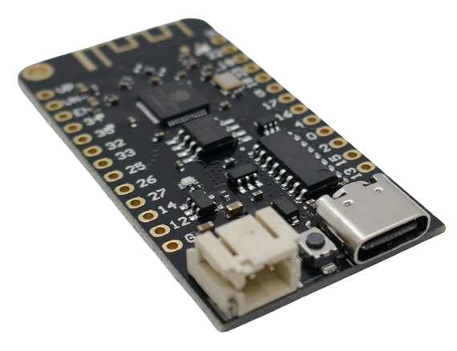
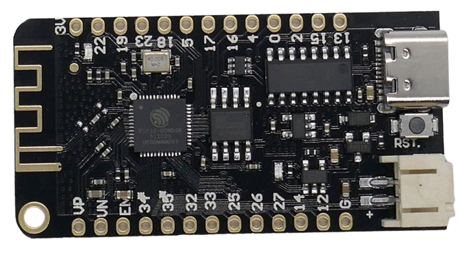

 
# Lolin32 Lite

> Classic ESP32 With Battery Power Support

The *Lolin32 Lite* development board features a classic *ESP32* microcontroller on a board that comes with battery support, making it an ideal choice for portable solutions.

The board comes with a *USB C* connector to connect to a PC, plus a *JST 2.0* socket to connect a battery. The battery can power the board, and the *USB C* connector can be used to charge it.

## Technical Details

Here are the fundamental board details:

| Item | Description |
| --- | --- |
| Memory | external 4MB Flash |
| Clock Speed | 240MHz |
| Charging | 500mA charging current, LTH7/HM4054H |
| Internal LED | GPIO22 |
| Battery | LiIon/LiPo 3.7V |
| USB-to-TTL | CH340 |
| Size | 49.2x25.5mm |
| Weight  | 6.6g |

## Caveats
This board is specifically designed for *portable devices* with a battery and a *small footprint*. This results in a few caveats.

### Power Supply
This board needs to be powered either by *USB* or *battery*. There is no separate *5V input pin*. While the board does output *3.3V* at its designated pin, you may not be able to run the board by providing *3.3V input*. If you do, the battery will not be charged.

In a nutshell, this board is specifically designed for *portable apps* that run from a battery. The *USB connector* in this scenario is primarily used to *charge the battery*.

### GPIOs
The board exposes *19 GPIOs* and *4 inputs*. Compared to other boards, the number of *GPIOs* is limited. For special purpose projects where you need to access certain functionality (i.e. *I2S*), make sure all necessary hardware pins are exposed.

## Pins
The board comes with *26 pins*. 

### Strapping Pins
*GPIO0* (as well as *GPIO45* and *GPIO46*) are *strapping pins* that play a role when switching the microcontroller to *firmware upload mode*.

| Pin | Strapping Use |
| --- | --- |
| GPIO0 | pull down during reset to enable firmware upload mode |
| GPIO45 | sets SPI voltage: low for 3.3V, high for 1.8V |
| GPIO46 | pull down to enable ROM messages during boot |

### Pullup And Pulldown
All *GPIO* pins support internal *pull-up* and *pull-down* resistors.

## When To Use

Here are reasons for choosing a **Lolin32 Lite**:

| Feature | Use Cases |
| --- | --- |
| Battery | comes with everything needed to hook up a *LiIon/LiPo* battery |
| Price | The board is relatively cheap |

These are *potential* reasons to choose a different microcontroller type:

| Use Case | Recommendation |
| --- | --- |
| External Power | Cannot be operated with external *3.3V power supply* |
| Limited GPIOs | Only relatively few *GPIO* are exposed. When you need a massive number of *GPIOs* or access to *specific CPU pins*, this board may not work for you |

## Programming

The *S2* supports the *Arduino Framework*.

It can be programmed using [platformio](https://platformio.org/), the vendors' [esp-idf](https://github.com/espressif/esp-idf), or the classic [Arduino IDE](https://www.arduino.cc/en/software).

Adding ESP Support To Arduino IDE
 

*Arduino IDE* by default only supports *Arduino*-compatible microcontrollers. To use it with *ESP* microcontrollers like the **S2**, the appropriate additional *board manager* needs to be installed. After that, *ESP* microcontrollers can be programmed just like any *Arduino* board.

To add an *ESP-compatible board manager*, in *Arduino IDE* choose the menu item *File/Preferences*, fill the url *https://raw.githubusercontent.com/espressif/arduino-esp32/gh-pages/package_esp32_dev_index.json* into the field *Additional Boards Manager URLs*, and click *OK*.

Next, go to *Tools/Board/Boards Manager*, and search for *esp32*. Install the board manager created by *Espressif Systems*.   

### Connecting Microcontroller To Computer
Most microcontroller boards come with a *USB connector* and a *USB-to-Serial* component. They can be directly connected to the *USB* interface of your computer.

> [!TIP]
> When you plug in the *USB cable* into your computer, you should hear the typical *sound* that plays when a new *USB device* is discovered. If you do not hear this sound (even though sound is enabled), make sure you are using a suitable *USB **data** cable*. Simple *USB charger cables* have no data pins and do not work. Also make sure you plugged in the USB cable *firmly* on both ends.

Once the microcontroller board is successfully connected to the computer, most boards indicate *power on* status via a *red LED*. A new *port* should also become available.

## Materials
[Lolin Lite eBook](https://megma.ma/wp-content/uploads/2021/08/Wemos-ESP32-Lolin32-Board-BOOK-ENGLISH.pdf)   
[HM4054H Charger](materials/hm4054h_datasheet.pdf)   
[ÖTH7R Charger (Chinese)](materials/lth7r_datasheet_ch.pdf)   
[ÖTH7S Charger (Chinese)](materials/lth7s_datasheet_ch.pdf)   

  

> Tags: Microcontroller, ESP32, Lolin Lite, Battery, Charger

[Visit Page on Website](https://done.land/components/microcontroller/esp/esp32/esp32/lolin32?601146050916240343) - created 2024-05-15 - last edited 2024-05-15
