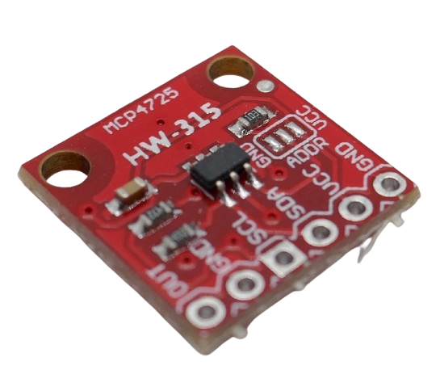

 
# DAC

> Built-In Digital-To-Analog Converter (DAC) With High Speed Direct Memory Access (DMA)

Classic *ESP32* microcontrollers and the *S2* both come with a built-in *DAC* (*Digital-to-Analog* converter) that can turn a digital value into a *voltage*. This can be useful to programmatically produce a given voltage, and the primary use case often is generating *wave forms*,  i.e. *signal generators* or *audio output*.

> [!CAUTION]
> *Espressif* has *removed* the internal *DAC* from succeeding microcontrollers. It is present *only* in *Classic ESP32* and *S2*. It is *not present* in *S3*, *C3*, *C6*, *H2*, and others.


## Advantages of Built-In DAC
You can easily get separate breakout boards with *external DACs* like the popular *MCP4725* with *I2C* interface, and add simple-to-use *DAC capability* to *any* microcontroller.




*External DACs* are *not the same* as having an *internal built-in DAC*: 

The *built-in DAC* inside a *ESP32* or *S2* tightly integrates into the rest of the microcontroller infrastructure and can communicate directly with memory (*Direct Memory Access*, *DMA*). 

This way, the *built-in DAC* can directly read and write to memory without using the CPU. This enables *high speed* output that could not be achieved with external *DACs*.

> [!NOTE]
> *External DACs* like the *MCP4725* do support *very high speeds*: its *I2C* interface is ready for *100kbps*, *400kbps*, and even *3.4Mbps*. However, it *cannot* directly access memory, and always needs the *CPU* to manage *I2C* and do the memory transfer, thus placing a high burden on the *CPU*.   


## Overview
A *Digital-to-Analog Converter* (DAC) converts digital data into an analog signal (*voltage*), enabling digital audio playback, video, and other data that can be used by analog devices such as speakers, monitors, and sensors.

A *DAC* is not a *buck* or *boost* converter, so it can only output *voltages* within the range of the *supply voltage*. 

### Support For Internal DAC
These *ESP32 modules* come with *built-in DACs*:

| ESP32 Module | DAC Channel 1 | DAC Channel 2 |
| --- | --- | --- |
| Classic ESP32 | GPIO25 | GPIO26 |
| ESP32-S2 | GPIO17 | GPIO18 |

The internal *DAC* in both modules is a *2-channel 8bit DAC*.

> [!NOTE]
> All *newer ESP32* no longer feature a built-in DAC.


### Voltage Range
The analog reference voltage for ESP32 is *3.3V*. An *ideal DAC* would be able to produce voltages in the range of *0.0-3.3V* in a *linear* way.

In practice, *DACs* are not perfectly ideal and show a *zero drift* (cannot deliver exactly *0.0V*, range ends at around *0.08V*) and *early saturation* (cannot reach the upper voltage limit and deliver around *3.165V* at most).

### Resolution
The *DAC resolution* defines the *voltage steps* that are accessible. The built-in *DAC* has a *8bit* resolution, providing *256 voltage steps*.


### Speed
The *internal DAC* can be operated in different modes, yielding different update speeds:

| Mode | Example | Speed | Remarks |
| --- | --- | --- | --- |
| Arduino API | `dacWrite(DAC_CH1, Val);` | 20uS/50kHz | requires no external includes |
| Espressif API | `dac_output_voltage(DAC_CH1, Val);` | 5uS/200kHz | requires `#include <driver/dac.h>` |
| DMA | 10uS/100kHz | no *CPU* load |

> [!TIP]
> *DMA* is the most performant operating mode as the *DAC* can directly work with the *memory* and does not need to involve the *CPU*. The *theoretical* speeds listed for the API calls (*using no DMA*) need to be put in relation to overheads occuring elsewhere in the system. If you really use the *API calls* to continuously produce signals in rapid succession, most likely the achievable speeds will be *much lower* than *DMA* due to system bottlenecks that you'll run into.

### Output Current
The DAC outputs a *control signal* that can be used to drive other circuitry, i.e. an *amplifier*, an *oscilloscope*, a *voltmeter*, or an *audio amplifier*.

**You cannot and should never directly drive** any component that requires significant currents. DAC output can typically source up to about **12mA** and sink up to about **10mA**. 
 
 For reliable operation and to avoid damaging the DAC, it is advisable to limit the current draw to much lower values and **not exceed 1-2mA**.

 > [!TIP]
 > If you need to output *higher currents*, you should use an external buffer, such as an *operational amplifier* (op-amp) configured as a *voltage follower*. 


### Operational Modes
The *ESP32 DAC* supports *three* modes of operation:

| Mode | Remark |
| --- | --- |
| Direct Voltage Output | 8bit digital input is directly converted to the corresponding analog voltage. This voltage stays constant until a new digital value is written to the DAC (*one-shot mode*) |
| DMA Continuous Output | Complex wave forms are generated from digital values read directly from memory without much *CPU* intervention. |
| Cosine Wave Generator | Generates a *cosine waveform* with controllable frequency, amplitude, and phase shift at an output frequency in the range of *130Hz-100kHz* |

## Producing Fixed Voltages
Often, your project just needs a *fixed voltage* that can be controlled by your code.

The easiest way for this is to use the default *Arduino API* (not requiring any additional libraries).

> [!NOTE]
> While the *Espressif API* is about *4x faster* than the built-in *Arduino API*, this does not really matter: when switching an output pin to a *fixed voltage*, it makes no difference whether this takes *20uS* or just *5uS*.

### Setting Pin Voltage
To set one of the *DAC output pins* to a given voltage, use this call:

````c++
dacWrite(uint8_t dac_pin, uint8_t value);
````

| Argument | Description |
| --- | --- |
| dac_pin | Classic ESP: GPIO25 (Ch1) or GPIO26 (Ch2); ESP32-S2: GPIO17 (Ch1) or GPIO18 (Ch2) |
| value | *0-255*: 0=0.08V; 255=3.16V |


### Turning Off Voltage
To *turn off* the voltage completely on a pin, use this call:

````c++
void dacDisable(uint8_t dac_pin);
````

> [NOTE]
> In a simple sketch you can test the *DAC output voltage* with a *multimeter*. **Only use** voltmeters with internal power supply. **Do not** connect voltmeters that draw their energy from the *DAC output*, i.e. to power its *display LEDs*. This would likely exceed the recommended maximum output current of *1-2mA*.

### Sawtooth Wave
Here is a simple sketch that first *increases* and then *decreases* the voltage in a *linear* way, effectively producing a *sawtooth wave*.


````c++
#define DAC1 25       // DAC Ch1 Output for classic ESP32
//#define DAC1 17       // DAC Ch1 Output for ESP32-S2
#define FREQUENCY 100 // signal frequency in Hertz

void setup(){
    // calculate required delay in milliseconds
    // we have 512 values per wave
    // One signal takes 20uS
    // the pure generation time is 512*20uS
    unsigned long signalTime = 512 * 20
    // calculate the signal time for the desired frequency
    unsigned long desiredSignalTime = 1000000 * FREQUENCY
    // calculate the excess time to wait
    unsigned long excessTime = (desiredSignalTime - signalTime)/512

}

void loop() {
 for (int i=0; i<255; i++){
   dacWrite(DAC1, i);
   delay(excessTime);
 }

 for (int i=255; i>=0; i--){
   dacWrite(DAC1, i);
   delay(excessTime);
 }
}
````

### Sine Wave
If you'd rather like to produce a *sine wave*, create a pre-calculated table with the digital values describing the sine wave, then feed these values to the DAC:

````c++
#define DAC1 25       // DAC Ch1 Output for classic ESP32
//#define DAC1 17       // DAC Ch1 Output for ESP32-S2

int Sin_Array[256]; 
float Period = (2*PI)/256;
float Rad_Angle;                   

void setup(){
    // calculate required delay in milliseconds
    // we have 256 values per wave
    // One signal takes 20uS
    // the pure generation time is 256*20uS
    unsigned long signalTime = 256 * 20
    // calculate the signal time for the desired frequency
    unsigned long desiredSignalTime = 1000000 * FREQUENCY
    // calculate the excess time to wait
    unsigned long excessTime = (desiredSignalTime - signalTime)/256


   for(int Angle=0; Angle<256; Angle++) {
       Rad_Angle = Angle*Period;
       Sin_Array[Angle] = (sin(Rad_Angle)*127)+128;
   }
}

void loop(){
 for(int i=0;i<256;i++)
   dacWrite(DAC1, Sin_Array[i]);
   delay(excessTime);
}
````


> Tags: ESP32, S2, DAC, DMA, Direct Memory Access

[Visit Page on Website](https://done.land/components/microcontroller/esp/esp32/examplecode/dac?723859050918243938) - created 2024-05-17 - last edited 2024-05-17
