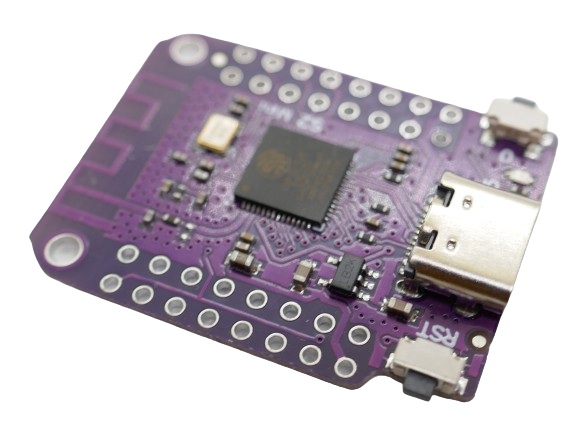

 
# S2

> The ESP32 S2 Is The ESP32 Successor Tailored Towards Low Energy Consumption And Sacrifices Bluetooth

In 2020, *Expressif* released both the *S-Series* and the first member of the *C-Series*.

The **S2** is focused on *low energy consumption* and comes with just one core, less *SRAM* and no *Bluetooth* support. This reduces energy consumption from 100uA of a regular **ESP32** to just 22uA.

This *microcontroller* is *perfect* for battery-driven projects. Do *not* use this microcontroller if you need *bluetooth support*.

A powerful **ESP32 S2 Mini** sharing the **ESP8266 D1 Mini** form factor. Note the dual-row terminals.

Differences between **S2** and the original **ESP32**:

| Feature | Removal |
| --- | --- |
| Cores | one core instead of two |
| Size  | 7x7 instead of 5x5 |
| Memory | SRAM reduced from 520 to 320, ROM reduced from 448 to 128 |
| LED PWM | reduced from 16 to 8 |
| ADC | 2x12bit 18ch instead of 2x13bit 20ch |
| UART  | reduced from 3 to 2 |
| I2C | reduced from 2 to 1 |
| IR/RMT | reduced from 8 to 4 |
| Bluetooth | removed |
| SD Card support | removed |
| Motor PWM | removed |
| Hall Sensor | removed |
| Ethernet  | removed |

Aside from the much lower *energy consumption*, the **S2** got some enhancements:

| Feature | Addition |
| --- | --- |
| Touch | extended from 10 to 14 |
| GPIO  | extended from 34 to 43 |
| USB OTG | added |
| TOF  | added |
| Temperature Sensor | added |

> Tags: Microcontroller, ESP32, S2, ESP32 S2, Energy

:eye:&nbsp;[Visit Page on Website](https://done.land/components/microcontroller/esp/esp32/s2?502092031823244200) - last edited 2024-03-23
