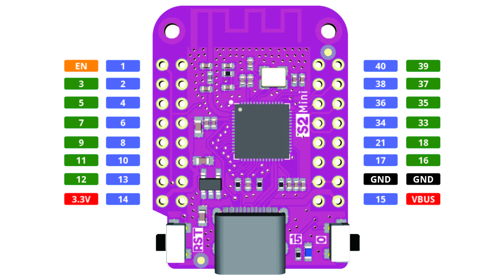

 
# S2

> Full Native USB Support And Low Energy Consumption

In 2020, *Expressif* released both the *S-Series* and the first member of the *C-Series*.

## When To Use

In a nutshell, these are the primary reasons for choosing the **S2**:

| Feature | Use Cases |
| --- | --- |
| Low Energy | perfect for battery-driven devices |
| MSC Support | can act as USB flash drive and also r/w from real USB flash drives, i.e. to easily transfer (sensor) data to a computer |
| HID Support | can simulate *USB input devices* such as *keyboards* and also use attached real input devices, i.e. an external keyboard. Perfect for devices that require extensive or convenient human data input |
| 43 GPIO | massive number of available *GPIOs* can control even very complex hardware scenarios |
| Temperature Sensor | **S2** can monitor its temperature. Perfect for use cases that can get (too) hot and then require an action |
| Time Of Flight | **S2** can use *radio waves* to locate items and calculate distances (with low resolution of roughly *1m*)

These are *potential* reasons to choose a different microcontroller type:

| Use Case | Recommendation |
| --- | --- |
| Complex and calculation-intensive | **S2** is fast but *single core*. For better multitasking, *dual core*, i.e. **ESP32**, **C3**, **S3** |
| Small Form Factor | **S2** does not support *USB-Serial-JTAG* to directly program it via *USB*. Additional components are required. Choose **S3**. |
| Bluetooth | **S2** does not support *Bluetooth*. Choose i.e. **S3**. 

## S2 Mini Technical Data

The *purple S2 Mini* board is one of the most popular and economic *S2 development boards* available:

| Item | Value |
| --- | --- |
| Operating Voltage | 3.3V (2.5-3.6V) |
| Digital IO Pins | 27 |
| Clock Speed | 240MHz |
| Flash | 4MB |
| PSRAM | 2MB |
| Size | 34.4x25.4mm |
| Weight | 2.4g |

## Evolution
Differences between **S2** and the original (initial) **ESP32**:

| Feature | Removal |
| --- | --- |
| Cores | one core instead of two |
| Size  | 7x7 instead of 5x5 |
| Memory | SRAM reduced from 520 to 320, ROM reduced from 448 to 128 |
| LED PWM | reduced from 16 to 8 |
| ADC | 2x12bit 18ch instead of 2x13bit 20ch |
| UART  | reduced from 3 to 2 |
| I2C | reduced from 2 to 1 |
| IR/RMT | reduced from 8 to 4 |
| Bluetooth | removed |
| SD Card support | removed |
| Motor PWM | removed |
| Hall Sensor | removed |
| Ethernet  | removed |

Aside from the much lower *energy consumption*, the **S2** got some enhancements:

| Feature | Addition |
| --- | --- |
| Touch | extended from 10 to 14 |
| GPIO  | extended from 34 to 43 |
| USB HID | HID Client and Host added |
| USB MSC | MSC Device and Host added
| TOF  | added |
| Temperature Sensor | added |

## GPIOs

The **S2** comes with *43 physical GPIO pins*. Not all pins are fully usable, and not all boards expose all pins.

> [!CAUTION]
> Pins may be labelled differently by a board. *GPIO10* and *D10* for example are **not the same** pin.

The 46 physical *GPIO* are labeled *GPIO0-GPIO21* and *GPIO26-GPIO46*.

Each pin can be used as a general *input* or *outüut* pin, or connected to an internal peripheral signal. Internal peripheral signals can be routed to *any* pin.

### Analog Input

*GPIO1-GPIO10* can be connected to *ADC1* for analog input, and *GPIO11-GPIO20* can be connected to *ADC2*.

### RTC Pins

The *RTC* component uses *GPIO0-GPIO21* as *RTC_GPIO0-RTC_GPIO21*.

### Special Purpose Pins

Some pins serve internal functions and should be used only for their intended purpose. 

#### Strapping Pins
*GPIO0* (as well as *GPIO45* and *GPIO46*) are *strapping pins* that play a role when switching the microcontroller to *firmware upload mode*.

| Pin | Strapping Use |
| --- | --- |
| GPIO0 | pull down during reset to enable firmware upload mode |
| GPIO45 | sets SPI voltage: low for 3.3V, high for 1.8V |
| GPIO46 | pull down to enable ROM messages during boot |

#### SPI
*GPIO26-GPIO32* are reserved for *SPI0/1*.

#### USB JTAG
*GPIO39-GPIO42* are used for *USB JTAG* (*Joined Test Action Group*) and can be used for *OpenOCD* debugging.

### S2 Mini Pinout

The **S2 Mini** microcontroller board comes in a *small form factor* that is *compatible in size* with *ESP8266/D1 Mini* boards and its many *shields*. 

*GND*, *Vbus*, and *3.3V* pins are compatible. *IO pin numbering* is different, and *GPIO assignments* in any firmware would need to be adjusted.

Due to its *small size*, the board exposes only commonly used microcontroller [pins](https://github.com/espressif/arduino-esp32/blob/master/variants/lolin_s2_mini/pins_arduino.h):

The pin numbers printed on the backside of the breakout board represent the exposed *GPIO* numbers. I.e., pin marked *1* represents *GPIO1*.

| Pin |  Remark | Description |
| --- |  --- | --- |
| 1-6 |  | general purpose: analog input (ADC1) and digital in/output |
| 7 | SPI SCK | general purpose: analog input (ADC1) and digital in/output |
| 8 | | general purpose: analog input (ADC1) and digital in/output |
| 9 | SPI MISO | general purpose: analog input (ADC1) and digital in/output |
| 10 | | general purpose: analog input (ADC1) and digital in/output |
| 11 | SPI MOSI | general purpose: analog input (ADC2) and digital in/output |
| 12 | SPI SS | general purpose: analog input (ADC2) and digital in/output |
| 13-14 | | general purpose: analog input (ADC2) and digital in/output |
| 15 | internal LED | general purpose: analog input (ADC2) and digital in/output |
| 16 | | general purpose: analog input (ADC2) and digital in/output |
| 17 | DAC1 | general purpose: analog input (ADC2) and digital in/output |
| 18 | DAC2 | general purpose: analog input (ADC2) and digital in/output |
| 21 | | general purpose digital in/output |
| 33 | I2C SDA | general purpose digital in/output |
| 34 | | general purpose digital in/output |
| 35 | I2C SCL | general purpose digital in/output|
| 36-40 | | general purpose digital in/output |

> [!CAUTION]
> The *ADC* (and thus *analog inputs* at *GPIO11-GPIO18*) can only be used when *WiFi* is *disabled*.

#### SPI
The **S2** has four *SPI* interfaces, accessible via *GPIO9-GPIO14*, and *GPIO33-GPIO37*.

#### I2C
Any *GPIO* pin can be configured for *I2C*.

#### PWM
All *GPIO* pins support *PWM*.

#### Pullup And Pulldown
All *GPIO* pins support internal *pull-up* and *pull-down* resistors.

## Arduino IDE Support

The *S2* can be programmed using *platformio*, *esp-idf*, or *Arduino IDE*.

### Add ESP Support

For *Arduino IDE* to work, support for *ESP microcontrollers* must be added: in *File/Preferences*, fill the url *https://raw.githubusercontent.com/espressif/arduino-esp32/gh-pages/package_esp32_dev_index.json* into the field *Additional Boards Manager URLs*, and click *OK*.

Next, go to *Tools/Board/Boards Manager*, and search for *esp32*. Install the option by *Espressif Systems*.

### Select Board Type

Connect the board to your computer using the *USB C* connector.

Next, select *Tools/Board/ESP32 Arduino*, then select the board *LOLIN S2*.

Finally, select *Tools/Port*, and select the port you connected the board to.

> [!TIP]
> If no port is shown, press the *RESET* button on the board. Then open the *Port* menu again. If still no port is shown, close all other programs or restart the computer. Make sure you are using a *USB data cable* (not a simple *charger* cable), and that the cable is firmly plugged in.

## Materials

[S2 Mini Datasheet](materials/esp32-s2_datasheet.pdf)   
[S2 Mini Schematics](materials/s2_mini_schematic.pdf)   
[S2 Mini Dimensions](materials/s2mini_dimensions.pdf)   

> Tags: Microcontroller, ESP32, S2, ESP32 S2, Energy

[Visit Page on Website](https://done.land/components/microcontroller/esp/esp32/s2?502092031823244200) - created 2024-03-23 - last edited 2024-05-04
