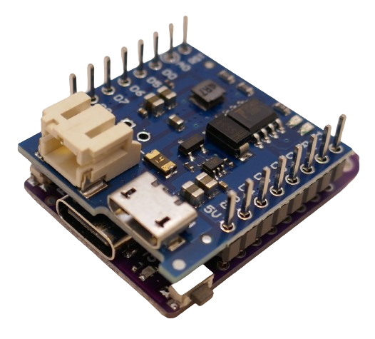

 
# S2 Mini

> Powerful ESP32 S2 Board That Works With ESP8266 Shields

The *S2 Mini* microcontroller board (aka *LOLIN S2 Mini* or *Wemos S2 Mini*) is a very popular and powerful board that uses the same *form factor* as its equally popular predecessor, the *ESP8266 D1 Mini*.

This enables the *S2 Mini* to continue to use *shields* that were designed for the *D1 Mini*, i.e. *battery shields*.

## S2 Mini Technical Data

Due to its form factor, the *S2 Mini* does not expose *all available hardware pins*. With *27 GPIOs*, this board is most sufficient for most *DIY projects*.

| Item | Value |
| --- | --- |
| Operating Voltage | 3.3V (2.5-3.6V) |
| Digital IO Pins | 27 |
| Clock Speed | 240MHz |
| Flash | 4MB |
| PSRAM | 2MB |
| Size | 34.4x25.4mm |
| Weight | 2.4g |

### Pins And Compatible Shields

All pins that are not *sofware-assignable* are *compatible with ESP8266 D1 Mini* pins:

Specifically, the pins for *GND*, *3.3V*, and *VBus* (*5V*) are hardware-identical:

This allows users to continue to use *shields* that were designed for *ESP8266*, i.e. *battery shields* that add *charging* and a battery to *portable projects*:

> [!CAUTION]
> All *software-configurable* pins (such as *GPIOs* and the pin for the built-in *LED*) are **not compatible** with *ESP8266 D1 Mini*. Since these pins can be adjusted freely in software in the *S2*, converting software from *ESP8266 D1 Mini* to *S2 Mini* is a matter of checking and potentially reassigning pin numbers.

### S2 Mini Pinout

The pin numbers printed on the backside of the breakout board represent the exposed *GPIO* numbers. I.e., pin marked *1* represents *GPIO1*.

| Pin |  Remark | Description |
| --- |  --- | --- |
| 1-6 |  | general purpose: analog input (ADC1) and digital in/output |
| 7 | SPI SCK | general purpose: analog input (ADC1) and digital in/output |
| 8 | | general purpose: analog input (ADC1) and digital in/output |
| 9 | SPI MISO | general purpose: analog input (ADC1) and digital in/output |
| 10 | | general purpose: analog input (ADC1) and digital in/output |
| 11 | SPI MOSI | general purpose: analog input (ADC2) and digital in/output |
| 12 | SPI SS | general purpose: analog input (ADC2) and digital in/output |
| 13-14 | | general purpose: analog input (ADC2) and digital in/output |
| 15 | internal LED | general purpose: analog input (ADC2) and digital in/output |
| 16 | | general purpose: analog input (ADC2) and digital in/output |
| 17 | DAC1 | general purpose: analog input (ADC2) and digital in/output |
| 18 | DAC2 | general purpose: analog input (ADC2) and digital in/output |
| 21 | | general purpose digital in/output |
| 33 | I2C SDA | general purpose digital in/output |
| 34 | | general purpose digital in/output |
| 35 | I2C SCL | general purpose digital in/output|
| 36-40 | | general purpose digital in/output |

> [!CAUTION]
> The *ADC* (and thus *analog inputs* at *GPIO11-GPIO18*) can only be used when *WiFi* is *disabled*.

## Prototyping

The *S2 Mini* uses *dual line header pins* (2x8 pins on both sides for a total of 32 pins).

This design was necessary to keep the *hardware compatibility* to the predecessor *ESP8266 D1 Mini* board: the *outer* 8-pin headers match the header pins in a *ESP8266 D1 Mini* (for power and *GND* pins at least).

You cannot of course use *dual line header pins* with a prototyping bread board as this would *short circuiting* both header pin lines.

### Soldering Header Pins

For prototyping, it makes most sense to solder the *outer* header pins normally for a *ESP8266 D1 Mini*-compatible foot print. 

The *inner* header pins should *not be connected* to the bread board. Instead, solder the header pins *on top*: this way, the additional pins can be connected using *female DuPont cables*.

## Materials

[S2 Mini Datasheet](materials/esp32-s2_datasheet.pdf)   
[S2 Mini Schematics](materials/s2_mini_schematic.pdf)   
[S2 Mini Dimensions](materials/s2mini_dimensions.pdf)   

> Tags: Microcontroller, ESP32, S2, ESP32 S2, Shield, Pin, I2C, SPI

[Visit Page on Website](https://done.land/components/microcontroller/esp/esp32/s2/s2mini?273412051205244129) - created 2024-05-04 - last edited 2024-05-04
