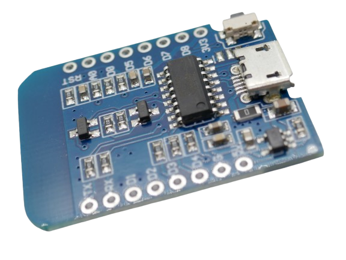

 
# ESP8266

> A Workhorse With WiFi Support That Can Do The Job Even For Sophisticated Projects

The *ESP8266* from *Expressif* is probably the most widely used *microcontroller* in non-Arduino projects. 

## Advantages

It became an instant success and convinced many users to move from *Arduino* to *ESP* because of a number of substantial advantages:

* **More Memory:** The *ESP8266* comes with more memory than *Arduinos* (in 2016 when the *ESP8266* was released) had. The dreaded *out of memory*-errors that commonly struck *Arduino* users do not occur with *ESP8266*.
* **WiFi Support:** *ESP8266* comes with built-in *WiFi* support and can work as *client*, *access point*, or *both*. This opened an entire new universe for makers: *ESP8266* can join home networks and report back *sensor data* wireless, or it can be used as *relais controller* to control devices via *remote control*.
* **Price:** Compared to *Arduinos*, *ESP8266* are dead cheap. A breakout board with *8MB RAM* typically costs less than EUR 2.00.

## Known Problems

*ESP8266* is produced by a *microcontroller company*, not a vendor for breakout boards. While *Expressif* does sell official *development boards*, the vast majority of breakout boards available are *clones* (or more correctly put: produced by a variety of third-party vendors).

**ESP8266** *clones* are known for commonly unsuitable *power regulators*: they can hardly provide the power for the *CPU* alone. Once you start adding additional components like sensors or displays, you may run into issues, and the board may stop working. Always make sure you review the data sheet before you buy, or take look at pictures and try and figure out the type of *power regulator* that is used on the board.

### CH9102, CP210x, CH340

Many *ESP8266* boards come with chips to connect to your PC via USB. That is crucial for most users in order to upload firmware.

There a boards with various chip types available. Here are the differences:

| OS | CH9102 | CP210x | CH340 |
| --- | --- | --- | --- |
| Windows | yes | yes | yes |
| MacOS | yes | yes | driver needed |
| Speed Mbps | 4 | 12 | 2 |

On *Windows* you can use all chips. For maximum transfer speed, try and choose boards with *CP210x*.

On *Apple*, try to avoid *CH340* unless you are ok with potentially having to search for and install an appropriate driver for it.

## ESP8266 from Expressif

The **ESP8266** surfaced in 2014. This microcontroller is much more powerful than the *ATMegas* used by *Arduino* at that time. 

> [!TIP]
> The *Expressif* **ESP32** microcontrollers (*ESP8266* successor) are so powerful and popular that in fact *Arduino* has switched horses, too, and released its first **ESP32** board in 2023: the [Nano ESP32](https://docs.arduino.cc/hardware/nano-esp32/).

from *left to right ordered by size*: **ESP32 C3** from *Seeed*, **ESP8266** *D1 Mini clone*, **ESP32 WROOM 32D** *dev board*.

These are industrial-grade CPUs used in many commercial devices. They have very low energy consumption and effective *sleep modes*, making them suitable for battery-driven devices as well.

In addition, they come with plenty of *memory*. Todays' *entry level* **ESP8266** typically come with *4MB* memory on board (check before you buy though, there are also 512KB variants).

### ESP8266EX

The **D1 Mini** (including clones) probably is the most popular board design: it is *cheap*, *compact*, comes with *WiFi* capabilities, has sufficient *memory* (tyically 4MB), provides enough *GPIO* pins for most projects (9 of which 5 are freely usable), has one *ADC* and supports *SPI* and *I2C* interfaces.

The *ESP8266 D1 Mini* is one of the most popular **ESP8266** boards in use.

It is based on the *Expressif ESP8266EX* chip, basically the only *ESP8266* chip widely used.

### ESP8266 Pro

The **Pro** version of **ESP8266** appears to be merely a marketing gag and refers to a different board layout. Its most visible "advantages* are a *ceramic antenna* instead of the simple *PCB antenna* and more memory: most **ESP8266 Pro** come with *16MB* instead of *4MB* memory (but watch out, some feature just 8MB or just 4MB).

The **ESP8266 Pro** is almost as expensive as a full-fledged **ESP32** and not a good choice.

On the negative side is an *unshielded* version of **ESP8266** (not covered by a shiny silver metal box) that has no *FCC ID*, and the same lame *voltage regulator* you find on the cheapest **ESP8266 clones*.

> [!TIP]
> *ESP8266 Pro* is a product from the past when the price difference between *ESP8266* and *ESP32* was still huge. Anyone in need of more memory could try and use the *ESP8266 Pro*.
> Today with price differences diminishing, either the basic *ESP8266* features are sufficient for your project (in which case you should get an *ESP8266*), or you need more (memory or better specs or a better voltage regulator). In which case you should get an *ESP32*.
> For the price of a *ESP8266 Pro* you can get a *ESP32* as well when you look around a bit.

> Tags: Microcontroller, ESP8266, Clone, Power Regulator, Expressif
