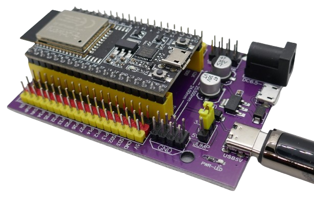
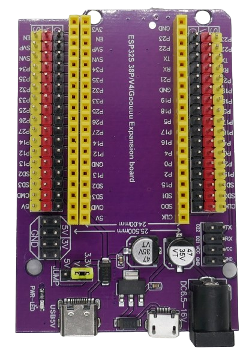
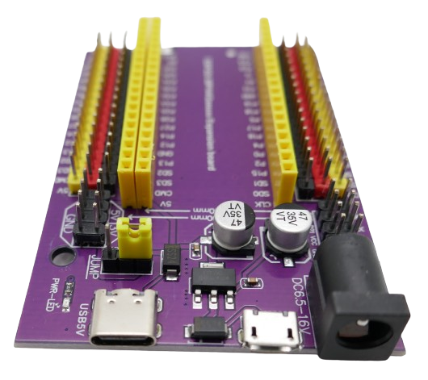

 
# DevKitC V4 / 38-Pin ESP32

> Expansion Board For 38-Pin ESP32 Development Boards

*38-pin* development boards are especially well suited to experiment with all *ESP32S* features as they provide access to almost every microcontroller pin.

At the same time, it makes such boards exceptionally large and a primary target for using *expansion boards* instead of *classic breadboards*.

## ESP32S 38P/V4/Goouu Expansion Board

This *expansion board* is suited for most *38pin ESP32S* boards with a width of *24mm* or *25.5mm* (which is why there are *three* pin rows):

This *expansion board* was originally designed for the *ESP32 DevKitC V4* which has a width of *25.5mm* and plugs into the two outer pin rows, with the antenna facing outwards.

### Dedicated Power Supply Pins
What sets this board apart from most others are the dedicated *red and black* power supply pins per *GPIO*:

Each *GPIO* is exposed via a *yellow* male pin that is accompanied by a *red* and a *black* power supply pin. Being able to route power to any component right at the pin level reduces wires and clutter.

#### Selecting Component Voltage
Components require either *3.3V* or *5V* - which is why you can choose the voltage supplied by the *red* pins. A jumper controls this voltage:

* **3.3V:** When the jumper is set to the *3.3V* position, then the *3.3V output* from the plugged in development board is routed to the *red* pins.

* **5V:** When the jumper is set to the *5V* position, then the *extension boards' 5V* is available at all *red* pins.

* **Custom:** When no jumper is used, then all *red* pins are disconnected. More precisely, they are connected to the *middle* pin of the jumper terminal. To route *custom* signals to the *red* pins, connect the desired signal to this *middle pin*.

> [!NOTE]
> Since the *expansion board* is not producing *3.3V*, the maximum current for *3.3V* depends entirely on the built-in voltage regulator on the development board you plugged in.

### Additional Pins

*VCC* (*3.3V*), *GND*, *RX*, and *TX* are exposed via a separate pin pad.

### Power Supply

The board comes with a solid *800mA 5V* [LD1117C50](materials/ld1117_datasheet.pdf) voltage regulator that can be powered by a *USB-C* or *Micro-USB* connector, or a round *DC plug*. It accepts input voltage up to *15V*.

#### Microcontroller Supply
The board supplies *5V* to the microcontroller, and in turn draws power from its *3.3V* output pin.

Two dedicated *5V* auxiliary pins are powered directly off the voltage regulator, and two dedicated *3.3V* auxiliary pins are powered by the microcontroller board.

> [!NOTE]
> As mentioned, the *jumper* controls the voltage routed to the *red* pins.

> Tags: Microcontroller, ESP32, Expansion Board, Development Board

[Visit Page on Website](https://done.land/components/microcontroller/expansionboards/devkitcv4?591341071504244301) - created 2024-07-03 - last edited 2024-07-05
