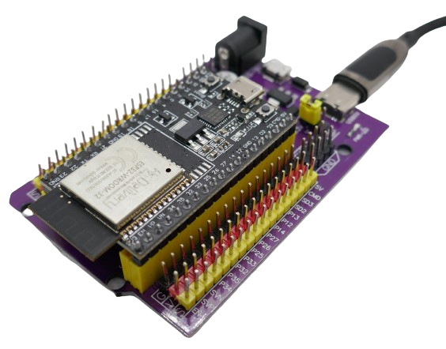

 
# Expansion Boards

> Expansion Boards For Microcontroller Projects

Classic *breadboards* might not always work well for microcontroller projects, especially when using development boards that expose most or all of the microcontroller pins.

Such development boards are often too large that to fit on breadboards, or when they do, they occupy almost all usable space.

That's why for microcontroller projects,  specialized *expansion boards* are used. 

## Specific Microcontroller Breadboards
*Expansion boards* are *highly specific* and must match the microcontroller board that you want to use: 

At the heart of the *expansion board*, there is a socket where you plug in the microcontroller board. 

As an added value, *expansion boards* can include voltage regulators and may be powered from a variety of sources and accepting a wide input voltage range.

## Benefits of Expansion Boards

For prototyping, *expansion boards* are not required but can fix a number of issues:

* **Space** As discussed, the primary target are *microcontroller boards* that are *too large* to fit on breadboards.
* **Power Supply:** *USB* power supply may not be sufficient for projects with many power-hungry components and lead to *brown-outs* and unexpected reboots. A more robust power supply provided by the *extension board* alleviates this.
* **Voltage Range:** Most *development boards* support a very limited input voltage range and can be damaged when exposed to more than *7V*. *Extension boards* often come with *voltage regulators* that support a much wider input voltage range and can be connected to *12V* on-board voltage sockets in cars, boats, or RVs.

> [!TIP]
> A few *expansion boards* add battery charging capabilities and can become part of the final device.

## Considerations

When selecting an *expansion board*, make sure...

* ...it is compatible to the *microcontroller development board* you use
* ...it is configured to supply the correct voltage to auxiliary pins (often there is a jumper to switch between *3.3V* and *5V*)
* ...it comes with a built-in voltage regulator powerful enough for your needs.

## List of Expansion Boards
Many different *expansion boards* exist, and it is not feasible to cover them all in detail. Most *expansion boards* work similarly, so it's sufficient to understand *what they are* and *how they are fundamentally configured*.

Here is an updated list of *expansion boards* reviewed so far on this site:

| Article | Microcontroller | Pins | Compatible Boards |
| --- | --- | --- | --- |
| [Review](./devkitcv4) | ESP32S | 38 | DevKitC V4 or similar, width 24mm or 25.5mm |

> [!TIP]
> The term *ESP32S* refers to *classic* ESP32 microcontrollers like *WROVER* or *WROOM*. The term *ESP32* is much broader and refers to *any* microcontroller of the *ESP32 family*, including *WROVER* as well as *S2* or *C3*.   

> Tags: Microcontroller, ESP32, Expansion Board, Development Board

[Visit Page on Website](https://done.land/components/microcontroller/expansionboards?569323071504244301) - created 2024-07-03 - last edited 2024-07-05
